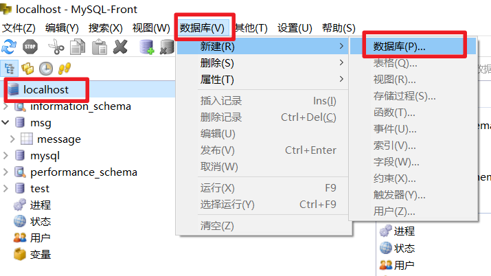
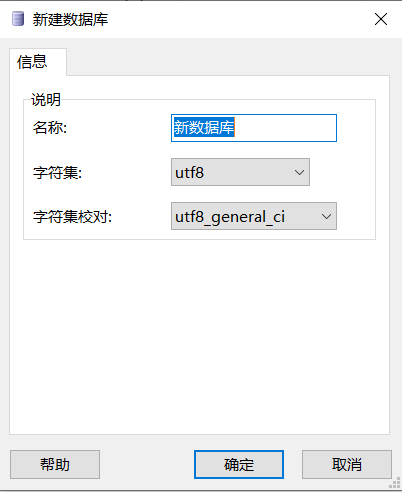
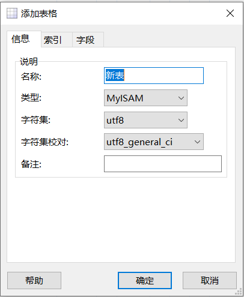
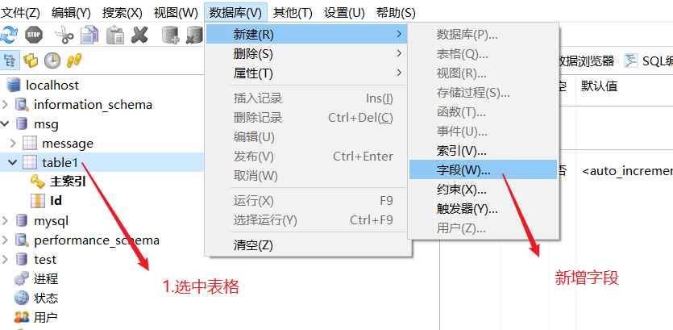
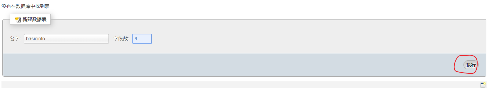
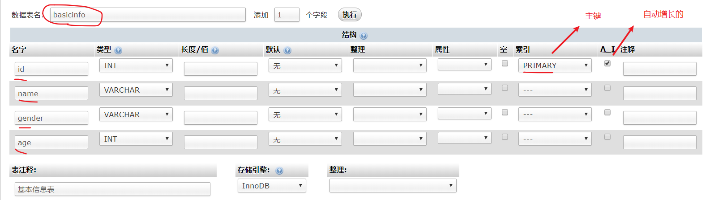
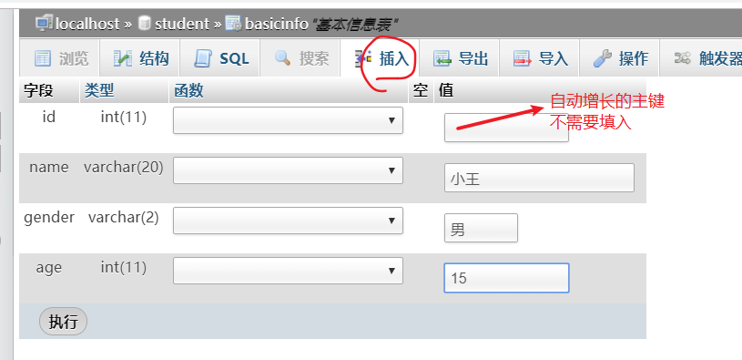
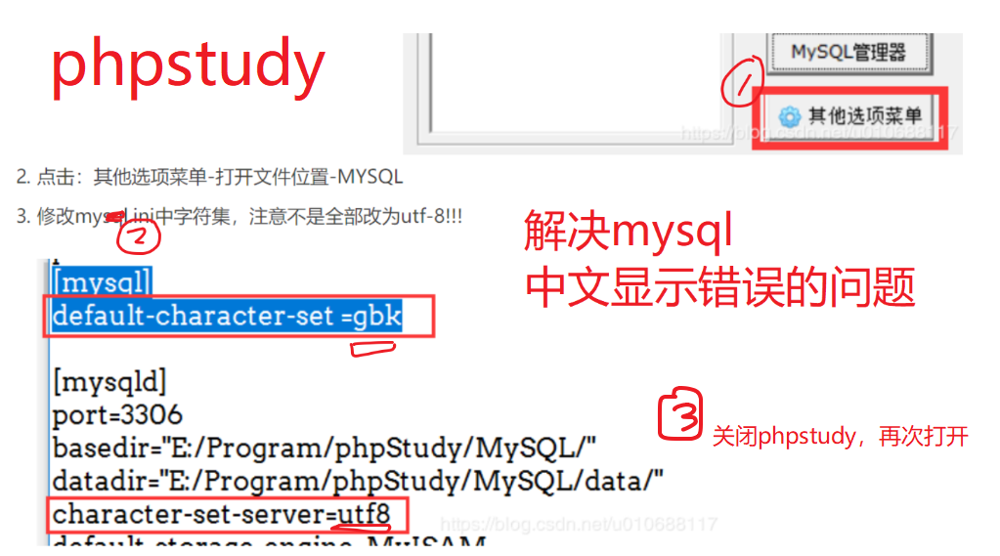

## MySQL数据库

- 关系型数据库，代表产品：
  - **MySQL**
  - Oracle
  - Sql server
  - DB2
- 非关系型数据库
  - redis 键值存储数据库
  - HBaise列存储数据库
  - **mongodb** 面向文档数据库
  - neo4j 图形数据库
  - Elasticsearch 搜索引擎存储

### 理解关系型数据库

在关系型数据库中，存在三级关系：

- 数据库
- 数据表
- 字段

- 每一列都是一类数据 --- `字段`
- 每一行代表一条数据 --- `记录`

| 数据库       | excel文件                |
| ------------ | ------------------------ |
| 数据库       | excel文件                |
| 数据表       | excel文件中的某一个sheet |
| 表结构：字段 | sheet中的表头：列        |


### MySQL简介

- 体积小、速度快、总体拥有成本低，一般中小型网站的开发都选择 MySQL 作为网站数据库。
- 搭配 [PHP](https://baike.baidu.com/item/PHP) 和 [Apache](https://baike.baidu.com/item/Apache) 可组成良好的开发环境。

### 安装MySQL

- 单独安装mysql

  - 官网下载：<https://www.mysql.com/downloads/>

- 集成安装

  由于mysql,apache,php是经典的开者伙伴，市面上有很多的集成环境（一个大的软件，其中已经配置好了这三个软件），我们也可以使用它们。优点在于：基本不需要配置，使用比较方便。这样的集成环境有：

  - wampserver

  - `phpstudy`

  - appserver

我们以phpstudy为例，去安装。值得提醒的是，当我们安装完MySQL后，我们的计算机又变成服务器了，不过不是Web服务器，而是MySQL数据库服务器了。


## mysql-front中操作数据库

### 新建数据库



在弹出的窗口中填写数据库名即可。



### 新建数据表


得到的效果如下：




### 添加字段



得到如下：


### 添加数据


### 新增表并设置表结构

- 一个数据库中可能有很多张表
- 每张表都有一个特殊的字段，这个字段可以用来把一条记录和其他记录区别开。这个具备这特性的字段叫表的主键。
- 每个字段都可以有自己的数据类型，就像变量有数据类型一样。
  - varchar:可变长字符串
  - int：整型





### 添加数据



### 查看数据

### 执行sql


## SQL语句


结构化查询语言(Structured Query Language)简称SQL，用来操作关系型数据库：

- 是一种数据库查询和程序设计语言，用来存取数据以及查询、更新、和管理关系型数据库。

- 数据库脚本文件的扩展名。

常用的sql语句有四类，curd：

- 增(create）
- 改(update)
- 查(read)
- 删(delete)


### 添加数据

格式: 

```
 insert into 表名(字段名1，字段名2,....)  values (值1，值2，....)
```

 注意: 

- 字段的顺序要和值的顺序是完全匹配的
- 字段列表可以不与表中的字段完全相等，
  - 可以省略一些不必要的字段
  - 顺序与不需要与定义表时的顺序一致
- 如果是字符串类型的字段，其值要加""，如果是数值类型的字符串，其值不需要加“”

示例:

```sql
insert into stu (sex, weight, name) values ('男', 60, '庞凯')
```

### 删除数据

格式: 

```
 delete  from 表名  where 删除条件
```

注意：

- 不指定条件将删除所有数据

示例：

```sql
-- 删除id为14的同学
delete from stu where id=14
-- 删除的时候，不加条件，将删除stu表中的全部记录
delete from stu
```


### 修改数据

格式:  

 ```
update 表名 set 字段1=值1, 字段2=值2,...  where 修改条件
 ```

注意：

	- 要修改的值使用键值对来表示 
	- 多个字段用,分隔
	- 不指定条件，将修改当前表中全部的记录

示例：

```sql
-- 修改id为1的同学的年龄为53
update stu set age=53 where id = 1

-- 修改id为1的同学的年龄为35，身高为160
update stu set age=35,height=160 where id = 1

-- 如果修改的时候，不加条件，则会修改全部的数据
update stu set weight = 60
```


### 数据查询

格式: 

```
SELECT  字段名1, 字段名2, .....  FROM 表名	WHERE <条件表达式>
```

示例：

 ```sql
# 查询部分字段
SELECT id,name,age FROM stu
# 查询所有字段
SELECT * FROM stu
# 带条件的查询
SELECT * FROM 表名 WHERE 条件1 and 条件2
 ```


## SQL 高级查询(了解)

### where子句

select  field1, field2... from 表名  查询表中的所有数据

  where 可以使用条件来筛选查询出的结果

 

 ```sql
-- 查询所有的学生
select * from stu
-- 查询所有学生的id，name，height
select id,name,height from stu
-- 带条件的查询
select * from stu where 条件
-- 查询所有的男同学
select * from stu where sex='男'
-- 查询年龄大于50的同学
select * from stu where age > 50
-- 查询年龄大于50岁的男同学
select * from stu where age>50 and sex='男'
-- 查询年龄在30~60之间的同学，包括30和60
select * from stu where age>=30 and age<=60
select * from stu where age between 30 and 60
 ```


案例5: 查询年龄在23-28之间的学生的所有信息

表： stu

字段： *

筛选条件： 

```sql
select * from stu where age >= 23 and age <= 28
select * from stu where age between 23 and 28
```


### 模糊查询

通配符:

  %: 代表任意长度(包括0)的任意字符

  _:  代表1位长度的任意字符

```
a%b :  ab  abb  asdfb
a_b: acb  atb 
a_b%:  acb  a&baaad
```

like: 在执行模糊查询时，必须使用like来作为匹配条件

```sql
-- 模糊查询
-- 查询姓王的同学
select * from stu where name like '王%'
-- 查询姓王的同学，要求完整的姓名必须是三个字
select * from stu where name like '王__'
-- 查询名字中带有王的人
select * from stu where name like '%王%'
```


### 查询结果排序

order by 可以对查询结果按某个字段进行升序或者降序排列

  升序 asc （默认值） ，  降序 desc 

可进行排序的字段通常是  整型  英文字符串型  日期型  (中文字符串也行,但一般不用)

```sql
-- select * from stu order by 字段 排序方式, 字段 排序方式
-- 查询所有的学生，按年龄升序排列
select * from stu order by age asc
select * from stu order by age
-- 查询所有的学生，按年龄降序排列
select * from stu order by age desc
-- 查询所有的学生，先按身高升序排列，如果身高相同再按id降序排列
select * from stu order by height asc, id desc
-- 查询所有的男同学，并按年龄降序排列
select * from stu where sex='男' order by age desc
```

注意：如果SQL语句中，有where和order by，where一定要放到order by之前


### 限制查询结果

limit 用来限制查询结果的起始点和长度

 格式:  limit  start, length

 start: 起始点。 查询结果的索引，从0开始。 0代表第一条数据。如果省略start，则默认表示从0开始

 length: 长度

```sql
-- 查询前3个同学
-- select * from stu limit 0, 3
-- 查询第3到第5名同学
-- select * from stu limit 2,3
-- 查询年龄最大的三个同学
-- select * from stu order by age desc limit 0,3
-- 查询年龄最大的三个男同学
-- select * from stu where sex='男' order by age desc limit 0,3
select * from stu where sex='男' order by age desc limit 3
```

注意：where、order by、limit如果一起使用，是有顺序的，where在最前面、其次是order by、limit要放到最后==。


### 连接查询

连接查询意思是将两个表或更多张表连接到一起查询。查询的结果一般会包含有两个表的全部结果。

不是说任意的两个表都可以连接查询；能够连接查询的两个表必须有关系才行。

连接查询的语法：

```mysql
select * from 表1 , 表2 where  两个表的关系
```

创建两个表:类别表和文章表：

```sql
// 类别表
CREATE TABLE IF NOT EXISTS `categroy` (
  `id` int(11) NOT NULL AUTO_INCREMENT,
  `name` varchar(10) NOT NULL,
  `slug` varchar(10) NOT NULL,
  PRIMARY KEY (`id`)
) ENGINE=InnoDB  DEFAULT CHARSET=utf8 COMMENT='文章类型表' AUTO_INCREMENT=1;
```


```sql
//文章表
CREATE TABLE IF NOT EXISTS `article` (
  `id` int(11) NOT NULL AUTO_INCREMENT,
  `cateid` int(11) NOT NULL,
  `title` varchar(20) NOT NULL,
  `content` varchar(50) NOT NULL,
  `dt` timestamp NOT NULL DEFAULT CURRENT_TIMESTAMP ON UPDATE CURRENT_TIMESTAMP,
  PRIMARY KEY (`id`)
) ENGINE=InnoDB  DEFAULT CHARSET=utf8 COMMENT='文章表' AUTO_INCREMENT=1;
```

这两个表的关系是 category.id = article.cateid

```bash
//插入数据
insert into article (cateid,title,content) value(1,"我要拿什么爱你","我要拿什么爱你呢？");
insert into categroy (name,slug) value ('科学','kexue');
//选出数据
 select article.id,title,content,name,dt from article,categroy where article.cateid=categroy.id;
```


## node使用mysql模块

```shell
# 安装
npm i mysql
```

在Node中使用MySQL模块一共需要5个步骤：

1) 加载 MySQL 模块

2) 创建 MySQL 连接对象

3) 连接 MySQL 服务器

**4) 执行SQL语句**           

5) 关闭链接               

#### 示例代码 

```js
// 1. 加载mysql
const mysql = require('mysql');
// 2. 创建连接对象
const conn = mysql.createConnection({
    // 对象的属性名字不能改变
    host: 'localhost',
    port: 3306,
    user: 'root',
    password: '',
    database: 'qishiliu'
});
// 3. 连接到MySQL服务器
conn.connect();
// 4. 执行SQL语句
// let sql = 'delete .....';
// conn.query(SQL语句, [传递给SQL语句中占位符的值], 处理结果的函数);
let sql = 'select id,name,age from stu';
conn.query(sql, (err, result, fields) => {
    if (err) throw err; // throw err 相当于 return console.log(err);
    console.log(result); // result就是查询结果
});
// 5. 关闭连接，释放资源
conn.end();
/**
 * query方法的功能：执行SQL语句
 * 参数1: 要执行的SQL语句
 * 参数2: 占位符所对应的数据，可选
 * 参数3: 当SQL执行完成后触发的回调函数，有三个参数
 *    err: 错误对象。如果SQL执行失败，err就是错误信息的对象；如果执行成功则为null
 *    results: SQL执行的结果
 *    fields: 本次SQL执行涉及到的字段信息
 */
//当执行查询的SQL语句时，返回值一定是一个数组；数组内部是对象；
```


### 查询

执行查询类型的SQL语句，查询结果（result）是一个数组，每个单元是对象，对象的属性是数据表的字段名。

占位符模式：

当SQL语句中使用了占位符，则query方法需要使用参数2

```js
// 1. 加载mysql
const mysql = require('mysql');
// 2. 创建连接对象
const conn = mysql.createConnection({
    host: 'localhost',
    user: 'root',
    password: '',
    database: 'qishiliu'
});
// 3. 连接到MySQL服务器
conn.connect();
// 4. 执行SQL语句

// 1. SQL中有一个占位符，要为query的第二个参数传值
// let sql = 'select id,name,age from stu where age>? and sex="男"';
// conn.query(sql, 30, (err, result) => {

// 2. SQL中有多个占位符，要为query的第二个参数传递数组
let sql = 'select id,name,age from stu where age>? and sex=?';
// [30,'男']依次放入上面的两个问号中
conn.query(sql, [30, '男'], (err, result) => {
    if (err) throw err;
    console.log(result);
});

// 5. 关闭连接
conn.end();
```

如果SQL中有多个占位符，则传递数组

```js
let sql = 'select * from student where sage > ? or sgender = ?';
conn.query(sql, [20, '男'], (err, result) => {
    if (err) throw err;
    console.log(result);
}); 
```


可以一次性执行多条SQL：

- 如果需要一次性执行多条SQL，需要在创建连接对象的时候加入 `multipleStatements: true` 选项
- 多条SQL之间一定要使用 ; 隔开
- result[0] 表示第一条SQL的查询结果；result[1] 表示第二条SQL的查询结果; ........依次类推

```js
// 1. 加载mysql
const mysql = require('mysql');
// 2. 创建连接对象
const conn = mysql.createConnection({
    host: 'localhost',
    user: 'root',
    password: '',
    database: 'qishiliu',
    multipleStatements: true // 设置该选项，表示可以一次性执行多条SQL
});
// 3. 连接到MySQL服务器
conn.connect();
// 4. 执行SQL语句

// 一次性执行多条SQL，每条SQL之间需要使用 ; 隔开
let sql = `
select id,name from stu;
select * from category
`;
conn.query(sql, (err, result) => {
    if (err) throw err;
    // console.log(result); // 得到一个数组套数组的形式
    console.log(result[0]); // 得到第一条SQL的查询结果
    console.log(result[1]); // 得到第二条SQL的查询结果
});

// 5. 关闭连接
conn.end();
```

###  添加

执行添加类型的SQL语句，查询结果（result）是一个对象，该对象中有两个属性要关注：

- affectedRows： 受影响行数
- insertID： 查询数据的主键值

占位符形式：

  数据添加时，占位符需要一个对象。 对象的属性是数据表字段名，值是要写入数据表的数据

```js
const mysql = require('mysql');
const conn = mysql.createConnection({
    host: 'localhost',
    port: 3306,
    user: 'root',
    password: '',
    database: 'qishiliu'
});
conn.connect();
// 1. insert into stu (字段,...) values (?, ?)
// let sql = 'insert into stu (name, age, sex) values (?, ?, ?)';
// conn.query(sql, ['张三疯', 99, '男'], (err, result) => {
//     if (err) throw err;
//     // console.log(result);
//     // result.insertId 表示新增数据的id
//     // result.affectedRows 受影响的行数
//     if (result.affectedRows > 0) {
//         console.log('添加成功，新数据的id为：' + result.insertId);
//     } else {
//         console.log('添加失败');
//     }
// });
// 2. insert into stu set 字段=值, 字段=值....
// 如果SQL语句中，有 “字段=值, 字段=值....” ，可以使用一个 ? 来表示
// 需要为这一个 ? 传递js对象
let sql = 'insert into stu set ?';
let values = {
    name: '李四',
    age: 20,
    height: 166
};
conn.query(sql, values, (err, result) => {
    if (result.affectedRows > 0) {
        console.log('添加成功，新数据的id为：' + result.insertId);
    } else {
        console.log('添加失败');
    }
});
conn.end();
```

### 修改

执行修改类型的SQL语句，查询结果（result）是一个对象，该对象中有 affectedRows 属性，表示本次修改操作影响到的行数。

```js
const mysql = require('mysql');
const conn = mysql.createConnection({
    host: 'localhost',
    port: 3306,
    user: 'root',
    password: '',
    database: 'qishiliu'
});
conn.connect();
// 更新
// update stu set 字段=值,字段=值 where id=11
let sql = 'update stu set ? where id=?';
let values = {
    name: '张四风',
    age: 79,
    height: 166
};
conn.query(sql, [values, 15], (err, result) => {
    if (err) throw err;
    if (result.affectedRows > 0) {
        console.log('修改成功');
    } else {
        console.log('修改失败');
    }
});
conn.end();
```

### 删除

==执行删除类型的SQL语句，查询结果（result）是一个对象，该对象中有 affectedRows 属性==

```js
const mysql = require('mysql');
const conn = mysql.createConnection({
    host: 'localhost',
    port: 3306,
    user: 'root',
    password: '',
    database: 'qishiliu'
});
conn.connect();
// 删除
let sql = 'delete from stu where id=?';
conn.query(sql, 16, (err, result) => {
    if (err) throw err;
    if (result.affectedRows > 0) {
        console.log('删除成功');
    } else {
        console.log('删除失败');
    }
});
conn.end();
```


### 显示所有数据库

`show databases;`

### 创建数据库

`create database 数据库名`

### 使用某个数据库

`use 数据库名；`

### 建立数据表

格式：

```
create 表名(
字段名 类型（长度） 是否可为空 其它修饰
)
```

示例：

```sql
CREATE TABLE IF NOT EXISTS `student` (
  `id` int(11) NOT NULL AUTO_INCREMENT,
  `sno` int(11) NOT NULL,
  `sname` varchar(10) NOT NULL,
  `sage` varchar(50) NOT NULL,
  `sgender` varchar(50) NOT NULL,
  PRIMARY KEY (`id`)
) ENGINE=InnoDB  DEFAULT CHARSET=utf8 COMMENT='学生表' AUTO_INCREMENT=1;
```

### 显示数据表

`show tables`

### 修改表名

`rename table 原表名 to 新表名；`

### 删除数据库

`drop database if exists school; `

//如果存在SCHOOL则删除

### 删除数据表

`drop table 数据表名;`

### 查看当前正在使用的数据库

` show database();`

### 查看表结构

`desc tabl_name;`


### phpstudy中文乱码




> 数据库是用来存储数据的一个工具(软件)

### select语句和其他子句的使用

```sql
  1 注释写法
  -- 这里是注释的内容

  2 sql语句的使用

  2.1 select语句 - 用来进行数据的查询操作（获取数据库中的数据）
  -- select 字段名 from 表名
  select * from user 获取user表中的所有数据
  select id from user 获取某个字段的数据
  select id,username,userage from user 获取多个字段的数据

  -- where子句的使用
  select * from user where id=1   指定条件
  select * from user where id in (1,2)  指定某个字段的多个情况
  select * from user where id>1 and userage=22  指定多个条件
  select * from user where id>1 or userage=18  多个条件满足某个

  -- order by子句的使用
  select * from user order by 字段名  根据指定字段排序，默认升序
  select * from user order by userage

  select * from user order by 字段名 desc 根据指定字段排序，降序
  select * from user order by userage desc

  -- limit 限制
  select * from user limit 2 只要最前面2条

  select * from user limit 0,3 后面的第一个值就像slice的参数一样，索引值， 第二个是个数

  - 分页数据的读取方式： 如果每页获取3条 （了解）
  select * from user limit 0,3  第一页
  select * from user limit 3,3  第二页
  select * from user limit 6,3  第三页
  select * from user limit 9,3  第四页
  select * from user limit (page-1) * 3, 3 第page页

```

### 非查询sql语句（增删改操作）

- insert into语句

```sql
 2.2 insert into 用来进行数据的新增操作(下面的多种操作方式，随意掌握一个即可)
  insert into 表名 (字段名) values(数据...)

  insert into user (userage,username) values(17, 'jack')  指定字段设置值时，必须与名称顺序对应

  insert into user values(null,'吴悠',13) 不指定字段，设置值时必须按照表格顺序设置，不填的写null

  下面是同时设置多条的书写方式：
  insert into user values(null,'吴悠1',12),(null,'吴悠2',11),(null,'吴悠3',10)
  insert into user (userage,username) values(127, 'jack1'),(137, 'jack2'),(147, 'jack3')

  insert into user set username='rose2', userage=19
```

### delete和update 操作

```sql
  2.3 delete 用来进行数据删除
  delete from user; 删除user表中所有数据，不要轻易尝试

  通常delete都与where子句结合使用 (之前使用的where操作与这里是一样的)
  delete from user where id=12 指定条件删除数据
  delete from user where id in (2,5,14)


  2.4 update 更新数据（修改）
  update 表名 set 字段名=值;  更新指定表中的所有数据，不要轻易尝试

  通常update都与where结合使用
  update user set username='abc' where id=3
  update user set username='xyz',userage=36 where id in (3,4)
```

### 小结

- select操作是会返回一些**数据内容**的
- 其他三个操作时不会返回数据内容的，而是通过查看**受影响的行数**判断是否成功


## 通过nodejs操作数据库的方式

- 使用一个mysql的包进行数据库操作

  - 安装的这个mysql包，是让nodejs方便的操作mysql数据库使用的

- 安装和引入

  - 安装方式：   npm install mysql

- 基本使用方式：

  - 引入： const mysql = require('mysql');

  - 创建连接对象：

    ```sql
    const con = mysql.createConnection({
      host: 'localhost', // 主机地址，主机名
      user: 'root', 		// 用户名
      password: 'root', // 密码
      port: '3306', 		// 端口号
      database: 'demo' // 数据库名
    });
    ```

  - con.query()

    -  参数1必选，sql语句
    -  参数2可选：占位符的数据（可以选择性记忆）
    -  参数3必选：回调函数
       -  参数1 err错误信息
       -  参数2 result 
          -  如果是select操作，result是获取到的数据，数组格式
          -  如果是非查询操作，result是操作结果的对象形式的信息
             -  affectedRows 代表受影响的行数，应当进行检测

- 数据库对比json文件的好处

  - json文件可以随便操作，数据库有用户名和密码，更安全一些
  - json文件需要自己书写js代码进行数据操作，数据库有sql语句，操作更方便简洁

