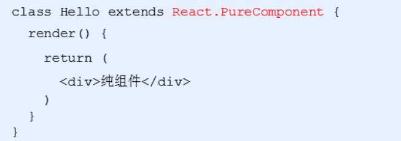

### React的使用

```html
<script src="./node_modules/react/umd/react.development.js"></script>
<script src="./node_modules/react-dom/umd/react-dom.development.js"></script>
```

```javascript
// 创建元素节点
// 1. 元素名称
// 2. 元素属性 传递的是个对象
// 3. 元素内容
let title = React.createElement('li', null, 'hellow react');
```

```javascript
// 渲染到页面
ReactDOM.render(title, root)
```


### React脚手架意义

- 脚手架是开发现代Web应用的必备
- 充分利用 Webpack，Babel，ESLint等工具辅助项目开发
- 零配置，无需手动配置繁琐的工具即可使用
- 关注业务，而不是工具配置

- 初始化项目，命令： npx create-react-app my-pro
  - npx 目的：提升包内提供的命令行工具的使用体验
  - create-react-app  这个是脚手架名称 不能随意更改
  - my-pro  自己定义的项目名称
- 启动项目，在项目根目录执行命令： npm start

yarn命令简介

- yarn 是Facebook发布的包管理器，可以看做是npm的替代品，功能与npm相同
- 初始化新项目：yarn init
- 安装包： yarn add 包名称
- 安装项目依赖： yarn

### 脚手架中使用React

- 导入react和react-dom两个包

```react
import React from 'react'
import ReactDOM from 'react-dom'
```

- 创建元素

```react
let myh1 = React.createElement('h1',null,'我是标题')
```

- 渲染到页面

```react
ReactDOM.render(myh1,document.getElementById('root'))
```

# JSX的使用

#### JSX产生的原因

通过createElement()方法创建的React元素有一些问题，代码比较繁琐，结构不直观，无法一眼看出描述的结构，用户体验不爽

JSX是JavaScript XML 的简写，表示在JavaScript代码中写HTML格式的代码

优势：声明式语法更加直观，与HTML结构相同，降低了学习成本，提升开发效率

#### 使用步骤

- 使用JSX语法创建react元素

```react
let h1 = <h1>我是通过JSX创建的元素</h1>
```

- 使用ReactDOM来渲染元素

```react
ReactDOM.render(h1,document.getElementById('root'))
```

#### 为什么在脚手架中可以使用JSX语法

- JSX 不是标准的ECMAScript语法，它是ECMAScript的语法拓展
- create-react-app脚手架中已经默认有该配置编译JSX语法的包： @bable/preset-react，无需手动配置


#####  注意点

- 只要是合法的js表达式都可以进行嵌入
- JSX自身也是js表达式  和vue差不多 三元可以    if for while不可以 
- 注意：js中的对象是一个例外，一般只会出现在style属性中
- 注意：在{}中不能出现语句

#### 3.1 条件渲染 

根据不同的条件来渲染不同的JSX结构---if 或者三元

```react
let isLoading = true
let loading = ()=>{
    if(isLoading){
        return <div>Loading...</div>
    }
    return <div>加载完成</div>
}
```

#### 3.2 列表渲染

- 如果需要渲染一组数据，我们应该使用数组的 map () 方法
- 注意：渲染列表的时候需要添加key属性，key属性的值要保证唯一
- 原则：map()遍历谁，就给谁添加key属性
- 注意：尽量避免使用索引号作为key

```react
let arr = [{
    id:1,
    name:'三国演义'
},{
    id:4,
    name:'红楼梦'
}]
let myul = (<ul>
    {arr.map(item => <li key={item.id}>{item.name}</li>)}
</ul>)
ReactDOM.render(myul,document.getElementById('root'))
```

#### 3.3 样式处理

##### 行内样式 -style

在style里面我们通过对象的方式传递数据

```react
<li key={item.id} style={{'color': 'red',"backgroundColor": 'pink'}}>{item.name}</li>
```

这种方式比较的麻烦，不方便进行阅读，而且还会导致代码比较的繁琐

##### 4.1 类名 -className

创建CSS文件编写样式代码

```css
.container {
    text-align: center
}
```

在js中进行引入，然后设置类名即可

```react
import './css/index.css'

<li className='container' key={item.id} style={{'color': 'red',"backgroundColor": 'pink'}}>{item.name}</li>
```


# React组件

### 4.2 函数创建组件

- **约定1：**函数名称必须以大写字母开头
- **约定2：**函数组件必须有返回值，表示该组件的结构
- 如果返回值为null，表示不渲染任何内容

编写函数组件

```react
function Header() {
    return (
        <div>这是第一个函数组件</div>
    )
}
```

利用ReactDOM.render()进行渲染

```react
ReactDOM.render(<Header />,document.getElementById('root'))
```

### 4.3 类组件

#### class 语法 就是构造函数

```
class Person {
        // constructor(){
        //     this.money=100000
        // }
        money=100000
        sing(){
            console.log("你好啊 健林")
        }

}
class Teacher extends Person{
    // constructor(){
    //     super()
    //     this.name='王俊草'
    // }
    name='王俊草'
    sayHi(){
   		 console.log("hihihi~~")
    }
}
```

创建class类，继承React.Component，在里面提供render方法，在return里面返回内容

```react
class Hello extends React.Component{
    render(){
        return (
            <div>这是第一个类组件</div>
        )
    }
}
```

通过ReactDOM进行渲染

```react
ReactDOM.render(<Hello />,document.getElementById('root'))
```

### 4.4 抽离成单独的JS文件

```react
import React from 'react'
// 2 写一个组件
export default class Header extends React.Component{
    // 必须有render
    render(){
       return <div>我是头部导出的</div>
    }
 }
```

- 在index.js中导入Hello组件，渲染到页面

```react
import Header from './zujian/Header'
ReactDOM.render(<Header />,document.getElementById('root'))
```


## React事件处理

```react
 class My extends React.Component {
    clickHandle(e){
        console.log('点了')
    }
    render(){
        return (
            <div><button onClick = {this.clickHandle}>点我点我点我</button></div>
        )
    }
}
```

### 支持的事件

- Clipboard Events  剪切板事件

  - 事件名 ：onCopy onCut onPaste
  - 属性     ：DOMDataTransfer clipboardData

- compositionEvent  复合事件

  - 事件名： onCompositionEnd onCompositionStart onCompositionUpdate
  - 属性： string data

- Keyboard Events  键盘事件

  - 事件名：onKeyDown onKeyPress onKeyUp
  - 属性： 例如 number keyCode  太多就不一一列举

- Focus Events  焦点事件  （这些焦点事件在 React DOM 上的所有元素都有效，不只是表单元素）

  - 事件名： onFocus onBlur
  - 属性： DOMEventTarget relatedTarget

- Form Events  表单事件

  - 事件名： onChange onInput onInvalid onSubmit

- Mouse Events  鼠标事件

  - 事件名：

    ```react
    onClick onContextMenu onDoubleClick onDrag onDragEnd onDragEnter onDragExit
    onDragLeave onDragOver onDragStart onDrop onMouseDown onMouseEnter onMouseLeave
    onMouseMove onMouseOut onMouseOver onMouseUp
    ```

- Pointer Events  指针事件

  - 事件名：

    ```react
    onPointerDown onPointerMove onPointerUp onPointerCancel onGotPointerCapture
    onLostPointerCapture onPointerEnter onPointerLeave onPointerOver onPointerOut
    ```

- Selection Events  选择事件

  - 事件名：onSelect

- Touch Events  触摸事件

  - 事件名：onTouchCancel onTouchEnd onTouchMove onTouchStart

- UI Events  UI 事件

  - 事件名： onScroll

- Wheel Events  滚轮事件

  - 事件名：onWheel

  - 属性： 

    ```react
    number deltaMode
    number deltaX
    number deltaY
    number deltaZ
    ```

- Media Events  媒体事件

  - 事件名：

    ```react
    onAbort onCanPlay onCanPlayThrough onDurationChange onEmptied onEncrypted
    onEnded onError onLoadedData onLoadedMetadata onLoadStart onPause onPlay
    onPlaying onProgress onRateChange onSeeked onSeeking onStalled onSuspend
    onTimeUpdate onVolumeChange onWaiting
    ```

- Image Events 图像事件

  - 事件名：onLoad onError

- Animation Events 动画事件

  - 事件名：onAnimationStart onAnimationEnd onAnimationIteration

- Transition Events 过渡事件

  - 事件名：onTransitionEnd

- Other Events  其他事件

  - 事件名： onToggle


## 5.3 有状态组件有state数据和无状态组件

- 函数组件又叫做 无状态组件，类组件又叫做 有状态组件
- 状态(state) 即数据
- 函数组件没有自己的状态，只负责数据展示
- 类组件有自己的状态，负责更新UI，让页面动起来

### state基本使用

```react
 class My extends React.Component {
    constructor(){
        super()
        // 第一种初始化方式
        this.state = {
            count : 0
        }
    }
    // 第二种初始化方式
    state = {
        count:1
    }
    render(){
        return (
            <div>计数器 :{this.state.count}</div>
        )
    }
}
```

###  setState() 修改状态

- setState() 作用：1.修改 state 2.更新UI

```react
export default class extends React.Component {
    // 第二种初始化方式
    state = {
        count:1
    }
    render(){
        return (
            <div>
                <div>计数器 :{this.state.count}</div>
                <button onClick={() => {
                     this.setState({
            	 		count: this.state.count+1
           			  })   
                }}>+1</button>
            </div>
        )
    }
}
```

- React底层会有监听，一旦我们调用了setState导致了数据的变化，就会重新调用一次render方法，重新渲染当前组件

- 在JSX中我们写的事件处理函数可以找到this，原因在于在JSX中我们利用箭头函数，箭头函数是不会绑定this，所以会向外一层去寻找，外层是render方法，在render方法里面的this刚好指向的是当前实例对象

## 事件绑定this指向

- 剪头函数
- 利用原型bind方法是可以更改函数里面this的指向的，所以我们可以在构造中调用bind方法，然后把返回的值赋值给我们的函数即可

```react
class App extends React.Component {
  state={a:1}
  // 事件处理程序
  onIncrement() {
    ...
  }
  render() {
    ...
    <button onClick={this.onIncrement.bind(this)}>点击+1</button>
  }
}
```

### class的实例方法-直接就写箭头函数

- 利用箭头函数形式的class实例方法
- 注意：该语法是实验性语法，但是，由于babel的存在可以使用

```react
  // 事件处理程序
  onIncrement = () => {
    console.log('事件处理程序中的this：', this)
    this.setState({
      count: this.state.count + 1
    })
  }
```

事件一般直接就写箭头函数


### 受控组件-使用state数据

使用state数据的组件叫 受控组件

使用state数据的表单元素叫 受控表单

- HTML中的表单元素是可输入的，也就是有自己的可变状态
- 而React中可变状态通常保存在state中，并且只能通过`setState()` 方法来修改
- React讲state与表单元素值value绑定在一起，有state的值来控制表单元素的值
- 受控组件：值受到react控制的表单元素

#### 使用步骤

- 在state中添加一个状态，作为表单元素的value值
- 给表单元素绑定change事件，将表单元素的值设置为state的值

```react
class App extends React.Component {
    state = {
        txt : ''
    }
    inputChange=(e)=>{
       this.setState({
           txt: e.target.value
       })
    }
    render(){
        console.log(this.state);
        
        return (
            <div>
                <input type="text" value={this.state.txt} onChange={this.inputChange}/>
            </div>
        )
    }
}
```


### 1.2 非受控组件 （了解）不用state 单纯只想ref操作dom获取文本框值

- 说明：借助于ref，使用元素DOM方式获取表单元素值
- ref的作用：获取DOM或者组件

#### 使用步骤

- 调用 `React.createRef()` 方法创建ref对象
- 将创建好的 ref 对象添加到文本框中
- 通过ref对象获取到文本框的值

```react
class App extends React.Component {
   // constructor(){
    //    super()
      //  this.txtRef = React.createRef()
   // }
    txtRef = React.createRef()
    // 获取文本框的值
    getTxt =() => {
        console.log(this.txtRef.current.value)
    }
    render(){
        return (
          <div>
            <input type ="text" ref={this.txtRef} />
            <button onClick ={this.getTxt}>获取值</button>
          </div>
        )
    }
}
```


# 组件案例

```react
add = (e) => {
  // 拿到用户输入的内容
  let {userName,userContent} = this.state
  if(userName.trim()==='' || userContent.trim() === ''){
      alert('请输入内容')
      return
  }
  // 利用数组拓展运算符来进行数据的拼接，把用户输入的存放在数组的第一个位置
 // this.state.comments.push() 不要直接这样！！
    let newcomments=[...this.state.comments]
    newcomments.push({
        id:newcomments.length+1,
        name:this.state.username,
        content:this.state.content
    })
  this.setState({
    comments: newComments,
    userName:'',
    userContent: ''
  })
}
```


## 组件通讯

- 组件时封闭的，要接受外部数据应该通过props来实现
- props的作用：接收传递给组件的数据
- 传递数据：给组件标签添加属性

- 接收数据：函数组件通过 参数 props接收数据，类组件通过 this.props接收数据


- 可以给组件传递任意类型的数据
- props是只读属性，不能对值进行修改
- 注意：使用类组件时，如果写了构造函数，应该将props传递给super(),否则无法在构造函数中获取到props，其他的地方是可以拿到的


### 父传子

- 父组件提供要传递的state数据
- 给子组件标签添加属性，值为state中的数据
- 子组件中通过props接收父组件中传递的数据


### 子传父

- 利用回调函数，父组件提供回调，子组件调用，将要传递的数据作为回调函数的参数
- 父组件提供一个回调函数，用来接收数据
- 将该函数作为属性的值，传递给子组件

- 子组件通过props调用回调函数


### 兄弟组件传递

- 将共享状态(数据)提升到最近的公共父组件中，由公共父组件管理这个状态

- 这个称为状态提升

- 公共父组件职责：1. 提供共享状态 2.提供操作共享状态的方法

- 要通讯的子组件只需要通过props接收状态或操作状态的方法

  

- 在父组件里定义共享状态，把这个状态传递给第一个子组件

```react
class Counter extends React.Component {
    // 提供共享的状态
    state = {
        count: 0
    }
    render() {
        return (<div>
            {/* 把状态提供给第一个子组件 */}
            <Child1 count={this.state.count}/>
            <Child2 />
        </div>
        )
    }
}
```

- 在第一个子组件里面就能通过props获取到

```react
class Child1 extends React.Component {
    render() {
        return (
            <h1>计数器：{this.props.count}</h1>
        )
    }
}
```

- 在父组件中提供共享方法，通过属性传递给第二个子组件，方便第二个子组件来进行调用

```react
    // 提供共享方法
    onIncrement = (res) => {
        // 只要第二个子组件调用了这个函数，就会执行里面代码
        this.setState({
            count: this.state.count + res
        })
    }
    render() {
        return (<div>
            ...
            {/* 把共享方法提供给第二个子组件 */}
            <Child2 onIncrement={this.onIncrement} />
        </div>
        )
    }
```

- 在第二个子组件里面通过props来获取到对应函数，然后进行调用

```react
class Child2 extends React.Component {
    handleClick = () => {
        // 这里一旦调用，就会执行父组件里面 onIncrement函数
        this.props.onIncrement(2)
    }
    render() {
        return (
            <button onClick={this.handleClick}>+</button>
        )
    }
}
```

## Context

如果出现层级比较多的情况下（例如：爷爷传递数据给孙子），使用Context来进行传递

- 在组件外面 调用 `React.createContext()` 创建 Provider(提供数据) 和 Consumer(获取数据) 两个组件


- 使用Provider 组件作为父节点

- 设置value属性，表示要传递的数据


- 哪一层想要接收数据，就用Consumer进行包裹，在里面回调函数中的参数就是传递过来的值

  ```rea
  <Consumer>
  	{ data => { <div>数据：{ data }</div>} }
  </Consumer>
  ```

  

## props进阶

- children属性： 表示组件标签的子节点，当组件标签有子节点时，props就会有该属性
- children属性与普通的props一样，值可以使任意值（文本、react元素、组件、甚至是函数）


### 6.2 props校验

- 关键问题：组件的使用者不知道需要传递什么样的数据
- props校验：允许在创建组件的时候，指定props的类型、格式等

- 作用：捕获使用组件时因为props导致的错误，给出明确的错误提示，增加组件的健壮性


#### 使用步骤

- 安装包  `prop-types (yarn add prop-types | npm i props-types)`

- 导入prop-types 包

- 校验规则通过PropTypes对象来指定

  ```rea
  App.propTypes = {
  	arr: PropTypes.array
  }
  ```

#### 常见的约束规则

- 创建的类型： `array、bool、func、number、object、string`
- React元素类型：`element`
- 必填项：`isRequired`
- 特定结构的对象： `shape({})`
- 更多的[约束规则](<https://zh-hans.reactjs.org/docs/typechecking-with-proptypes.html#proptypes>)


### 6.3 props的默认值

- 场景：分页组件 -> 每页显示条数


# 组件生命周期

### 创建时（挂载阶段）

- 执行时机：组件创建时（页面加载时）


### 更新时

执行时机：`setState()、 forceUpdate()、 组件接收到新的props`

说明：以上三者任意一种变化，组件就会重新渲染


componentDidUpdate(preProps)  preProps 更新之前的老props

### 卸载时

执行时机：组件从页面中消失

作用：用来做清理操作


#### 新版完整生命周期钩子函数


##### `getDerivedStateFromProps()`

- **`getDerivedStateFromProps`** 会在调用 render 方法之前调用，并且在初始挂载及后续更新时都会被调用。它应返回一个对象来更新 state，如果返回 null 则不更新任何内容
- 不管原因是什么，都会在*每次*渲染前触发此方法

##### `shouldComponentUpdate()`

- 根据 **`shouldComponentUpdate()`** 的返回值，判断 React 组件的输出是否受当前 state 或 props 更改的影响。默认行为是 state 每次发生变化组件都会重新渲染
- 当 props 或 state 发生变化时，**`shouldComponentUpdate()`** 会在渲染执行之前被调用。返回值默认为 true

##### `getSnapshotBeforeUpdate()`

- **`getSnapshotBeforeUpdate()`** 在最近一次渲染输出（提交到 DOM 节点）之前调用。它使得组件能在发生更改之前从 DOM 中捕获一些信息（例如，滚动位置）。此生命周期的任何返回值将作为参数传递给 **`componentDidUpdate()`**
- 此用法并不常见，但它可能出现在 UI 处理中，如需要以特殊方式处理滚动位置的聊天线程等


# render-props模式

- 创建Mouse组件，在组件中提供复用的逻辑代码
- 将要复用的状态作为 props.render(state)方法的参数，暴露到组件外部
- 使用props.render() 的返回值作为要渲染的内容

```react
class Mouse extends React.Component {
    // 鼠标位置状态
    state = {
        x: 0,
        y: 0
    }
    // 监听鼠标移动事件
    componentDidMount(){
        window.addEventListener('mousemove',this.handleMouseMove)
    }
    handleMouseMove = e => {
        this.setState({
            x: e.clientX,
            y: e.clientY
        })
    }
    render(){
        // 向外界提供当前子组件里面的数据
        return this.props.render(this.state)
    }
}
class App extends React.Component {
    render() {
        return (
            <div>
                App
                <Mouse render={mouse => {
                    return <p>X{mouse.x}Y{mouse.y}</p>
                }}/>
            </div>
        )
    }
}
ReactDOM.render(<App />,document.getElementById('root'))
```

## 2.2 children代替render属性

- 推荐：使用childre代替render属性


# 高阶组件 

- 高阶组件(HOC、Higher-Order Component) 是一个函数，接收要包装的组件，返回**增强**后的组件


- 高阶组件内部创建了一个类组件，在这个类组件中提供复用的状态逻辑代码，通过prop将复用的状态传递给被包装组件`WrappedComponent`

高阶函数(形式上):如果一个**函数**的形参或者返回值也是**函数**

高阶组件:如果一个**函数**的形参和返回值是**组件**

```react
// 定义一个函数，在函数内部创建一个相应类组件
function abc(WrapComponent){ // 函数组件
     class My extends React.Component{
        componentDidMount(){
            console.log('100----')
        }
        render(){
            return <div>
                <h1>我是My公共部分哦</h1>
            	<WrapComponent/>    // 函数组件
            </div>
        }
    }
    return My
}
// 函数组件
const ComponentA = ()=>{return div}
const ComponentB = ()=>{return div}

const WithA(类组件) = abc(ComponentA)
<WithA/>
const WithB(类组件) = abc(ComponentB)
```


## ` setState()`说明

- `setState()`更新数据是异步的
- 注意：使用该语法，后面的`setState`不要依赖前面`setState`的值
- 多次调用`setState`，只会触发一次render

##### 语法1---简单写法

```
this.setState({
  xx:123
})
```

##### 语法2 --复杂语法

- ：使用 `setState((state,props) => {})` 语法
- 参数state： 表示最新的state
- 参数props： 表示最新的props


- 场景：在状态更新(页面完成重新渲染)后立即执行某个操作
- 语法：`setState(update[,callback])`


## 4.2 JSX语法的转化过程

- JSX仅仅是`createElement()` 方法的语法糖(简化语法)

  JSX语法被 @babel/preset-react 插件编译为`createElement()` 方法


## 组件更新机制

- 过程：父组件重新渲染时，也会重新渲染子组件，但只会渲染当前组件子树（当前组件以其所有子组件）


## 组件性能优化

### 1.2 减轻state

- 减轻state：只存储跟组件渲染相关的数据（比如：count/ 列表数据 /loading等）
- 注意：不用做渲染的数据   固定死的数据   不要放在state中
- 对于这种需要在多个方法中用到的数据，应该放到this中


### 1.2 避免不必要的重新渲染

- 组件更新机制：父组件更新会引起子组件也被更新，这种思路很清晰
- 问题：子组件没有任何变化时也会重新渲染
- 解决方式：使用钩子函数 shouldComponentUpdate(nextProps, nextState)
  - 在这个函数中，nextProps和nextState是最新的状态以及属性
- 作用：这个函数有返回值，如果返回true，代表需要重新渲染，如果返回false，代表不需要重新渲染
- 触发时机：更新阶段的钩子函数，组件重新渲染前执行(shouldComponentUpdate => render)


##### 案例

需求：随机生成数字，显示在页面，如果生成的数字与当前显示的数字相同，那么就不需要更新UI，反之更新UI。

利用nextState参数来判断当前组件是否需要更新

```react
class App extends React.Component {
    state = {
        number: 0
    }
    // 点击事件，每次点击生成一个随机数
    hanldeBtn = () => {
        this.setState({
            number: Math.floor(Math.random() * 3)
        })
    }
    // 将要更新UI的时候会执行这个钩子函数
    shouldComponentUpdate(nextProps,nextState) {
         // 判断一下当前生成的 值是否与页面的值相等
         if(nextState.number !== this.state.number){
             return true
         }
         return false
    }
    render() {
        return (
            <div>
                随机数：{this.state.number} <br />
                <button onClick={this.hanldeBtn}>生成随机数</button>
            </div>
        )
    }
}
```

利用props参数来判断是否需要进行更新

```react
class App extends React.Component {
    state = {
        number: 0
    }
    // 点击事件，每次点击生成一个随机数
    hanldeBtn = () => {
        this.setState({
            number: Math.floor(Math.random() * 3)
        })
    }

    render() {
        return (
            <div>
                <NumberBox number={this.state.number} />
                <button onClick={this.hanldeBtn}>生成随机数</button>
            </div>
        )
    }
}
class NumberBox extends React.Component {
    // 将要更新UI的时候会执行这个钩子函数
    shouldComponentUpdate(nextProps, nextState) {
        // 判断一下当前生成的 值是否与页面的值相等
        if (nextProps.number !== this.props.number) {
            return true
        }
        return false
    }
    render() {
        return (
            <h1>随机数：{this.props.number} </h1>
        )
    }
}
```

### 1.3 纯组件

#### 作用以及使用

- 纯组件： PureComponent 与 React.Component 功能相似
- 区别： PureComponent 内部自动实现了 shouldComponentUpdate钩子，不需要手动比较
- 原理：纯组件内部通过分别比对前后两次 props和state的值，来决定是否重新渲染组件



#### 实现原理

- 说明：纯组件内部的对比是 shallow compare（浅层对比）
- 对于值类型来说：比较两个值是否相同


- 引用类型：只比对对象的引用地址是否相同


- 注意：state 或 props 中属性值为引用类型时，应该创建新数据，不要直接修改原数据


建议数组和对象 创建新数据再赋值


## 虚拟DOM和Diff算法

- React更新视图的思想是：只要state变化就重新渲染视图
- 特点：思路非常清晰
- 问题：组件中只有一个DOM元素需要更新时，也得把整个组件的内容重新渲染吗？ 不是这样的
- 理想状态：部分更新，只更新变化的地方

### Diff算法

- 初次渲染时，React会根据初始化的state（model），创建一个虚拟DOM对象（树）
- 根据虚拟DOM生成真正的DOM，渲染到页面
- 当数据变化后(setState())，会重新根据新的数据，创建新的虚拟DOM对象（树）
- 与上一次得到的虚拟DOM对象，使用Diff算法比对（找不同），得到需要更新的内容
- 最终，React只将变化的内容更新（patch）到DOM中，重新渲染到页面


### 代码演示

- 组件render()调用后，根据状态和JSX结构生成虚拟DOM对象(render()方法的调用并不意味着浏览器进行渲染，render方法调用时意味着Diff算法开始比对了)
- 示例中，只更新p元素的文本节点内容
- 初次渲染的DOM对象


- 数据更新之后的虚拟DOM对象


- 虚拟DOM最大的特点是 脱离了浏览器的束缚，也就是意味着只要是能支持js的地方都可以用到react，所以为什么说react是可以进行跨平台的开发

**diff算法有个很重要的概念，叫做同级比较**

1首先会比较最顶层的虚拟dom节点是否一致，假设一致，再去比较下一个节点。

2 假设第一层虚拟dom不一致，这个时候怎么办呢？这个时候react就不会往下比了，他会原始的虚拟dom下面的节点全部删除掉，重新生成一遍节点下面的所有dom，然后用重新生成的dom，替换原始页面的dom，也就是只比对一层dom，

3 这不是性能很低吗？假设第一层节点不同，下面的节点都相同，岂不是下面的节点都没法复用了，确实是这样的，虽然会造成一些dom节点的渲染浪费，

4 但是这种比对有什么好处呢？我们说同层比对，带来的算法非常的简单，只要一层一层的做对比就行了，算法简单，带来的好处就是比对的速度会非常的快，所以可能会造成重新渲染的一些浪费，但大大减少了去比对的算法上的性能消耗。所以采用了同层比对的算法。

**虚拟dom根据key值做关联，只要找到对应的名字一样的节点是否相同，极大的提高了react的性能**


# React路由基础

- 安装： yarn add react-router-dom

- 如果没有安装yarn工具的，需要先全局安装一下yarn：npm install -g yarn

- 导入路由的三个核心组件： Router / Route / Link

  ```react
  import {BrowserRouter as Router, Route, Link} from 'react-router-dom'
  ```

- 使用Router 组件包裹整个应用

- 使用Link组件作为导航菜单（路由入口）


- 使用Route组件配置路由规则和要展示的组件（路由出口）


### 常用组件说明

- **Router组件：**包裹整个应用，一个React应用只需要使用一次
  - 两种常用的Router： HashRouter和BrowserRouter
  - HashRouter： 使用URL的哈希值实现 （localhost:3000/#/first）
  - 推荐 BrowserRouter：使用H5的history API实现（localhost3000/first）
- **Link组件：**用于指定导航链接（a标签）
  - 最终Link会编译成a标签，而to属性会被编译成 a标签的href属性
- **Route组件：**指定路由展示组件相关信息
  - path属性：路由规则，这里需要跟Link组件里面to属性的值一致
  - component属性：展示的组件
  - Route写在哪，渲染出来的组件就在哪

### 路由的执行过程

- 当我们切换地址时候，修改了浏览器地址栏中的url
- React路由监听地址栏url的变化
- React路由内部遍历所有的Route组件，拿着Route里面path规则与pathname进行匹配

- 当路由规则（path）能够匹配地址栏中的pathname时，就展示该Route组件的内容

### 编程式导航

- **场景：**点击登陆按钮，登陆成功后，通过代码跳转到后台首页，如何实现？
- **编程式导航：**通过JS代码来实现页面跳转`this.props.history.push()`
- history是React路由提供的，用于获取浏览器历史记录的相关信息
- **push(path)：**跳转到某个页面，参数path表示要跳转的路径
- go(n)：前进或后退功能，参数n表示前进或后退页面数量

### 3.3 匹配模式

#### 模糊匹配模式

- 当Link组件的to属性值为 '/login' 时候，为什么默认路由也被匹配成功？
- 默认情况下，React路由是模糊匹配模式
- 模糊匹配规则：只要pathname以path开头就会匹配成功


#### 精准匹配

- 给Route组件添加exact属性，让其变为**精准匹配模式**
- 精确匹配：只有当path和pathname完全匹配时才会展示改路由


### 4.3 其他路由

1. Switch(了解就行)-> 只显示第一个可以匹配到的组件

   ```html
   <Switch>
       <Route/>
       <Route/>
   </Switch>
   ```

2. 重定向

   ```html
   <Route
       exact
       path="/"
       render={props => {
       // console.log('render-props模式：', props)
       // Redirect 组件：是路由的重定向组件，通过 to 属性，来指定要重定向到的路由地址
       return <Redirect to="/home" />
       }}
    />
   ```
