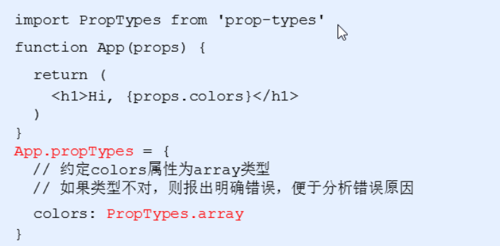
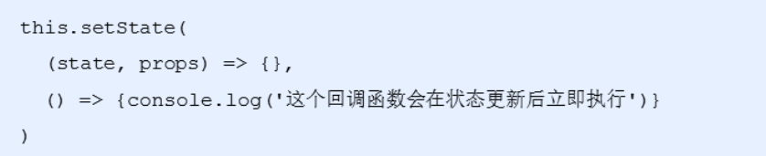

# React基础知识点

### React的安装

npm i react react-dom 

- react 包是核心，提供创建元素，组件等功能
- react-dom 包提供DOM相关功能

### React的使用

- 引入react和react-dom的两个js文件

```html
<script src="./node_modules/react/umd/react.development.js"></script>
<script src="./node_modules/react-dom/umd/react-dom.development.js"></script>
```

- 创建React元素

```javascript
// 创建元素节点
// 1. 元素名称
// 2. 元素属性 传递的是个对象
// 3. 元素内容
let title = React.createElement('li', null, 'hellow react');
```

- 渲染到页面

```javascript
// 渲染到页面
ReactDOM.render(title, root)
```

## 1.3 React脚手架

- 初始化项目，命令： npx create-react-app my-pro
- 启动项目，在项目根目录执行命令： npm start

### 脚手架中使用React-了解目录就行

1  可以删掉只留index.js  2 不管他 清空index.js 自己写

- 导入react和react-dom两个包

```react
import React from 'react'
import ReactDOM from 'react-dom'
```

- 创建元素

```react
let myh1 = React.createElement('h1',null,'我是标题')
```

- 渲染到页面

```react
ReactDOM.render(myh1,document.getElementById('root'))
```

# JSX的使用

#### JSX产生的原因

由于通过createElement()方法创建的React元素有一些问题，代码比较繁琐，结构不直观，无法一眼看出描述的结构，不优雅，用户体验不爽

#### JSX的概述

JSX是JavaScript XML 的简写，表示在JavaScript代码中写HTML格式的代码

优势：声明式语法更加直观，与HTML结构相同，降低了学习成本，提升开发效率

## 2.2 简单入门使用

#### 为什么在脚手架中可以使用JSX语法

- JSX 不是标准的ECMAScript语法，它是ECMAScript的语法拓展
- 需要使用babel编译处理后，才能在浏览器环境中使用
- create-react-app脚手架中已经默认有该配置，无需手动配置
- 编译JSX语法的包： @bable/preset-react

#### 2.3 注意点

- React元素的属性名使用驼峰命名法
- 特殊属性名：class -> className，for -> htmlFor，tabindex -> tabIndex
- 如果没有子节点的React元素可以用 `/>` 来结束
- 推荐：使用 小括号包裹JSX，从而避免JS中换行的问题

## 2.4 JSX语法

##### 行内样式 -style

在style里面我们通过对象的方式传递数据

```react
<li key={item.id} style={{'color': 'red',"backgroundColor": 'pink'}}>{item.name}</li>
```

这种方式比较的麻烦，不方便进行阅读，而且还会导致代码比较的繁琐

##### 4.1 类名 -className

创建CSS文件编写样式代码

```css
.container {
    text-align: center
}
```

在js中进行引入，然后设置类名即可

```react
import './css/index.css'

<li className='container' key={item.id} style={{'color': 'red',"backgroundColor": 'pink'}}>{item.name}</li>
```


# React组件

## 组件的两种创建方式

### 4.2 函数创建组件

- 函数组件：使用JS的函数创建组件
- **约定1：**函数名称必须以大写字母开头
- **约定2：**函数组件必须有返回值，表示该组件的结构
- 如果返回值为null，表示不渲染任何内容

编写函数组件

```react
function Header() {
    return (
        <div>这是第一个函数组件</div>
    )
}
```

利用ReactDOM.render()进行渲染

```react
ReactDOM.render(<Header />,document.getElementById('root'))
```

### 4.3 类组件

#### class 语法 就是构造函数

```
class Person {
        // constructor(){
        //     this.money=100000
        // }
        money=100000
        sing(){
            console.log("你好啊 健林")
        }

}

class Teacher extends Person{
    // constructor(){
    //     super()
    //     this.name='王俊草'
    // }
    name='王俊草'
    sayHi(){
   		 console.log("hihihi~~")
    }
}
```

- 使用ES6语法的class创建的组件
- 约定1：类名称也必须要大写字母开头
- 约定2：类组件应该继承React.Component父类，从而可以使用父类中提供的方法或者属性
- 约定3：类组件必须提供 render 方法
- 约定4：render方法中必须要有return返回值

创建class类，继承React.Component，在里面提供render方法，在return里面返回内容

```react
class Hello extends React.Component{
    render(){
        return (
            <div>这是第一个类组件</div>
        )
    }
}
```

通过ReactDOM进行渲染

```react
ReactDOM.render(<Hello />,document.getElementById('root'))
```


## React事件处理

```react
 class My extends React.Component {
    clickHandle(e){
        console.log('点了')
    }
    render(){
        return (
            <div><button onClick = {this.clickHandle}>点我点我点我</button></div>
        )
    }
}
```

### 支持的事件

- Clipboard Events  剪切板事件

  - 事件名 ：onCopy onCut onPaste
  - 属性     ：DOMDataTransfer clipboardData

- compositionEvent  复合事件

  - 事件名： onCompositionEnd onCompositionStart onCompositionUpdate
  - 属性： string data

- Keyboard Events  键盘事件

  - 事件名：onKeyDown onKeyPress onKeyUp
  - 属性： 例如 number keyCode  太多就不一一列举

- Focus Events  焦点事件  （这些焦点事件在 React DOM 上的所有元素都有效，不只是表单元素）

  - 事件名： onFocus onBlur
  - 属性： DOMEventTarget relatedTarget

- Form Events  表单事件

  - 事件名： onChange onInput onInvalid onSubmit

- Mouse Events  鼠标事件

  - 事件名：

    ```react
    onClick onContextMenu onDoubleClick onDrag onDragEnd onDragEnter onDragExit
    onDragLeave onDragOver onDragStart onDrop onMouseDown onMouseEnter onMouseLeave
    onMouseMove onMouseOut onMouseOver onMouseUp
    ```

- Pointer Events  指针事件

  - 事件名：

    ```react
    onPointerDown onPointerMove onPointerUp onPointerCancel onGotPointerCapture
    onLostPointerCapture onPointerEnter onPointerLeave onPointerOver onPointerOut
    ```

- Selection Events  选择事件

  - 事件名：onSelect

- Touch Events  触摸事件

  - 事件名：onTouchCancel onTouchEnd onTouchMove onTouchStart

- UI Events  UI 事件

  - 事件名： onScroll

- Wheel Events  滚轮事件

  - 事件名：onWheel

  - 属性： 

    ```react
    number deltaMode
    number deltaX
    number deltaY
    number deltaZ
    ```

- Media Events  媒体事件

  - 事件名：

    ```react
    onAbort onCanPlay onCanPlayThrough onDurationChange onEmptied onEncrypted
    onEnded onError onLoadedData onLoadedMetadata onLoadStart onPause onPlay
    onPlaying onProgress onRateChange onSeeked onSeeking onStalled onSuspend
    onTimeUpdate onVolumeChange onWaiting
    ```

- Image Events 图像事件

  - 事件名：onLoad onError

- Animation Events 动画事件

  - 事件名：onAnimationStart onAnimationEnd onAnimationIteration

- Transition Events 过渡事件

  - 事件名：onTransitionEnd

- Other Events  其他事件

  - 事件名： onToggle

## 5.4 State和SetState

```react
 class My extends React.Component {
    constructor(){
        super()

        // 第一种初始化方式
        this.state = {
            count : 0
        }
    }
    // 第二种初始化方式
    state = {
        count:1
    }
    render(){
        return (
            <div>计数器 :{this.state.count}</div>
        )
    }
}
```

### 6.1 setState() 修改状态

```react
export default class extends React.Component {
    // 第二种初始化方式
    state = {
        count:1
    }
    render(){
        return (
            <div>
                <div>计数器 :{this.state.count}</div>
                <button onClick={() => {
                     this.setState({
            	 		count: this.state.count+1
           			  })   
                }}>+1</button>
            </div>
        )
    }
}
```

#### 小结

- 修改state里面的值我们需要通过 this.setState() 来进行修改
- React底层会有监听，一旦我们调用了setState导致了数据的变化，就会重新调用一次render方法，重新渲染当前组件

## 表单处理

### 1.1 受控组件 -使用state数据

使用state数据的组件叫 受控组件

使用state数据的表单元素叫 受控表单

- HTML中的表单元素是可输入的，也就是有自己的可变状态
- 而React中可变状态通常保存在state中，并且只能通过`setState()` 方法来修改
- React讲state与表单元素值value绑定在一起，有state的值来控制表单元素的值
- 受控组件：值受到react控制的表单元素


#### 使用步骤

- 在state中添加一个状态，作为表单元素的value值
- 给表单元素绑定change事件，将表单元素的值设置为state的值

#### 示例demo

```react
class App extends React.Component {

    state = {
        txt : ''
    }
    inputChange=(e)=>{
       this.setState({
           txt: e.target.value
       })
    }
    render(){
        console.log(this.state);
        
        return (
            <div>
                {/* 把state的值设置给输入框的value，绑定change事件，这样用户在输入内容的时候调用相应函数，在函数里面把当前设置的值赋值给state，从而达到数据的统一 */}
                <input type="text" value={this.state.txt} onChange={this.inputChange}/>
            </div>
        )
    }
}
ReactDOM.render(<App />,document.getElementById('root'))

```

+ react 表单基本都可以这样处理 -v--model就是这样实现的

### 1.2 非受控组件 （了解）不用state 单纯只想ref操作dom获取文本框值

- 说明：借助于ref，使用元素DOM方式获取表单元素值
- ref的作用：获取DOM或者组件

#### 使用步骤

- 调用 `React.createRef()` 方法创建ref对象
- 将创建好的 ref 对象添加到文本框中
- 通过ref对象获取到文本框的值

```react
class App extends React.Component {
    constructor(){
        super()
        
        //创建 ref
        this.txtRef = React.createRef()
    }
    //或者 txtRef = React.createRef()
    // 获取文本框的值
    getTxt =() => {
        console.log(this.txtRef.current.value)
    }
    render(){
        return (
          <div>
            <input type ="text" ref={this.txtRef} />
            <button onClick ={this.getTxt}>获取值</button>
          </div>
        )
    }
}
```


# React组件进阶

## 3.2 组件的props

- 接收数据：函数组件通过 参数 props接收数据，类组件通过 this.props接收数据

  - 函数组件获取

    

  - 类组件获取

    


​    

### 特点

- 可以给组件传递任意类型的数据
- props是只读属性，不能对值进行修改
- 注意：使用类组件时，如果写了构造函数，应该将props传递给super(),否则，无法在构造函数中获取到props，其他的地方是可以拿到的


## 3.3 组件通讯的三种方式

### 4.1父组件传递数据给子组件

- 父组件提供要传递的state数据
- 给子组件标签添加属性，值为state中的数据
- 子组件中通过props接收父组件中传递的数据


### 4.2 子组件传递数据给父组件

- 利用回调函数，父组件提供回调，子组件调用，将要传递的数据作为回调函数的参数
- 父组件提供一个回调函数，用来接收数据
- 将该函数作为属性的值，传递给子组件


- 子组件通过props调用回调函数


### 5.1 兄弟组件传递

- 将共享状态(数据)提升到最近的公共父组件中，由公共父组件管理这个状态
- 这个称为状态提升
- 公共父组件职责：1. 提供共享状态 2.提供操作共享状态的方法
- 要通讯的子组件只需要通过props接收状态或操作状态的方法


## 5.2 Context

如果出现层级比较多的情况下（例如：爷爷传递数据给孙子），我们会使用Context来进行传递

作用： 跨组件传递数据

### 使用步骤

- 在组件外面 调用 `React.createContext()` 创建 Provider(提供数据) 和 Consumer(获取数据) 两个组件


- 使用Provider 组件作为父节点


- 设置value属性，表示要传递的数据


- 哪一层想要接收数据，就用Consumer进行包裹，在里面回调函数中的参数就是传递过来的值


## props进阶

### 6.1 children属性

- children属性： 表示组件标签的子节点，当组件标签有子节点时，props就会有该属性
- children属性与普通的props一样，值可以使任意值（文本、react元素、组件、甚至是函数）


### 6.2 props校验

- 对于组件来说，props是外来的，无法保证组件使用者传入什么格式的数据，简单来说就是组件调用者可能不知道组件封装着需要什么样的数据
- 如果传入的数据不对，可能会导致报错
- 关键问题：组件的使用者不知道需要传递什么样的数据
- props校验：允许在创建组件的时候，指定props的类型、格式等


- 作用：捕获使用组件时因为props导致的错误，给出明确的错误提示，增加组件的健壮性


#### 使用步骤

- 安装包  `prop-types (yarn add prop-types | npm i props-types)`
- 导入prop-types 包2
- 使用`组件名.propTypes={}` 来给组件的props添加校验规则
- 校验规则通过PropTypes对象来指定




#### 常见的约束规则

- 创建的类型： `array、bool、func、number、object、string`
- React元素类型：`element`
- 必填项：`isRequired`
- 特定结构的对象： `shape({})`
- 更多的[约束规则](<https://zh-hans.reactjs.org/docs/typechecking-with-proptypes.html#proptypes>)


### 6.3 props的默认值

- 场景：分页组件 -> 每页显示条数


# 组件生命周期


### 更新时

执行时机：`setState()、 forceUpdate()、 组件接收到新的props`

说明：以上三者任意一种变化，组件就会重新渲染

执行顺序：


componentDidUpdate(preProps)  preProps 更新之前的老props

### 卸载时

执行时机：组件从页面中消失

作用：用来做清理操作


### 1.2 不常用的钩子函数

##### `getDerivedStateFromProps()`

- **`getDerivedStateFromProps`** 会在调用 render 方法之前调用，并且在初始挂载及后续更新时都会被调用。它应返回一个对象来更新 state，如果返回 null 则不更新任何内容
- 不管原因是什么，都会在*每次*渲染前触发此方法

##### `shouldComponentUpdate()`

- 根据 **`shouldComponentUpdate()`** 的返回值，判断 React 组件的输出是否受当前 state 或 props 更改的影响。默认行为是 state 每次发生变化组件都会重新渲染
- 当 props 或 state 发生变化时，**`shouldComponentUpdate()`** 会在渲染执行之前被调用。返回值默认为 true

##### `getSnapshotBeforeUpdate()`

- **`getSnapshotBeforeUpdate()`** 在最近一次渲染输出（提交到 DOM 节点）之前调用。它使得组件能在发生更改之前从 DOM 中捕获一些信息（例如，滚动位置）。此生命周期的任何返回值将作为参数传递给 **`componentDidUpdate()`**
- 此用法并不常见，但它可能出现在 UI 处理中，如需要以特殊方式处理滚动位置的聊天线程等


# render-props模式 -就是父传子类似

```react
class Mouse extends React.Component {
    // 鼠标位置状态
    state = {
        x: 0,
        y: 0
    }

    // 监听鼠标移动事件
    componentDidMount(){
        window.addEventListener('mousemove',this.handleMouseMove)
    }
    handleMouseMove = e => {
        this.setState({
            x: e.clientX,
            y: e.clientY
        })
    }
    render(){
        // 向外界提供当前子组件里面的数据
        return this.props.render(this.state)
    }
}
class App extends React.Component {
    render() {
        return (
            <div>
                App
                <Mouse render={mouse => {
                    return <p>X{mouse.x}Y{mouse.y}</p>
                }}/>
            </div>
        )
    }
}
ReactDOM.render(<App />,document.getElementById('root'))
```

## 2.2 children代替render属性

- 注意：并不是该模式叫 render props就必须使用名为render的prop，实际上可以使用任意名称的prop
- 把prop是一个函数并且告诉组件要渲染什么内容的技术叫做： render props模式
- 推荐：使用childre代替render属性


# 高阶组件

- 高阶组件(HOC、Higher-Order Component) 是一个函数，接收要包装的组件，返回增强后的组件


- 高阶组件内部创建了一个类组件，在这个类组件中提供复用的状态逻辑代码，通过prop将复用的状态传递给被包装组件`WrappedComponent`

```react
// 定义一个函数，在函数内部创建一个相应类组件
function abc(WrapComponent){ // 函数组件
     class My extends React.Component{
        componentDidMount(){
            console.log('100----')
        }
        render(){
            return <div>
                <h1>我是My公共部分哦</h1>
            	<WrapComponent/>    // 函数组件
            </div>
        }
    }
    return My
}
// 函数组件
const ComponentA = ()=>{return div}
const ComponentB = ()=>{return div}


const WithA(类组件) = abc(ComponentA)
<WithA/>
const WithB(类组件) = abc(ComponentB)
```


# 4React原理说明

## `4.1 setState()`说明

- `setState()`更新数据是异步的
- 多次调用`setState`，只会触发一次render

### 语法1---简单写法

```
this.setState({
  xx:123
})
```

### 语法2 --复杂语法

- ：使用 `setState((state,props) => {})` 语法

### 注意：第二个参数



## 4.2 JSX语法的转化过程

- JSX仅仅是`createElement()` 方法的语法糖(简化语法)
- JSX语法被 @babel/preset-react 插件编译为`createElement()` 方法
- React 元素： 是一个对象，用来描述你希望在屏幕上看到的内容


# React原理揭秘

## 1.1 组件更新机制-演示组件更新案例

- setState() 的两个作用
  - 修改state
  - 更新组件

- 过程：父组件重新渲染时，也会重新渲染子组件，但只会渲染当前组件子树（当前组件以其所有子组件）

## 组件性能优化

### 1.2 减轻state

- 减轻state：只存储跟组件渲染相关的数据（比如：count/ 列表数据 /loading等）
- 注意：不用做渲染的数据   固定死的数据   不要放在state中
- 对于这种需要在多个方法中用到的数据，应该放到this中


### 1.2 避免不必要的重新渲染

- 组件更新机制：父组件更新会引起子组件也被更新，这种思路很清晰
- 问题：子组件没有任何变化时也会重新渲染
- 如果避免不必要的重新渲染？
- 解决方式：使用钩子函数 shouldComponentUpdate(nextProps, nextState)
  - 在这个函数中，nextProps和nextState是最新的状态以及属性
- 作用：这个函数有返回值，如果返回true，代表需要重新渲染，如果返回false，代表不需要重新渲染
- 触发时机：更新阶段的钩子函数，组件重新渲染前执行(shouldComponentUpdate => render)


#### 随机数案例

需求：随机生成数字，显示在页面，如果生成的数字与当前显示的数字相同，那么就不需要更新UI，反之更新UI。

利用nextState参数来判断当前组件是否需要更新

```react
class App extends React.Component {
    state = {
        number: 0
    }
    // 点击事件，每次点击生成一个随机数
    hanldeBtn = () => {
        this.setState({
            number: Math.floor(Math.random() * 3)
        })
    }
    // 将要更新UI的时候会执行这个钩子函数
    shouldComponentUpdate(nextProps,nextState) {
         // 判断一下当前生成的 值是否与页面的值相等
         if(nextState.number !== this.state.number){
             return true
         }
         return false
    }
    render() {
        return (
            <div>
                随机数：{this.state.number} <br />
                <button onClick={this.hanldeBtn}>生成随机数</button>
            </div>
        )
    }
}
```

利用props参数来判断是否需要进行更新

```react
class App extends React.Component {
    state = {
        number: 0
    }
    // 点击事件，每次点击生成一个随机数
    hanldeBtn = () => {
        this.setState({
            number: Math.floor(Math.random() * 3)
        })
    }

    render() {
        return (
            <div>
                <NumberBox number={this.state.number} />
                <button onClick={this.hanldeBtn}>生成随机数</button>
            </div>
        )
    }
}
class NumberBox extends React.Component {
    // 将要更新UI的时候会执行这个钩子函数
    shouldComponentUpdate(nextProps, nextState) {
        // 判断一下当前生成的 值是否与页面的值相等
        if (nextProps.number !== this.props.number) {
            return true
        }
        return false
    }
    render() {
        return (
            <h1>随机数：{this.props.number} </h1>
        )
    }
}
```

### 1.3 纯组件

#### 作用以及使用

- 纯组件： PureComponent 与 React.Component 功能相似
- 区别： PureComponent 内部自动实现了 shouldComponentUpdate钩子，不需要手动比较
- 原理：纯组件内部通过分别比对前后两次 props和state的值，来决定是否重新渲染组件


#### 实现原理

- 说明：纯组件内部的对比是 shallow compare（浅层对比）
- 对于值类型来说：比较两个值是否相同


- 引用类型：只比对对象的引用地址是否相同


- 注意：state 或 props 中属性值为引用类型时，应该创建新数据，不要直接修改原数据


##建议数组和对象 创建新数据再赋值

## 2 虚拟DOM和Diff算法

- React更新视图的思想是：只要state变化就重新渲染视图
- 特点：思路非常清晰
- 问题：组件中只有一个DOM元素需要更新时，也得把整个组件的内容重新渲染吗？ 不是这样的
- 理想状态：部分更新，只更新变化的地方
- React运用的核心点就是 虚拟DOM 配合 Diff 算法

### 虚拟DOM--控制台查看打印的el

本质上就是一个JS对象，用来描述你希望在屏幕上看到的内容


### Diff算法

执行过程

- 初次渲染时，React会根据初始化的state（model），创建一个虚拟DOM对象（树）
- 根据虚拟DOM生成真正的DOM，渲染到页面
- 当数据变化后(setState())，会重新根据新的数据，创建新的虚拟DOM对象（树）
- 与上一次得到的虚拟DOM对象，使用Diff算法比对（找不同），得到需要更新的内容
- 最终，React只将变化的内容更新（patch）到DOM中，重新渲染到页面


### 代码演示

- 组件render()调用后，根据状态和JSX结构生成虚拟DOM对象(render()方法的调用并不意味着浏览器进行渲染，render方法调用时意味着Diff算法开始比对了)
- 示例中，只更新p元素的文本节点内容
- 初次渲染的DOM对象


- 数据更新之后的虚拟DOM对象


# React路由基础

## 2.2 路由的基本使用

### 使用步骤

- 安装： yarn add react-router-dom

- 如果没有安装yarn工具的，需要先全局安装一下yarn：npm install -g yarn

- 导入路由的三个核心组件： Router / Route / Link

  ```react
  import {BrowserRouter as Router, Route, Link} from 'react-router-dom'
  ```

- 使用Router 组件包裹整个应用


- 使用Link组件作为导航菜单（路由入口）


- 使用Route组件配置路由规则和要展示的组件（路由出口）


### 常用组件说明

- **Router组件：**包裹整个应用，一个React应用只需要使用一次
  - 两种常用的Router： HashRouter和BrowserRouter
  - HashRouter： 使用URL的哈希值实现 （localhost:3000/#/first）
  - 推荐 BrowserRouter：使用H5的history API实现（localhost3000/first）
- **Link组件：**用于指定导航链接（a标签）
  - 最终Link会编译成a标签，而to属性会被编译成 a标签的href属性
- **Route组件：**指定路由展示组件相关信息
  - path属性：路由规则，这里需要跟Link组件里面to属性的值一致
  - component属性：展示的组件
  - Route写在哪，渲染出来的组件就在哪

### 路由的执行过程

- 当我们切换地址时候，修改了浏览器地址栏中的url
- React路由监听地址栏url的变化
- React路由内部遍历所有的Route组件，拿着Route里面path规则与pathname进行匹配


- 当路由规则（path）能够匹配地址栏中的pathname时，就展示该Route组件的内容

### 3.1 编程式导航 点击跳转去登录

- **场景：**点击登陆按钮，登陆成功后，通过代码跳转到后台首页，如何实现？
- **编程式导航：**通过JS代码来实现页面跳转
- history是React路由提供的，用于获取浏览器历史记录的相关信息
- **push(path)：**跳转到某个页面，参数path表示要跳转的路径
- go(n)：前进或后退功能，参数n表示前进或后退页面数量


### 3.2 默认 /

- 现在的路由都是通过点击导航菜单后展示的，如果进入页面的时候就主动触发路由呢
- 默认路由：表示进入页面时就会匹配的路由
- 默认路由：只需要把path设置为 `'/'`


### 3.3 匹配模式

#### 模糊匹配模式

- 当Link组件的to属性值为 '/login' 时候，为什么默认路由也被匹配成功？
- 默认情况下，React路由是模糊匹配模式
- 模糊匹配规则：只要pathname以path开头就会匹配成功


#### 精准匹配

- 默认路由认可情况下都会展示，如果避免这种问题？
- 给Route组件添加exact属性，让其变为**精准匹配模式**
- 精确匹配：只有当path和pathname完全匹配时才会展示改路由


### 4.1  路由参数

/abc/:id       /abc/1

this.props.match?

### 4.2 父子嵌套路由

/home

/home/news 先到home  在匹配news

### 4.3 其他路由

1. Switch(了解就行)-> 只显示第一个可以匹配到的组件

   ```html
   <Switch>
       <Route/>
       <Route/>
   </Switch>
   ```

2. 重定向

   ```html
   <Route
       exact
       path="/"
       render={props => {
       // console.log('render-props模式：', props)
       // Redirect 组件：是路由的重定向组件，通过 to 属性，来指定要重定向到的路由地址
       return <Redirect to="/home" />
       }}
    />
   ```


# 5  简单路由案例   新闻 我的  属于home组件子路由  

/home 是公共组件

/home/news 是home的子组件

/home/profile也是home的子组件

/ 默认访问 /home/news


# 6 配置服务器与脚手架创建hkzf-111项目

## 1.3 项目准备

- 本地接口部署
  - 创建并导入数据：数据库名称hkzf(固定名称)  npm start启动服务器 hzkz_v1  工作直接找后台要接口文档发就行
- 使用脚手架初始化项目
  - 使用 npx create-react-app hkzf-mobile
  - 进入到项目根目录 使用 npm start
  - 后面写react项目 发送ajax 请求 localhost:8080拿数据

### 1.3.2 项目目录结构 


1 文件夹名字一般都是自己随便取的  2 如果你要引入  路径找对就行

## 2.1 antd-mobile 组件库

#### 介绍与使用

- 打开 antd-mobile的[文档](https://mobile.ant.design/index-cn)
- `antd-mobile` 是 [Ant Design](http://ant.design/) 的移动规范的 React 实现，服务于蚂蚁及口碑无线业务。

#### 快速上手

- 安装

  - npm install antd-mobile --save

- 使用

  - 导入组件
  - 在index.js导入样式

  ```react
  // 导入组件
  import { Button } from 'antd-mobile';
  // 导入样式
  import 'antd-mobile/dist/antd-mobile.css';  // or 'antd-mobile/dist/antd-mobile.less'
  ReactDOM.render(<Button>Start</Button>, mountNode);
  ```

## 2.2 配置路由

- 安装 yarn add react-router-dom
- 导入路由组件：Router / Route / Link
- 在pages文件夹中创建 Home/index.js 和 CityList/index.js 两个组件
- 使用Route组件配置首页和城市选择页面


## 2.3 外观和样式调整

- 修改页面标题，在index.html里面修改
- 基础样式调整，在index.css 中调整 全局初始化样式


## 项目整体布局

### 3.1  两种页面布局

- 有TabBar的页面： 首页、找房、资讯、我的
- 无TabBar的页面：城市选择等
- TabBar 的菜单也可以实现路由切换，也就是路由内部切换路由（嵌套路由）


### 3.2 嵌套路由

- 嵌套路由：路由内部包含路由
- 用Home组件表示父路由的内容     home是公共组件 有底部的tabbar 内容区域匹配四个子组件
- 用News组件表示子路由的内容

#### 使用步骤

- 在pages文件夹中创建News/index.js 组件
- 在Home组件中，添加一个Route作为子路由的出口
- 设置嵌套路由的path，格式以父路由path开头(父组件展示了，子组件才会展示)
- 修改pathname为 /home/news，News组件的内容就会展示在Home组件中了


### 实现TabBar

#### 3.3 拷贝TabBar组件结构介绍

- 打开 antd-mobile 组件库中TabBar的组件文档(全部拷贝 之后可以删除fullscreen的div只留TabBar)
- 选择APP型选项卡菜单，点击 `</>`显示源码
- 拷贝核心代码到 Home 组件中（Home是父路由组件）
- 调整代码

#### 4.1 修改TabBar组件样式

- 修改TabBar菜单项文字标题
  - TabBar的文字标题在TabBar.Item 的title属性中，所以我们修改对应四个title属性即可

```react
<TabBar.Item
    title="首页"
    ...
>
</TabBar.Item>
<TabBar.Item
    title="找房"
    ...
>
</TabBar.Item>
<TabBar.Item
    title="咨询"
    ...
>
</TabBar.Item>
<TabBar.Item
    title="我的"
    ...
>
</TabBar.Item>
```

- 修改TabBar菜单文字标题颜色
  - TabBar菜单选中的文字颜色在 TabBar的 tintColor 属性中设置
  - 未选中文字颜色用默认的即可，删除 TabBar中的 unselectedTintColor 属性

```react
<TabBar
    tintColor="#21b97a"
    barTintColor="white"
>
...
</TabBar>
```

- 使用字图图标，修改TabBar菜单的图标
  - 字体图标的 资源在课件的素材中，直接复制过来即可
  - 在 index.js里面引入字体图标的 css样式文件，这样我们只需要在组件中设置对应的类名即可,icon代表是默认图标，selectedIcon代表是选中的图标

```react
<TabBar.Item
    {/*默认的图标*/}
    icon={
        <i className="iconfont icon-ind"></i>
    }
     {/*选中图标*/}
    selectedIcon={<i className="iconfont icon-ind"></i>
    }
    ...
>
</TabBar.Item>
<TabBar.Item
    icon={
        <i className="iconfont icon-findHouse"></i>
    }
    selectedIcon={
        <i className="iconfont icon-findHouse"></i>
    }
    ...
>
</TabBar.Item>
<TabBar.Item
    icon={
        <i className="iconfont icon-infom"></i>
    }
    selectedIcon={
        <i className="iconfont icon-infom"></i>
    }
    ...
>
</TabBar.Item>
<TabBar.Item
    icon={
        <i className="iconfont icon-my"></i>
    }
    selectedIcon={<i className="iconfont icon-my"></i>}
    ...
>
</TabBar.Item>
```


- 修改TabBar菜单项的图标大小

- 在当前组件对应文件夹中创建index.css文件，修改一下字体图标的大小，设置为20px（注意，在home.js中记得导入当前的样式）

- 调整TabBar的位置，固定在最底部

  - 通过调试工具我们发现，底部的TabBar的类名叫 am-tab-bar-bar，所以我们只需要设置一下这个类名的属性即可

  - 把fullscreen样式div去掉自己写css固定就行

    ```
    .am-tab-bar-bar{
        position: fixed;
        bottom: 0;
        //z-index: 1;// 后面可能会被遮住
    }
    ```

- 去掉TabBar的徽章

  - 找到TabBar.Item里面对应的 badge 属性，删除即可 

#### 4.2  TabBar配合路由实现

- 根据TabBar组件文档设置不渲染内容（只保留菜单项，不显示内容）
  - 给TabBar设置 noRenderContent  属性即可

```react
<TabBar
    ...
    noRenderContent = "true"
>
```

- 给TabBar.Item 绑定点击事件，在点击事件逻辑里面利用编程式导航，进行路由的切换
  - 利用 this.props.history,push() 来实现

```
 <TabBar.Item
    ...
    onPress={() => {
        this.setState({
            selectedTab: 'blueTab',
        });
        {/* 切换路由 */}
        this.props.history.push('/home/index')
    }}
>
</TabBar.Item>
<TabBar.Item
    ...
    onPress={() => {
        this.setState({
            selectedTab: 'redTab',
        });
        this.props.history.push('/home/list')
    }}
>
</TabBar.Item>
<TabBar.Item
    ...
    onPress={() => {
        this.setState({
            selectedTab: 'greenTab',
        });
        this.props.history.push('/home/news')
    }}
>
</TabBar.Item>
<TabBar.Item
    ...
    onPress={() => {
        this.setState({
            selectedTab: 'yellowTab',
        });
        this.props.history.push('/home/profile')
    }}
>
</TabBar.Item>
```

- 创建TabBar组件菜单项对应的其他3个组件，并在Home组件中配置路由信息
  - 创建对应的组件，然后在 home.js中进行导入，最后配置一下路由

```react
{/* 配置路由信息 */}
<Route path="/home/index" component={Index}></Route>
<Route path="/home/list" component={HouseList}></Route>
<Route path="/home/news" component={News}></Route>
<Route path="/home/profile" component={Profile}></Route>
```

- 给菜单项添加selected属性，设置当前匹配的菜单项高亮

  - 通过 this.props.location.pathname 就能拿到当前的路由的path
  - 在TabBarItem里面设置 selected的属性，判断是否等于当前的pathname
  - 在state中记录当前的pathname

  ```react
   state = {
       // 选中的菜单项,记录当前的pathname来匹配对应的tab
       selectedTab: this.props.location.pathname,
  
   }
  ```

  - 在每个TabBar.Item里面利用selected属性判断一下

```react
<TabBar.Item
     selected={this.state.selectedTab === '/home/index'}
     onPress={() => {
         this.setState({
             selectedTab: '/home/index',
         });
         this.props.history.push('/home/index')
     }}
     ...
 >
 </TabBar.Item>
 <TabBar.Item
     selected={this.state.selectedTab === '/home/list'}
     onPress={() => {
         this.setState({
             selectedTab: '/home/list',
         });
         this.props.history.push('/home/list')
     }}
     ...
 >
 </TabBar.Item>
 <TabBar.Item
     selected={this.state.selectedTab === '/home/news'}
     onPress={() => {
         this.setState({
             selectedTab: '/home/news',
         });
         this.props.history.push('/home/news')
     }}
     ...
 >
 </TabBar.Item>
 <TabBar.Item
     selected={this.state.selectedTab === '/home/profile'}
     onPress={() => {
         this.setState({
             selectedTab: '/home/profile',
         });
         this.props.history.push('/home/profile')
     }}
     ...
 >
 </TabBar.Item>
```

#### 5.1 TabBar代码的重构

- 发现TabBar的Iitem里面的内容几乎是一致的，只是里面内容不同
- 所以我们可以封装一下
- 提供菜单数据


- 使用map来进行遍历

声明一下数据源

```react
const tabItems = [{
    title: '首页',
    icon: 'icon-ind',
    path: '/home/index'
},
{
    title: '找房',
    icon: 'icon-findHouse',
    path: '/home/list'
},
{
    title: '资讯',
    icon: 'icon-infom',
    path: '/home/news'
},
{
    title: '我的',
    icon: 'icon-my',
    path: '/home/profile'
}]
```

封装一个函数来遍历渲染

```react
renderTabBarItem() {
   return tabItems.map(item => {
        return (
            <TabBar.Item
                title={item.title}
                key={item.title}
                icon={
                    <i className={`iconfont ${item.icon}`}></i>
                }
                selectedIcon={<i className={`iconfont ${item.icon}`}></i>
                }
                selected={this.state.selectedTab === item.path}
                onPress={() => {
                    this.setState({
                        selectedTab: item.path,
                    });
                    this.props.history.push(item.path)
                }}
            >
            </TabBar.Item>

        )
    })
}
```

在render方法中调用即可

```react
render() {
    return (<div>
        {/* 配置路由信息 */}
        <Route path="/home/index" component={Index}></Route>
        <Route path="/home/list" component={HouseList}></Route>
        <Route path="/home/news" component={News}></Route>
        <Route path="/home/profile" component={Profile}></Route>
        {/* 底部导航栏 */}
        <TabBar
            tintColor="#21b97a"
            barTintColor="white"
            noRenderContent="true"
        >
            {this.renderTabBarItem()}
        </TabBar>
    </div>)
}
```

## 5.2 首页实现路由跳转

constructor可以简单

```
// constructor(props) {
    //     super(props);
    //     // 数据
    //     this.state = {
    //         selectedTab: '/home/index',
    //         hidden: false,//false 不隐藏
    //         fullScreen: false,// 控制div样式
    //     };
    // }
    // 数据 简写
    state= {
        selectedTab: '/home/index',
        hidden: false,//false 不隐藏
        fullScreen: false,// 控制div样式
    }
```


- 首页的路由是需要去处理的
- 修改首页路由的配置： /；这里需要添加 exact属性
- 如果是默认路由需要跳转到 /home/index 首页 注意：Route之间不要有空格

```react
{/* 配置默认路由 */}
<Route path="/" exact render={() => <Redirect to="/home/index"></Redirect>}></Route>
```

## 6.2 轮播图 

### 组件使用的基本步骤

- 打开antd-mobile组件库的Carousel组件文档
- 选择基本，点击 (`</>`) 显示源码
- 拷贝核心代码到Index的组件中
- 分析并且调整代码，让其能够在项目中运行

### 轮播图的移植

- 拷贝示例代码中的内容

  - 导入组件

  ```react
  import { Carousel, WingBlank } from 'antd-mobile';
  ```

  - 状态


  - 声明周期钩子函数，修改状态，设置数据

  ```react
  componentDidMount() {
      // simulate img loading
      setTimeout(() => {
          this.setState({
              data: ['AiyWuByWklrrUDlFignR', 'TekJlZRVCjLFexlOCuWn', 'IJOtIlfsYdTyaDTRVrLI'],
          });
      }, 100);
  }
  ```

  - 结构


    <div className="index">
    <Carousel
        {/* 自动播放 */}
        autoplay={false}
        {/* 无限循环 */}
        infinite
        {/* 轮播图切换前的回调函数 */}
        beforeChange={(from, to) => console.log(`slide from ${from} to ${to}`)}
        {/* 轮播图切换后的回调函数 */}
        afterChange={index => console.log('slide to', index)}
        {/* 自动切换的时间 */}
        autoplayInterval='2000'
    >    
        {/* 遍历状态里面的数据，创建对应的a标签和img图片标签 */}
        {this.state.data.map(val => (
            <a
                key={val}
                href="http://www.alipay.com"
                style={{ display: 'inline-block', width: '100%', height: this.state.imgHeight }}
            >
                 {
                        // fire window resize event to change height
                        window.dispatchEvent(new Event('resize'));
                        this.setState({ imgHeight: 'auto' });
                    }}
                />
            </a>
        ))}
    </Carousel>
    </div>

- 现在我们需要对轮播图进行定制

  - 先优化相应的结构，删除不必要的代码

  ```react
  <div className="index">
      <Carousel
          autoplay={true}
          infinite
          autoplayInterval='2000'
      >
          {this.state.data.map(val => (
              <a
                  key={val}
                  href="http://www.alipay.com"
                  style={{ display: 'inline-block', width: '100%', height: this.state.imgHeight }}
              >
                  
              </a>
          ))}
      </Carousel>
  </div>
  ```

### 获取轮播图的数据

- 安装 axios： yarn add axios
- 在Index组件中导入axios

```react
import axios from 'axios'
```

- 在state中添加轮播图数据：swipers

```react
state = {
    // 轮播图状态
    swipers: [],
}
```

- 新建一个方法 getSwipers 用来获取轮播图数据

```react
async getSwipers() {
    // 请求数据
    let {data: res} = await axios.get('http://localhost:8080/home/swiper')
    // 判断返回的状态是否是成功
    if(res.status!= 200){
        console.error(res.description)
        return
    }
    // 把获取到的值设置给state
    this.setState({
        swipers: res.body
    })

}
```

- 在componentDidMount钩子函数中调用这个方法

```react
componentDidMount() {
    // 调用请求轮播图的方法
   this.getSwipers()
}
```

- 使用获取到的数据渲染轮播图

```
// 渲染轮播图的逻辑代码
renderSwipers(){
    return this.state.swipers.map(item => (
        <a
            key={item.id}
            href="http://www.itcast.cn"
            style={{ display: 'inline-block', width: '100%', height: 212 }}
        >
            
        </a>
    ))
}
render() {
    return (
        <div className="index">
            <Carousel
                autoplay={true}
                infinite
                autoplayInterval='2000'
            >
                {/* 调用渲染轮播图的方法 */}
                {this.renderSwipers()}
            </Carousel>
        </div>
    )
}
```

## 6.1 轮播图的问题 

- **刷新后, 轮播图无法自动滚动->**

  > 原因分析

  1. 图片加载前-> autoplay={true}
  2. 为true时, 还没有图片-> 不能自动

  > 解决方案

  1. 需求: 控制视图变化->通过数据控制视图->提供state数据
  2. autoplay={this.state.isplay}
  3. 图片加载完毕-> 改isplay为true

- 解决办法

  - 在state中添加轮播图数据是否加载完成的状态

  ```react
      state = {
          // 轮播图状态
          swipers: [],
          isplay: false
      }
  ```

  - 在轮播图数据加载完成时候，修改这个状态为true

  ```react
      async getSwipers() {
          ...
          // 把获取到的值设置给state
          this.setState({
              swipers: res.body
          })
          
          
  		//延迟修改确保有数据了		
  		setTimeout(()=>{
  
              this.setState({
  
                  isplay:true
  
              })
  
         },10)
  
        也可以
        // 赋值修改数据 this.setState 他是异步的 会稍微延迟 而且有第二个参数数据一定成功
          this.setState({
              swipers:res.data.body,
          },()=>{
              // 第二个回调函数里面 数据一定是设置成功了
              this.setState({
                  isplay:true//数据有了之后 设置为true
              })
          })
  ```

### sass--less

less 需要下载 less-loader 在写样式就可以写less了

sass也需要下载 node-sass  写样式 就可以写sass

使用步骤

1  下载 yarn add node-sass

2  新建xx.scss文件  sass文件 在里面和less一样写样式

3 在哪用就导入即可


# 首页模块

## 1.1 导航菜单整租合租

- 利用了antd-moblie的Flex组件进行的布局
- 导入nav的图片

```react
import nav1 from '../../assets/images/nav-1.png'
import nav2 from '../../assets/images/nav-2.png'
import nav3 from '../../assets/images/nav-3.png'
import nav4 from '../../assets/images/nav-4.png'
```

- 编写页面页面

```react
<Flex className="nav">
    <Flex.Item>
        
        <h2>整租</h2>
    </Flex.Item>
    <Flex.Item>
        
        <h2>合租</h2>
    </Flex.Item>
    <Flex.Item>
        
        <h2>地图找房</h2>
    </Flex.Item>
    <Flex.Item>
        
        <h2>去出租</h2>
    </Flex.Item>
</Flex>
```

- 给Flex 组件添加了类名是为了去更改相应的样式

```css
.nav {
    padding: 10px 0;
}

.nav img {
    width: 48px;
}

.nav h2 {
    font-size: 13px;
    font-weight: 400;
}
/* 通过调试工具我们看到，后续被生成的这个父元素的类名叫am-flexbox-item */
.am-flexbox-item {
    text-align: center;
}

h2 {
    margin: 0;
    margin-top: 7px;
}
```

## 1. 2 导航菜单的重构

- 把内容封装成数组

```react
// 导航菜单的数据
const navs = [{
    id: 0,
    img: nav1,
    title: '整租',
    path: '/home/houselist'
}, {
    id: 1,
    img: nav2,
    title: '合租',
    path: '/home/houselist'
}, {
    id: 2,
    img: nav3,
    title: '地图找房',
    path: '/home/map'
}, {
    id: 3,
    img: nav4,
    title: '去出租',
    path: '/rent/add'
}]
```

- 创建对应的方法 renderNavs,在方法中遍历navs，一个一个设置数据，把最终的JSX返回

```react
// 渲染导航菜单的逻辑代码
renderNavs() {
    return navs.map(item => {
        return (
            <Flex.Item key={item.id} onClick={()=>{this.props.history.push(item.path)}}>
                
                <h2>{item.title}</h2>
            </Flex.Item>
        )
    })
}
```

- 在render方法中调用这个函数

```react
{/* 导航栏 */}
<Flex className="nav">
    {this.renderNavs()}
</Flex>
```

## 2.2 sass使用

less  sass 都差不多  可以嵌套写样式

- 打开[脚手架文档](https://facebook.github.io/create-react-app/docs/getting-started)，找到添加Sass样式
- 安装Sass： yarn add node-sass
- 创建后缀名为.scss 或者 .sass 的样式文件
- 在组件中导入Sass样式

### 数据获取

- 在state中添加租房小组数据：groups

```react
    state = {
        ...
        // 租房小组状态
        groups: []
    }
```

- 新建一个方法`getGroups`用来获取数据，并更新groups状态

```react
async getGroups() {
    let { data: res } = await axios.get('http://localhost:8080/home/groups', {
        params: {
            'area': 'AREA%7C88cff55c-aaa4-e2e0'
        }
    })
    // 判断返回的状态是否是成功
    if (res.status != 200) {
        console.error(res.description)
        return
    }
    // 把获取到的值设置给state
    this.setState({
        groups: res.body
    })
}
```

- 在`componentDidMount`钩子函数中调用该方法

```react
componentDidMount() {
    // 调用请求轮播图的方法
    this.getSwipers()
    this.getGroups()
}
```

- 使用获取到的数据渲染租房小组数据

### 页面结构样式

- 实现标题的结构和样式
- 打开Grid 宫格组件 
- 选择 基本 菜单，点击(`</>`) 显示源码
- 拷贝核心代码到Index组件中
- 分析调整代码

布局结构

```react
 {/* 租房小组 */}
<div className="groups">
                {/* 标题  */}
                <div className="groups-title" >
                    <h3>租房小组</h3>
                    <span>更多</span>
                </div>
                {/* 内容 */}
                <Grid data={this.state.groups} 
                activeStyle={true} 
                hasLine={false}
                columnNum={2} 
                square={false}
                renderItem={item => (
                    <Flex className="grid-item" justify="between">
                      <div className="desc">
                        <h3>{item.title}</h3>
                        <p>{item.desc}</p>
                      </div>
                      
                    </Flex>
                  )}
                />

            </div>
```

相应的样式属性

```less
.group {
    background-color: #f6f5f6;
    overflow: hidden;
    padding: 0 10px;
    .group-title {
        position: relative;
        margin: 15px 0px 15px 10px;
        font-size: 15px;
        .more {
            color: #787d82;
            position: absolute;
            right: 0;
            font-size: 14px;
            font-weight: normal;
        }
    }
    // 覆盖默认背景色
    .am-grid .am-flexbox {
        background-color: inherit;
        .am-flexbox-item .am-grid-item-content {
            padding: 0;
            padding-bottom: 10px;
        }
    }
    .group-item {
        height: 75px;
        .desc {
            .title {
                font-weight: bold;
                font-size: 13px;
                margin-bottom: 5px;
            }
            .info {
                font-size: 12px;
                color: #999;
            }
        }
        img {
            width: 55px;
        }
    }
    .am-flexbox-align-stretch {
        margin-bottom: 10px;
        .am-grid-item {
            background-color: #fff;
            &:first-child {
                margin-right: 10px;
            }
        }
    }
}
```

## 4.1 最新资讯

### 数据获取(页面渲染直接使用模板结构)

- 在state中添加租房小组数据：news

```react
    state = {
        ...
        // 最新资讯
        news: []
    }
```

- 创建一个函数 `getNews()`, 在这个函数中利用`axios`来请求服务器
- 获取到的数据判断返回的状态是否是200，如果不是，提示用户
- 如果状态是200，利用`this.setState()` 来更新页面
- 在`componentDidUpdate`钩子函数中调用 `getNews()` 

```react
async getNews() {
    let { data: res } = await axios.get('http://localhost:8080/home/news?area=AREA%7C88cff55c-aaa4-e2e0')
    // 判断返回的状态是否是成功
    if (res.status != 200) {
        console.error(res.description)
        return
    }
    // 把获取到的值设置给state
    this.setState({
        news: res.body
    })
}
```

- 创建页面结构，渲染到页面
  - `WingBlank`组件 两翼留白 的效果
  - 渲染的逻辑代码比较多，抽取成一个方法，这样保证结构中的代码比较清晰

```react
 {/* 最新资讯 */}
<div className="news">
    <h3 className="group-title">最新资讯</h3>
    <WingBlank size="md">{this.renderNews()}</WingBlank>
</div>

renderNews() {
 return this.state.news.map(item => {
     return (
         <div className="news-item" key={item.id}>
             <div className="imgwrap">
                 
             </div>
             <Flex className="content" direction="column" justify="between">
                 <h3 className="title">{item.title}</h3>
                 <Flex className="info" justify="between">
                     <span>{item.from}</span>
                     <span>{item.date}</span>
                 </Flex>
             </Flex>
         </div>
     )
 })
```

- 样式属性

```less
// 最新资讯：
.news {
  padding: 10px;
  background-color: #fff;
  overflow: hidden;

  .group-title {
    margin: 10px 0 5px 10px;
    font-size: 15px;
  }

  .news-item {
    height: 120px;
    padding: 15px 10px 15px 0;
    border-bottom: 1px solid #e5e5e5;
  }

  .news-item:last-child {
    border: 0;
  }

  .imgwrap {
    float: left;
    height: 90px;
    width: 120px;
  }

  .img {
    height: 90px;
    width: 120px;
  }

  .content {
    overflow: hidden;
    height: 100%;
    padding-left: 12px;
  }

  .title {
    margin-bottom: 15px;
    font-size: 14px;
  }

  .info {
    width: 100%;
    color: #9c9fa1;
    font-size: 12px;
  }

  .message-title {
    margin-bottom: 48px;
  }
}
```

### 解决内容被`TabBar`压住的问题

我们在Home.js中找到 包裹 路由和底部导航栏的div盒子，给其添加 padding-bottom 属性即可

## 4.2 首页-顶部导航功能

```react
 <Flex className='search-box'>
    {/* 左侧白色区域 */}
    <Flex className="search">
        {/* 位置 */}
        <div className="location" >
            <span className="name">长沙</span>
            <i className="iconfont icon-arrow" />
        </div>

        {/* 搜索表单 */}
        <div className="form">
            <i className="iconfont icon-seach" />
            <span className="text">请输入小区或地址</span>
        </div>
    </Flex>
    {/* 右侧地图图标 */}
    <i className="iconfont icon-map" />
</Flex>
```

相关样式

```less
// 顶部导航
.search-box {
    position: absolute;
    top: 25px;
    width: 100%;
    padding: 0 10px;
    // 左侧白色区域
    .search {
        flex: 1;
        height: 34px;
        margin: 0 10px;
        padding: 5px 5px 5px 8px;
        border-radius: 3px;
        background-color: #fff;
        // 位置
        .location {
            .icon-arrow {
                margin-left: 2px;
                font-size: 12px;
                color: #7f7f80;
            }
        }
        // 搜索表单
        .form {
            border-left: solid 1px #e5e5e5;
            margin-left: 12px;
            line-height: 16px;
            .icon-seach {
                vertical-align: middle;
                padding: 0 2px 0 12px;
                color: #9c9fa1;
                font-size: 15px;
            }
            .text {
                padding-left: 4px;
                font-size: 13px;
                color: #9c9fa1;
            }
        }
    }
    // 右侧地图图标
    .icon-map {
        font-size: 25px;
        color: #fff;
    }
}
```

## 4.3 H5中利用定理定位API

地理位置API 允许用户向 Web应用程序提供他们的位置，出于隐私考虑，报告地理位置前先会请求用户许可

地理位置的API是通过 `navigator.geolocation` 对象提供，通过`getCurrentPosition`方法获取

获取到的地理位置跟 GPS、IP地址、WIFI和蓝牙的MAC地址、GSM/CDMS的ID有关

比如：手机优先使用GPS定位，笔记本等最准确的是定位是WIFI

我们所获取到的是经纬度，其实对我们来说是没有用的，所以我们需要借助百度地图、高德地图等的开放接口，来帮我们把经纬度进行换算

```
// 1 原生js带的 位置不准  2 国内用不了
navigator.geolocation.getCurrentPosition(position=>{
    console.log("当前位置",position)
})
```


## 5.1 定位相关 百度地图API （map组件）

- H5的地理位置API只能获取到对应经纬度信息
- 实际开发中，会使用百度地图/高德地图来完成地理位置的相关功能
- 租房项目中，通过百度地图API实现地理位置和地图找房功能
- 我们需要去参照[百度地图文档](http://lbsyun.baidu.com/)
- 1 注册百度开发者账号，申请对应的AK


## 5.2 百度地图使用步骤

- 在public/index.html引入百度地图的API的JS文件，替换自己申请好的密钥


- 在index.css中设置全局样式


- 创建Map组件，配置路由，在Map组件中，创建地图容器元素，并设置样式 

  ​	// 注意：在 react脚手架 中，访问全局变量，需要使用 window 来访问

  ​	// 参考文档：https://facebook.github.io/create-react-app/docs/using-global-variables

  ​	const BMap = window.BMap


- 创建地图实例


- 设置中心点坐标


- 初始化地图，同时设置展示级别


## 6.1 百度地图API 获取顶部导航城市信息

- 查看百度地图的定位文档
- 通过IP定位获取到当前城市名称
- 调用我们服务器的ajax接口，换取项目中的城市信息


## 城市列表-顶部导航栏

- 打开antd-mobile 组件库的NavBar 导航栏组件 文档
- 从文档中拷贝组件示例代码到项目中，让其正确运行
- 修改导航栏样式和结构

**示例**

- 引入 组件库

```react
import {NavBar, Icon} from 'antd-mobile'
```

- 拷贝代码结构

```react
<div>
    <NavBar
        // 模式 默认值是 dark
        mode="light"
        // 左侧小图片
        icon={<Icon type="left" />}
        // 左侧按钮的点击事件
        onLeftClick={() => console.log('onLeftClick')}
        // 右侧按按钮图标
        rightContent={[
            <Icon key="0" type="search" style={{ marginRight: '16px' }} />,
            <Icon key="1" type="ellipsis" />,
        ]}
    >城市列表</NavBar>
</div>
```

- 修改结构代码

```
<div>
    <NavBar
        // 模式 默认值是 dark
        mode="light"
        // 左侧小图片
        icon={<i className='iconfont icon-back' />}
        // 左侧按钮的点击事件
        onLeftClick={() => this.props.history.go(-1)}
    >城市列表</NavBar>
</div>
```


- 设置相应的样式

```scss
.navbar{
        background-color: #f6f5f6;
        position: absolute;
        top: 0;
        width: 100%;
 }
```

## 6.3 获取数据-并格式

- 根据接口文档提供的url进行网络请求
- 获取到相应的数据信息

```react
// 当组件被挂载的时候调用
componentDidMount() {
   this.getcitylist()
}

```

```
async getcitylist(){
   let res=await axios.get("http://localhost:8080/area/city?level=1")
   console.log("城市列表数据",res)
    //    let city=res.data.body
    // 处理数据 把数据 变成我们想要的格式
    //循环 把拼音开头的城市 放在 对应的数组里面
    /* 
    {
        a:[城市1 ...]
        b:[城市1，城市2...]
        c:[...]
        ...
    }
    */
    let citylist={}
    res.data.body.forEach(item=>{
        // 'nc'.substr(0,1) 从0索引开始 截取1个
        let word=item.short.substr(0,1)// a  b  c
        // citylist[word] citylist['a'] citylist.a
        if(citylist[word]){//有这个单词  就把城市push 到数组
            citylist[word].push(item)
        }else{//没有 就设置为数组 并且带上第一次的城市
            citylist[word]= [item] //citylist.a=
        }
    
    })
    console.log("城市",citylist)

    // 1 在公司里面  1 发送ajax拿到的数据 正好是符合 可以直接用  2 发送ajax拿到数据 格式不太好 (1 给后台 2 只能自己再做格式)
}
```


# 城市选择模块

### 1.1 获取数据

- 根据接口文档提供的url进行网络请求
- 获取到相应的数据信息

```react
// 当组件被挂载的时候调用
componentDidMount() {
   this.getCityList()
}
async getCityList() {
    let {data:res} = await axios.get('http://localhost:8080/area/city?level=1')
    console.log(res);
}
```

### 1.2 处理数据格式

我们需要把服务器返回的数据进行格式化处理，我们可以通过首字母来进行城市的定位，所以我们需要把格式转换成以下格式

```
// 已有数据结构
[
{label:'北京',value:'',pinyin:'beijing',short:'bj'}，
{label:'宝鸡',value:'',pinyin:'beijing',short:'bj'},
...
]
// 所需数据
// 设计数据->添加分组标题
var cityList = {
    'a':[{label:'安庆',short:'aq'},.....],
    'b':[{label:'北京',short:'bj'},{label:'宝鸡',short:'bj'},...],
    'c':[{label:'长沙',short:'cs'},....]
}
// 考虑按照a->b->c排序 所以需要通过数组控制
var cityIndex = ['a','b','c',......]
// 结论: 通过数组的索引找a->通过a找对象中的城市数组
```


- 我们需要遍历  list数组
- 获取到每一个城市的首字母
- 判断我们定义的数组中是否有这个分类，如果有，那么直接push数据进来，如果没有，[item]添加这个分类
- 当城市列表数据按照首字母分好类了之后，还需要实现热门城市数据和定位城市数据
- 获取热门城市数据，添加到`cityList` 列表数据中，将索引数据添加到 `cityIndex` 索引数据中
- 获取当前城市数据，添加到`cityList` 列表数据中，将索引数据添加到 `cityIndex` 索引数据中

封装一个函数，来处理这个数据

```react
/**
 * 格式化返回的数据
 * @param {*} list 
 */
// 获取城市列表和城市字母数组 封装一下 免得代码太长 太乱了
    formatCity(list){
        //    let city=res.data.body
        // 处理数据 把数据 变成我们想要的格式
        //循环 把拼音开头的城市 放在 对应的数组里面
       let citylist={}
       list.forEach(item=>{
           // 'nc'.substr(0,1) 从0索引开始 截取1个
           let word=item.short.substr(0,1)// a  b  c
           // citylist[word] citylist['a'] citylist.a
           if(citylist[word]){//有这个单词  就把城市push 到数组
               citylist[word].push(item)
           }else{//没有 就设置为数组 并且带上第一次的城市
               citylist[word]= [item] //citylist.a=
           }
       
       })
        //    console.log("城市",citylist)
       // 把得到的城市数据 的 字母 拿出来 单独 存一个数组 还排序了 从a...
       // Object.keys 把对象的 key 组成数组返回 Object.values
       let cityindex= Object.keys(citylist).sort()
        //  console.log("字母数组",cityindex)
        return {
            citylist,
            cityindex
        }
    }
```

在`getCityList()`方法中调用这个函数，来格式化数据

```react
async getCityList() {
    let res=await axios.get("http://localhost:8080/area/city?level=1")
       console.log("城市列表数据",res)
        // 1 在公司里面  1 发送ajax拿到的数据 正好是符合 可以直接用  2 发送ajax拿到数据 格式不太好 (1 给后台 2 只能自己再做格式)
        let {citylist,cityindex}=this.formatCity(res.data.body)
}
```

## 2.1 获取热门城市数据，

获取热门城市数据并且添加到 `cityList`和`cityListIndex`中，注意，对象里面的属性是无序的，可以直接插入，但是数组是有序的，我们需要添加到前面

```react
// 2 通过分析发现 还差 热门城市和定位城市 我们需要添加
        // 2.1 发送ajax先获取热门城市加上
        let hotres=await axios.get("http://localhost:8080/area/hot")
        citylist['hot']=hotres.data.body ;// {hot:[]}
        cityindex.unshift("hot") ;// [hot,a...]
```

## 2.2 封装获取当前城市信息

我们将获取定位城市的代码封装到一个函数中，哪个页面需要获取定位城市，直接调用该方法即可

- 在utils目录中，创建一个index.js文件，在这个文件中进行封装
- 创建并且导出获取定位城市的函数 getCurrentCity
- 判断localStorage中是否有定位信息   ---decodeURI('%E5%8C%97%E4%BA%AC')  北京中文被编码了
- 如果没有，我们通过获取定位信息来获取当前定位城市，获取完了需要存到本地存储中
- 如果有，直接使用就好

```react
// 导出 封装的 获取当前定位城市的 函数
// export 可以导出 多个 使用：import { getCurrentCity } from '../../utils/index'
// export default 一般导出一个
import axios from 'axios'
export let getCurrentCity=()=>{
    // 获取当前定位城市
    // 先去localstorage里面获取 有没有 名字约定 my-city
    // 有呢？直接localstorage获取
    // 没有呢？ 我们就需要百度定位拿出来了
    let city=JSON.parse(localStorage.getItem("my-city"))
    if(!city){//没有 就需要百度定位获取
        // 因为有点异步 我们用promise 包装一下
        return new Promise((resolve,reject)=>{
            // 通过ip定位当前城市 
            var myCity = new window.BMap.LocalCity();
            myCity.get(async (result)=>{
                var cityName = result.name;//cityName城市的名字
                //  我们有接口 通过城市的名字获取城市信息 --这个才是全的
                // async 需要写在 离 await 最近的那个函数
                let diwei=await axios.get("http://localhost:8080/area/info?name="+cityName)
                // console.log("定位城市信息",diwei.data.body);//{label: "北京", value: "AREA|88cff55c-aaa4-e2e0"}
                // 需要存到localstorage
                localStorage.setItem("my-city",JSON.stringify(diwei.data.body))
                // 返回
                resolve(diwei.data.body)
            }); 

        })
    }else{//有
        // 这也和上面统一给promise
        // Promise.resolve(city) 直接给resolve 简化操作
        return Promise.resolve(city);
        // return new Promise((resolve,reject)=>{
        //     resolve(city)
        // })
    }


}

```

- 将定位的城市信息添加到 `cityList`和`cityIndex`中

```react
// 获取当前城市定位信息
let diwei = await getCurrentCity()
// 将当前城市数据添加到 cityList
cityList['#'] = [diwei]
// 将当前城市数据添加到 cityIndex 
cityIndex.unshift('#')
```

## 3 长列表性能优化 

页面数据很多：1 分页 懒加载 每次显示20条    2 

### 很多概述

antd mobile 组件本身也有列表  配置麻烦 功能少 不常用  没用他

在展示大型列表和表格数据的时候（城市列表、通讯录、微博等），会导致页面卡顿，滚动不流畅等性能问题，这样就会导致移动设备耗电加快，影响移动设备的电池寿命

产生性能问题的元素：大量DOM节点的重绘和重排 (以后尽量少创建删除等等操作dom元素)

优化方案：

- 懒渲染
- 可视区域渲染

### 懒渲染

- 懒加载，常见的长列表优化方案，常见于移动端
- 原理：每次只渲染一部分，等渲染的数据即将滚动完时，再渲染下面部分
- 优点：每次渲染一部分数据，速度快
- 缺点：数据量大时，页面中依然存在大量DOM节点，占用内存过多，降低浏览器渲染性能，导致页面卡顿
- 使用场景：数据量不大的情况下

### 可视区渲染（React-virtualized）

上拉加载 第一次20条 再加载 又有20条。。。

可视区域渲染：只是显示你看到的那个部分 这样性能很高

原理： 只渲染页面可视区域的列表项，非可视区域的数据 **完全不渲染(预加载前面几项和后面几项)** ，在滚动列表时动态更新列表项


**使用场景：** 一次性展示大量数据的情况

## 4 react-virtualized 

### 概述

- 在项目中的应用：实现城市选择列表页面的渲染
- react-virtualized 是React组件，用来高效渲染大型列表和表格数据  他功能很多
- GitHub地址： [react-virtualized](https://github.com/bvaughn/react-virtualized)

### 4.1 List基本使用

- 安装： yarn add react-virtualized
- 在项目入口文件 index.js 中导入样式文件  List 渲染列表数据
- 打开 [文档](https://github.com/bvaughn/react-virtualized/blob/master/docs)， 点击List组件，进入List的文档中
- 示例 ：<https://bvaughn.github.io/react-virtualized/#/components/List>
- 拷贝示例代码到我们项目中，分析示例代码
  1 看官网 2 英文看不懂 翻译 3 直接百度 
- 1 。数据写在 state里面  2 把每行的内容函数放到组件 写了单词+城市的div 3 修改List组件的加上this...

```react
import React from 'react';
import ReactDOM from 'react-dom';
import { List } from 'react-virtualized';

// 列表数据
const list = [
  'Brian Vaughn'
  // And so on...
];
// 渲染每一行的内容
function rowRenderer ({
  key,         // Unique key within array of rows
  index,       // 索引号
  isScrolling, // 当前项是否正在滚动中
  isVisible,   // 当前项在List中是可见的
  style        // 重点属性：一定要给每一个行数添加该样式
}) {
  return (
    <div
      key={key}
      style={style}
    >
      {list[index]}
    </div>
  )
}

// 渲染list列表
ReactDOM.render(
  <List
    // 组件的宽度
    width={300}
    // 组件的高度
    height={300}
    rowCount={list.length}  // 渲染总条数
    // 每行的高度
    rowHeight={20}
    rowRenderer={rowRenderer} //渲染每行的内容
  />,
  document.getElementById('example')
);
```

### 4.2 AutoSizer让List组件占满屏幕 宽高

- 利用 `AutoSizer` 组件来调整子元素的宽高
- 导入 `AutoSizer` 组件
- 通过 render-props 模式，获取到`AutoSizer` 组件暴露的 width 和 height 属性
- 设置List组件的 width  和 height 属性


- 设置城市选择页面根元素高度 100%，让List组件占满整个页面

```scss
.citylist {
    height: 100%;
    padding-top: 45px;
  
}
```

## 5 渲染城市列表 

1 渲染城市列表

2 渲染城市列表（展示左侧索引字母

3 渲染城市列表（展示索引下的城市以及动态计算每一行的高度）计算高必须return 100先占位

4 渲染右侧索引列表

### 渲染城市列表

- 将获取到的cityList和cityIndex添加为组建的状态数据

```
    state = {
        cityList: {},
        cityIndex: []
    }
```

- 修改List组件的rowCount为cityIndex数组的长度

```react
{/* 城市列表 */}
<AutoSizer>
    {
        ({ width, height }) => {
            return <List
                // 组件的宽度
                width={width}
                // 组件的高度
                height={height}
                rowCount={this.state.cityIndex.length}
                // 每行的高度
                rowHeight={this.getHeight}
                rowRenderer={this.rowRender}
            />
        }
    }
</AutoSizer>
```

- 修改List组件的rowRender方法中渲染的结构和样式(写个方法改# hot)

```react
({ index: number }): number  这个index参数是数字索引 而且你要返回 也是数字
abc({ index }) 

// 渲染每一行的内容
//   每行渲染的内容
    rowRenderer =({
        key,         // key
        index,       // 每项索引
        isScrolling, // 是否在滚动 true正在滚动
        isVisible,   // 是否可见 true 见到
        style        // Style object to be applied to row (to position it)
    })=> {
        // index  0 1 2 3..  ---a 单词
        let word=this.state.cityindex[index];//# hot a b c d 
        let citys=this.state.citylist[word];// 对象.a .b .c对应的数组
        return (
            //  我是内容啊啊 {index}----{isScrolling+''}
            <div key={key} style={style} className="city">
                    {/* 单词字母 */}
                    <div className="title">{this.formatWord(word)} </div>
                    {citys.map(item=>{
                        // 每一个城市
                        return <div className="name" key={item.value} >
                            {item.label}
                        </div>
                    })} 
            </div>
        )
    }
```

- 修改List的rowHeight为函数，动态计算每行的高度

```react
// 动态计算高度
// 计算高度返回
    getHeight=({index})=>{
        console.log("索引",index)
        // 单词高度+城市的高度*城市的数量
        // 36+50*城市的数量
        // console.log(this.state)  用到了this 如果出现问题首先考虑 this有问题 改造成箭头函数
        let zimu=this.state.cityindex[index];//a b c
        let citys=this.state.citylist[zimu]
        return 36+50*citys.length;
    }
```

## 6 渲染右侧索引列表

- 封装`renderIndex`方法，用来渲染城市索引列表
- 在方法中，获取到索引数组 `cityIndex`，遍历`cityIndex`，渲染索引列表
- 将索引hot替换成 热
- 在state中添加状态 activeIndex，用来指定当前高亮的索引
- 在遍历cityIndex时，添加当前字母索引是否是高亮

结构代码

```react
{/* 右侧索引列表 */}
<ul className="city-index">
    {
        this.renderIndex()
    }
</ul>
```

样式代码

```scss
 // 右侧索引

  .city-index{
    position: absolute;
    top: 50px;
    right: 10px;
    .index-item{
      width: 20px;
      height: 20px;
      border-radius: 50%;
      text-align: center;
      line-height: 20px;
      margin-top: 5px;
      font-size: 12px;
    }
    .active{
      background-color: #21b97a;
      color: #fff;
    }
  }
```

渲染右侧索引的函数

```react
 renderIndex(){
        return this.state.cityindex.map((item,index)=>{

            // 字母单词 activeIndex是谁索引 他就active选中
            return <li className={`index-item ${this.state.activeIndex==index?'active':'' }`} 
            key={item}
            >
                    {item=='hot'?'热':item.toUpperCase()} 
            </li>
        })
    }
```

## 1.1 城市索引列表高亮

 当我滑动的时候 判断滑动到哪个字母 哪个字母对应就应该选中

- 给list组件添加onRowsRendered配置项，用于获取当前列表渲染的行信息，在里面就会有相应信息
- 通过参数 startIndex 获取到 起始行对应的索引号
- 判断 startIndex 和 activeIndex 不同时候，更新状态 activeIndex为 startIndex

```react
<List
    ...
    onRowsRendered={this.rowRender}
/>

/**
 * 获取滚动时候,相应的数据
 * @param {*} param0 
 */
rowRender = ({ startIndex }) => {
    if (this.state.activeIndex !== startIndex) {
        this.setState({
            activeIndex: startIndex
        })
    }
}
```

## 1.2 点击索引置顶该索引城市

在老版本的react里面  也是同this.$refs.abc --- ref='abc' 获取元素

新版本 必须先 调用React.createRef() 创建ref对象

- 给索引列表绑定点击事件
- 在点击事件中，通过index获取到当前项索引号
- 调用List组件的 scrollToRow(10)方法，让List组件滚动到指定行
  - 调用React.createRef() 创建ref对象
  - 将创建好的ref对象，添加为List组件的ref属性
  - 通过ref的current属性，获取到组件实例，再调用组件的scrollToRow方法
- List 还要加上 属性 scrollToAlignment="start" (默认是显示在最后，start这个显示在最前顶部)
- (前面可以就不需要这步了)对于点击索引无法正确定位的问题，调用List组件的 measureAllRows 方法，提前计算高度来解决

```react
// 核心代码
 listRef=React.createRef();//react 必须先创建这个 在去给组件写ref=xxx
...
//async componentDidMount() {
   // await this.getCityList()
    // 计算List组件高度
    // this.listRef.current.measureAllRows()
//}
 renderIndex(){
        return this.state.cityindex.map((item,index)=>{

            // 字母单词 activeIndex是谁索引 他就active选中
            return <li className={`index-item ${this.state.activeIndex==index?'active':'' }`} 
            key={item}
            onClick={()=>{
                // 让列表 滚动到对应的单词位置
                console.log("点击的索引",index)
                // console.log(this.listRef.current) list组件
                this.listRef.current.scrollToRow(index);// 滚动到对应的索引
            }}
            >
                    {item=='hot'?'热':item.toUpperCase()} 
            </li>
        })
   }
render() {
    return (
        <div className="citylist">
            ...
            {/* 城市列表 */}
            <AutoSizer>
                {
                    ({ width, height }) => {
                        return <List
                            ref={this.listRef}
                            ...
                            scrollToAlignment="start"
                        />
                    }
                }
            </AutoSizer>
            ...
        </div>
    )
}
```

# 6.1 切换城市

- 给城市列表项绑定事件
- 判断当前城市是否有房源数据
- 如果有房源数据，则保持当前城市数据到本地缓存中，并返回上一页
- 如果没有房源数据，则提示用户：改城市暂无房源数据，不执行任何操作
- 首页 也可以导入对应修改成封装的方法

```
let res=await getCurrentCity()
        this.setState({
            currentCity:res.label
        })
```


```react
const HOST_CITY = ['北京', '上海', '广州', '深圳']
// 渲染每一行的内容
rowRenderer({
    key,         // Unique key within array of rows
    index,       // 索引号
    isScrolling, // 当前项是否正在滚动中
    isVisible,   // 当前项在List中是可见的
    style        // 重点属性：一定要给每一个行数添加该样式
}) {
    let letter = this.state.cityIndex[index]
    let citys = this.state.cityList[letter]
    return (
        <div
            key={key}
            style={style}
            className="city"
        >
            <div className="title">{this.formatCityIndex(letter)}</div>
            {citys.map(item => {
                return (
                    // 绑定点击事件，传递城市名称和value
                    <div className="name" key={item.value} onClick={() => this.changeCity(item.label, item.value)}>{item.label}</div>
                )
            })}</div>
    )
}
changeCity = (label, value) => {
    if (HOST_CITY.indexOf(label) > -1) {
        // 说明是有房源数据的城市
        localStorage.setItem('localCity', JSON.stringify({
            label,
            value
        }))
    } else {
        // 没有房源城市，提示用户
        Toast.info('当前城市没有房源', 1);
    }
}
```

#  好客租房移动Web（上）-总结

primary 蓝色  success 绿色  danger 红色 warning 黄色 info 灰色或者黑色

## 1.1 城市索引列表高亮

- 给list组件添加onRowsRendered配置项，用于获取当前列表渲染的行信息，在里面就会有相应信息
- 通过参数 startIndex 获取到 起始行对应的索引号
- 判断 startIndex 和 activeIndex 不同时候，更新状态 activeIndex为 startIndex

```react
<List
    ...
    onRowsRendered={this.rowRendered}
/>

/**
 * 获取滚动时候,相应的数据
 * @param {*} param0 
 */
rowRendered = ({ startIndex }) => {
    if (this.state.activeIndex !== startIndex) {
        this.setState({
            activeIndex: startIndex
        })
    }
}
```

## 1.2 点击索引置顶该索引城市

- 给索引列表绑定点击事件
- 在点击事件中，通过index获取到当前项索引号
- 调用List组件的 scrollToRow方法，让List组件滚动到指定行
  - 调用React.createRef() 创建ref对象
  - 将创建好的ref对象，添加为List组件的ref属性
  - 通过ref的current属性，获取到组件实例，再调用组件的scrollToRow方法
- List 还要加上 属性 scrollToAlignment="start" (默认是显示在最后，start这个显示在最前顶部)
- (前面可以就不需要这步了)对于点击索引无法正确定位的问题，调用List组件的 measureAllRows 方法，提前计算高度来解决

```react
// 核心代码
 listRef=React.createRef();//react 必须先创建这个 在去给组件写ref=xxx
...
//async componentDidMount() {
   // await this.getCityList()
    // 计算List组件高度
    // this.listRef.current.measureAllRows()
//}
renderCityIndex() {
    return this.state.cityIndex.map((item, index) => {
        return (
            <li className="city-index-item" key={item} onClick={() => {
                // 拿到List组件的实例
                this.listRef.current.scrollToRow(index)
            }}>
              ...
            </li>
        )
    })
}
render() {
    return (
        <div className="citylist">
            ...
            {/* 城市列表 */}
            <AutoSizer>
                {
                    ({ width, height }) => {
                        return <List
                            ref={this.listRef}
                            ...
                            scrollToAlignment="start"
                        />
                    }
                }
            </AutoSizer>
            ...
        </div>
    )
}
```

# 2.1 切换城市

- 给城市列表项绑定事件
- 判断当前城市是否有房源数据
- 如果有房源数据，则保持当前城市数据到本地缓存中，并返回上一页
- 如果没有房源数据，则提示用户：改城市暂无房源数据，不执行任何操作
- 首页 也可以导入对应修改成封装的方法

```
let res=await getCurrentCity()
        this.setState({
            currentCity:res.label
        })
```


```react
const HOST_CITY = ['北京', '上海', '广州', '深圳']
// 渲染每一行的内容
rowRenderer({
    key,         // Unique key within array of rows
    index,       // 索引号
    isScrolling, // 当前项是否正在滚动中
    isVisible,   // 当前项在List中是可见的
    style        // 重点属性：一定要给每一个行数添加该样式
}) {
    let letter = this.state.cityIndex[index]
    let citys = this.state.cityList[letter]
    return (
        <div
            key={key}
            style={style}
            className="city"
        >
            <div className="title">{this.formatCityIndex(letter)}</div>
            {citys.map(item => {
                return (
                    // 绑定点击事件，传递城市名称和value
                    <div className="name" key={item.value} onClick={() => this.changeCity(item.label, item.value)}>{item.label}</div>
                )
            })}</div>
    )
}
changeCity = (label, value) => {
    if (HOST_CITY.indexOf(label) > -1) {
        // 说明是有房源数据的城市
        localStorage.setItem('localCity', JSON.stringify({
            label,
            value
        }))
    } else {
        // 没有房源城市，提示用户
        Toast.info('当前城市没有房源', 1);
    }
}
```

# 2.2 好客租房移动Web（上）-总结

- 项目准备：部署本地接口，脚手架初始化项目，antd-mobile，路由等
- 项目整体布局：分析两种页面布局，使用嵌套路由实现带TabBar页面布局等
- 首页模块：租房小组结构布局，数据获取，H5地理定位和百度地图地理定位等
- 城市选择模块：数据结构处理，长列表性能优化，react-virtualized，索引列表等

# 2.3 好客租房移动Web（中）

## 3.1 功能分析

- map组件展示当前定位城市 并且 发送ajax展示该城市所有区的房源数据(每个区有多少套房子)
- 点击区展示某区下  所有镇的房源数据
- 点击镇  展示某镇下所有的街道小区的房源数据
- 点击小区 展示某小区下的房源数据列表 显示出来一个ul li类似的列表

## 封装顶部导航栏

### 3.2  结构实现

- 封装NavHeader组件实现城市选择，地图找房页面的复用
- 在components目录中创建组件 NavHeader/index.js
- 在该组件中封装 antd-mobile 组件库中的 NavBar组件
- 在地图找房页面使用封装好的 NavHeader组件实现顶部导航栏功能
- 使用NavHeader组件，替换城市选择页面的NavBar组件

```react
import React from 'react';
import {NavBar} from 'antd-mobile'

// components/NavHeader/index.js
export default class extends React.Component {
    render() {
        return (
            <NavBar
                    className="navbar"
                    // 模式 默认值是 dark
                    mode="light"
                    // 左侧小图片
                    icon={<i className='iconfont icon-back' />}
                    // 左侧按钮的点击事件
                    onLeftClick={() => this.props.history.go(-1)}
                // 标题内容不定的，所以我们通过外界来传入
                >{this.props.children}</NavBar>
        )
    }
}
// pages/Map/index.js
...
import NavHeader from '../../components/NavHeader'
export default class extends React.Component {
    ...
    render() {
        return (
            <div className="map">
                <NavHeader>
                    地图找房
                </NavHeader>
                <div id="container"></div>
            </div>
        )
    }
}
```

### 3.3 样式调整

- 在components下的NavHeader文件夹中创建 index.scss 文件
- 把之前城市列表写过的样式，复制到这个文件下

### 4.1 注意路由的问题withrouter功能处理

注意：默认情况下，只有路由 Route 直接渲染的组件才能够获取到路由信息，如果需要在其他组件中获取到路由信息可以通过 withRouter 高阶组件来获取

- 从 react-router-dom 中导入 withRouter 高阶组件

- 使用  withRouter 高阶组件包装 NavHeader 组件

  - 目的：包装后，就可以在组建中获取到当前路由信息

- 从 props 中就能获取history对象

- 调用history对象的 go() 方法就能实现返回上一页功能了

- 由于头部的左侧按钮不一定是返回上一个页面的功能，所以我们需要把左侧点击逻辑处理需要通过父组件传递进来，如果说外界传递了，那么我们就直接使用外界的行为，如果没有传递，那么就用默认的行为

```react
import React from 'react';
import { NavBar } from 'antd-mobile'
import './index.scss'
import { withRouter } from 'react-router-dom'

class NavHeader extends React.Component {
    render() {
        
        return (
            <NavBar
                className="navbar"
                // 模式 默认值是 dark
                mode="light"
                // 左侧小图片
                icon={<i className='iconfont icon-back' />}
                // 左侧按钮的点击事件
                onLeftClick={ () => {
                    this.props.history.go(-1)
                }}
            >{this.props.children}</NavBar>
        )
    }
}
// 通过withRouter 包装一层后，返回的还是一个组件，这个跟我们之前讲到的包装组件很类似
export default withRouter(NavHeader)
```

### 4.2 添加props校验

往往我们封装好了的组件可能会提供给别人去使用，然而别人在使用我们组件的时候不清楚需要传递怎样的props，所以我们可以通过添加props校验，来提示使用者，应该怎样正确的传递props

- 安装 yarn add prop-types    ---基本上react必定会用的
- 导入 PropTypes
- 给NavHeader组件的 children 和 onLeftClick添加props校验
- 有哪些验证文档：<https://www.jianshu.com/p/8bd8a6e60e78>

```react
import PropTypes from 'prop-types'
NavHeader.propTypes = {
    children: PropTypes.string.isRequired
}
```

### 4.3 城市选择页面使用NavHeader组件

- 在CityList.js文件中，引入 NavHeader组件
- 把之前NavBar组件去掉，使用我们封装好的NavHeader组件就好

# 5 组件之间样式覆盖问题

我们正常写的 css scss样式  其实 是全局样式 --所有组件都会用到 如果有冲突 就冲突

vue scoped 局部样式  不加scoped 全局

react 默认写的css  scss 全局的   ---react也可以写局部样式

## 目标

- 能够利用CSS Modules解决组件之间样式覆盖的问题

## 5.1 组件之间样式覆盖 概念演示

- 问题：Map组件的样式，会影响首页组件的样式
- 在Map 修改首页的样式 
- 原因：在**配置路由**的时候，首页组件与Map组件都会被导入到路由中，那么只要组件被导入，那么相关的样式也会被导入进来，如果两个组件的样式名称相同，那么就会影响另外一个组件的样式
- 小结：默认情况下，只要导入了组件，不管组件有没有显示在页面中，组件的样式就会全局生效
- 解决方式
  - 1 写不同的类名 (人 都想不出那么多类名 要疯)
  - CSS IN JS （在js里面引入css  这是react 常用的写局部样式的方法）

## 5.2 CSS IN JS (写局部样式的)

CSS IN JS 是使用JavaScript 编写 CSS 的统称，用来解决CSS样式冲突，覆盖等问题；

[CSS IN JS](https://github.com/MicheleBertoli/css-in-js) 的具体实现有50多种，比如：CSS Modules、styled-components等

styled-components文档：<https://www.styled-components.com/>

推荐使用：CSS Modules（React脚手架已经集成进来了，可以直接使用）

自己webpack怎么配置：<https://github.com/css-modules/webpack-demo>

## 5.3 CSS Modules 

### 概念

- CSS Modules文档： <https://github.com/css-modules/css-modules>
- CSS Modules通过对CSS类名重命名，保证每一个类名的唯一性，从而避免样式冲突问题
- (css modules 用代码给你随机生成 唯一的类名 这样就不会冲突 比我们自己取不同的类名爽多了)
- 实现方式：webpack的css-loader 插件（https://github.com/css-modules/webpack-demo）
- 命名采用：BEM（Block块、Element元素、Modifier三部分组成）命名规范。比如： .list_item_active
- 在React脚手架中演化成：文件名、类名、hash（随机）三部分，只需要指定类名即可


## 6.1 react中局部样式的使用

- 创建名为xx.module.css 的样式文件（React脚手架中的约定，与普通CSS区分开）


- 组件中导入样式文件**（注意语法）**


- 通过styles对象访问对象中的样式名来设置样式


## 6.2 使用CSS Modules修改 map样式

- 在map目录中创建 map.module.css 的样式文件
- 在样式文件中修改当前组件的样式
- 在局部样式中非要使用全局样式，需要使用：global() 来指定，

示例demo

```css
.news{
    background-color: red;
}
// :global(.news){
    background-color: red;
}

```

在局部样式中

 :global(.xx) { color: #333; }

```css
.container {
    height: 100%;
}
.map{
    padding-top: 45px;
    height: 100%;
}

/* :global(.navbar){
    background-color: red;
} */
```

页面结构


```react
<div className={styles.map}>
    <NavHeader>
        地图找房
    </NavHeader>
    <div id='container' className={styles.container}></div>
</div>
```

总结：

# 地图找房模块

## 1.1 根据定位展示当前城市

- storage拿出来 根据定位展示当前城市地图 获取定位城市
- 地址解析：省市名字转经纬度 
- 逆地址解析：经纬度点 转成 具体的地址
- 调用 centerAndZoom() 方法在地图中展示当前城市，并设置缩放级别为11
- 在地图中添加比例尺和平移缩放控件
- map.addControl(new BMap.NavigationControl());
- 文档 <http://lbsyun.baidu.com/index.php?title=jspopular3.0/guide/helloworld>

## 实现房源信息子地图中展示


这些房源信息其实就是用文本覆盖物来实现的，所以我们先查看百度开发文档，先创建文本覆盖物

### 1.2 创建文本覆盖物 demo

打开百度地图添加文字标签DEMO

文档地址： <http://lbsyun.baidu.com/jsdemo.htm#c1_14>

- 创建Label 示例对象
- 掉用setStyle() 方法设置样式
- 在map对象上调用 addOverlay() 方法，讲文本覆盖物添加到地图中


### 1.3 绘制房源覆盖物 修改样式即可

- 由于默认提供的本文覆盖物与我们效果不符合，所以我们需要进行重新的绘制
- 调用Label的 setContent方法，传入html结构，修改HTML的内容样式;注意：调用了setContent 那么里面文本的内容就失效了
- setContent文档 ：<http://lbsyun.baidu.com/cms/jsapi/reference/jsapi_reference_3_0.html#a3b9>


- 调用setStyle方法修改覆盖物样式


- 给覆盖物添加点击事件


- 覆盖的内容结构

```html
<div class="${styles.bubble}">
    <p class="${styles.name}">朝阳区</p>
    <p>10套</p>
 </div>
```

- 覆盖物的样式

```react
const labelStyle = {
    cursor: 'pointer',
    border: '0px solid rgb(255,0,0)',
    padding: '0px',
    whiteSpace: 'nowrap',
    fontSize: '12px',
    color: 'rbg(255,255,255)',
    textAlign: 'center'
}
```

生成一个覆盖物

```
 /* 
        //生成一个覆盖物
        var opts = {
            position : point,    // 指定文本标注所在的地理位置
            offset   : new BMap.Size(0, 0)    //设置文本偏移量
        }
        var label = new BMap.Label('', opts);  // 创建文本标注对象
        // 1 应该写一个div盒子样式 直接写在里面 也是对的
        // 2 也可以调用label.setContent() 写内容
        label.setContent(`<div class="${styles.bubble}">
            <p class="${styles.name}">西城区</p>
            <p>301套</p>
        </div>`)
        // 覆盖物最外层可以写的样式
        label.setStyle({
            cursor: 'pointer'
        });
        // 绑定点击事件
        label.addEventListener("click",e=>{
            console.log("点击覆盖物了",e)
        })
        map.addOverlay(label); // 添加覆盖物到地图 
        */
```


## 2 地图找房-业务逻辑分析

区级  --》县镇级-》街道小区级(直接显示当前小区的房子列表)

- 进入获取区房源数据，渲染覆盖物
- 点击覆盖物：
  - 放大地图
  - 获取数据，渲染下一级覆盖物
- 区、镇覆盖物的点击事件中，清除现有的覆盖物，获取下一级数据，创建新的覆盖物
- 小区：不清楚覆盖物，移动地图，展示该小区下的房源信息

### 2.1 获取所有区的信息

- 发送请求获取房源数据
- 遍历数据，创建覆盖物，给每一个覆盖物添加唯一标识
- 给覆盖物添加点击事件
- 在单击事件中，获取到当前单击项的唯一标识 id->value
- 以当前覆盖物放大地图（级别为13），调用clearOverlays()方法清除当前覆盖物

```react
// 请求接口，获取房源数据
let res = await axios.get(`http://localhost:8080/area/map?id=${value}`)
// 遍历房源信息，创建对应的覆盖物
res.data.body.map(item => {
    // 给每一条数据添加覆盖物
    // 得到返回的经纬度信息
    let { coord: { longitude, latitude }, label: areaName, count, value } = item
    // 创建覆盖物
    let label = new BMap.Label('', {
        position: new BMap.Point(longitude, latitude),
        offset: new BMap.Size(-35, -35)
    })
    // 设置覆盖物内容
    label.setContent(`<div class="${styles.bubble}">
    <p class="${styles.name}">${areaName}</p>
    <p>${count}套</p>
  </div>`)
    // 设置样式
    label.setStyle(labelStyle)
    // 添加点击事件
    label.addEventListener('click', function () {
        // 当点击了覆盖物，要以当前点击的覆盖物为中心来放大地图
        map.centerAndZoom(点, 13);
        // 解决清除覆盖物的时候，百度地图js报错问题
        setTimeout(function () {
            map.clearOverlays()
        }, 0)
    })
    // 给label添加唯一标识
    label.id = value
    // 添加到地图上
    map.addOverlay(label)
})
```

### 3 封装流程 

到目前为止，我们才完成地图找房的一环，也就是获取了区的房源信息，然后可以点击对应区的房源，清除地图上的覆盖物，而我们再实现镇的时候也是相同的逻辑，，实现小区的时候，逻辑流程也是相似的，所以我们可以对此进行一层封装，提高代码复用性

地图找房功能的封装流程

   11 显示区   13 显示县镇  15 显示小区名 (再点就不放大了 显示房源列表即可)

   // 假设当前地图缩放级别为 11，此时，type 为 circle（圆形覆盖物）

​    // 假设当前地图缩放级别为 13，此时，type 为 circle（圆形覆盖物）

​    // 假设当前地图缩放级别为 15，此时，type 为 rect（矩形覆盖物）

 this.map.getZoom() 获取当前缩放级别


#### 

#### 4.2 this.renderOverly(id,type) 

```
async renderOverlays(id,type){
        let fgwRes= await axios.get("http://localhost:8080/area/map?id="+id)
        console.log("房源覆盖物",fgwRes)
        // 一会循环一次 生成一个覆盖物
        fgwRes.data.body.forEach(item=>{
            // 解构出来 longitude经度
            let {coord:{longitude,latitude},count,label:areaname,value  }=item
            //生成一个覆盖物
            let areapoint = new BMap.Point(longitude, latitude); //设置点坐标  经纬度
            var opts = {
                position : areapoint,    // 指定文本标注所在的地理位置
                offset   : new BMap.Size(0, 0)    //设置盒子偏移量 位置
            }
            var label = new BMap.Label('', opts);  // 创建文本标注对象
            // 1 应该写一个div盒子样式 直接写在里面 也是对的
            // 2 也可以调用label.setContent() 写内容
            if(type=='cycle'){
                label.setContent(`<div class="${styles.bubble}">
                    <p class="${styles.name}">${areaname}</p>
                    <p>${count}套</p>
                </div>`)
            }else if(type=='rect'){
                label.setContent(`<div class="${styles.rect}">
                    <span class="${styles.housename}">${areaname}</span>
                    <span class="${styles.housenum}">${count}套</span>
                    <i class="${styles.arrow}"></i>
              </div>`)
            }
            // 覆盖物最外层可以写的样式 百度地图自带了外层盒子样式
            label.setStyle({
                cursor: 'pointer',
                border:"0",
                padding:"0"
            });
            // label.id=value
            // 绑定点击事件
            label.addEventListener("click",e=>{
                // e 是事件对象 value 每一个覆盖物的id 后面要用
                console.log("点击覆盖物了",value)
                // 如果你现在是11 区 点击 就去13 镇
                // 如果你是13 镇 点击就去 15 街道小区
                // 如果是15 就应该 获取当前小区的 具体房子列表
                let zoom=this.map.getZoom()
                console.log("zoom",zoom)
                // this.abc(zoom,areapoint,value)
                if(zoom==11){
                    setTimeout(()=>{
                        // 清除老的覆盖物 给个延时就行 因为这个百度地图的bug
                         this.map.clearOverlays()
                    },0)
                     // 点击放到地图到该区域中间
                    this.map.centerAndZoom(areapoint, 13);  //11是显示市区 13显示县镇 15 显示 街道小区
                    // 发送ajax 获取下面镇的覆盖物数据  循环生成
                    this.renderOverlays(value,'cycle')
                }else if(zoom==13){
                    setTimeout(()=>{
                        // 清除老的覆盖物 给个延时就行 因为这个百度地图的bug
                         this.map.clearOverlays()
                    },0)
                     // 点击放到地图到该区域中间
                    this.map.centerAndZoom(areapoint, 15);  //11是显示市区 13显示县镇 15 显示 街道小区
                    // 发送ajax 获取下面镇的覆盖物数据  循环生成
                    this.renderOverlays(value,'rect')
                }else if(zoom==15){
                    console.log("已经到小区了 应该发送ajax去获取房子列表")
                    this.gethouselist(value)
                }

            })
            this.map.addOverlay(label); // 添加覆盖物到地图
        })
    }
```


## 5 获取并展示小区房源数据 

- 创建Label、设置 样式、设置html内容，绑定事件
- 在单击事件中，获取小区下的所有房源数据
- 展示房源列表
- 渲染获取到的房源列表

​       

### 5.1 单击获取数据展示房源列表

展示房源列表 show代表显示 点击了就true 默认false不显示

接口地址：http://localhost:8080/houses?cityId=AREA%7C88cff55c-aaa4-e2e0

​	1发送请求 getHouseList 2 复制结构样式

### 5.2  获取并展示小区房源数据（优化）

tag标签  类名  tag1  tag2 tag3

```
 const tagClass = 'tag' + (index + 1)
                        return (
                            <span
                                className={[styles.tag, styles[tagClass]].join(' ')}
                                ...
```


房源列表相关样式：

房屋列表样式

示例demo

```react
// 逻辑代码

async getHouseList(id) {
    let res = await axios.get('http://localhost:8080/houses?cityId=' + id)
    this.setState({
        housesList: res.data.body.list,
        isShowList: true
    })
}
//结构
{/* 房源列表 */}
{/* 添加 styles.show 展示房屋列表 */}
    <div
        className={[
            styles.houseList,
            this.state.isShowList ? styles.show : ''
        ].join(' ')}
    >
        <div className={styles.titleWrap}>
            <h1 className={styles.listTitle}>房屋列表</h1>
            <Link className={styles.titleMore} to="/home/list">
                更多房源</Link>
        </div>
        <div className={styles.houseItems}>
            {/* 房屋结构 */}
            {this.renderHousesList()}
        </div>
    </div>
</div>
// 渲染房屋列表的item方法
/**
 * 渲染房源列表
 */
renderHousesList() {
    return this.state.housesList.map(item => (
        <div className={styles.house}>
            <div className={styles.imgWrap}>
                
            </div>
            <div className={styles.content}>
                <h3 className={styles.title}>{item.title}</h3>
                <div className={styles.desc}>{item.desc}</div>
                <div>
                    {/* ['近地铁', '随时看房'] */}
                    {item.tags.map((tag, index) => {
                        const tagClass = 'tag' + (index + 1)
                        return (
                            <span
                                className={[styles.tag, styles[tagClass]].join(' ')}
                                key={tag}
                            >
                                {tag}
                            </span>
                        )
                    })}
                </div>
                <div className={styles.price}>
                    <span className={styles.priceNum}>{item.price}</span> 元/月
    </div>
            </div>
        </div>
    )
    )
}
```


## 6 移动地图与添加loading

### 6.1  点击小区 移动地图到中间

 		<http://lbsyun.baidu.com/cms/jsapi/reference/jsapi_reference_3_0.html>


- 使用地图的 panBy() 方法，移动地图到中间位置

  - 垂直位移：(window.innerHeight（屏幕高度）-330（房源列表高度）/2） 

    -e.changedTouches[0].clientY（目标覆盖层的位置）

  - 水平位移：window.innerWidth（屏幕宽度）/2 - e.changedTouches[0].clientX

- 移动地图的时候（监听movestart事件），隐藏房源列表


### 6.2 添加Loading效果 

- 利用Toast的loading方法来实现

- 在每次请求开始的时候开启loading    Toast.loading('加载中。。。', 0, null, false)

- 在请求结束后关闭loading   Toast.hide()

- 2 添加loading优化体验

  显示0秒代表不隐藏     Toast.loading('正在加载...', 0, null, false)

  ​    // 请求成功 隐藏loading

  ​        Toast.hide()

# 地图找房模块

## 1.1 根据定位展示当前城市 

- storage拿出来 根据定位展示当前城市地图 获取定位城市
- (逆地址解析就是省市名字转化成坐标经纬度) 
- 调用 centerAndZoom() 方法在地图中展示当前城市，并设置缩放级别为11
- 在地图中添加比例尺和平移缩放控件
- map.addControl(new BMap.NavigationControl());
- 文档 <http://lbsyun.baidu.com/index.php?title=jspopular3.0/guide/helloworld>

## 实现房源信息子地图中展示 

### 1.2 创建文本覆盖物 demo

打开百度地图添加文字标签DEMO

文档地址： <http://lbsyun.baidu.com/jsdemo.htm#c1_14>

- 创建Label 示例对象
- 掉用setStyle() 方法设置样式
- 在map对象上调用 addOverlay() 方法，讲文本覆盖物添加到地图中


### 1.3 绘制房源覆盖物 修改样式即可

- 由于默认提供的本文覆盖物与我们效果不符合，所以我们需要进行重新的绘制
- 调用Label的 setContent方法，传入html结构，修改HTML的内容样式;注意：调用了setContent 那么里面文本的内容就失效了
- setContent文档 ：<http://lbsyun.baidu.com/cms/jsapi/reference/jsapi_reference_3_0.html#a3b9>


- 调用setStyle方法修改覆盖物样式


- 给覆盖物添加点击事件


- 覆盖的内容结构

```html
<div class="${styles.bubble}">
    <p class="${styles.name}">朝阳区</p>
    <p>10套</p>
 </div>
```

- 覆盖物的样式

```react
const labelStyle = {
    cursor: 'pointer',
    border: '0px solid rgb(255,0,0)',
    padding: '0px',
    whiteSpace: 'nowrap',
    fontSize: '12px',
    color: 'rbg(255,255,255)',
    textAlign: 'center'
}
```

## 2 地图找房-业务逻辑分析 

区级  --》县镇级-》街道小区级(直接显示当前小区的房子列表)

- 进入获取区房源数据，渲染覆盖物
- 点击覆盖物：
  - 放大地图
  - 获取数据，渲染下一级覆盖物
- 区、镇覆盖物的点击事件中，清除现有的覆盖物，获取下一级数据，创建新的覆盖物
- 小区：不清楚覆盖物，移动地图，展示该小区下的房源信息

### 2.1 获取所有区的信息

- 发送请求获取房源数据
- 遍历数据，创建覆盖物，给每一个覆盖物添加唯一标识
- 给覆盖物添加点击事件
- 在单击事件中，获取到当前单击项的唯一标识 id->value
- 以当前覆盖物放大地图（级别为13），调用clearOverlays()方法清除当前覆盖物

```react
// 请求接口，获取房源数据
let res = await axios.get(`http://localhost:8080/area/map?id=${value}`)
// 遍历房源信息，创建对应的覆盖物
res.data.body.map(item => {
    // 给每一条数据添加覆盖物
    // 得到返回的经纬度信息
    let { coord: { longitude, latitude }, label: areaName, count, value } = item
    // 创建覆盖物
    let label = new BMap.Label('', {
        position: new BMap.Point(longitude, latitude),
        offset: new BMap.Size(-35, -35)
    })
    // 设置覆盖物内容
    label.setContent(`<div class="${styles.bubble}">
    <p class="${styles.name}">${areaName}</p>
    <p>${count}套</p>
  </div>`)
    // 设置样式
    label.setStyle(labelStyle)
    // 添加点击事件
    label.addEventListener('click', function () {
        // 当点击了覆盖物，要以当前点击的覆盖物为中心来放大地图
        map.centerAndZoom(this.K.position, 13);
        // 解决清除覆盖物的时候，百度地图js报错问题
        setTimeout(function () {
            map.clearOverlays()
        }, 0)
    })
    // 给label添加唯一标识
    label.id = value
    // 添加到地图上
    map.addOverlay(label)
})
```

### 3 封装流程 

到目前为止，我们才完成地图找房的一环，也就是获取了区的房源信息，然后可以点击对应区的房源，清除地图上的覆盖物，而我们再实现镇的时候也是相同的逻辑，，实现小区的时候，逻辑流程也是相似的，所以我们可以对此进行一层封装，提高代码复用性

地图找房功能的封装流程

   11 显示区   13 显示县镇  15 显示小区名 (再点就不放大了 显示房源列表即可)

   // 假设当前地图缩放级别为 11，此时，type 为 circle（圆形覆盖物）

​    // 假设当前地图缩放级别为 13，此时，type 为 circle（圆形覆盖物）

​    // 假设当前地图缩放级别为 15，此时，type 为 rect（矩形覆盖物）

 this.map.getZoom() 获取当前缩放级别

#### 3.1 renderOverlays 方法的封装

- 这个方法是整个封装的入口
- 在这个方法需要 接收区域id ，获取对应的房源数据


- 

#### 4.1

#### 4.2 this.renderOverly(id,type) 

```
async renderOverly(id,type){

        // 获取 当前城市对应的覆盖物数据
        let fgwRes=await axios.get('http://localhost:8080/area/map?id='+id) 

        console.log("覆盖物数据",fgwRes)
        
        //循环 创建地图覆盖物
        fgwRes.data.body.forEach(item=>{
            // longitude经度
            let { coord: { longitude, latitude }, label: areaName, count, value }=item
            let areaPoint=new BMap.Point(longitude, latitude)
            // 循环一次 创建一个覆盖物
            if(type=='cycle'){
                var opts = {
                    position : areaPoint,    // 指定坐标 注意要百度的坐标
                    offset   : new BMap.Size(-35, -35)    //设置文本位置
                }
                var label = new BMap.Label("", opts);  // 创建文本标注对象
                // 直接写html结构
                label.setContent(`<div class="${styles.bubble}">
                    <p class="${styles.name}">${areaName}</p>
                    <p>${count}套</p>
                </div>`)
            }else{
                var opts = {
                    position : areaPoint,    // 指定坐标 注意要百度的坐标
                    offset   : new BMap.Size(-35, -35)    //设置文本位置
                }
                var label = new BMap.Label("", opts);  // 创建文本标注对象
                // 直接写html结构
                label.setContent(`<div class="${styles.rect}">
                <span class="${styles.housename}">${areaName}</span>
                <span class="${styles.housenum}">${count}套</span>
                <i class="${styles.arrow}"></i>
              </div>`)
            }
            // 设置外层样式
            label.setStyle(labelStyle);
            label.id=value
            // 点击覆盖物
            label.addEventListener("click",e=>{
                console.log("点了label啦",label.id)
                // 如果点击的时候是11 我就跳到13 ..
                let zoom= this.map.getZoom()
                console.log("zoom",zoom)
                // 放大地图 把当前覆盖物到中心 
                if(zoom==11){
                    this.map.centerAndZoom(areaPoint, 13);
                    // 发送请求获取县镇数据
                    this.renderOverly(label.id,'cycle')
                }else if(zoom==13){
                    this.map.centerAndZoom(areaPoint, 15);
                    // 发送请求获取街道小区数据显示 矩形覆盖物
                    this.renderOverly(label.id,'rect')
                }else if(zoom==15){
                    //  发送请求显示房子列表
                    console.log("发送ajax获取房子数据")
                    return;
                }
                
                // 清除所有覆盖物
                setTimeout(()=>{
                    this.map.clearOverlays()  
                },10)
                // 发送请求获取 县镇的数据 循环生成覆盖物
            })
            // 添加覆盖物到地图上
            this.map.addOverlay(label); 
        })

    }
```


## 5 获取并展示小区房源数据 

- 创建Label、设置 样式、设置html内容，绑定事件
- 在单击事件中，获取小区下的所有房源数据
- 展示房源列表
- 渲染获取到的房源列表

​       

### 5.1 单击获取数据展示房源列表

展示房源列表 show代表显示 点击了就true 默认false不显示

接口地址：http://localhost:8080/houses?cityId=AREA%7C88cff55c-aaa4-e2e0

​	1发送请求 getHouseList 2 复制结构样式

### 5.2  获取并展示小区房源数据（优化）

tag标签  类名  tag1  tag2 tag3

```
 const tagClass = 'tag' + (index + 1)
                        return (
                            <span
                                className={[styles.tag, styles[tagClass]].join(' ')}
                                ...
```


房源列表相关样式：

房屋列表样式

示例demo

```react
// 逻辑代码

async getHouseList(id) {
    let res = await axios.get('http://localhost:8080/houses?cityId=' + id)
    this.setState({
        housesList: res.data.body.list,
        isShowList: true
    })
}
//结构
{/* 房源列表 */}
{/* 添加 styles.show 展示房屋列表 */}
    <div
        className={[
            styles.houseList,
            this.state.isShowList ? styles.show : ''
        ].join(' ')}
    >
        <div className={styles.titleWrap}>
            <h1 className={styles.listTitle}>房屋列表</h1>
            <Link className={styles.titleMore} to="/home/list">
                更多房源</Link>
        </div>
        <div className={styles.houseItems}>
            {/* 房屋结构 */}
            {this.renderHousesList()}
        </div>
    </div>
</div>
// 渲染房屋列表的item方法
/**
 * 渲染房源列表
 */
renderHousesList() {
    return this.state.housesList.map(item => (
        <div className={styles.house}>
            <div className={styles.imgWrap}>
                
            </div>
            <div className={styles.content}>
                <h3 className={styles.title}>{item.title}</h3>
                <div className={styles.desc}>{item.desc}</div>
                <div>
                    {/* ['近地铁', '随时看房'] */}
                    {item.tags.map((tag, index) => {
                        const tagClass = 'tag' + (index + 1)
                        return (
                            <span
                                className={[styles.tag, styles[tagClass]].join(' ')}
                                key={tag}
                            >
                                {tag}
                            </span>
                        )
                    })}
                </div>
                <div className={styles.price}>
                    <span className={styles.priceNum}>{item.price}</span> 元/月
    </div>
            </div>
        </div>
    )
    )
}
```


## 6 移动地图与添加loading

### 6.1  点击小区 移动地图到中间

 		<http://lbsyun.baidu.com/cms/jsapi/reference/jsapi_reference_3_0.html>


- 使用地图的 panBy() 方法，移动地图到中间位置

  - 垂直位移：(window.innerHeight（屏幕高度）-330（房源列表高度）/2） 

    -e.changedTouches[0].clientY（目标覆盖层的位置）

  - 水平位移：window.innerWidth（屏幕宽度）/2 - e.changedTouches[0].clientX

- 移动地图的时候（监听movestart事件），隐藏房源列表


### 6.2 添加Loading效果 

- 利用Toast的loading方法来实现

- 在每次请求开始的时候开启loading    Toast.loading('加载中。。。', 0, null, false)

- 在请求结束后关闭loading   Toast.hide()

- 2 添加loading优化体验

  显示0秒代表不隐藏     Toast.loading('正在加载...', 0, null, false)

  ​    // 请求成功 隐藏loading

  ​        Toast.hide()

# axios优化&环境变量

## 目标

- 能够通过 axios.create() 方法来构建axios实例对象，并且配置baseURL
- 能够知道 .env.development 和 .env.production 两个文件的作用
- 能够配置开发环境变量
- 能够在代码中引入配置的环境变量的值

每一次我们请求接口的时候，每一次都需要写相同的baseUrl。例如：http://localhost:8080，这样太繁琐，所以我们可以对网络请求进行优化，接口域名、图片域名、分为开发环境和生产环境，直接写在代码中，项目发布时，很难替换

## 1.1 配置统一的URL 

```react
axios.defaults.baseURL = 'http://localhost:8080'
// 或者
const instance = axios.create({
    baseURL: 'http://localhost:8080'
})
```

## 1.2 配置生产环境和开发环境 

```
// 通过脚手架的环境变量来解决 开发环境
在开发环境变量文件 .env.development 中，配置 REACT_APP_URL= http://localhost:8080

// 通过脚手架的环境变量解决， 生成环境
在生产环境变量文件 .env.production 中，配置 REACT_APP_URL=线上接口地址
```

## 1.3 使用环境变量 

在react官网中，有详细说明环境变量的配置


在里面会发现对应的文件还有个 .local 后缀的文件，这个文件的优先级更高，以下就是你输入不同命令，执行文件的优先级


- 在项目根目录中创建文件 .env.development


- 在该文件中添加环境变量 REACT_APP_URL（注意：环境变量约定REACT_APP 开头）,设置 REACT_APP_URL=http://localhost:8080

```react
REACT_APP_URL =http://localhost:8080
```

- 重新启动脚手架，脚手架在运行的时候就会解析这个文件
- 在utils/url.js 中，创建 BASE_URL 变量，设置值为 process.env.REACT_APP_URL
- 导出BASE_URL

```react
// 配置baseURL
export const BASE_URL = process.env.REACT_APP_URL
```

- 在我们页面引入就能使用了 (修改图片地址试试)

```react
import {BASE_URL} from '../../utils/url.js'
```

## 1.4 axios 优化 

- 在utils/api.js 中，导入 axios和BASE_URL
- 调用 axios.create() 方法创建一个axios实例
- 给 create 方法，添加配置baseURL，值为 BASE_URL
- 导出API对象

```react
import axios from 'axios'
import { BASE_URL } from './url.js'

// 创建axios的配置文件，里面配置baseURL路径
const config = {
    baseURL: BASE_URL
}

// 根据create 方法来构建axios对象
const instance = axios.create(config)

export { instance }
```

- 导入API，代替之前直接利用axois请求的代码

```react
import {instance} from '../../utils/api.js'
```

# 列表找房功能

## 2.2 顶部搜索导航栏

### 封装搜索导航栏组件 

- 在components 目录中创建组件 SearchHeader/index.js
- 把之前写过的结构拷贝到这个文件中
- 然后把跟首页相关的数据去掉，标题，城市名称
- 通过props来进行传递

```react
import { Flex } from 'antd-mobile';
import React from 'react'
import {withRouter} from 'react-router-dom'
import './index.scss'
import PropTypes from 'prop-types'

function SearchHeader({ history, cityName}) {
    return (
        <Flex className='search-box'>
            {/* 左侧白色区域 */}
            <Flex className="search">
                {/* 位置 */}
                <div className="location" onClick={() => history.push('/citylist')}>
                    <span className="name">{cityName}</span>
                    <i className="iconfont icon-arrow" />
                </div>

                {/* 搜索表单 */}
                <div className="form" onClick={() => history.push('/search')}>
                    <i className="iconfont icon-seach" />
                    <span className="text">请输入小区或地址</span>
                </div>
            </Flex>
            {/* 右侧地图图标 */}
            <i className="iconfont icon-map" onClick={() => history.push('/map')} />
        </Flex>
    )
}
// 设置校验
SearchHeader.propTypes = {
    cityName: PropTypes.string.isRequired
}
export default withRouter(SearchHeader)
```

### 把搜索导航栏引入到HouseList中,调整相应样式

```react
import React from "react";
import SearchHeader from "../../components/SearchHeader";

let {label} = JSON.parse(localStorage.getItem('localCity'))

export default class HouseList extends React.Component {
 componentDidMount(){
     console.log('houseList')
 }
  render() {
    return (
      <div>
        <SearchHeader cityName={label}> </SearchHeader>
      </div>
    );
  }
}
```

- 在找房页面SearHeader组件基础上，调整结构

  - 我们需要SearHeader组件样式，所以我们还需要传递className的属性进去，调整一下SearchHeader组件

  ```react
  function SearchHeader({ history, cityName, className }) {
    return (
        // search-box 这个样式不能去掉，所以我们可以先通过数组的方式，添加多个类名，然后利用 join 方法转成字符串
      <Flex className={["search-box", className || ""].join(" ")}>
      ...
      </Flex>
      )
  }
  ```

- 给SearchHeader组件传递className属性，来调整组件样式，让其适应找房页面效果，下面是HouseList的头布局

```react
<Flex className={style.header}>
  <i className='iconfont icon-back' onClick={() => this.props.history.go(-1)}></i>
  <SearchHeader cityName={label} className={style.searchHeader}> </SearchHeader>
</Flex>
```

- 创建 index.module.css,设置相应的样式，修改了一些组件中的全局样式，所以我们需要通过 :global来设置

```css
/* 覆盖 searchHeader的样式 */

.header {
    height: 45px;
    background-color: #f5f6f5;
    padding: 0 10px;
}


/* 控制左侧小箭头 */

.header :global(.icon-back) {
    font-size: 16px!important;
    color: #999;
}


/* 控制右侧的图标 */

.header :global(.icon-map) {
    color: #00ae66;
}


/* 控制search输入框 */

.header :global(.search) {
    height: 30px;
}

.searchHeader {
    position: relative;
    top: 0;
    padding: 0;
}
```

## 3 条件筛选


### 3.1 结构分析

- 父组件：Filter
- 子组件：FilterTitle 标题菜单组件
- 子组件：FilterPicker 前三个菜单对应的内容组件
- 子组件：FilterMore 最后一个菜单对应的内容组件

###  3.2 功能分析

- 点击FilterTitle组件菜单，展开该条件筛选对话框，被点击的标题高亮
- 点击取消按钮或空白区域，隐藏对话框，取消标题高亮
- 选择筛选条件后，点击确定按钮，隐藏对话框，当前标题高亮
- 打开对话框时，如果有选择的条件，那么默认显示已选择的条件
- 打开对话框已经隐藏对话框有动画效果
- 吸顶功能

### 3.3 FilterTitle组件实现思路分析思路

高亮 兄弟组件都可以控制 所以最好给父亲好控制

- 根据标题菜单数据，渲染标题列表
- 标题可以被点击
- 标题高亮
  - 点击时高亮
  - 有筛选条件选中时
  - 标题高亮状态：提升至父组件Filter中，由父组件提供高亮状态，子组件通过props接受状态来实现高亮
  - 原则：单一数据源，也就是说，状态只应该有一个组件提供并且提供操作状态的方法，其他组件直接使用组件中状态和操作状态的方法即可

## 4 步骤

- 通过props接受，高亮状态对象 titleSelectedStatus
- 遍历titleList数组，渲染标题列表
- 判断高亮对象中当前标题是否高亮，如果是，添加高亮类

### 4.1 -FilterTitle组件实现（1高亮逻辑） 

FilterTitle 循环生成标题 并且接受filter传来的状态谁true谁加选中类名

```react
// FilterTitle
// 条件筛选栏标题数组：
const titleList = [
  { title: "区域", type: "area" },
  { title: "方式", type: "mode" },
  { title: "租金", type: "price" },
  { title: "筛选", type: "more" }
];

export default function FilterTitle({titleSelectedStatus}) {
  return (
    <Flex align="center" className={styles.root}>
      {/* 遍历标题数组 */}
      {titleList.map(item => {
        // 获取父组件传递过来的状态
        let isSelected = titleSelectedStatus[item.type];
        return (
          <Flex.Item key={item.type}>
            {/* 选中类名： selected */}{" "}
            <span
              className={[
                styles.dropdown,
                // 判断当前的标题是否是选中状态，如果是，设置选中的样式
                isSelected ? styles.selected : ""
              ].join(" ")}
            >
              <span>{item.title}</span> <i className="iconfont icon-arrow" />
            </span>
          </Flex.Item>
        );
      })}
    </Flex>
  );
}

// Filter
/**
 * 标题高亮状态
 */
const titleSelectedStatus = {
  area: false,
  mode: false,
  price: true,
  more: false
}
export default class Filter extends Component {
  state = {
    titleSelectedStatus
  };
  render() {
    let { titleSelectedStatus } = this.state;
    return (
      <div className={styles.root}>
        {/* 前三个菜单的遮罩层 */}
        <div className={styles.content}>
          {/* 标题栏 */}{" "}
          <FilterTitle titleSelectedStatus={titleSelectedStatus} />
          ...
        </div>
      </div>
    );
  }
}
```

### 4.2  FilterTitle组件实现（2点击菜单高亮）

- 给标题项绑定单击事件，在事件中调用父组件传过来的方法 onClick
- 将当前标题type，通过onClick的参数，传递给父组件
- 父组件中接受到当前type，修改改标题的选中状态为true

```react
// Filter 
/**
 * 标题高亮状态
 */
const titleSelectedStatus = {
  area: false,
  mode: false,
  price: false,
  more: false
};

export default class Filter extends Component {
  ...
  // 父元素提供子元素调用的函数
  onTitleClick = type => {
    this.setState({
      titleSelectedStatus: {
        ...titleSelectedStatus,
        [type]: true
      }
    });
  };
  render() {
    let { titleSelectedStatus } = this.state;
    return (
      <div className={styles.root}>
        {" "}
        {/* 前三个菜单的遮罩层 */}
        <div className={styles.content}>
          {" "}
          {/* 标题栏 */}{" "}
          <FilterTitle
            ...
            onTitleClick={this.onTitleClick}
          />
          ...
        </div>{" "}
      </div>
    );
  }
}

// FilterTitle
export default function FilterTitle({titleSelectedStatus,onClick}) {
  return (
    <Flex align="center" className={styles.root}>
      {/* 遍历标题数组 */}
      {titleList.map(item => {
        ...
        return (
          <Flex.Item key={item.type} onClick={() => onTitleClick(item.type)}>
            {/* 选中类名： selected */}{" "}
            <span
              className={[
                styles.dropdown,
                // 判断当前的标题是否是选中状态，如果是，设置选中的样式
                isSelected ? styles.selected : ""
              ].join(" ")}
            >
              <span>{item.title}</span> <i className="iconfont icon-arrow" />
            </span>
          </Flex.Item>
        );
      })}
    </Flex>
  );
}
```

## 5 FilterPicker 组件 

#### 4.3 思路分析

- 点击前三个标题展示该组件，点击取消的时候隐藏
- 使用PickerView组件来实现页面效果
- 获取到PickerView组件中，选中的筛选条件值
- 点击确定按钮，隐藏该组件，将获取到的筛选条件值传递给父组件
- 展示或隐藏对话框的状态：由父组件提供，通过props传递给子组件
- 筛选条件数据：由父组件提供（因为所有筛选条件是通过一个接口来获取的），通过props传递给子组件

#### 5 使用步骤

##### 定义openType，实现FilterPicker显示隐藏

- 在Filter组件中，提供组件展示或隐藏的状态：openType

```react
  state = {
    ...
    // 控制FilterPicker或 FilterMore组件的展示和隐藏
    openType: ""
  };
```

- 在render方法中判断 openType的值为 area/mode/price 时，就显示 FilterPicker组件，以及遮罩层

```react
{/* 前三个菜单的遮罩层 */} 
{ openType === "area" || openType === "mode" || openType === "price" ? (<div className={styles.mask}></div>) : ("")}
...
{/* 前三个菜单对应的内容： */}
{openType === "area" || openType === "mode" || openType === "price" ? (<FilterPicker />) : ("")}
```

- 在 onTitleClick方法中，修改状态 openType为当前 type，展示对话框

```react
// 父元素提供子元素调用的函数
onTitleClick = type => {
  this.setState({
    titleSelectedStatus: {
      ...titleSelectedStatus,
      [type]: true
    },
    openType: type
  });
};
```

#### 5.2 取消按钮提供onCancel方法

在Filter组件中，提供onCancel方法（作为取消按钮和遮罩层的事件）

```react
// 取消,
onCancel = () => {
  // 隐藏对话框
  this.setState({
    openType:''
  })
};
```

- 在onCancel方法中，修改状态 openType为空，隐藏对话框
- 讲onCancel通过props传递给FilterPicker组件，在取消按钮的单击事件中调用该方法

#### 5.3在Filter组件中，提供onSave方法，作为确定按钮的事件处理

```react
// 在父组件 Filter中定义 确定和取消的函数
// 取消
onCancel = () => {
  // 隐藏对话框
  this.setState({
    openType: ""
  });
};
// 保存，隐藏对话框
onSave = () => {
  this.setState({
    openType: ""
  });
};
// 传递给FilterPicker
render(){
    return (
       ...
       <FilterTitle
		  titleSelectedStatus={titleSelectedStatus}
		  onTitleClick={this.onTitleClick}
		/>
    )
}

// 在FilterPicker里面进行一次中转，最后这个按钮是在FilterFooter里面
render() {
  let { onCancel ,onSave} = this.props;
  return (
    <>
      {/* 选择器组件： */}
      <PickerView data={province} value={null} cols={3} />

      {/* 底部按钮 */}
      <FilterFooter onCancel={onCancel} onSave={onSave}/>
    </>
  );
}

// 在FilterFooter里面调用
function FilterFooter({ className, style, onCancel, onSave, cancelText }) {
  return (
    <Flex style={style} className={[styles.root, className || ''].join(' ')}>
      {/* 取消按钮 */}
      <span
        className={[styles.btn, styles.cancel].join(' ')}
        onClick={onCancel}
      >
        {cancelText}
      </span>

      {/* 确定按钮 */}
      <span className={[styles.btn, styles.ok].join(' ')} onClick={onSave}>
        确定
      </span>
    </Flex>
  )
}
```

#### 6.1 获取筛选条件数据给filterpicker

- 在Filter组件中，发送请求，获取所有筛选条件数据
- 将数据保存为状态：filtersData

```react
// 获取筛选数据
  async getFilterData() {
    let { value } = JSON.parse(localStorage.getItem("localCity"));
    let res = await instance.get(`/houses/condition?id=${value}`);
    console.log(res);
    this.setState({
      filtersData: res.data.body
    });
  }
```

## 6 传递filtersData显示对应数据和几列

- 封装方法 renderFilterPicker 来渲染FilterPicker组件

```react
// 渲染FilterPicker组件的方法
  renderFilterPicker=()=>{
    let {openType}= this.state
    if(openType=='area'||openType=='mode'||openType=='price'){
        return <FilterPicker onCancel={this.onCancel} onSave={this.onSave} />
    }
    return null
  }
render(){
    return (
       ...
       {this.renderFilterPicker()}
    )
}
```

- 在方法中，根据openType的类型，从filtersData中获取需要的数据
- 讲数据通过props传递给FilterPicker组件

```react
// 渲染FilterPicker组件的方法
  renderFilterPicker() {
    const {
      openType,
      filtersData: { area, subway, rentType, price }
    } = this.state;
    if (openType !== "area" && openType !== "mode" && openType !== "price")
      return null;
    // 拼接数据
    let data = [];
    // pickerView显示的列数
    let cols = 3
    switch (openType) {
      case "area":
        // 区域数据
        data = [area, subway];
        break;
      case "mode":
        // 方式数据
        data = rentType;
        cols = 1
        break;
      case "price":
        // 租金数据
        data = price;
        cols =1
        break;
    }
    return (
      <FilterPicker onCancel={this.onCancel} onSave={this.onSave} data={data} cols={cols}/>
    );
  }
```

- FilterPicker组件接收到数据后，讲其作为PickerView组件的data

```react
export default class FilterPicker extends Component {
  render() {
    let { onCancel, onSave, data ,cols} = this.props;
    return (
      <>
        {/* 选择器组件： */}
        <PickerView data={data} value={null} cols={cols} />

        {/* 底部按钮 */}
        <FilterFooter onCancel={onCancel} onOk={onSave} />
      </>
    );
  }
}
```

​	

# 列表找房模块-条件筛选

## 1.1 FilterPicker获取选中值 

- 在FilterPicker组件中，添加状态value（用于获取PickerView组件的选中值）

```react
  state = {
    value: null
  }
```

- 给PickerView组件添加配置项 onChange，通过参数获取到选中值，并更新状态 value

```react
<PickerView
  data={data}
  // 我们一旦监听了 onChange事件，同步了value值，那么这个组件成了受控组件，所以我们需要同步value的值
  value={this.state.value}
  cols={cols}
  onChange={val => {
    this.setState({ value: val });
  }}
/>
```

- 在确定按钮的事件处理程序中，讲 type 和 value 作为参数传递给父组件

```react
// Filter组件
 <FilterPicker ... type={openType}/>
 
// FilterPicker组件
{/* 底部按钮，这个type由外界进行的传递，所以我们需要通过props来进行接收 */}
<FilterFooter onCancel={onCancel} onSave={() => onSave(type,this.state.value)} />
```

## 1.2 设置默认选中值

如果是之前选中了的，当我们再次显示FilterPicker的时候，应该展示默认选中项

- 在Filter组件中，提供选中值状态： **selectedValues**

```react
// 默认选中的状态
const selectedValues = {
  area: ["area", null],
  mode: ["null"],
  price: ["null"],
  more: []
};
...
  state = {
    ...
    // 筛选默认选中的状态值
    selectedValues
  };
```

- 通过openType获取到当前类型的选中值（defaultValue），通过props传递给FilterPicker组件

```react
const {
  ...,
  selectedValues
} = this.state;
// 默认选中值
let defaultValue = selectedValues[openType];
...
<FilterPicker
  ...
  defaultValue={defaultValue}
/>
```

- 在FilterPicker组件中，将当前defaultValue设置为状态value的默认值

```react
state = {
  value: this.props.defaultValue
}
```

- 在点击确定按钮后，在父组件中更新当前type对应的selectedValues状态值

```react
// 保存，隐藏对话框
onSave = (type, value) => {
  this.setState({
    openType: '',
    selectedValues: {
      ...this.state.selectedValues,
      [type]: value
    }
  });
};
```

### 1 问题

- 在前面三个标签之间来回切换时候，默认选中值不会生效，当点击确定，点击对应的重新打开FilterPicker组件时候，才会生效

- 分析：两种操作方式的区别在于有没有重新创建FilterPicker组件，重新创建的时候，会生效，不重新创建，不会生效

- ```
  //在初始化测试验证
  constructor(props){
      super(props)
      this.state={
        value:this.props.defaultValue
      }
  
      console.log('创建了')
    }
  ```

- 

- 原因：不重新创建FilterPicker组件时，不会再次执行state初始化，也就拿不到最新的props

- 解决方式：给FilterPicker组件添加key值为openType，这样，在不同标题之间切换时候，key值都不相同，React内部会在key不同时候，重新创建该组件

# 列表找房模块-完善FilterTitle

## 2.1 思路

- 点击标题时，遍历标题高亮数据
- 如果是当前标题，直接设置为高亮
- 分别判断每个标题对应的筛选条件有没有选中值（判断每个筛选条件的选中值与默认值是否相同，相同表示没有选中值，不同，表示选中了值）
  - selectedVal 表示当前type的选中值
  - 如果type为area，此时，selectedVal.length !== 2 || selectedVal[0] !== 'area'，就表示已经有选中值
  - 如果 type 为 mode，此时，selectedVal[0] !== 'null'，就表示已经有选中值
  - 如果 type 为 price，此时，selectedVal[0] !== 'null'，就表示有选中值
- 如果有，就让该标题保持高亮
- 如果没有，就让该标题取消高亮

## 2.2 实现步骤

- 在标题点击事件 onTitleClick事件里面，获取到两个状态：标题选中状态对象和筛选条件的选中值对象

```react
 const { titleSelectedStatus, selectedValues } = this.state;
```

- 根据当前标题选中状态对象，获取到一个新的标题选中状态对象（newTitleSelectedStatus）

```react
// 创建新的标题选中状态对象
let newTitleSelectedStatus = { ...titleSelectedStatus };
```

- 使用Object.keys()，遍历标题选中状态对象

```react
Object.keys(titleSelectedStatus).forEach(key => {
     ...
});
```

- 先判断是否为当前标题，如果是，直接让该标题选中状态为true（高亮）

```react
Object.keys(titleSelectedStatus).forEach(key => {
 // key表示数组中每一项
 if (key === type) {
   // 当前标题
   newTitleSelectedStatus[type] = true;
   return;
 }
 ...
});
```

- 否则，分别判断每个标题的选中值是否与默认值相同
- 如果不同，则设置该标题的选中状态为true
- 如果相同，则设置该标题的选中状态为false

```react
for(let key in newtitleSelectedStatus){//循环 判断 每个有没有值
        // console.log("key",key)  area mode price more
        // selectedValues[key] 如果对于有值  这个标题就应该选中 true
        if(key==type){//如果当前的是点击的那个 必须就高亮了 就不用判断是否有值了
           newtitleSelectedStatus[key]=true;
           continue;//跳出这次循环 继续下一次
        }
        let selectedVal=selectedValues[key]
        if(key=='area'&&(selectedVal.length !== 2 || selectedVal[0] !== 'area')){//有值area选中
            newtitleSelectedStatus[key]=true;
        }else if(key=='mode'&&selectedVal[0] !== 'null'){//有值mode应该选中
             newtitleSelectedStatus[key]=true;
        }else if(key=="price"&&selectedVal[0] !== 'null'){//有值 price应该选中
          newtitleSelectedStatus[key]=true;
        }else if(key=="more"&&selectedVal.length!=0){//more有值应该选中
            //  more要选中
        }else{
          newtitleSelectedStatus[key]=false;//没有值 不选中
        }
}
```

- 更新状态 titleSelectedStatus的值为： newTitleSelectedStatus

```react
this.setState({
  titleSelectedStatus: newTitleSelectedStatus,
  openType: type
});
```

# 列表找房模块-FilterMore组件

## 3.1 渲染组件数据

- 封装renderFilterMore方法，渲染FilterMore组件

- 从filtersData中，获取数据（roomType，oriented，floor，characteristic），通过props传递给FilterMore组件

```react
renderFilterMore() {
  // 获取对应数据 roomType，oriented，floor，characteristic
  const {
    openType,
    filtersData: { roomType, oriented, floor, characteristic }
  } = this.state;
  // 把数据封装到一个对象中，方便传递
  const data = {
    roomType,
    oriented,
    floor,
    characteristic
  };
  if (openType !== "more") {
    return null;
  }
  // 传递给子组件
  return <FilterMore data={data}/>;
}
```

- FilterMore组件中，通过props获取到数据，分别将数据传递给renderFilters方法
- 正在renderFilters方法中，通过参数接收数据，遍历数据，渲染标签

```react
// 渲染标签
renderFilters(data) {
  // 高亮类名： styles.tagActive
  return data.map(item => {
    return (
      <span key={item.value} className={[styles.tag].join(" ")}>{item.label}</span>
    );
  });
}

render() {
  const {
    data: { roomType, oriented, floor, characteristic }
  } = this.props;
  return (
    <div className={styles.root}>
      ...
      <div className={styles.tags}>
        <dl className={styles.dl}>
          <dt className={styles.dt}> 户型 </dt>
          <dd className={styles.dd}> {this.renderFilters(roomType)} </dd>
          <dt className={styles.dt}> 朝向 </dt>
          <dd className={styles.dd}> {this.renderFilters(oriented)} </dd>
          <dt className={styles.dt}> 楼层 </dt>
          <dd className={styles.dd}> {this.renderFilters(floor)} </dd>
          <dt className={styles.dt}> 房屋亮点 </dt>
          <dd className={styles.dd}>
          ...
      </div>
      ...
    </div>
  );
}
```

## 3.2 获取选中值并且高亮显示 

- filtermore在state中添加状态 selectedValues

```react
  state = {
    selectedValues: []
  };
```

- 给标签绑定单击事件，通过参数获取到当前项的value

```react
<span
  key={item.value}
  className={[styles.tag, isSelected ? styles.tagActive : ""].join(" ")}
  onClick={() => this.onTagClick(item.value)}
>
  {item.label}
</span>
```

- 判断selectedValues中是否包含当前value值
- 如果不包含，就将当前项的value添加到selectedValues数组中
- 如果包含，就从selectedValues数组中移除（使用数组的splice方法，根据索引号删除）
- 在渲染标签时，判断selectedValues数组中，是否包含当前项的value，包含，就添加高亮类

```react
onTagClick(value) {
    const { selectedValues } = this.state;
    // 创建新数组，尽量不要直接操作原数组
    const newSelectedValues = [...selectedValues];
    if (selectedValues.indexOf(value) <= -1) {
      // 不包含当前的value
      newSelectedValues.push(value);
    } else {
      // 说明包含，就需要移除
      const index = newSelectedValues.findIndex(item => item === value);
      newSelectedValues.splice(index, 1);
    }
    this.setState({
      selectedValues: newSelectedValues
    });
}
```

## 4.1 清除和确定按钮的逻辑处理 

- 设置FilterFooter组件的取消按钮文字为： 清除

```react
<FilterFooter
  className={styles.footer}
  cancelText="清除"
  onCancel={this.onCancel}
  onOk={this.onOk}
/>
```

- 点击取消按钮时，清空所有选中的项的值（selectedValues:[]）

```react
// 取消点击事件
onCancel = () => {
  this.setState({
    selectedValues: []
  });
};
```

- 点击确定按钮时，讲当前选中项的值和type，传递给Filter父组件
- 在Filter组件中的onSave方法中，接收传递过来的选中值，更新状态selectedValues

```react
// Filter 组件，传递type跟onSave
 <FilterMore data={data} type={openType} onSave={this.onSave} defaultValues={defaultValues}/>;
 
 
// 确定点击事件,通过props来获取type跟onSave方法
onSave = () => {
  const {  onSave } = this.props;
  onSave(type, this.state.selectedValues);
};
```

## 4.2 设置默认选中值 

- 在渲染FilterMore组件时，从selectedValues中，获取到当前选中值more
- 通过props讲选中值传递给FilterMore组件
- 给遮罩层绑定事件，在事件中，调用父组件的onCancel关闭FilterMore组件

```react
// Filter组件
renderFilterMore() {
  ...
  let defaultValues = selectedValues.more
  // 传递给子组件
  return <FilterMore data={data} type={openType} onSave={this.onSave} defaultValues={defaultValues} onCancel={this.onCancel}/>;
}

// FilterMore组件
 {/* 遮罩层 */} <div className={styles.mask} onClick={()=>{
      this.props.onCancel()
  }}/>
```

- 在FilterMore组件中，讲获取到的选中值，设置为子组件状态selectedValues的默认值

```react
state = {
  selectedValues: this.props.defaultValues
};
```


##  FilterPicker组件（解决设置默认选中值的bug）

   在没有关掉FilterPicker组件的时候切换 默认值 就失效了   

​       1  原因就是没有关掉切换标题 组件没有重新创建 state赋值只执行了第一次 后面都没有执行 默认值就不生效 这样就不行了，关掉打开可以是因为每次默认值都会重新执行

​        2 解决：  1 react中 key值不一样 组件就一定会重新创建 我们给FilterPicker组件一个openType一定不一样 小技巧 

## 提前做了5 完善FilterTitle高亮功能 

取消和确定--不管怎么样  有值当前的就选高亮  没值就不高亮

- 在Filter组件的onTitleClick方法中，添加type为more的判断条件
- 当选中值数组长度不为0的时候，表示FilterMore组件中有选中项，此时，设置选中状态高亮
- 点击确定按钮时，根据参数type和value，判断当前菜单是否高亮

```react
// 保存，隐藏对话框
  onSave = (type, value) => {
    const { titleSelectedStatus } = this.state;
    let newTitleSelectedStatus = { ...titleSelectedStatus };
    let selectedVal = value;
    if (
      type === "area" &&
      (selectedVal.length !== 2 || selectedVal[0] !== "area")
    ) {
      newTitleSelectedStatus[type] = true;
    } else if (type === "mode" && selectedVal[0] !== "null") {
      newTitleSelectedStatus[type] = true;
    } else if (type === "price" && selectedVal[0] !== "null") {
      newTitleSelectedStatus[type] = true;
    } else if (type === "more" && selectedVal.length !== 0) {
      // 更多选择
      newTitleSelectedStatus[type] = true;
    } else {
      newTitleSelectedStatus[type] = false;
    }
    this.setState({
      openType: "",
      titleSelectedStatus: newTitleSelectedStatus,
      selectedValues: {
        ...this.state.selectedValues,
        [type]: value
      }
    });
  };
```

- 在关闭对话框时（onCancel），根据type和当前type的选中值，判断当前菜单是否高亮

```react
// 取消
  onCancel = type => {
    const { titleSelectedStatus, selectedValues } = this.state;
    let newTitleSelectedStatus = { ...titleSelectedStatus };
    let selectedVal = selectedValues[type];
    if (
      type === "area" &&
      (selectedVal.length !== 2 || selectedVal[0] !== "area")
    ) {
      newTitleSelectedStatus[type] = true;
    } else if (type === "mode" && selectedVal[0] !== "null") {
      newTitleSelectedStatus[type] = true;
    } else if (type === "price" && selectedVal[0] !== "null") {
      newTitleSelectedStatus[type] = true;
    } else if (type === "more" && selectedVal.length !== 0) {
      // 更多选择
      newTitleSelectedStatus[type] = true;
    } else {
      newTitleSelectedStatus[type] = false;
    }
    // 隐藏对话框
    this.setState({
      openType: "",
      titleSelectedStatus: newTitleSelectedStatus
    });
  };
```

# 列表找房模块-获取房屋列表数据

## 5 组装筛选条件 

- 在Filter组件的onSave方法中，根据最新selectedValues组装筛选的条件数据 filters，以下是数据格式


- 获取区域数据的参数名：area 或 subway(选中值，数组的第一个元素)
- 获取区域数据值（以最后一个value为准）
- 获取方式和租金的值（选中值得第一个元素）
- 获取筛选（more）的值（讲选中值数组转换为以逗号分隔的字符串）

```react
// 先组拼数据格式
let newSelectedValues = {
  ...selectedValues,
  [type]: value
};
const { area, mode, price, more } = newSelectedValues;

// 筛选条件数据
const filters = {};
// 区域
const areaKey = area[0];
let areaValue = "null";
if (area.length === 3) {
  areaValue = area[2] !== "null" ? area[2] : area[1];
}
filters[areaKey] = areaValue;
// 方式和租金
filters.mode = mode[0];
filters.price = price[0];
// more
filters.more = more.join(",");
```

## 6.1获取房屋数据 

- 将筛选条件数据filters传递给父组件HouseList

```react
 // 保存，隐藏对话框
  onSave = (type, value) => {
    ...

    this.props.onFilter(filters)
    ...
  };
```

- HouseList组件中，创建方法onFilter，通过参数接收filters数据，并存储到this中

```react
  // 提供给Filter组件调用的函数，接受参数 filters(记住写箭头函数)
  onFilter = filters => {
    this.filters = filters;
    this.searchHouseList();
  };
```

- 创建方法searchHouseList（用来获取房屋列表数据）
- 根据接口，获取当前定位城市id参数
- 将筛选条件数据与分页数据合并后，作为借口的参数，发送请求，获取房屋数据

```react
 // 获取房源列表的函数
  async searchHouseList() {
    // 获取城市信息
    let { value } = JSON.parse(localStorage.getItem("localCity"));
    // 请求数据
    let res = await instance.get("/houses", {
      cityId: value,
      ...this.filters,
      start: 1,
      end: 20
    });
    let { list, count } = res.data.body;
    this.setState({
      list: list,
      count: count
    });
  }
```

## 6.2 进入页面时获取数据 

- 在componentDidMount钩子函数中，调用searchHouseList，来获取房屋列表数据
- 给HouseList组件添加属性 filters，值为对象

```react
  // 初始化属性
  filters = {};
```

- 添加两个状态：list和count（存储房屋列表数据和总条数）

```react
  state = {
    list: [],
    count: 0
  };
```

- 将获取到的房屋数据，存储在state中

```react
 // 获取房源列表的函数
  async searchHouseList() {
    // 获取城市信息
    let { value } = JSON.parse(localStorage.getItem("localCity"));
    // 请求数据
    let res = await instance.get("/houses", {
      cityId: value,
      ...this.filters,
      start: 1,
      end: 20
    });
    let { list, count } = res.data.body;
    this.setState({
      list: list,
      count: count
    });
  }
```

## 6.3 使用List组件渲染数据 (先不封装HouseItem)

- 先复制 List 简单看看：文档：<https://github.com/bvaughn/react-virtualized/blob/master/docs/List.md>


- 使用react-virtualized的List组件渲染房屋列表（参考CityList组件的使用）
- 先写死300 AutoSizer占满屏幕 后面要使用WindowScroller  注意如果看不见数据 所有父级div有没有高度100%
- 注意 滑快了有报错（后面再解决 现在先这样）
- AutoSizer占满屏幕

```react
// 渲染每一行的内容
renderHouseList = ({
  key, // Unique key within array of rows
  index, // 索引号
  style // 重点属性：一定要给每一个行数添加该样式
}) => {
  // 当前这一行的
  const { list } = this.state;
  const house = list[index];
  return (
    <HouseItem
      key={key}
      style={style}
      src={BASE_URL + house.houseImg}
      title={house.title}
      desc={house.desc}
      tags={house.tags}
      price={house.price}
    />
  );
};
render(){
    return (
      <div>
         ...
          {/* 房屋列表houseItems这个样式高度要100% */}
        <div className={styles.houseItems}>
          <AutoSizer>
              {({ height, width }) => (
                <List
                  // 组件的宽度
                  width={300}
                  // 组件的高度
                  height={300}
                  rowCount={this.state.count} // List列表项总条目数
                  // 每行的高度
                  rowHeight={120} // 每一行高度
                  rowRenderer={this.renderHouseList}
                />
               )}
           </AutoSizer>
        </div>
      </div>
    )
}
```

- 封装HouseItem组件，实现map和HouseList页面中，房屋列表项的复用
- 注意 houselist组件这个样式高度要100%

```react
import React from 'react'

import PropTypes from 'prop-types'

import styles from './index.module.css'

function HouseItem({ src, title, desc, tags, price, onClick }) {
  return (
    <div className={styles.house} onClick={onClick}>
      <div className={styles.imgWrap}>
        
      </div>
      <div className={styles.content}>
        <h3 className={styles.title}>{title}</h3>
        <div className={styles.desc}>{desc}</div>
        <div>
          {/* ['近地铁', '随时看房'] */}
          {tags.map((tag, index) => {
            const tagClass = 'tag' + (index + 1)
            return (
              <span
                className={[styles.tag, styles[tagClass]].join(' ')}
                key={tag}
              >
                {tag}
              </span>
            )
          })}
        </div>
        <div className={styles.price}>
          <span className={styles.priceNum}>{price}</span> 元/月
        </div>
      </div>
    </div>
  )
}

HouseItem.propTypes = {
  src: PropTypes.string,
  title: PropTypes.string,
  desc: PropTypes.string,
  tags: PropTypes.array.isRequired,
  price: PropTypes.number,
  onClick: PropTypes.func
}

export default HouseItem
```

- 使用HouseItem组件改造HouseList组件的房屋列表项（大家自己可以在map用一用）

### 进入页面应该发送ajax

# 列表找房模块-房屋列表

## 1.1 使用`WindowScroller` 让Lsit跟随页面滚动 -参数不要少了

文档 ：https://github.com/bvaughn/react-virtualized/tree/master/docs

- **默认：**List组件只让组件自身出现滚动条，无法让整个页面滚动，也就无法实现标题吸顶功能
- **解决方式：**使用`WindowScroller`高阶组件，让List组件跟随页面滚动（为List组件提供状态，同时还需要设置List组件的autoHeight属性）
- **注意：**`WindowScroller`高阶组件只能提供height，无法提供width
- **解决方式：**在WindowScroller组件中使用AutoSizer高阶组件来为List组件提供width


```react
<WindowScroller>
  {({ height, isScrolling, scrollTop }) => (
    <AutoSizer>
      {({ width }) => (
        <List
          autoHeight // 设置高度为 WindowScroller 最终渲染的列表高度
          // 组件的宽度
          width={width} // 视口宽度
          // 组件的高度
          height={height} // 视口高度
          rowCount={this.state.count} // List列表项总条目数
          // 每行的高度
          rowHeight={120} // 每一行高度
          rowRenderer={this.renderHouseList}
          isScrolling={isScrolling}
          scrollTop={scrollTop}
        />
      )}
    </AutoSizer>
  )}
</WindowScroller>
```

## `1.2 InfiniteLoader` 无限滚动加载组件 

文档  <https://github.com/bvaughn/react-virtualized/tree/master/docs>

先复制使用

- 滚动房屋列表时候，动态加载更多房屋数据
- 使用`InfiniteLoader` 组件，来实现无限滚动列表，从而加载更多房屋数据
- 根据 `InfiniteLoader` 文档示例，在项目中使用组件


```react
<InfiniteLoader
  isRowLoaded={this.isRowLoaded}
  loadMoreRows={this.loadMoreRows}
  rowCount={this.state.count}
>
  {({ onRowsRendered, registerChild }) => (
    <WindowScroller>
      {({ height, isScrolling, scrollTop }) => (
        <AutoSizer>
          {({ width }) => (
            <List
              onRowsRendered={onRowsRendered}
              ref={registerChild}
              autoHeight // 设置高度为 WindowScroller 最终渲染的列表高度
              // 组件的宽度
              width={width} // 视口宽度
              // 组件的高度
              height={height} // 视口高度
              rowCount={this.state.count} // List列表项总条目数
              // 每行的高度
              rowHeight={120} // 每一行高度
              rowRenderer={this.renderHouseList}
              isScrolling={isScrolling}
              scrollTop={scrollTop}
            />
          )}
        </AutoSizer>
      )}
    </WindowScroller>
  )}
</InfiniteLoader>
 // 判断每一行数据是否加载完毕
  isRowLoaded = ({ index }) => {
    return !!this.state.list[index];
  };
  // 用来获取更多房屋列表数据
  // 注意，该方法的返回值是一个 Promise 对象，并且，这个对象应该在数据加载完成时，来调用 resolve让 Promise对象的状态变为已完成
  loadMoreRows = ({ startIndex, stopIndex }) => {
    return new Promise(resolve => {
       ...
    });
  };
```


## 2.1 加载更多房屋列表数据

- 在loadMoreRows方法中，根据起始索引和结束索引，发送请求，获取更多房屋数据
- 获取到最新的数据后，与当前list中的数据合并，再更新state，并调用Promise的resolve

```react
 loadMoreRows = ({ startIndex, stopIndex }) => {
    return new Promise(resolve => {
      instance
        .get("/houses", {
          params: {
            cityId: value,
            ...this.filters,
            start: startIndex,
            end: stopIndex
          }
        })
        .then(res => {
          this.setState({
            list: [...this.state.list, ...res.data.body.list]
          });

          // 加载数据完成时，调用resolve即可
          resolve();
        });
    });
  };
```

- 报错情况---在renderHouseList方法中，判断house是否存在
- 不存在的时候，就渲染一个loading元素
- 存在的时候，再渲染HouseItem组件

```react
// 渲染每一行的内容
  renderHouseList = ({
    key, // Unique key within array of rows
    index, // 索引号
    style // 重点属性：一定要给每一个行数添加该样式
  }) => {
    // 当前这一行的
    const { list } = this.state;
    const house = list[index];
    // 如果不存在，需要渲染loading元素占位
    if (!house) {
      return (
        <div key={key} style={style}>
          <p className={styles.loading}></p>
        </div>
      );
    }
    return (
      ...
    );
  };
```

# 列表找房模块-吸顶功能

## 2.2 实现思路

- 在页面滚动的时候，判断筛选栏上边是否还在可视区域内
- 滚动到某个规定的位置 就固定定位 吸顶  --没有滚动就正常
- 吸顶之后，元素脱标，房屋列表会突然往上调动筛选栏的高度，解决这个问题，我们用一个跟筛选栏相同的占位div元素默认是0高 固定定位留出位置设置为那个高度比如50 正好，在筛选栏脱标后，代替它撑起高度

## 2.3 实现步骤1 基本结构

- 封装Sticky组件（吸顶功能--滚动固定定位）
- 在HouseList页面中，导入Sticky组件
- 使用Sticky组件包裹要实现吸顶功能的Filter组件

```react
<Sticky>
  <Filter onFilter={this.onFilter} />
</Sticky>
```

- 在Sticky组件中，创建两个ref对象（placeholder，content），分别指向占位元素和内容元素

```react
class Sticky extends Component {
  // 创建ref对象
  placeholder = createRef()
  content = createRef()
  ...
  render() {
   return (
     <div>
       {/* 占位元素 */}
       <div ref={this.placeholder} />
       {/* 内容元素 */}
       <div ref={this.content}>{this.props.children}</div>
     </div>
   )
}
```

## 3.1实现步骤2 监听滚动判断是否fixed固定定位-注意层级

- 在组件中，监听浏览器的scroll事件

```react
// 监听 scroll 事件
componentDidMount() {
  window.addEventListener('scroll', this.handleScroll)
}
componentWillUnmount() {
  window.removeEventListener('scroll', this.handleScroll)
}
```

- 在scroll事件中，通过getBoundingClientRect()方法得到筛选栏占位元素当前位置
- 判断top是否小于0（是否在可视区内）
- 如果小于，就添加需要吸顶样式（fixed），同时设置占位元素高度
- 否则，就移除吸顶样式，同时让占位元素高度为0

```react
// scroll 事件的事件处理程序
handleScroll=()=>{
        console.log("我滚动了")
        // 获取占位div  和要fixed定位的 div
        let pDiv=this.placerholderRef.current
        let contentDiv=this.contentRef.current
        // 判断是否到顶部 判断占位div--pDiv是否top位置到0了
        // getBoundingClientRect 他可以获取到当前元素 距离上下左右的位置
        // console.log( pDiv.getBoundingClientRect() )// top 距离顶部
        let {top}=pDiv.getBoundingClientRect()
        if(top<=0){//到顶了 就要filter固定定位
            contentDiv.style.position='fixed'
            pDiv.style.height="40px";
        }else{//没有到顶
            contentDiv.style.position='static'
            pDiv.style.height="0";
        }
    }
```

## 3.2 通用性优化 高度传来

- 现在Sticky组件中占位元素的高度是写死的，这样就不通用了，我们可以把这个高度通过参数来进行传递，组件内部通过props就可以来进行获取了

```react
// HouseList组件
<Sticky height={40}>
  <Filter onFilter={this.onFilter} />
</Sticky>

// Sticky 组件
  handleScroll = () => {
    const { height } = this.props;
    ...
   // 获取占位div  和要fixed定位的 div
        let pDiv=this.placerholderRef.current
        let contentDiv=this.contentRef.current
        // 判断是否到顶部 判断占位div--pDiv是否top位置到0了
        // getBoundingClientRect 他可以获取到当前元素 距离上下左右的位置
        // console.log( pDiv.getBoundingClientRect() )// top 距离顶部
        let {top}=pDiv.getBoundingClientRect()
        if(top<=0){//到顶了 就要filter固定定位
            contentDiv.style.position='fixed'
            pDiv.style.height=height+"px";
        }else{//没有到顶
            contentDiv.style.position='static'
            pDiv.style.height="0";
        }
  };
```

# 列表找房模块-优化

## 4.1 加载提示

- 发送ajax的 loading效果

- 实现加载房源数据时：加载中、加载完成的提示（需要解决：没有房源数据时，不弹提示框）

  - 判断一下count是否为0，如果为0，就不加载提示信息

  ```
      //getHouseList 提示找到的房源数量
      if (count !== 0) {
        Toast.info(`共找到 ${count} 套房源`, 2, null, false)
      }
  ```

  

- 找不到房源数据时候的提示（需要解决：进入页面就展示该提示的问题）

  - 判断一下是否是第一次进入，可以用一个变量来进行记录，然后只要进行了数据请求，就把这个标识更改

  ```
  const { count, isLoaded } = this.state
  
      // 注意：因为 count 默认值为 0 ，所以，进入页面时，就会展示 没有房源 的提示！
      // 需求：进入页面时，先不要展示 没有房源 的提示。而是等到，数据加载完成后，如果 count 为0，再展示 没有房源 的提示
      // 解决：添加 数据加载完成的状态，使用该状态 和 !count 一起来决定是否展示 没有房源的提示
      if (isLoaded && !count) {
        // 没有房源
        return <NoHouse>没有找到房源，请您换个搜索条件吧~</NoHouse>
      }
  ```

  

## 4.2 条件筛选栏优化

- 点击条件筛选栏，展示FilterPicker组件时，样式错乱问题（需要解决：样式问题）

  - 把FilterPicker组件修改成绝对定位，脱标了，就不会挤下面的结构了

- 使用条件筛选查询数据时，页面没有回到顶部（需要解决：每次重新回到页面顶部）

  - 在点击条件查询确定按钮的时候，利用window.scroll(0 ,0) 来回到页面顶部

  


# react-spring动画库

## 5.2 概述

vue 

- 场景：展示筛选对话框的时候，实现动画效果，增强用户体验
- react-spring是基于spring-physics（弹簧物理）的react动画库，动画效果更加流畅、自然
- 优势：
  - 几乎可以实现任意UI动画效果
  - 组件式使用方式（render-props模式），简单易用，符合react的声明式特性，性能高
- [github地址](https://github.com/react-spring/react-spring)
- [官方文档](https://www.react-spring.io/docs/props/spring)

## 5.3 基本使用

- 安装： yarn add react-spring
- 打开Spring组件文档
- 导入Spring文档，使用Spring组件包裹要实现动画效果的遮罩层div
- 通过render-props模式，讲参数props设置为遮罩层div的style
- 给Spring组件添加from属性，指定：组件第一次渲染时的动画状态
- 给Spring组件添加to属性，指定：组件要更新的新动画状态
- props就是透明度有0~1中变化的值


## 6 实现了导航栏的显示隐藏

- 

```react
 {/* 搜索顶部导航 */}
            <Spring
                from={{ opacity: 0 }}
                to={{ opacity: 1 }}>
                {
                    props => <div style={props} className="search">
                        <i className="iconfont icon-back"></i>
                        <SearchHeader cityname={this.state.cityname}></SearchHeader>
                    </div>
                }
            </Spring>
```

## 6.2 房子详情页面

# 房屋详情模块-准备工作

## 1.1  模板说明

- 创建房屋详情页面HouseDetail
- 修改NavHeader组件（添加了className和rightContent两个props）
- 创建了HousePackage组件（房屋配套）
- 这些模板已经提供好，可以直接来使用

```react
// 添加 className 和 rightContent（导航栏右侧内容） 属性
function NavHeader({
  children,
  history,
  onLeftClick,
  className,
  rightContent
}) {
  // 默认点击行为
  const defaultHandler = () => history.go(-1)

  return (
    <NavBar
      className={[styles.navBar, className || ''].join(' ')}
      mode="light"
      icon={<i className="iconfont icon-back" />}
      onLeftClick={onLeftClick || defaultHandler}
      rightContent={rightContent}
    >
      {children}
    </NavBar>
  )
}

// 添加props校验
NavHeader.propTypes = {
  ...
  rightContent: PropTypes.array
}

// withRouter(NavHeader) 函数的返回值也是一个组件
export default withRouter(NavHeader)
```

## 1.2 路由参数--动态路由 

- 房源有多个，那么URL路径也就有多个，那么需要多少个路由规则来匹配呢？一个还是多个？
- 使用 一个 路由规则匹配不同的URL路径，同时I获取到URL中不同的内容，利用路由参数来解决
- 让一个路由规则，同时匹配多个符合该规则的URL路径
- 语法：/detail/:id ，其中:id 就是路由参数


- 获取路由参数： props.match.params


+ 点击跳转详情页面

在找房页面中，给每一个房源列表添加点击事件，在点击时跳转到房屋详情页面

# houselist房子列表 小bug

必须写 style了  才能计算每行的高度等样式

```
 // 每行的div结构   style={style}

            <div className={styles.house} style={style} key={key}
```


# 房屋详情模块-准备工作

## 1.1  模板说明

- 创建房屋详情页面HouseDetail
- 修改NavHeader组件（添加了className和rightContent两个props）
- 创建了HousePackage组件（房屋配套）
- 这些模板已经提供好，可以直接来使用

```react
// 添加 className 和 rightContent（导航栏右侧内容） 属性
function NavHeader({
  children,
  history,
  onLeftClick,
  className,
  rightContent
}) {
  // 默认点击行为
  const defaultHandler = () => history.go(-1)

  return (
    <NavBar
      className={[styles.navBar, className || ''].join(' ')}
      mode="light"
      icon={<i className="iconfont icon-back" />}
      onLeftClick={onLeftClick || defaultHandler}
      rightContent={rightContent}
    >
      {children}
    </NavBar>
  )
}

// 添加props校验
NavHeader.propTypes = {
  ...
  rightContent: PropTypes.array
}

// withRouter(NavHeader) 函数的返回值也是一个组件
export default withRouter(NavHeader)
```

## 1.2 路由参数 

- 房源有多个，那么URL路径也就有多个，那么需要多少个路由规则来匹配呢？一个还是多个？
- 使用 一个 路由规则匹配不同的URL路径，同时I获取到URL中不同的内容，利用路由参数来解决
- 让一个路由规则，同时匹配多个符合该规则的URL路径
- 语法：/detail/:id ，其中:id 就是路由参数


- 获取路由参数： props.match.params


## 2.1 展示房屋详情 

1  根据id发送ajax获取数据

-  在找房页面中，给每一个房源列表添加点击事件，在点击时跳转到房屋详情页面
-  在单击事件中，获取到当前房屋id
-  根据房屋详情的路由地址，调用history.push() 实现路由跳转

```react
<
  onClick={() => this.props.history.push(`/detail/${house.houseCode}`)}
  // 注意：该组件中应该接收 style，然后给组件元素设置样式！！！

/>
```

- 封装getHouseDetail方法，在componentDidMount中调用该方法

```react
componentDidMount() {
    // 获取房屋数据
    this.getHouseDetail()
}
```

- 在方法中，通过路由参数获取到当前房屋id
- 使用API发送请求，获取房屋数据，保存到state中

```react
 // 发送ajax获取房子详情
  async gethousedetail(){
    console.log('id',this.props.match.params.id)
    let id=this.props.match.params.id;
    let res=await API.get("/houses/"+id)
    console.log("房子详情",res)
    this.setState({
        houseInfo:res.data.body 
    },()=>{

      // 成功有数据之后 loading
      this.setState({
        isLoading:true
      })

      // 有数据 渲染 地图
      this.renderMap(this.state.houseInfo.community, {
        latitude: this.state.houseInfo.coord.latitude,
        longitude: this.state.houseInfo.coord.longitude
      })


    })

  }
```

## 2.2 使用房屋数据，渲染页面

- 解构出需要的数据

  ```react
  const {
    isLoading,
    houseInfo: {
      community,
      title,
      price,
      roomType,
      size,
      floor,
      oriented,
      supporting,
      description
    }
  } = this.state
  ```

- 渲染小区名称

  ```react
  {/* 导航栏 */}
  <NavHeader
    className={styles.navHeader}
    rightContent={[<i key="share" className="iconfont icon-share" />]}
  >
    {community}
  </NavHeader>
  ```

- 渲染轮播图

  ```react
  // 渲染轮播图结构
  renderSwipers() {
    const {
      houseInfo: { houseImg }
    } = this.state
  
    return houseImg.map(item => (
      <a key={item} href="http://itcast.cn">
        
      </a>
    ))
  }
  ```

- 渲染标签

  ```react
  // 渲染标签
  renderTags() {
    const {
      houseInfo: { tags }
    } = this.state
  
    return tags.map((item, index) => {
      // 如果标签数量超过3个，后面的标签就都展示位第三个标签的样式
      let tagClass = ''
      if (index > 2) {
        tagClass = 'tag3'
      } else {
        tagClass = 'tag' + (index + 1)
      }
  
      return (
        <span key={item} className={[styles.tag, styles[tagClass]].join(' ')}>
          {item}
        </span>
      )
    })
  }
  ```

- 渲染价格，房型，面积等

  ```react
  <Flex className={styles.infoPrice}>
    <Flex.Item className={styles.infoPriceItem}>
      <div>
        {price}
        <span className={styles.month}>/月</span>
      </div>
      <div>租金</div>
    </Flex.Item>
    <Flex.Item className={styles.infoPriceItem}>
      <div>{roomType}</div>
      <div>房型</div>
    </Flex.Item>
    <Flex.Item className={styles.infoPriceItem}>
      <div>{size}平米</div>
      <div>面积</div>
    </Flex.Item>
  </Flex>
  ```

- 渲染装修，楼层，朝向等

  ```react
  <Flex className={styles.infoBasic} align="start">
     <Flex.Item>
       <div>
         <span className={styles.title}>装修：</span>
         精装
       </div>
       <div>
         <span className={styles.title}>楼层：</span>
         {floor}
       </div>
     </Flex.Item>
     <Flex.Item>
       <div>
         <span className={styles.title}>朝向：</span>
         {oriented.join('、')}
       </div>
       <div>
         <span className={styles.title}>类型：</span>普通住宅
       </div>
     </Flex.Item>
   </Flex>
  ```

- 渲染地图

  ```react
  // 渲染地图
  renderMap(community, coord) {
    const { latitude, longitude } = coord
  
    const map = new BMap.Map('map')
    const point = new BMap.Point(longitude, latitude)
    map.centerAndZoom(point, 17)
  
    const label = new BMap.Label('', {
      position: point,
      offset: new BMap.Size(0, -36)
    })
  
    label.setStyle(labelStyle)
    label.setContent(`
      <span>${community}</span>
      <div class="${styles.mapArrow}"></div>
    `)
    map.addOverlay(label)
  }
  ```

- 渲染房屋配套

  ```react
   {/* 房屋配套 */}
   <div className={styles.about}>
     <div className={styles.houseTitle}>房屋配套</div>
     {/* 判断是否有数据 */}
     {supporting.length === 0 ? (
       <div className={styles.titleEmpty}>暂无数据</div>
     ) : (
       <HousePackage list={supporting} />
     )}
   </div>
  ```

- 渲染房屋概况

  ```react
  <div className={styles.set}>
    <div className={styles.houseTitle}>房源概况</div>
    <div>
      <div className={styles.contact}>
        <div className={styles.user}>
          
          <div className={styles.useInfo}>
            <div>王女士</div>
            <div className={styles.userAuth}>
              <i className="iconfont icon-auth" />
              已认证房主
            </div>
          </div>
        </div>
        <span className={styles.userMsg}>发消息</span>
      </div>
  
      <div className={styles.descText}>
        {description || '暂无房屋描述'}
      </div>
    </div>
  </div>
  ```

- 渲染推荐，可以复用 HouseItem组件

  ```react
  <div className={styles.recommend}>
    <div className={styles.houseTitle}>猜你喜欢</div>
    <div className={styles.items}>
      {recommendHouses.map(item => (
        <HouseItem {...item} key={item.id} />
      ))}
    </div>
  </div>
  ```

# 电话与客服

a href="tel:187..." 打电话


百度：环信客服

前端：注册账号  -》登录客服云-》点击右上角管理员模式->渠道管理-》选中网站之类

​       把那段js复制到页面body里面

测试：我注册账号直接引入他的js就可以  <http://leijuncao.applinzi.com/kuayu/1.html>

# 2.3 好客租房移动Web（中）小结

- 地图找房模块：百度地图API，地图覆盖物，CSS Modules解决样式覆盖问题，脚手架环境变量，axios公共URL配置
- 列表找房模块：条件筛选组件封装（变化点），房源列表，react-virtualized（InfiniteLoader，WindowScroller），react-spring动画库
- 房屋详情模块：路由参数（/:id 和 props.match.params），展示房屋详情

# 好客租房移动web（下）

# 登录模块

功能实现：

- 添加状态：username和password

```react
  state = {
    username: '',
    password: ''
  }
```

- 使用受控组件方式获取表单元素值

```react
getUserName = e => {
  this.setState({
    username: e.target.value
  })
}

getPassword = e => {
  this.setState({
    password: e.target.value
  })
}
render() {
    const { username, password } = this.state

    return (
      <div className={styles.root}>
        ...

        {/* 登录表单 */}
        <WingBlank>
          <form onSubmit={this.handleSubmit}>
            <div className={styles.formItem}>
              <input
                className={styles.input}
                value={username}
                onChange={this.getUserName}
                name="username"
                placeholder="请输入账号"
              />
            </div>
            {/* 长度为5到8位，只能出现数字、字母、下划线 */}
            {/* <div className={styles.error}>账号为必填项</div> */}
            <div className={styles.formItem}>
              <input
                className={styles.input}
                value={password}
                onChange={this.getPassword}
                name="password"
                type="password"
                placeholder="请输入密码"
              />
            </div>
            ...
      </div>
    )
  }
}
```

- 给form表单添加 onSubmit
- 创建方法 handleSubmit，实现表单提交

```react
// 表单提交事件的事件处理程序
handleSubmit = async e => {
  // 阻止表单提交时的默认行为
  e.preventDefault()
  ...
}
```

- 在方法中，通过username和password获取到账号和密码
- 使用API调用登录接口，将username和password作为参数
- 判断返回值status为200时候，表示登录成功
- 登录成功后，将token保存到本地存储中（my_token）
- 返回登录前的页面

```react
// 表单提交事件的事件处理程序
handleSubmit = async e => {
  // 阻止表单提交时的默认行为
  e.preventDefault()

  // 获取账号和密码
  const { username, password } = this.state

  // console.log('表单提交了', username, password)
  // 发送请求
  const res = await API.post('/user/login', {
    username,
    password
  })

  console.log('登录结果：', res)
  const { status, body, description } = res.data

  if (status === 200) {
    // 登录成功
    localStorage.setItem('my_token', body.token)
    this.props.history.go(-1)
  } else {
    // 登录失败
    Toast.info(description, 2, null, false)
  }
}
```

## 4.1 表单验证说明

- 表单提交前，需要先进性表单验证，验证通过后再提交表单
- 方式一：antd-mobile 组件库的方式（需要InputItem文本输入组件）

```
 <InputItem
            type="phone"
            placeholder="input your phone"
            error={this.state.hasError}
            onErrorClick={this.onErrorClick}
            onChange={this.onChange}
            value={this.state.value}
          >手机号码</InputItem>
```


- 推荐：使用更通用的 formik，React中专门用来进行表单处理和表单校验的库


# formik

## 目标

- 知道formik的作用
- 能够参照文档来实现简单的表单校验
- 能够给登录功能添加表单校验
- 能够使用formik中提供的组件：Form, Field, ErrorMessage，来对登录模块进行优化

## 4.2 介绍

- Github地址：[formik文档](http://jaredpalmer.com/formik/docs/overview)
- 场景：表单处理，表单验证
- 优势：轻松处理React中的复杂表单，包括：获取表单元素的值，表单验证和错误信息，处理表单提交，并且将这些内容放在一起统一处理，有利于代码阅读，重构，测试等
- 使用两种方式：1. 高阶组件（withFormik） 2. render-props（<Formik render={() => {}} />）

## formik来实现表单校验 

### 4.3 -5重构

- 安装： yarn add formik
- 导入 withFormik，使用withFormit 高阶组件包裹Login组件
- 为withFormit提供配置对象： mapPropsToValues / handleSubmit
- 在Login组件中，通过props获取到values（表单元素值对象），handleSubmit，handleChange
- 使用values提供的值，设置为表单元素的value，使用handleChange设置为表单元素的onChange
- 使用handleSubmit设置为表单的onSubmit
- 在handleSubmit中，通过values获取到表单元素值
- 在handleSubmit中，完成登录逻辑


```react
// Login组件中
render() {
  // const { username, password } = this.state

  // 通过 props 获取高阶组件传递进来的属性
  const { values, handleSubmit, handleChange } = this.props

  return (
    <div className={styles.root}>
      {/* 顶部导航 */}
      <NavHeader className={styles.navHeader}>账号登录</NavHeader>
      <WhiteSpace size="xl" />

      {/* 登录表单 */}
      <WingBlank>
        <form onSubmit={handleSubmit}>
          <div className={styles.formItem}>
            <input
              className={styles.input}
              value={values.username}
              onChange={handleChange}
              name="username"
              placeholder="请输入账号"
            />
          </div>
          {/* 长度为5到8位，只能出现数字、字母、下划线 */}
          {/* <div className={styles.error}>账号为必填项</div> */}
          <div className={styles.formItem}>
            <input
              className={styles.input}
              value={values.password}
              onChange={handleChange}
              name="password"
              type="password"
              placeholder="请输入密码"
            />
          </div>
          {/* 长度为5到12位，只能出现数字、字母、下划线 */}
          {/* <div className={styles.error}>账号为必填项</div> */}
          <div className={styles.formSubmit}>
            <button className={styles.submit} type="submit">
              登 录
            </button>
          </div>
        </form>
        <Flex className={styles.backHome}>
          <Flex.Item>
            <Link to="/registe">还没有账号，去注册~</Link>
          </Flex.Item>
        </Flex>
      </WingBlank>
    </div>
  )
}

// 使用 withFormik 高阶组件包装 Login 组件，为 Login 组件提供属性和方法
Login = withFormik({
  // 提供状态：
  mapPropsToValues: () => ({ username: '', password: '' }),
  // 表单的提交事件
  handleSubmit: async (values, { props }) => {
    // 获取账号和密码
    const { username, password } = values

    // 发送请求
    const res = await API.post('/user/login', {
      username,
      password
    })

    console.log('登录结果：', res)
    const { status, body, description } = res.data

    if (status === 200) {
      // 登录成功
      localStorage.setItem('hkzf_token', body.token)

      // 注意：无法在该方法中，通过 this 来获取到路由信息
      // 所以，需要通过 第二个对象参数中获取到 props 来使用 props
      props.history.go(-1)
    } else {
      // 登录失败
      Toast.info(description, 2, null, false)
    }
  }
})(Login)
```

### 5 两种表单验证方式

- 两种方式

  - 通过validate 配置手动校验

    

  - 通过 validationSchema 配置项配合Yup来校验

    

- 推荐： validationSchema配合Yup的方式进行表单校验

### 6 给登录功能添加表单验证

- 安装： yarn add yup （[Yup 文档](https://github.com/jquense/yup)），导入Yup

```react
// 导入Yup
import * as Yup from 'yup'
```

- 在 withFormik 中添加配置项 validationSchema，使用 Yup 添加表单校验规则


- 在 Login 组件中，通过 props 获取到 errors（错误信息）和  touched（是否访问过，注意：需要给表单元素添加 handleBlur 处理失焦点事件才生效！）
- 在表单元素中通过这两个对象展示表单校验错误信


示例代码：

```react
// 使用 withFormik 高阶组件包装 Login 组件，为 Login 组件提供属性和方法
Login = withFormik({
  ...
  // 添加表单校验规则
  validationSchema: Yup.object().shape({
    username: Yup.string()
      .required('账号为必填项')
      .matches(REG_UNAME, '长度为5到8位，只能出现数字、字母、下划线'),
    password: Yup.string()
      .required('密码为必填项')
      .matches(REG_PWD, '长度为5到12位，只能出现数字、字母、下划线')
  }),
  ...
})(Login)
```

在结构中需要渲染错误信息：

```react
{/* 登录表单 */}
<WingBlank>
  <form onSubmit={handleSubmit}>
    ...  用户名的错误提示
    {errors.username && touched.username && (
      <div className={styles.error}>{errors.username}</div>
    )}
    ... 密码框的错误提示
    {errors.password && touched.password && (
      <div className={styles.error}>{errors.password}</div>
    )}
    ...
</WingBlank>
```

### 6 简单处理 简化表单验证

- 导入 Form组件，替换form元素，去掉onSubmit


- 导入Field组件，替换input表单元素，去掉onChange，onBlur，value


- 导入 ErrorMessage 组件，替换原来的错误消息逻辑代码


- 去掉所有 props

示例代码：

```react
// 导入withFormik
import { withFormik, Form, Field, ErrorMessage } from 'formik'

<Form>
  {/* 账号 */}
  <div className={styles.formItem}>
    <Field
      className={styles.input}
      name="username"
      placeholder="请输入账号"
    />
  </div>
  <ErrorMessage
    className={styles.error}
    name="username"
    component="div"
  />
  {/* 密码 */}
  <div className={styles.formItem}>
    <Field
      className={styles.input}
      name="password"
      type="password"
      placeholder="请输入密码"
    />
  </div>
  <ErrorMessage
    className={styles.error}
    name="password"
    component="div"
  />
  <div className={styles.formSubmit}>
    <button className={styles.submit} type="submit">
      登 录
    </button>
  </div>
</Form>
```

# 我的页面

## 目标

- 我的页面能够实现判断用户登录状态来显示不同的效果
- 能够实现退出登录功能

## 1.1 结构和样式

- 对应的结构样式可以直接拿过来用，我们最主要要实现里面的代码逻辑，文件在 pages/Profile/index

```react
render() {
    return (
      <div className={styles.root}>
        {/* 个人信息 */}
        <div className={styles.title}>
          
          <div className={styles.info}>
            <div className={styles.myIcon}>
              
            </div>
            <div className={styles.user}>
              <div className={styles.name}>{nickname || '游客'}</div>
              {/* 登录后展示： */}
              {isLogin ? (
                <>
                  <div className={styles.auth}>
                    <span onClick={this.logout}>退出</span>
                  </div>
                  <div className={styles.edit}>
                    编辑个人资料
                    <span className={styles.arrow}>
                      <i className="iconfont icon-arrow" />
                    </span>
                  </div>
                </>
              ) : (
                <div className={styles.edit}>
                  <Button
                    type="primary"
                    size="small"
                    inline
                    onClick={() => history.push('/login')}
                  >
                    去登录
                  </Button>
                </div>
              )}
              {/* 未登录展示： */}
            </div>
          </div>
        </div>
        {/* 九宫格菜单 */}
        <Grid
          data={menus}
          // 列数
          columnNum={3}
          // 不需要分割线
          hasLine={false}
          // 渲染每一项
          renderItem={item =>
            item.to ? (
              <Link to={item.to}>
                <div className={styles.menuItem}>
                  <i className={`iconfont ${item.iconfont}`} />
                  <span>{item.name}</span>
                </div>
              </Link>
            ) : (
              <div className={styles.menuItem}>
                <i className={`iconfont ${item.iconfont}`} />
                <span>{item.name}</span>
              </div>
            )
          }
        />
        {/* 加入我们 */}
        <div className={styles.ad}>
          
        </div>
      </div>
    )
  }
```

## 1.2 功能分析

- 判断是否登录（本地缓存中是否有token信息，直接调用isAuth() 方法即可，这里在utils/token.js文件中已经封装好了）

  ```
  const TOKEN = 'my_token'
  
  // 获取token
  const getToken = () => localStorage.getItem(TOKEN)
  
  // 设置token
  const setToken = val => localStorage.setItem(TOKEN, val)
  
  // 删除token
  const removeToken = () => localStorage.removeItem(TOKEN)
  
  // 根据 token 判断是否登录
  // 约定：如果有 token，就表示登录了
  const isAuth = () => !!getToken()
  
  export { getToken, setToken, removeToken, isAuth }
  ```


- 如果登录了，就发送请求获取个人资料，并且在页面中展示个人资料

- 如果没有登录，则不获取个人资料，只在页面中展示未登录信息

- 在页面中展示登录或未登录信息，就要通过state变化来体现，因此，需要一个标示是否登录的状态


## 1.3 判断用户是否登陆步骤 -必须判断200否则容易出错

- 在state中添加两个状态：isLogin（是否登录）和userInfo（用户信息）

```react
  state = {
    // 是否登录
    isLogin: isAuth(),
    // 用户信息
    userInfo: {
      avatar: '',
      nickname: ''
    }
  }
```

- 从utils中导入isAuth（登录状态）、getToken（获取token）

```react
import { BASE_URL, isAuth, getToken, API } from '../../utils'
```

- 创建方法getUserInfo，用户来获取个人资料

```react
async getUserInfo() {
    ...
}
```

- 在方法中，通过isLogin判断用户是否登录

```react
if (!this.state.isLogin) {
    // 未登录
    return
}
```

- 如果没有登录，则不发送请求，渲染未登录信息

```react
// 对用结构使用状态来判断显示登录还是未登录UI
 {/* 登录后展示： */}
{isLogin ? (
  <>
    <div className={styles.auth}>
      <span onClick={this.logout}>退出</span>
    </div>
    <div className={styles.edit}>
      编辑个人资料
      <span className={styles.arrow}>
        <i className="iconfont icon-arrow" />
      </span>
    </div>
  </>
) : (
  <div className={styles.edit}>
    <Button
      type="primary"
      size="small"
      inline
      onClick={() => history.push('/login')}
    >
      去登录
    </Button>
  </div>
)}
```

- 如果已登录，就根据接口发送请求，获取用户个人资料
- 渲染个人资料数据

```react
async getUserInfo() {
  if (!this.state.isLogin) {
    // 未登录
    return
  }

  // 发送请求，获取个人资料
  const res = await API.get('/user', {
    headers: {
      authorization: getToken()
    }
  })

  if (res.data.status === 200) {
    // 请求成功
    const { avatar, nickname } = res.data.body
    this.setState({
      userInfo: {
        avatar: BASE_URL + avatar,
        nickname
      }
    })
  }
}


// render方法中 
render(){
    const { history } = this.props

    const {
      isLogin,
      userInfo: { avatar, nickname }
    } = this.state
    return (
      <div className={styles.root}>
        {/* 个人信息 */}
        <div className={styles.title}>
          
          <div className={styles.info}>
            <div className={styles.myIcon}>
              
            </div>
            <div className={styles.user}>
              <div className={styles.name}>{nickname || '游客'}</div>
              ...
}
```

## 2.1 退出功能 

- 点击退出按钮，弹出对话框，提示是否确定退出
- 给退出按钮绑定点击事件，创建方法logout作为事件处理函数
- 导入Modal对话框组件（弹出模态框）

```react
import {..., Modal } from 'antd-mobile'
```

- 在方法中，拷贝Modal组件文件高中确认对话框的示例代码

```react
const alert = Modal.alert
alert('Delete', 'Are you sure?', [
      { text: 'Cancel',onPress: () => console.log('cancel) },
      { text: 'Ok', onPress: () => console.log('ok')}
])
```

- 修改对话框的文字提示

```react
alert('提示', '是否确定退出?', [
      { text: '取消'},
      { text: '退出', onPress: () => console.log('ok')}
])
```

- 在退出按钮的事件处理程序中，先调用退出接口（让服务器端退出），再移除本地token（本地退出）
- 把登录状态isLogin设置为false
- 清空用户状态对象

```react
{
  text: '退出',
  onPress: async () => {
    // 调用退出接口
    await API.post('/user/logout', null, {
      headers: {
        authorization: getToken()
      }
    })

    // 移除本地token
    removeToken()

    // 处理状态
    this.setState({
      isLogin: false,
      userInfo: {
        avatar: '',
        nickname: ''
      }
    })
  }
}
```

# 登录访问控制

## 目标

- 理解访问控制中的两种功能和两种页面
- 能够说出处理两种功能用什么方式来实现
- 能够写出 axios请求拦截器与响应拦截器，并且能够说出这两种拦截器分别在什么时候触发，有什么作用
- 能够说出处理两种页面用什么方式来实现
- 能够说出AuthRoute 鉴权路由组件实现思路
- 能够参照官网自己封装AuthRoute 鉴权路由组件
- 能够实现修改登录成功后的跳转

## 2.2 概述

项目中的两种类型的功能和两种类型的页面：

两种功能：

- 登录后才能进行操作（比如：获取个人资料）
- 不需要登录就可以操作（比如：获取房屋列表）

两种页面：

- 需要登录才能访问（比如：发布房源页）
- 不需要登录即可访问（比如：首页）

对于需要登录才能操作的功能使用 **axios 拦截器** 进行处理（比如：统一添加请求头 authorization等）

对于需要登录才能访问的页面使用 **路由控制**

## 2.3 功能处理-使用axios拦截器统一处理token 

- 在api.js 中，添加请求拦截器  (API.interceptors.request.user())
- 获取到当前请求的接口路径（url）
- 判断接口路径，是否是以/user 开头，并且不是登录或注册接口（只给需要的接口添加请求头）
- 如果是，就添加请求头Authorization

```react
// 添加请求拦截器
API.interceptors.request.use(config => {
  const { url } = config
  // 判断请求url路径
  if (
    url.startsWith('/user') &&
    !url.startsWith('/user/login') &&
    !url.startsWith('/user/registered')
  ) {
    // 添加请求头
    config.headers.authorization = getToken()
  }
  return config
})
```

- 添加响应拦截器 (API.interceptors.response.use())
- 判断返回值中的状态码
- 如果是400，标示token超时或异常，直接移除token

```react
// 添加响应拦截器
API.interceptors.response.use(response => {
  const { status } = response.data
  if (status === 400) {
    // 此时，说明 token 失效，直接移除 token 即可
    removeToken()
  }
  return response
})
```

## 3 页面处理-AuthRoute鉴权路由组件 

### 3.1 实现原理

- 限制某个页面只能在登陆的情况下访问，但是在React路由中并没有直接提供该组件，需要手动封装，来实现登陆访问控制（类似与Vue路由的导航守卫）

- 参数 react-router-dom的[鉴权文档](https://reacttraining.com/react-router/web/example/auth-workflow)

- AuthRoute 组件实际上就是对原来Route组件做了一次包装，来实现一些额外的功能

  - 使用

  

- render方法：render props模式，指定该路由要渲染的组件内容

- Redirect组件：重定向组件，通过to属性，指定要跳转的路由信息

```react
// 官网封装的核心逻辑代码
// ...rest  把之前的组件中传递的属性原封不动传递过来
function PrivateRoute({ Yemian , ...rest }) {
  return (
    <Route
      {...rest}
      // render方法： render props模式，指定该路由要渲染的组件内容
      render={props =>
        // 判断是否登陆，如果登陆，跳转配置的component，如果没有登陆，利用 Redirect组件来进行重定向
        fakeAuth.isAuthenticated ? (
          <Yemian  {...props} />
        ) : (
          <Redirect
            to={{
              pathname: "/login",
              // 把当前的页面路径保存起来，方便用户登录后能够跳回当前页面
              state: { from: props.location }
            }}
          />
        )
      }
    />
  );
}
```

### 3.2 封装AuthRoute鉴权路由组件

- 在components目录中创建AuthRoute/index.js 文件
- 创建组件AuthRoute并导出
- 在AuthRoute组件中返回Route组件（在Route基础上做了一层包装，用于实现自定义功能）
- 给Route组件，添加render方法，指定改组件要渲染的内容（类似与component属性）
- 在render方法中，调用isAuth() 判断是否登陆
- 如果登陆了，就渲染当前组件（通过参数component获取到要渲染的组件，需要重命名）
- 如果没有登陆，就重定向到登陆页面，并且指定登陆成功后腰跳转的页面路径
- 将AuthRoute组件接收到的props原样传递给Route组件（保证与Route组件使用方式相同）
- 使用AuthRoute组件配置路由规则，验证是否实现页面的登陆访问控制

```react
import React from 'react'

import { isAuth } from '../../utils/token'

import {Route,Redirect} from 'react-router-dom'
// ...reset 在函数里面 三个点 接收 剩余参数
// 在其他地方 ...reset 三个点 是展开
function AuthRoute({Yemian,...reset}){
    return <Route 
            {...reset}
            render={ (newprops)=>{
                // newprops 当前路由信息
                console.log("newprops",newprops)
                // 如果没有登录 就跳转到登录
                if(!isAuth()){
                    // return <Redirect to="/login"></Redirect>
                    return <Redirect 
                    to={{
                        pathname:"/login",
                        // 跳到 login页面 并且把这个地址当成参数 传给login
                        // 一会login登录成功 还可以根据这个地址push跳转回来
                        state:{
                            from: newprops.location
                        }
                        }}>
                    </Redirect>
                }
                // 如果登录了就正常return 显示组件内容

                // return <div>我是rent</div>
                return <Yemian></Yemian>
            }
            
            } >
        </Route>
}


export default AuthRoute
```

### 4。1 修改登录成功跳转

- 登陆成功后，判断是否需要跳转到用户想要访问的页面（判断props.location.state 是否有值）
- 如果不需要，则直接调用history.go(-1) 返回上一页
- 如果需要，就跳转到from.pathname 指定的页面（推荐使用replace方法模式，不是push）

```react
 // 表单的提交事件
  handleSubmit: async (values, { props }) => {
    ...
    if (status === 200) {
      // 登录成功
      localStorage.setItem('hkzf_token', body.token)

      /* 
        1 登录成功后，判断是否需要跳转到用户想要访问的页面（判断 props.location.state 是否有值）。
        2 如果不需要（没有值），则直接调用 history.go(-1) 返回上一页。
        3 如果需要，就跳转到 from.pathname 指定的页面（推荐使用 replace 方法模式，而不是 push）。
      */
      if (!props.location.state) {
        // 此时，表示是直接进入到了该页面，直接调用 go(-1) 即可
        props.history.go(-1)
      } else {
        // replace: [home, map]
        props.history.replace(props.location.state.from.pathname)
      }
    } else {
      // 登录失败
      Toast.info(description, 2, null, false)
    }
  }
```

# 我的收藏模块

## 4.3 检查房源是否收藏 

- 在state中添加状态，isFavorite（表示是否收藏），默认值是false

```react
state= {
    // 表示房源是否收藏
    isFavorite: false
}
```

- 创建方法 checkFavorite，在进入房源详情页面时调用该方法
- 先调用isAuth方法，来判断是否登陆
- 如果未登录，直接return，不再检查是否收藏
- 如果已登陆，从路由参数中，获取当前房屋id
- 使用API调用接口，查询该房源是否收藏
- 如果返回状态码为200，就更新isFavorite；否则，不做任何处理

```react
async checkFavorite() {
    const isLogin = isAuth()

    if (!isLogin) {
      // 没有登录
      return
    }

    // 已登录
    const { id } = this.props.match.params
    const res = await API.get(`/user/favorites/${id}`)

    const { status, body } = res.data
    if (status === 200) {
      // 表示请求已经成功，需要更新 isFavorite 的值
      this.setState({
        isFavorite: body.isFavorite
      })
    }
  }
```

- 在页面结构中，通过状态isFavorite修改收藏按钮的文字和图片内容

```react
{/* 底部收藏按钮 */}
<Flex className={styles.fixedBottom}>
  <Flex.Item>
    
    <span className={styles.favorite}>
      {isFavorite ? '已收藏' : '收藏'}
    </span>
  </Flex.Item>
  <Flex.Item>在线咨询</Flex.Item>
  <Flex.Item>
    <a href="tel:400-618-4000" className={styles.telephone}>
      电话预约
    </a>
  </Flex.Item>
</Flex>
```

## 5 收藏房源 

### 5.1  判断是否登录

- 给收藏按钮绑定点击事件，创建方法handleFavorite作为事件处理程序

```react
handleFavorite = async () => {
    ...
}
```

- 调用isAuth方法，判断是否登陆
- 如果未登录，则使用Modal.alert 提示用户是否去登陆
- 如果点击取消，则不做任何操作
- 如果点击去登陆，就跳转到登陆页面，同时传递state(登陆后，再回到房源收藏页面)

```react
const isLogin = isAuth()
const { history, location, match } = this.props

if (!isLogin) {
  // 未登录
  return alert('提示', '登录后才能收藏房源，是否去登录?', [
    { text: '取消' },
    {
      text: '去登录',
      onPress: () => history.push('/login', { from: location })
    }
  ])
}
```

### 5.2  收藏房源（2）

​     true就是收藏 就去删除  成功后 变成false

- 根据isFavorite判断，当前房源是否收藏
- 如果未收藏，就调用添加收藏接口，添加收藏
- 如果收藏了，就调用删除接口，删除收藏

```react
if (isFavorite) {
  // 已收藏，应该删除收藏
  const res = await API.delete(`/user/favorites/${id}`)
  // console.log(res)
  this.setState({
    isFavorite: false
  })

  if (res.data.status === 200) {
    // 提示用户取消收藏
    Toast.info('已取消收藏', 1, null, false)
  } else {
    // token 超时
    Toast.info('登录超时，请重新登录', 2, null, false)
  }
} else {
  // 未收藏，应该添加收藏
  const res = await API.post(`/user/favorites/${id}`)
  // console.log(res)
  if (res.data.status === 200) {
    // 提示用户收藏成功
    Toast.info('已收藏', 1, null, false)
    this.setState({
      isFavorite: true
    })
  } else {
    // token 超时
    Toast.info('登录超时，请重新登录', 2, null, false)
  }
}
```

- 完整逻辑代码

```react
handleFavorite = async () => {
    const isLogin = isAuth()
    const { history, location, match } = this.props

    if (!isLogin) {
      // 未登录
      return alert('提示', '登录后才能收藏房源，是否去登录?', [
        { text: '取消' },
        {
          text: '去登录',
          onPress: () => history.push('/login', { from: location })
        }
      ])
    }

    // 已登录
    const { isFavorite } = this.state
    const { id } = match.params

    if (isFavorite) {
      // 已收藏，应该删除收藏
      const res = await API.delete(`/user/favorites/${id}`)
      // console.log(res)
      this.setState({
        isFavorite: false
      })

      if (res.data.status === 200) {
        // 提示用户取消收藏
        Toast.info('已取消收藏', 1, null, false)
      } else {
        // token 超时
        Toast.info('登录超时，请重新登录', 2, null, false)
      }
    } else {
      // 未收藏，应该添加收藏
      const res = await API.post(`/user/favorites/${id}`)
      // console.log(res)
      if (res.data.status === 200) {
        // 提示用户收藏成功
        Toast.info('已收藏', 1, null, false)
        this.setState({
          isFavorite: true
        })
      } else {
        // token 超时
        Toast.info('登录超时，请重新登录', 2, null, false)
      }
    }
  }
```

### 先写上三个路由

```
{/* 配置登录后，才能访问的页面 */}
<AuthRoute exact path="/rent" component={Rent} />
<AuthRoute path="/rent/add" component={RentAdd} />
<AuthRoute path="/rent/search" component={RentSearch} />
```

# 房源发布模块

## 去出租 前期准备工作】

封装的路由  记住   <Yemian {...newprops}></Yemian>  需要传不然没有history了 

### 1.1 功能

- 获取房源的小区信息，房源图片上传，房源发布等


### 1.2 模板改动说明

- 修改首页（Index）去出租链接为： /rent/add
- 修改公共组件NoHouse的children属性校验为： node（任何可以渲染的内容）


- 修改公共组件HousePackage，添加onSelect的默认值


- 添加获取  封装当前定位城市


- 创建了三个页面组件：Rent（已发布房源列表）、Rent/Add（发布房源）、Rent/Search（关键词搜索校区信息）


- Rent 模板代码

```react
import React, { Component } from 'react'

import { Link } from 'react-router-dom'

import { API, BASE_URL } from '../../utils'

import NavHeader from '../../components/NavHeader'
import HouseItem from '../../components/HouseItem'
import NoHouse from '../../components/NoHouse'

import styles from './index.module.css'

export default class Rent extends Component {
  state = {
    // 出租房屋列表
    list: []
  }

  // 获取已发布房源的列表数据
  async getHouseList() {
    const res = await API.get('/user/houses')

    const { status, body } = res.data
    if (status === 200) {
      this.setState({
        list: body
      })
    } else {
      const { history, location } = this.props
      history.replace('/login', {
        from: location
      })
    }
  }

  componentDidMount() {
    this.getHouseList()
  }

  renderHouseItem() {
    const { list } = this.state
    const { history } = this.props

    return list.map(item => {
      return (
        <HouseItem
          key={item.houseCode}
          onClick={() => history.push(`/detail/${item.houseCode}`)}
          src={BASE_URL + item.houseImg}
          title={item.title}
          desc={item.desc}
          tags={item.tags}
          price={item.price}
        />
      )
    })
  }

  renderRentList() {
    const { list } = this.state
    const hasHouses = list.length > 0

    if (!hasHouses) {
      return (
        <NoHouse>
          您还没有房源，
          <Link to="/rent/add" className={styles.link}>
            去发布房源
          </Link>
          吧~
        </NoHouse>
      )
    }

    return <div className={styles.houses}>{this.renderHouseItem()}</div>
  }

  render() {
    const { history } = this.props

    return (
      <div className={styles.root}>
        <NavHeader onLeftClick={() => history.go(-1)}>房屋管理</NavHeader>

        {this.renderRentList()}
      </div>
    )
  }
}
```

### 1.3 三个路由规则配置

- 在App.js 中导入Rent已发布房源列表页面
- 在App.js 中导入AuthRoute组件
- 使用AuthRoute组件，配置路由规则
- 使用同样方式，配置Rent/Add 房源发布页面，Rent/Search 关键词搜索小区信息页面

```react
{/* 配置登录后，才能访问的页面 */}
<AuthRoute exact path="/rent" component={Rent} />
<AuthRoute path="/rent/add" component={RentAdd} />
<AuthRoute path="/rent/search" component={RentSearch} />
```

## 搜索模块 

### 2.1 关键词搜索小区信息

- 获取SearchBar 搜索栏组件的值
- 在搜索栏的change事件中，判断当前值是否为空
- 如果为空，直接return，不做任何处理
- 如果不为空，就根据当前输入的值以及当前城市id，获取该关键词对应的小区信息
- **问题：**搜索栏中每输入一个值，就发一次请求，这样对服务器压力比较大，用户体验不好
- **解决方式：**使用定时器来进行延迟执行（关键词：JS文本框输入 防抖）


#### 2.2 实现步骤

- 给SearchBar组件，添加onChange配置项，获取文本框的值

```react
<div className={styles.root}>
  {/* 搜索框 */}
  <SearchBar
    placeholder="请输入小区或地址"
    value={searchTxt}
    onChange={this.handleSearchTxt}
    showCancelButton={true}
    onCancel={() => history.go(-1)}
  />

  {/* 搜索提示列表 */}
  <ul className={styles.tips}>{this.renderTips()}</ul>
</div>
```

- 判断当前文本框的值是否为空
- 如果为空，清空列表，然后return，不再发送请求

```react
handleSearchTxt = value => {
    this.setState({ searchTxt: value })
    if (!value) {
      // 文本框的值为空
      return this.setState({
        tipsList: []
      })
    }
  }
```

- 如果不为空，使用API发送请求，获取小区数据
- 使用定时器来延迟搜索，提升性能

```react
handleSearchTxt = value => {
    this.setState({ searchTxt: value })

    if (!value) {
      // 文本框的值为空
      return this.setState({
        tipsList: []
      })
    }

    // 清除上一次的定时器
    clearTimeout(this.timerId)

    this.timerId = setTimeout(async () => {
      // 获取小区数据
      const res = await API.get('/area/community', {
        params: {
          name: value,
          id: this.cityId
        }
      })
      this.setState({
        tipsList: res.data.body
      })
    }, 500)
  }
```

### 2.3 传递校区信息给发布房源页面

- 给搜索列表项添加点击事件

```react
// 渲染搜索结果列表
  renderTips = () => {
    const { tipsList } = this.state

    return tipsList.map(item => (
      <li
        key={item.community}
        className={styles.tip}
        onClick={() => this.onTipsClick(item)}
      >
        {item.communityName}
      </li>
    ))
  }
```

- 在事件处理程序中，调用 history.replace() 方法跳转到发布房源页面
- 将被点击的校区信息作为数据一起传递过去

```react
onTipsClick = item => {
    this.props.history.replace('/rent/add', {
      name: item.communityName,
      id: item.community
    })
  }
```

- 在发布房源页面，判断history.location.state 是否为空
- 如果为空，不做任何处理
- 如果不为空，则将小区信息存储到发布房源页面的状态中

```react
componentDidMount(){
      console.log("add的props",this.props)
      let state =this.props.location.state 
      if(state){
        console.log("111")
        // 赋值
        this.setState({
          community:{
            name:state.communityName,
            id:state.community
          }
        })
      }
  }

```

## 发布房源

### 3.1 布局结构 模板


- List列表 组件
- InputItem 文本输入组件
- TextareaItem 多行输入组件
- Picker 选择器组件
- ImagePicker 图片选择器组件
- 模板结构

### 3.2 获取房源数据分析 

- InputItem、TextareaItem、Picker组件，都使用onChange配置项，来获取当前值
- 处理方式：封装一个事件处理函数 getValue 来统一获取三种组件的值
  - 创建方法getValue作为三个组件的事件处理函数
  - 该方法接受两个参数：1. name 当前状态名；2. value 当前输入值或者选中值
  - 分别给 InputItem/TextareaItem/Picker 组件，添加onChange配置项
  - 分别调用 getValue 并传递 name 和 value 两个参数（注意：Picker组件选中值为数组，而接口需要字符串，所以，取索引号为 0 的值即可）


示例代码：

```react
  /* 
    获取表单数据：
  */
  getValue = (name, value) => {
    this.setState({
      [name]: value
    })
  }
  
  // 给相应组件添加 onChange 事件，传递 name 和value
  onChange={(value)=>{
              this.getValue('size',value)
           }}
  
```

### 3.3 获取房屋配置数据 洗衣机.. 

- 给HousePackge 组件， 添加 onSelect 属性
- 在onSelect 处理方法中，通过参数获取到当前选中项的值
- 根据发布房源接口的参数说明，将获取到的数组类型的选中值，转化为字符串类型
- 调用setState 更新状态

```react
/* 
  获取房屋配置数据
*/
handleSupporting = selected => {
  this.setState({
    supporting: selected.join('|')
  })
}
  
...
<HousePackge select onSelect={this.handleSupporting} />
```

### 4 图片上传 

1 发布房源（4房屋图片上传分析）

onChange获取图片  然后点击再formdata 上传

2 发布房源（5获取房屋图片）

onChange获取图片

3 发布房源（6上传房屋图片）

formdata 循环追加好所有图片 上传

#### 分析

- 根据发布房源接口，最终需要的是房屋图片的路径
- 两个步骤： 1- 获取房屋图片； 2- 上传图片获取到图片的路径
- 如何获取房屋图片？ ImagePicker图片选择器组件，通过onChange配置项来获取
- 如何上传房屋图片？ 根据图片上传接口，将图片转化为FormData数据后再上传，由接口返回图片路径


#### 获取房屋图片

要上传图片，首先需要先获取到房屋图片

- 给ImagePicker 组件添加 onChange 配置项
- 通过onChange 的参数，获取到上传的图片，并且存储到tempSlides中

```react
  handleHouseImg = (files, type, index) => {
    // files 图片文件的数组； type 操作类型：添加，移除（如果是移除，那么第三个参数代表就是移除的图片的索引）
    console.log(files, type, index)
    this.setState({
      tempSlides: files
    })
  }
  ...
   <ImagePicker
     files={tempSlides}
     onChange={this.handleHouseImg}
     multiple={true}
     className={styles.imgpicker}
   />
```

#### 上传房屋图片

图片已经可以通过 ImagePicker 的 onChange 事件来获取到了，接下来就需要把图片进行上传，然后获取到服务器返回的成功上传图片的路径

- 给提交按钮，绑定点击事件
- 在事件处理函数中，判断是否有房屋图片
- 如果没有，不做任何处理
- 如果有，就创建FormData的示例对象（form）
- 遍历tempSlides数组，分别将每一个图片图片对象，添加到form中（键为：file，根据接口文档获取）
- 调用图片上传接口，传递form参数，并设置请求头 Content-Type 为 multipart/form-data
- 通过接口返回值获取到图片路径

```react
// 上传图片
// 提交所有数据 到后台 但是再这之前 先做上传图片
  addHouse=async ()=>{
    // 先上传了 图片--使用ajax 上传图片 必须配合 FormData对象
    if(this.state.tempSlides.length>0){
        // 有图片才上传
        // 1 获取图片对象
        console.log("存的图片数组",this.state.tempSlides)
        // 2 配合FormData 组装图片数据  原生自带的 他是专门用来上传图片的 他是二进制
        let formdata=new FormData()
        this.state.tempSlides.forEach(item=>{
          //  item.file 每一个图片对象
          //  formdata.append("参数名字",值) 追加数据
          formdata.append("file",item.file)
        })
        // formdata 就是要传的 所有图片数据
        // console.log(formdata)
        // axios支持 这种formdata数据API.post(地址,formdata,{headers})
        let picRes=await API.post("/houses/image",formdata,{
            "Content-Type":"multipart/form-data"
        })
        console.log("图片结果",picRes)
    }


    //添加房源 获取所有数据 包括刚刚传完的图片地址 给后台 
  }
...
<Flex.Item className={styles.confirm} onClick={this.addHouse}>
  提交
</Flex.Item>
```

## 5.1 发布房源

到现在，我们已经可以获取到发布房源的所有信息了，接下来就需要把数据传递给服务器

- 在 addHouse 方法中， 从state 里面获取到所有的房屋数据
- 使用API 调用发布房源接口，传递所有房屋数据
- 根据接口返回值中的状态码，判断是否发布成功
- 如果状态码是200，标示发布成功，就提示：发布成功，并跳转到已发布的房源页面
- 否则，就提示：服务器偷懒了，请稍后再试

```react
addHouse = async () => {
  const {
    tempSlides,
    title,
    description,
    oriented,
    supporting,
    price,
    roomType,
    size,
    floor,
    community
  } = this.state
  let houseImg = ''

  // 上传房屋图片：
  if (tempSlides.length > 0) {
    // 已经有上传的图片了
    const form = new FormData()
    tempSlides.forEach(item => form.append('file', item.file))

    const res = await API.post('/houses/image', form, {
      headers: {
        'Content-Type': 'multipart/form-data'
      }
    })
    houseImg = res.data.body.join('|')
  }

  // 发布房源
  const res = await API.post('/user/houses', {
    title,
    description,
    oriented,
    supporting,
    price,
    roomType,
    size,
    floor,
    community: community.id,
    houseImg
  })

  if (res.data.status === 200) {
    // 发布成功
    Toast.info('发布成功', 1, null, false)
    this.props.history.push('/rent')
  } else {
    Toast.info('服务器偷懒了，请稍后再试~', 2, null, false)
  }
}
```

# 项目打包

## 5.2 简易打包 

- 打开 create-react-app 脚手架的 [打包文档说明](https://facebook.github.io/create-react-app/docs/deployment)
- 在根目录创建 .env.production 文件，配置生产环境的接口基础路径


- 在项目根目录中，打开终端
- 输入命令： yarn build，进行项目打包，生成build文件夹（打包好的项目内容）
- 将build目录中的文件内容，部署到都服务器中即可
- 也可以通过终端中的提示，使用 serve-s build 来本地查看（需要全局安装工具包 serve）

**如果出现以下提示，就代表打包成功，在根目录中就会生成一个build文件夹**


```
  打包后的文件 返回到服务器 需要注意
      1 直接把build下的 html css这些放到根路径 直接就行了
      2 如果你是放到某个文件夹 不是直接放到根路径 
         那么 一般你需要yarn bulid打包的  配置路径
        文档：https://www.jianshu.com/p/db914c668142
```


## 5.3 脚手架的配置说明 

- create-react-app 中隐藏了 webpack的配置，隐藏在react-scripts包中

- 两种方式来修改

  - 运行命令 npm run eject 释放 webpack配置（注意：不可逆）

    如果您对构建工具和配置选择不满意，您可以`eject`随时进行。此命令将从项目中删除单个构建依赖项。

    相反，它会将所有配置文件和传递依赖项（Webpack，Babel，ESLint等）作为依赖项复制到项目中`package.json`。从技术上讲，依赖关系和开发依赖关系之间的区别对于生成静态包的前端应用程序来说是非常随意的。此外，它曾经导致某些托管平台出现问题，这些托管平台没有安装开发依赖项（因此无法在服务器上构建项目或在部署之前对其进行测试）。您可以根据需要自由重新排列依赖项`package.json`。

    除了`eject`仍然可以使用所有命令，但它们将指向复制的脚本，以便您可以调整它们。在这一点上，你是独立的。

    你不必使用`eject`。策划的功能集适用于中小型部署，您不应觉得有义务使用此功能。但是，我们知道如果您准备好它时无法自定义此工具将无用

  - 通过第三方包重写 webpack配置（比如：**[react-app-rewired](https://mobile.ant.design/docs/react/use-with-create-react-app-cn)** 等）

## 6.1 antd-mobile 按需加载 

- 打开 antd-mobile 在create-react-app中的使用文档

- 安装 yarn add react-app-rewired customize-cra（用于脚手架重写配置）

- 修改package.json 中的 scripts

- ```
  /* package.json */
  "scripts": {
  -   "start": "react-scripts start",
  +   "start": "react-app-rewired start",
  -   "build": "react-scripts build",
  +   "build": "react-app-rewired build",
  -   "test": "react-scripts test --env=jsdom",
  +   "test": "react-app-rewired test --env=jsdom",
  }
  ```

- 


- 在项目根目录创建文件： config-overrides.js(用于覆盖脚手架默认配置)


- 安装 yarn add babel-plugin-import 插件（用于按需加载组件代码和样式）
- 修改 config-overrides.js 文件，配置按需加载功能

```react
const { override, fixBabelImports } = require('customize-cra');
module.exports = override(
  fixBabelImports('import', {
    libraryName: 'antd-mobile',
    style: 'css',
  }),
);
```

- 重启项目（yarn start）
- 移除index.js 中导入的 antd-mobile样式文件
- 将index.css 移动到App后面，让index.css 中的页面背景生效

 打完包后，你会发现，两次打包的体积会有变化，这样达到了一个代码体积优化的层面


## 6.2 基于路由代码分割 

- 目的：将代码按照路由进行分割，只在访问该路由的时候才加载该组件内容，提高首屏加载速度
- 如何实现？ React.lazy() 方法 + import() 方法、Suspense组件（[React Code-Splitting文档](https://reactjs.org/docs/code-splitting.html)）
- React.lazy() 作用： 处理动态导入的组件，让其像普通组件一样使用
- import('组件路径')，作用：告诉webpack，这是一个代码分割点，进行代码分割
- Suspense组件：用来在动态组件加载完成之前，显示一些loading内容，需要包裹动态组件内容


项目中代码修改：


## 6.3 其他性能优化 

- React.js 优化性能[文档](https://reactjs.org/docs/docs/optimizing-performance.html)

- react-virtualized只加载用到的组件 [文档](https://github.com/bvaughn/react-virtualized#getting-started)

- 脚手架配置 解决跨域问题

  - 安装 http-proxy-middleware

    ```
    $ npm install http-proxy-middleware --save
    $ # or
    $ yarn add http-proxy-middleware
    ```

  - 创建`src/setupProxy.js`并放置以下内容

    ```react
    const proxy = require('http-proxy-middleware');
    
    module.exports = function(app) {
      app.use(proxy('/api', { target: 'http://www.xxyy.com:5000/' }));
    };
    axios.get("/api/login")  ---http://www.xxyy.com:5000/login
    ```

  ```
  - **注意：**无需在任何位置导入此文件。它在启动开发服务器时自动注册，此文件仅支持Node的JavaScript语法。请务必仅使用支持的语言功能（即不支持Flow，ES模块等）。将路径传递给代理功能允许您在路径上使用通配和/或模式匹配，这比快速路由匹配更灵活
  ```
