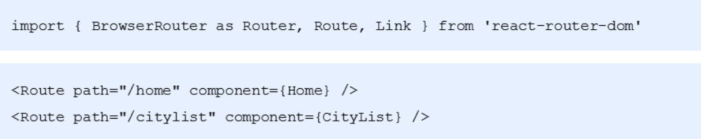
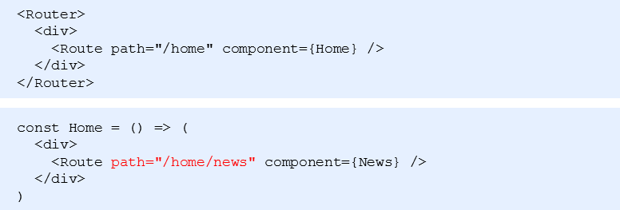
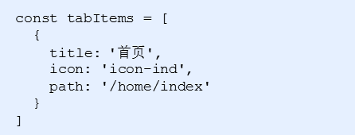

## antd-mobile 组件库

- 打开 antd-mobile的[文档](https://mobile.ant.design/index-cn)
- `antd-mobile` 是 [Ant Design](http://ant.design/) 的移动规范的 React 实现，服务于蚂蚁及口碑无线业务。

#### 快速上手

- 安装

  - npm install antd-mobile --save

- 使用

  - 导入组件
  - 在index.js导入样式

  ```react
  // 导入组件
  import { Button } from 'antd-mobile';
  // 导入样式
  import 'antd-mobile/dist/antd-mobile.css';  // or 'antd-mobile/dist/antd-mobile.less'
  ReactDOM.render(<Button>Start</Button>, mountNode);
  ```

## 2.2 配置路由

- 安装 yarn add react-router-dom
- 导入路由组件：Router / Route / Link
- 在pages文件夹中创建 Home/index.js 和 CityList/index.js 两个组件
- 使用Route组件配置首页和城市选择页面




## 项目整体布局

#### 使用步骤

- 在pages文件夹中创建News/index.js 组件
- 在Home组件中，添加一个Route作为子路由的出口
- 设置嵌套路由的path，格式以父路由path开头(父组件展示了，子组件才会展示)
- 修改pathname为 /home/news，News组件的内容就会展示在Home组件中了



### 实现TabBar

- 打开 antd-mobile 组件库中TabBar的组件文档(全部拷贝 之后可以删除fullscreen的div只留TabBar)
- 选择APP型选项卡菜单，点击 `</>`显示源码
- 拷贝核心代码到 Home 组件中（Home是父路由组件）
- 调整代码

#### 4.1 修改TabBar组件样式

- 修改TabBar菜单项文字标题
  - TabBar的文字标题在TabBar.Item 的title属性中，所以我们修改对应四个title属性即可

```react
<TabBar.Item
    title="首页"
    ...
>
</TabBar.Item>
<TabBar.Item
    title="找房"
    ...
>
</TabBar.Item>
<TabBar.Item
    title="咨询"
    ...
>
</TabBar.Item>
<TabBar.Item
    title="我的"
    ...
>
</TabBar.Item>
```

- 修改TabBar菜单文字标题颜色
  - TabBar菜单选中的文字颜色在 TabBar的 tintColor 属性中设置
  - 未选中文字颜色用默认的即可，删除 TabBar中的 unselectedTintColor 属性

```react
<TabBar
    tintColor="#21b97a"
    barTintColor="white"
>
...
</TabBar>
```

- 使用字图图标，修改TabBar菜单的图标
  - 字体图标的 资源在课件的素材中，直接复制过来即可
  - 在 index.js里面引入字体图标的 css样式文件，这样我们只需要在组件中设置对应的类名即可,icon代表是默认图标，selectedIcon代表是选中的图标

```react
<TabBar.Item
    {/*默认的图标*/}
    icon={
        <i className="iconfont icon-ind"></i>
    }
     {/*选中图标*/}
    selectedIcon={<i className="iconfont icon-ind"></i>
    }
    ...
>
</TabBar.Item>
<TabBar.Item
    icon={
        <i className="iconfont icon-findHouse"></i>
    }
    selectedIcon={
        <i className="iconfont icon-findHouse"></i>
    }
    ...
>
</TabBar.Item>
<TabBar.Item
    icon={
        <i className="iconfont icon-infom"></i>
    }
    selectedIcon={
        <i className="iconfont icon-infom"></i>
    }
    ...
>
</TabBar.Item>
<TabBar.Item
    icon={
        <i className="iconfont icon-my"></i>
    }
    selectedIcon={<i className="iconfont icon-my"></i>}
    ...
>
</TabBar.Item>
```


- 修改TabBar菜单项的图标大小
  
- 在当前组件对应文件夹中创建index.css文件，修改一下字体图标的大小，设置为20px（注意，在home.js中记得导入当前的样式）
  
- 调整TabBar的位置，固定在最底部
  - 通过调试工具我们发现，底部的TabBar的类名叫 am-tab-bar-bar，所以我们只需要设置一下这个类名的属性即可

  - 把fullscreen样式div去掉自己写css固定就行

    ```
    .am-tab-bar-bar{
        position: fixed;
        bottom: 0;
        //z-index: 1;// 后面可能会被遮住
    }
    ```

- 去掉TabBar的徽章
  
  - 找到TabBar.Item里面对应的 badge 属性，删除即可 

#### 4.2  TabBar配合路由实现

- 根据TabBar组件文档设置不渲染内容（只保留菜单项，不显示内容）
  - 给TabBar设置 noRenderContent  属性即可

```react
<TabBar
    ...
    noRenderContent = "true"
>
```

- 给TabBar.Item 绑定点击事件，在点击事件逻辑里面利用编程式导航，进行路由的切换
  - 利用 this.props.history,push() 来实现

```
 <TabBar.Item
    ...
    onPress={() => {
        this.setState({
            selectedTab: 'blueTab',
        });
        {/* 切换路由 */}
        this.props.history.push('/home/index')
    }}
>
</TabBar.Item>
<TabBar.Item
    ...
    onPress={() => {
        this.setState({
            selectedTab: 'redTab',
        });
        this.props.history.push('/home/list')
    }}
>
</TabBar.Item>
<TabBar.Item
    ...
    onPress={() => {
        this.setState({
            selectedTab: 'greenTab',
        });
        this.props.history.push('/home/news')
    }}
>
</TabBar.Item>
<TabBar.Item
    ...
    onPress={() => {
        this.setState({
            selectedTab: 'yellowTab',
        });
        this.props.history.push('/home/profile')
    }}
>
</TabBar.Item>
```

- 创建TabBar组件菜单项对应的其他3个组件，并在Home组件中配置路由信息
  - 创建对应的组件，然后在 home.js中进行导入，最后配置一下路由

```react
{/* 配置路由信息 */}
<Route path="/home/index" component={Index}></Route>
<Route path="/home/list" component={HouseList}></Route>
<Route path="/home/news" component={News}></Route>
<Route path="/home/profile" component={Profile}></Route>
```

- 给菜单项添加selected属性，设置当前匹配的菜单项高亮

  - 通过 this.props.location.pathname 就能拿到当前的路由的path
  - 在TabBarItem里面设置 selected的属性，判断是否等于当前的pathname
  - 在state中记录当前的pathname

  ```react
   state = {
       // 选中的菜单项,记录当前的pathname来匹配对应的tab
       selectedTab: this.props.location.pathname,

   }
  ```

  - 在每个TabBar.Item里面利用selected属性判断一下

```react
<TabBar.Item
     selected={this.state.selectedTab === '/home/index'}
     onPress={() => {
         this.setState({
             selectedTab: '/home/index',
         });
         this.props.history.push('/home/index')
     }}
     ...
 >
 </TabBar.Item>
 <TabBar.Item
     selected={this.state.selectedTab === '/home/list'}
     onPress={() => {
         this.setState({
             selectedTab: '/home/list',
         });
         this.props.history.push('/home/list')
     }}
     ...
 >
 </TabBar.Item>
 <TabBar.Item
     selected={this.state.selectedTab === '/home/news'}
     onPress={() => {
         this.setState({
             selectedTab: '/home/news',
         });
         this.props.history.push('/home/news')
     }}
     ...
 >
 </TabBar.Item>
 <TabBar.Item
     selected={this.state.selectedTab === '/home/profile'}
     onPress={() => {
         this.setState({
             selectedTab: '/home/profile',
         });
         this.props.history.push('/home/profile')
     }}
     ...
 >
 </TabBar.Item>
```

#### 5.1 TabBar代码的重构

- 发现TabBar的Iitem里面的内容几乎是一致的，只是里面内容不同
- 所以我们可以封装一下
- 提供菜单数据



- 使用map来进行遍历

声明一下数据源

```react
const tabItems = [{
    title: '首页',
    icon: 'icon-ind',
    path: '/home/index'
},
{
    title: '找房',
    icon: 'icon-findHouse',
    path: '/home/list'
},
{
    title: '资讯',
    icon: 'icon-infom',
    path: '/home/news'
},
{
    title: '我的',
    icon: 'icon-my',
    path: '/home/profile'
}]
```

封装一个函数来遍历渲染

```react
renderTabBarItem() {
   return tabItems.map(item => {
        return (
            <TabBar.Item
                title={item.title}
                key={item.title}
                icon={
                    <i className={`iconfont ${item.icon}`}></i>
                }
                selectedIcon={<i className={`iconfont ${item.icon}`}></i>
                }
                selected={this.state.selectedTab === item.path}
                onPress={() => {
                    this.setState({
                        selectedTab: item.path,
                    });
                    this.props.history.push(item.path)
                }}
            >
            </TabBar.Item>

        )
    })
}
```

在render方法中调用即可

```react
render() {
    return (<div>
        {/* 配置路由信息 */}
        <Route path="/home/index" component={Index}></Route>
        <Route path="/home/list" component={HouseList}></Route>
        <Route path="/home/news" component={News}></Route>
        <Route path="/home/profile" component={Profile}></Route>
        {/* 底部导航栏 */}
        <TabBar
            tintColor="#21b97a"
            barTintColor="white"
            noRenderContent="true"
        >
            {this.renderTabBarItem()}
        </TabBar>
    </div>)
}
```

## 5.2 首页实现路由跳转

- 首页的路由是需要去处理的
- 修改首页路由的配置： /；这里需要添加 exact属性
- 如果是默认路由需要跳转到 /home/index 首页 注意：Route之间不要有空格

```react
{/* 配置默认路由 */}
<Route path="/" exact render={() => <Redirect to="/home/index"></Redirect>}></Route>
```

## 6.2 轮播图

### 组件使用的基本步骤

- 打开antd-mobile组件库的Carousel组件文档
- 选择基本，点击 (`</>`) 显示源码
- 拷贝核心代码到Index的组件中
- 分析并且调整代码，让其能够在项目中运行

### 轮播图的移植

- 拷贝示例代码中的内容

  - 导入组件

  ```react
  import { Carousel, WingBlank } from 'antd-mobile';
  ```

  - 状态


  - 声明周期钩子函数，修改状态，设置数据

  ```react
  componentDidMount() {
      // simulate img loading
      setTimeout(() => {
          this.setState({
              data: ['AiyWuByWklrrUDlFignR', 'TekJlZRVCjLFexlOCuWn', 'IJOtIlfsYdTyaDTRVrLI'],
          });
      }, 100);
  }
  ```

  - 结构

    <div className="index">
    <Carousel
        {/* 自动播放 */}
        autoplay={false}
        {/* 无限循环 */}
        infinite
        {/* 轮播图切换前的回调函数 */}
        beforeChange={(from, to) => console.log(`slide from ${from} to ${to}`)}
        {/* 轮播图切换后的回调函数 */}
        afterChange={index => console.log('slide to', index)}
        {/* 自动切换的时间 */}
        autoplayInterval='2000'
    >    
        {/* 遍历状态里面的数据，创建对应的a标签和img图片标签 */}
        {this.state.data.map(val => (
            <a
                key={val}
                href="http://www.alipay.com"
                style={{ display: 'inline-block', width: '100%', height: this.state.imgHeight }}
            >
                 {
                        // fire window resize event to change height
                        window.dispatchEvent(new Event('resize'));
                        this.setState({ imgHeight: 'auto' });
                    }}
                />
            </a>
        ))}
    </Carousel>
    </div>

- 现在我们需要对轮播图进行定制

  - 先优化相应的结构，删除不必要的代码

  ```react
  <div className="index">
      <Carousel
          autoplay={true}
          infinite
          autoplayInterval='2000'
      >
          {this.state.data.map(val => (
              <a
                  key={val}
                  href="http://www.alipay.com"
                  style={{ display: 'inline-block', width: '100%', height: this.state.imgHeight }}
              >
                  
              </a>
          ))}
      </Carousel>
  </div>
  ```

### 获取轮播图的数据

- 安装 axios： yarn add axios
- 在Index组件中导入axios

```react
import axios from 'axios'
```

- 在state中添加轮播图数据：swipers

```react
state = {
    // 轮播图状态
    swipers: [],
}
```

- 新建一个方法 getSwipers 用来获取轮播图数据

```react
async getSwipers() {
    // 请求数据
    let {data: res} = await axios.get('http://localhost:8080/home/swiper')
    // 判断返回的状态是否是成功
    if(res.status!= 200){
        console.error(res.description)
        return
    }
    // 把获取到的值设置给state
    this.setState({
        swipers: res.body
    })

}
```

- 在componentDidMount钩子函数中调用这个方法

```react
componentDidMount() {
    // 调用请求轮播图的方法
   this.getSwipers()
}
```

- 使用获取到的数据渲染轮播图

```
// 渲染轮播图的逻辑代码
renderSwipers(){
    return this.state.swipers.map(item => (
        <a
            key={item.id}
            href="http://www.itcast.cn"
            style={{ display: 'inline-block', width: '100%', height: 212 }}
        >
            
        </a>
    ))
}
render() {
    return (
        <div className="index">
            <Carousel
                autoplay={true}
                infinite
                autoplayInterval='2000'
            >
                {/* 调用渲染轮播图的方法 */}
                {this.renderSwipers()}
            </Carousel>
        </div>
    )
}
```

## 6.1 轮播图的问题

- **刷新后, 轮播图无法自动滚动->**

  > 原因分析

  1. 图片加载前-> autoplay={true}
  2. 为true时, 还没有图片-> 不能自动

  > 解决方案

  1. 需求: 控制视图变化->通过数据控制视图->提供state数据
  2. autoplay={this.state.isplay}
  3. 图片加载完毕-> 改isplay为true

- 解决办法

  - 在state中添加轮播图数据是否加载完成的状态

  ```react
      state = {
          // 轮播图状态
          swipers: [],
          isplay: false
      }
  ```

  - 在轮播图数据加载完成时候，修改这个状态为true

  ```react
      async getSwipers() {
          ...
          // 把获取到的值设置给state
          this.setState({
              swipers: res.body
          })
          
          
  		//延迟修改确保有数据了		
  		setTimeout(()=>{

              this.setState({

                  isplay:true

              })

         },10)

        也可以
        // 赋值修改数据 this.setState 他是异步的 会稍微延迟 而且有第二个参数数据一定成功
          this.setState({
              swipers:res.data.body,
          },()=>{
              // 第二个回调函数里面 数据一定是设置成功了
              this.setState({
                  isplay:true//数据有了之后 设置为true
              })
          })
  ```

### sass--less

less 需要下载 less-loader 在写样式就可以写less了

sass也需要下载 node-sass  写样式 就可以写sass

使用步骤

1  下载 yarn add node-sass

2  新建xx.scss文件  sass文件 在里面和less一样写样式

3 导入即可