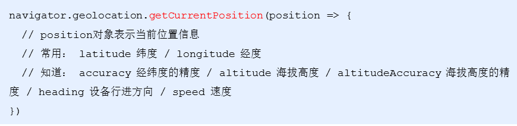
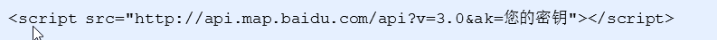
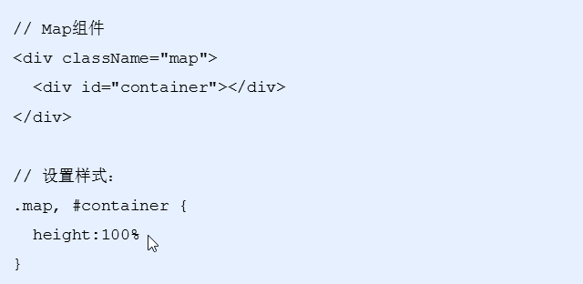
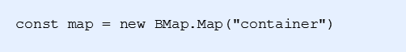
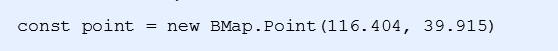
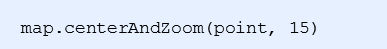
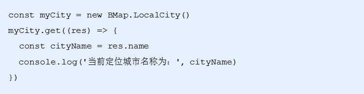

# 首页模块

## 1. 2 导航菜单的重构

```react
// 导航菜单的数据
const navs = [{
    id: 0,
    img: nav1,
    title: '整租',
    path: '/home/houselist'
}, {
    id: 1,
    img: nav2,
    title: '合租',
    path: '/home/houselist'
}, {
    id: 2,
    img: nav3,
    title: '地图找房',
    path: '/home/map'
}, {
    id: 3,
    img: nav4,
    title: '去出租',
    path: '/rent/add'
}]
```

- 创建对应的方法 renderNavs,在方法中遍历navs，一个一个设置数据，把最终的JSX返回

```react
// 渲染导航菜单的逻辑代码
renderNavs() {
    return navs.map(item => {
        return (
            <Flex.Item key={item.id} onClick={()=>{this.props.history.push(item.path)}}>
                
                <h2>{item.title}</h2>
            </Flex.Item>
        )
    })
}
```

- 在render方法中调用这个函数

```react
{/* 导航栏 */}
<Flex className="nav">
    {this.renderNavs()}
</Flex>
```

## 3 租房小组

- 在state中添加租房小组数据：groups

```react
    state = {
        ...
        // 租房小组状态
        groups: []
    }
```

- 新建一个方法`getGroups`用来获取数据，并更新groups状态

```react
async getGroups() {
    let { data: res } = await axios.get('http://localhost:8080/home/groups', {
        params: {
            'area': 'AREA%7C88cff55c-aaa4-e2e0'
        }
    })
    // 判断返回的状态是否是成功
    if (res.status != 200) {
        console.error(res.description)
        return
    }
    // 把获取到的值设置给state
    this.setState({
        groups: res.body
    })
}
```

- 在`componentDidMount`钩子函数中调用该方法

```react
componentDidMount() {
    // 调用请求轮播图的方法
    this.getSwipers()
    this.getGroups()
}
```

- 使用获取到的数据渲染租房小组数据

### 页面结构样式

- 实现标题的结构和样式
- 打开Grid 宫格组件 
- 选择 基本 菜单，点击(`</>`) 显示源码
- 拷贝核心代码到Index组件中
- 分析调整代码

布局结构

```react
 {/* 租房小组 */}
<div className="groups">
                {/* 标题  */}
                <div className="groups-title" >
                    <h3>租房小组</h3>
                    <span>更多</span>
                </div>
                {/* 内容 */}
                <Grid data={this.state.groups} 
                activeStyle={true} 
                hasLine={false}
                columnNum={2} 
                square={false}
                renderItem={item => (
                    <Flex className="grid-item" justify="between">
                      <div className="desc">
                        <h3>{item.title}</h3>
                        <p>{item.desc}</p>
                      </div>
                      
                    </Flex>
                  )}
                />

            </div>
```

相应的样式属性

```less
.group {
    background-color: #f6f5f6;
    overflow: hidden;
    padding: 0 10px;
    .group-title {
        position: relative;
        margin: 15px 0px 15px 10px;
        font-size: 15px;
        .more {
            color: #787d82;
            position: absolute;
            right: 0;
            font-size: 14px;
            font-weight: normal;
        }
    }
    // 覆盖默认背景色
    .am-grid .am-flexbox {
        background-color: inherit;
        .am-flexbox-item .am-grid-item-content {
            padding: 0;
            padding-bottom: 10px;
        }
    }
    .group-item {
        height: 75px;
        .desc {
            .title {
                font-weight: bold;
                font-size: 13px;
                margin-bottom: 5px;
            }
            .info {
                font-size: 12px;
                color: #999;
            }
        }
        img {
            width: 55px;
        }
    }
    .am-flexbox-align-stretch {
        margin-bottom: 10px;
        .am-grid-item {
            background-color: #fff;
            &:first-child {
                margin-right: 10px;
            }
        }
    }
}
```

## 4.1 最新资讯

### 数据获取(页面渲染直接使用模板结构)

- 在state中添加租房小组数据：news

```react
    state = {
        ...
        // 最新资讯
        news: []
    }
```

- 创建一个函数 `getNews()`, 在这个函数中利用`axios`来请求服务器
- 获取到的数据判断返回的状态是否是200，如果不是，提示用户
- 如果状态是200，利用`this.setState()` 来更新页面
- 在`componentDidUpdate`钩子函数中调用 `getNews()` 

```react
async getNews() {
    let { data: res } = await axios.get('http://localhost:8080/home/news?area=AREA%7C88cff55c-aaa4-e2e0')
    // 判断返回的状态是否是成功
    if (res.status != 200) {
        console.error(res.description)
        return
    }
    // 把获取到的值设置给state
    this.setState({
        news: res.body
    })
}
```

- 创建页面结构，渲染到页面
  - `WingBlank`组件 两翼留白 的效果
  - 渲染的逻辑代码比较多，抽取成一个方法，这样保证结构中的代码比较清晰

```react
 {/* 最新资讯 */}
<div className="news">
    <h3 className="group-title">最新资讯</h3>
    <WingBlank size="md">{this.renderNews()}</WingBlank>
</div>

renderNews() {
 return this.state.news.map(item => {
     return (
         <div className="news-item" key={item.id}>
             <div className="imgwrap">
                 
             </div>
             <Flex className="content" direction="column" justify="between">
                 <h3 className="title">{item.title}</h3>
                 <Flex className="info" justify="between">
                     <span>{item.from}</span>
                     <span>{item.date}</span>
                 </Flex>
             </Flex>
         </div>
     )
 })
```

- 样式属性

```less
// 最新资讯：
.news {
  padding: 10px;
  background-color: #fff;
  overflow: hidden;

  .group-title {
    margin: 10px 0 5px 10px;
    font-size: 15px;
  }

  .news-item {
    height: 120px;
    padding: 15px 10px 15px 0;
    border-bottom: 1px solid #e5e5e5;
  }

  .news-item:last-child {
    border: 0;
  }

  .imgwrap {
    float: left;
    height: 90px;
    width: 120px;
  }

  .img {
    height: 90px;
    width: 120px;
  }

  .content {
    overflow: hidden;
    height: 100%;
    padding-left: 12px;
  }

  .title {
    margin-bottom: 15px;
    font-size: 14px;
  }

  .info {
    width: 100%;
    color: #9c9fa1;
    font-size: 12px;
  }

  .message-title {
    margin-bottom: 48px;
  }
}
```


## 4.2 首页-顶部导航功能

```react
 <Flex className='search-box'>
    {/* 左侧白色区域 */}
    <Flex className="search">
        {/* 位置 */}
        <div className="location" >
            <span className="name">长沙</span>
            <i className="iconfont icon-arrow" />
        </div>

        {/* 搜索表单 */}
        <div className="form">
            <i className="iconfont icon-seach" />
            <span className="text">请输入小区或地址</span>
        </div>
    </Flex>
    {/* 右侧地图图标 */}
    <i className="iconfont icon-map" />
</Flex>
```

相关样式

```less
// 顶部导航
.search-box {
    position: absolute;
    top: 25px;
    width: 100%;
    padding: 0 10px;
    // 左侧白色区域
    .search {
        flex: 1;
        height: 34px;
        margin: 0 10px;
        padding: 5px 5px 5px 8px;
        border-radius: 3px;
        background-color: #fff;
        // 位置
        .location {
            .icon-arrow {
                margin-left: 2px;
                font-size: 12px;
                color: #7f7f80;
            }
        }
        // 搜索表单
        .form {
            border-left: solid 1px #e5e5e5;
            margin-left: 12px;
            line-height: 16px;
            .icon-seach {
                vertical-align: middle;
                padding: 0 2px 0 12px;
                color: #9c9fa1;
                font-size: 15px;
            }
            .text {
                padding-left: 4px;
                font-size: 13px;
                color: #9c9fa1;
            }
        }
    }
    // 右侧地图图标
    .icon-map {
        font-size: 25px;
        color: #fff;
    }
}
```

## 4.3 H5中利用定理定位API

地理位置API 允许用户向 Web应用程序提供他们的位置，出于隐私考虑，报告地理位置前先会请求用户许可

地理位置的API是通过 `navigator.geolocation` 对象提供，通过`getCurrentPosition`方法获取

获取到的地理位置跟 GPS、IP地址、WIFI和蓝牙的MAC地址、GSM/CDMS的ID有关

比如：手机优先使用GPS定位，笔记本等最准确的是定位是WIFI

我们所获取到的是经纬度，其实对我们来说是没有用的，所以我们需要借助百度地图、高德地图等的开放接口，来帮我们把经纬度进行换算

```
// 1 原生js带的 位置不准  2 国内用不了
navigator.geolocation.getCurrentPosition(position=>{
    console.log("当前位置",position)
})
```



- H5的地理位置API只能获取到对应经纬度信息
- 参照[百度地图文档](http://lbsyun.baidu.com/)

  注册百度开发者账号，申请对应的AK

## 5.2 百度地图使用步骤

- 在public/index.html引入百度地图的API的JS文件，替换自己申请好的密钥



- 在index.css中设置全局样式

- 创建Map组件，配置路由，在Map组件中，创建地图容器元素，并设置样式 

  ​	// 注意：在 react脚手架 中，访问全局变量，需要使用 window 来访问

  ​	// 参考文档：https://facebook.github.io/create-react-app/docs/using-global-variables

  ​	const BMap = window.BMap



- 创建地图实例



- 设置中心点坐标



- 初始化地图，同时设置展示级别



## 6.1 百度地图API 获取顶部导航城市信息

- 查看百度地图的定位文档
- 通过IP定位获取到当前城市名称
- 调用我们服务器的ajax接口，换取项目中的城市信息



## 城市列表-顶部导航栏

```react
import {NavBar, Icon} from 'antd-mobile'
```

- 拷贝代码结构

```react
<div>
    <NavBar
        // 模式 默认值是 dark
        mode="light"
        // 左侧小图片
        icon={<Icon type="left" />}
        // 左侧按钮的点击事件
        onLeftClick={() => console.log('onLeftClick')}
        // 右侧按按钮图标
        rightContent={[
            <Icon key="0" type="search" style={{ marginRight: '16px' }} />,
            <Icon key="1" type="ellipsis" />,
        ]}
    >城市列表</NavBar>
</div>
```

- 修改结构代码

```
<div>
    <NavBar
        // 模式 默认值是 dark
        mode="light"
        // 左侧小图片
        icon={<i className='iconfont icon-back' />}
        // 左侧按钮的点击事件
        onLeftClick={() => this.props.history.go(-1)}
    >城市列表</NavBar>
</div>
```

设置相应的样式

```scss
.navbar{
        background-color: #f6f5f6;
        position: absolute;
        top: 0;
        width: 100%;
 }
```
## 6.3 获取数据-并格式

- 根据接口文档提供的url进行网络请求
- 获取到相应的数据信息

```react
// 当组件被挂载的时候调用
componentDidMount() {
   this.getcitylist()
}
```

```react
async getcitylist(){
   let res=await axios.get("http://localhost:8080/area/city?level=1")
   console.log("城市列表数据",res)
    /* 
    {
        a:[城市1 ...]
        b:[城市1，城市2...]
        c:[...]
        ...
    }
    */
    let citylist={}
    res.data.body.forEach(item=>{
        // 'nc'.substr(0,1) 从0索引开始 截取1个
        let word=item.short.substr(0,1)// a  b  c
        // citylist[word] citylist['a'] citylist.a
        if(citylist[word]){//有这个单词  就把城市push 到数组
            citylist[word].push(item)
        }else{//没有 就设置为数组 并且带上第一次的城市
            citylist[word]= [item] //citylist.a=
        }
    })
    console.log("城市",citylist)
}
```
