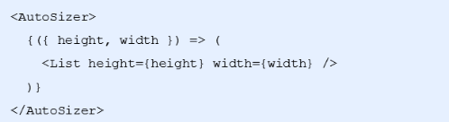

# 城市选择模块

### 1.1 获取数据

- 根据接口文档提供的url进行网络请求
- 获取到相应的数据信息

```react
// 当组件被挂载的时候调用
componentDidMount() {
   this.getCityList()
}
async getCityList() {
    let {data:res} = await axios.get('http://localhost:8080/area/city?level=1')
    console.log(res);
}
```

### 1.2 处理数据格式

我们需要把服务器返回的数据进行格式化处理，我们可以通过首字母来进行城市的定位，所以我们需要把格式转换成以下格式

```
// 已有数据结构
[
{label:'北京',value:'',pinyin:'beijing',short:'bj'}，
{label:'宝鸡',value:'',pinyin:'beijing',short:'bj'},
...
]
// 所需数据
// 设计数据->添加分组标题
var cityList = {
    'a':[{label:'安庆',short:'aq'},.....],
    'b':[{label:'北京',short:'bj'},{label:'宝鸡',short:'bj'},...],
    'c':[{label:'长沙',short:'cs'},....]
}
// 考虑按照a->b->c排序 所以需要通过数组控制
var cityIndex = ['a','b','c',......]
// 结论: 通过数组的索引找a->通过a找对象中的城市数组
```


- 我们需要遍历  list数组
- 获取到每一个城市的首字母
- 判断我们定义的数组中是否有这个分类，如果有，那么直接push数据进来，如果没有，[item]添加这个分类
- 当城市列表数据按照首字母分好类了之后，还需要实现热门城市数据和定位城市数据
- 获取热门城市数据，添加到`cityList` 列表数据中，将索引数据添加到 `cityIndex` 索引数据中
- 获取当前城市数据，添加到`cityList` 列表数据中，将索引数据添加到 `cityIndex` 索引数据中

封装一个函数，来处理这个数据

```react
/**
 * 格式化返回的数据
 * @param {*} list 
 */
// 获取城市列表和城市字母数组 封装一下 免得代码太长 太乱了
    formatCity(list){
        //    let city=res.data.body
        // 处理数据 把数据 变成我们想要的格式
        //循环 把拼音开头的城市 放在 对应的数组里面
       let citylist={}
       list.forEach(item=>{
           // 'nc'.substr(0,1) 从0索引开始 截取1个
           let word=item.short.substr(0,1)// a  b  c
           // citylist[word] citylist['a'] citylist.a
           if(citylist[word]){//有这个单词  就把城市push 到数组
               citylist[word].push(item)
           }else{//没有 就设置为数组 并且带上第一次的城市
               citylist[word]= [item] //citylist.a=
           }
       
       })
        //    console.log("城市",citylist)
       // 把得到的城市数据 的 字母 拿出来 单独 存一个数组 还排序了 从a...
       // Object.keys 把对象的 key 组成数组返回 Object.values
       let cityindex= Object.keys(citylist).sort()
        //  console.log("字母数组",cityindex)
        return {
            citylist,
            cityindex
        }
    }
```

在`getCityList()`方法中调用这个函数，来格式化数据

```react
async getCityList() {
    let res=await axios.get("http://localhost:8080/area/city?level=1")
       console.log("城市列表数据",res)
        // 1 在公司里面  1 发送ajax拿到的数据 正好是符合 可以直接用  2 发送ajax拿到数据 格式不太好 (1 给后台 2 只能自己再做格式)
        let {citylist,cityindex}=this.formatCity(res.data.body)
}
```

## 2.1 获取热门城市数据，

获取热门城市数据并且添加到 `cityList`和`cityListIndex`中，注意，对象里面的属性是无序的，可以直接插入，但是数组是有序的，我们需要添加到前面

```react
// 2 通过分析发现 还差 热门城市和定位城市 我们需要添加
        // 2.1 发送ajax先获取热门城市加上
        let hotres=await axios.get("http://localhost:8080/area/hot")
        citylist['hot']=hotres.data.body ;// {hot:[]}
        cityindex.unshift("hot") ;// [hot,a...]
```

## 2.2 封装获取当前城市信息

我们将获取定位城市的代码封装到一个函数中，哪个页面需要获取定位城市，直接调用该方法即可

- 在utils目录中，创建一个index.js文件，在这个文件中进行封装
- 创建并且导出获取定位城市的函数 getCurrentCity
- 判断localStorage中是否有定位信息   ---decodeURI('%E5%8C%97%E4%BA%AC')  北京中文被编码了
- 如果没有，我们通过获取定位信息来获取当前定位城市，获取完了需要存到本地存储中
- 如果有，直接使用就好

```react
// 导出 封装的 获取当前定位城市的 函数
// export 可以导出 多个 使用：import { getCurrentCity } from '../../utils/index'
// export default 一般导出一个
import axios from 'axios'
export let getCurrentCity=()=>{
    // 获取当前定位城市
    // 先去localstorage里面获取 有没有 名字约定 my-city
    // 有呢？直接localstorage获取
    // 没有呢？ 我们就需要百度定位拿出来了
    let city=JSON.parse(localStorage.getItem("my-city"))
    if(!city){//没有 就需要百度定位获取
        // 因为有点异步 我们用promise 包装一下
        return new Promise((resolve,reject)=>{
            // 通过ip定位当前城市 
            var myCity = new window.BMap.LocalCity();
            myCity.get(async (result)=>{
                var cityName = result.name;//cityName城市的名字
                //  我们有接口 通过城市的名字获取城市信息 --这个才是全的
                // async 需要写在 离 await 最近的那个函数
                let diwei=await axios.get("http://localhost:8080/area/info?name="+cityName)
                // console.log("定位城市信息",diwei.data.body);//{label: "北京", value: "AREA|88cff55c-aaa4-e2e0"}
                // 需要存到localstorage
                localStorage.setItem("my-city",JSON.stringify(diwei.data.body))
                // 返回
                resolve(diwei.data.body)
            }); 

        })
    }else{//有
        // 这也和上面统一给promise
        // Promise.resolve(city) 直接给resolve 简化操作
        return Promise.resolve(city);
        // return new Promise((resolve,reject)=>{
        //     resolve(city)
        // })
    }


}

```

- 将定位的城市信息添加到 `cityList`和`cityIndex`中

```react
// 获取当前城市定位信息
let diwei = await getCurrentCity()
// 将当前城市数据添加到 cityList
cityList['#'] = [diwei]
// 将当前城市数据添加到 cityIndex 
cityIndex.unshift('#')
```

## 3 长列表性能优化（★★）

- 懒渲染
- 可视区域渲染

### 懒渲染

- 懒加载，常见的长列表优化方案，常见于移动端
- 原理：每次只渲染一部分，等渲染的数据即将滚动完时，再渲染下面部分
- 优点：每次渲染一部分数据，速度快
- 缺点：数据量大时，页面中依然存在大量DOM节点，占用内存过多，降低浏览器渲染性能，导致页面卡顿
- 使用场景：数据量不大的情况下

### 可视区渲染（React-virtualized）

上拉加载 第一次20条 再加载 又有20条。。。

可视区域渲染：只是显示你看到的那个部分 这样性能很高

原理： 只渲染页面可视区域的列表项，非可视区域的数据 **完全不渲染(预加载前面几项和后面几项)** ，在滚动列表时动态更新列表项


## 4 react-virtualized

- 在项目中的应用：实现城市选择列表页面的渲染
- react-virtualized 是React组件，用来高效渲染大型列表和表格数据  他功能很多
- GitHub地址： [react-virtualized](https://github.com/bvaughn/react-virtualized)

### 4.1 List基本使用

- 安装： yarn add react-virtualized
- 在项目入口文件 index.js 中导入样式文件  List 渲染列表数据
- 打开 [文档](https://github.com/bvaughn/react-virtualized/blob/master/docs)， 点击List组件，进入List的文档中
- 示例 ：<https://bvaughn.github.io/react-virtualized/#/components/List>
- 拷贝示例代码到我们项目中，分析示例代码
  1 看官网 2 英文看不懂 翻译 3 直接百度 
- 1 。数据写在 state里面  2 把每行的内容函数放到组件 写了单词+城市的div 3 修改List组件的加上this...

```react
import React from 'react';
import ReactDOM from 'react-dom';
import { List } from 'react-virtualized';

// 列表数据
const list = [
  'Brian Vaughn'
  // And so on...
];
// 渲染每一行的内容
function rowRenderer ({
  key,         // Unique key within array of rows
  index,       // 索引号
  isScrolling, // 当前项是否正在滚动中
  isVisible,   // 当前项在List中是可见的
  style        // 重点属性：一定要给每一个行数添加该样式
}) {
  return (
    <div
      key={key}
      style={style}
    >
      {list[index]}
    </div>
  )
}

// 渲染list列表
ReactDOM.render(
  <List
    // 组件的宽度
    width={300}
    // 组件的高度
    height={300}
    rowCount={list.length}  // 渲染总条数
    // 每行的高度
    rowHeight={20}
    rowRenderer={rowRenderer} //渲染每行的内容
  />,
  document.getElementById('example')
);
```

### 4.2 AutoSizer让List组件占满屏幕 宽高

- 利用 `AutoSizer` 组件来调整子元素的宽高
- 导入 `AutoSizer` 组件
- 通过 render-props 模式，获取到`AutoSizer` 组件暴露的 width 和 height 属性
- 设置List组件的 width  和 height 属性



- 设置城市选择页面根元素高度 100%，让List组件占满整个页面

```scss
.citylist {
    height: 100%;
    padding-top: 45px;
}
```

### 渲染城市列表

- 将获取到的cityList和cityIndex添加为组建的状态数据

```
    state = {
        cityList: {},
        cityIndex: []
    }
```

- 修改List组件的rowCount为cityIndex数组的长度

```react
{/* 城市列表 */}
<AutoSizer>
    {
        ({ width, height }) => {
            return <List
                // 组件的宽度
                width={width}
                // 组件的高度
                height={height}
                rowCount={this.state.cityIndex.length}
                // 每行的高度
                rowHeight={this.getHeight}
                rowRenderer={this.rowRender}
            />
        }
    }
</AutoSizer>
```

- 修改List组件的rowRender方法中渲染的结构和样式(写个方法改# hot)

```react
({ index: number }): number  这个index参数是数字索引 而且你要返回 也是数字
abc({ index }) 

// 渲染每一行的内容
//   每行渲染的内容
    rowRenderer =({
        key,         // key
        index,       // 每项索引
        isScrolling, // 是否在滚动 true正在滚动
        isVisible,   // 是否可见 true 见到
        style        // Style object to be applied to row (to position it)
    })=> {
        // index  0 1 2 3..  ---a 单词
        let word=this.state.cityindex[index];//# hot a b c d 
        let citys=this.state.citylist[word];// 对象.a .b .c对应的数组
        return (
            //  我是内容啊啊 {index}----{isScrolling+''}
            <div key={key} style={style} className="city">
                    {/* 单词字母 */}
                    <div className="title">{this.formatWord(word)} </div>
                    {citys.map(item=>{
                        // 每一个城市
                        return <div className="name" key={item.value} >
                            {item.label}
                        </div>
                    })} 
            </div>
        )
    }
```

- 修改List的rowHeight为函数，动态计算每行的高度

```react
// 动态计算高度
// 计算高度返回
    getHeight=({index})=>{
        console.log("索引",index)
        // 单词高度+城市的高度*城市的数量
        // 36+50*城市的数量
        // console.log(this.state)  用到了this 如果出现问题首先考虑 this有问题 改造成箭头函数
        let zimu=this.state.cityindex[index];//a b c
        let citys=this.state.citylist[zimu]
        return 36+50*citys.length;
    }
```

## 6 渲染右侧索引列表

- 封装`renderIndex`方法，用来渲染城市索引列表
- 在方法中，获取到索引数组 `cityIndex`，遍历`cityIndex`，渲染索引列表
- 将索引hot替换成 热
- 在state中添加状态 activeIndex，用来指定当前高亮的索引
- 在遍历cityIndex时，添加当前字母索引是否是高亮

结构代码

```react
{/* 右侧索引列表 */}
<ul className="city-index">
    {
        this.renderIndex()
    }
</ul>
```

样式代码

```scss
 // 右侧索引

  .city-index{
    position: absolute;
    top: 50px;
    right: 10px;
    .index-item{
      width: 20px;
      height: 20px;
      border-radius: 50%;
      text-align: center;
      line-height: 20px;
      margin-top: 5px;
      font-size: 12px;
    }
    .active{
      background-color: #21b97a;
      color: #fff;
    }
  }
```

渲染右侧索引的函数

```react
 renderIndex(){
        return this.state.cityindex.map((item,index)=>{

            // 字母单词 activeIndex是谁索引 他就active选中
            return <li className={`index-item ${this.state.activeIndex==index?'active':'' }`} 
            key={item}
            >
                    {item=='hot'?'热':item.toUpperCase()} 
            </li>
        })
    }
```

## 1.1 城市索引列表高亮

 当我滑动的时候 判断滑动到哪个字母 哪个字母对应就应该选中

- 给list组件添加onRowsRendered配置项，用于获取当前列表渲染的行信息，在里面就会有相应信息
- 通过参数 startIndex 获取到 起始行对应的索引号
- 判断 startIndex 和 activeIndex 不同时候，更新状态 activeIndex为 startIndex

```react
<List
    ...
    onRowsRendered={this.rowRender}
/>

/**
 * 获取滚动时候,相应的数据
 * @param {*} param0 
 */
rowRender = ({ startIndex }) => {
    if (this.state.activeIndex !== startIndex) {
        this.setState({
            activeIndex: startIndex
        })
    }
}
```

## 1.2 点击索引置顶该索引城市

在老版本的react里面  也是同this.$refs.abc --- ref='abc' 获取元素

新版本 必须先 调用React.createRef() 创建ref对象

- 给索引列表绑定点击事件
- 在点击事件中，通过index获取到当前项索引号
- 调用List组件的 scrollToRow(10)方法，让List组件滚动到指定行
  - 调用React.createRef() 创建ref对象
  - 将创建好的ref对象，添加为List组件的ref属性
  - 通过ref的current属性，获取到组件实例，再调用组件的scrollToRow方法
- List 还要加上 属性 scrollToAlignment="start" (默认是显示在最后，start这个显示在最前顶部)
- (前面可以就不需要这步了)对于点击索引无法正确定位的问题，调用List组件的 measureAllRows 方法，提前计算高度来解决

```react
// 核心代码
 listRef=React.createRef();//react 必须先创建这个 在去给组件写ref=xxx
...
//async componentDidMount() {
   // await this.getCityList()
    // 计算List组件高度
    // this.listRef.current.measureAllRows()
//}
 renderIndex(){
        return this.state.cityindex.map((item,index)=>{

            // 字母单词 activeIndex是谁索引 他就active选中
            return <li className={`index-item ${this.state.activeIndex==index?'active':'' }`} 
            key={item}
            onClick={()=>{
                // 让列表 滚动到对应的单词位置
                console.log("点击的索引",index)
                // console.log(this.listRef.current) list组件
                this.listRef.current.scrollToRow(index);// 滚动到对应的索引
            }}
            >
                    {item=='hot'?'热':item.toUpperCase()} 
            </li>
        })
   }
render() {
    return (
        <div className="citylist">
            ...
            {/* 城市列表 */}
            <AutoSizer>
                {
                    ({ width, height }) => {
                        return <List
                            ref={this.listRef}
                            ...
                            scrollToAlignment="start"
                        />
                    }
                }
            </AutoSizer>
            ...
        </div>
    )
}
```

# 6.1 切换城市

- 给城市列表项绑定事件
- 判断当前城市是否有房源数据
- 如果有房源数据，则保持当前城市数据到本地缓存中，并返回上一页
- 如果没有房源数据，则提示用户：改城市暂无房源数据，不执行任何操作
- 首页 也可以导入对应修改成封装的方法

```
let res=await getCurrentCity()
        this.setState({
            currentCity:res.label
        })
```


```react
const HOST_CITY = ['北京', '上海', '广州', '深圳']
// 渲染每一行的内容
rowRenderer({
    key,         // Unique key within array of rows
    index,       // 索引号
    isScrolling, // 当前项是否正在滚动中
    isVisible,   // 当前项在List中是可见的
    style        // 重点属性：一定要给每一个行数添加该样式
}) {
    let letter = this.state.cityIndex[index]
    let citys = this.state.cityList[letter]
    return (
        <div
            key={key}
            style={style}
            className="city"
        >
            <div className="title">{this.formatCityIndex(letter)}</div>
            {citys.map(item => {
                return (
                    // 绑定点击事件，传递城市名称和value
                    <div className="name" key={item.value} onClick={() => this.changeCity(item.label, item.value)}>{item.label}</div>
                )
            })}</div>
    )
}
changeCity = (label, value) => {
    if (HOST_CITY.indexOf(label) > -1) {
        // 说明是有房源数据的城市
        localStorage.setItem('localCity', JSON.stringify({
            label,
            value
        }))
    } else {
        // 没有房源城市，提示用户
        Toast.info('当前城市没有房源', 1);
    }
}
```
