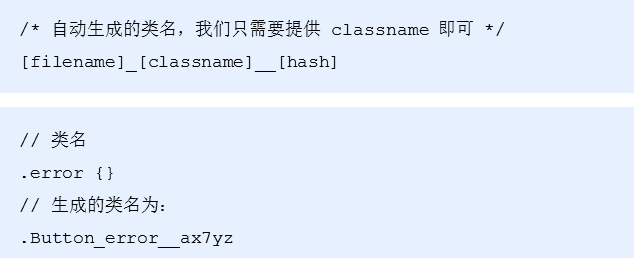
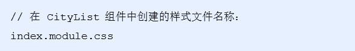
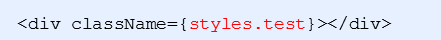

# 渲染城市列表

## 1.1 城市索引列表高亮

- 给list组件添加onRowsRendered配置项，用于获取当前列表渲染的行信息，在里面就会有相应信息
- 通过参数 startIndex 获取到 起始行对应的索引号
- 判断 startIndex 和 activeIndex 不同时候，更新状态 activeIndex为 startIndex

```react
<List
    ...
    onRowsRendered={this.rowRendered}
/>

/**
 * 获取滚动时候,相应的数据
 * @param {*} param0 
 */
rowRendered = ({ startIndex }) => {
    if (this.state.activeIndex !== startIndex) {
        this.setState({
            activeIndex: startIndex
        })
    }
}
```

## 1.2 点击索引置顶该索引城市

- 给索引列表绑定点击事件
- 在点击事件中，通过index获取到当前项索引号
- 调用List组件的 scrollToRow方法，让List组件滚动到指定行
  - 调用React.createRef() 创建ref对象
  - 将创建好的ref对象，添加为List组件的ref属性
  - 通过ref的current属性，获取到组件实例，再调用组件的scrollToRow方法
- List 还要加上 属性 scrollToAlignment="start" (默认是显示在最后，start这个显示在最前顶部)
- (前面可以就不需要这步了)对于点击索引无法正确定位的问题，调用List组件的 measureAllRows 方法，提前计算高度来解决

```react
// 核心代码
 listRef=React.createRef();//react 必须先创建这个 在去给组件写ref=xxx
...
//async componentDidMount() {
   // await this.getCityList()
    // 计算List组件高度
    // this.listRef.current.measureAllRows()
//}
renderCityIndex() {
    return this.state.cityIndex.map((item, index) => {
        return (
            <li className="city-index-item" key={item} onClick={() => {
                // 拿到List组件的实例
                this.listRef.current.scrollToRow(index)
            }}>
              ...
            </li>
        )
    })
}
render() {
    return (
        <div className="citylist">
            ...
            {/* 城市列表 */}
            <AutoSizer>
                {
                    ({ width, height }) => {
                        return <List
                            ref={this.listRef}
                            ...
                            scrollToAlignment="start"
                        />
                    }
                }
            </AutoSizer>
            ...
        </div>
    )
}
```

# 2.1 切换城市

- 给城市列表项绑定事件
- 判断当前城市是否有房源数据
- 如果有房源数据，则保持当前城市数据到本地缓存中，并返回上一页
- 如果没有房源数据，则提示用户：改城市暂无房源数据，不执行任何操作
- 首页 也可以导入对应修改成封装的方法

```
let res=await getCurrentCity()
        this.setState({
            currentCity:res.label
        })
```


```react
const HOST_CITY = ['北京', '上海', '广州', '深圳']
// 渲染每一行的内容
rowRenderer({
    key,         // Unique key within array of rows
    index,       // 索引号
    isScrolling, // 当前项是否正在滚动中
    isVisible,   // 当前项在List中是可见的
    style        // 重点属性：一定要给每一个行数添加该样式
}) {
    let letter = this.state.cityIndex[index]
    let citys = this.state.cityList[letter]
    return (
        <div
            key={key}
            style={style}
            className="city"
        >
            <div className="title">{this.formatCityIndex(letter)}</div>
            {citys.map(item => {
                return (
                    // 绑定点击事件，传递城市名称和value
                    <div className="name" key={item.value} onClick={() => this.changeCity(item.label, item.value)}>{item.label}</div>
                )
            })}</div>
    )
}
changeCity = (label, value) => {
    if (HOST_CITY.indexOf(label) > -1) {
        // 说明是有房源数据的城市
        localStorage.setItem('localCity', JSON.stringify({
            label,
            value
        }))
    } else {
        // 没有房源城市，提示用户
        Toast.info('当前城市没有房源', 1);
    }
}
```


## 3.1 功能分析

- map组件展示当前定位城市 并且 发送ajax展示该城市所有区的房源数据(每个区有多少套房子)
- 点击区展示某区下  所有镇的房源数据
- 点击镇  展示某镇下所有的街道小区的房源数据
- 点击小区 展示某小区下的房源数据列表 显示出来一个ul li类似的列表

## 封装顶部导航栏

### 3.2  结构实现

- 封装NavHeader组件实现城市选择，地图找房页面的复用
- 在components目录中创建组件 NavHeader/index.js
- 在该组件中封装 antd-mobile 组件库中的 NavBar组件
- 在地图找房页面使用封装好的 NavHeader组件实现顶部导航栏功能
- 使用NavHeader组件，替换城市选择页面的NavBar组件

```react
import React from 'react';
import {NavBar} from 'antd-mobile'

// components/NavHeader/index.js
export default class extends React.Component {
    render() {
        return (
            <NavBar
                    className="navbar"
                    // 模式 默认值是 dark
                    mode="light"
                    // 左侧小图片
                    icon={<i className='iconfont icon-back' />}
                    // 左侧按钮的点击事件
                    onLeftClick={() => this.props.history.go(-1)}
                // 标题内容不定的，所以我们通过外界来传入
                >{this.props.children}</NavBar>
        )
    }
}
// pages/Map/index.js
...
import NavHeader from '../../components/NavHeader'
export default class extends React.Component {
    ...
    render() {
        return (
            <div className="map">
                <NavHeader>
                    地图找房
                </NavHeader>
                <div id="container"></div>
            </div>
        )
    }
}
```

### 4.1 注意路由的问题withrouter功能处理

注意：默认情况下，只有路由 Route 直接渲染的组件才能够获取到路由信息，如果需要在其他组件中获取到路由信息可以通过 withRouter 高阶组件来获取

- 从 react-router-dom 中导入 withRouter 高阶组件

- 使用  withRouter 高阶组件包装 NavHeader 组件

  - 目的：包装后，就可以在组建中获取到当前路由信息

- 从 props 中就能获取history对象

- 调用history对象的 go() 方法就能实现返回上一页功能了

- 由于头部的左侧按钮不一定是返回上一个页面的功能，所以我们需要把左侧点击逻辑处理需要通过父组件传递进来，如果说外界传递了，那么我们就直接使用外界的行为，如果没有传递，那么就用默认的行为

```react
import React from 'react';
import { NavBar } from 'antd-mobile'
import './index.scss'
import { withRouter } from 'react-router-dom'

class NavHeader extends React.Component {
    render() {
        
        return (
            <NavBar
                className="navbar"
                // 模式 默认值是 dark
                mode="light"
                // 左侧小图片
                icon={<i className='iconfont icon-back' />}
                // 左侧按钮的点击事件
                onLeftClick={ () => {
                    this.props.history.go(-1)
                }}
            >{this.props.children}</NavBar>
        )
    }
}
// 通过withRouter 包装一层后，返回的还是一个组件，这个跟我们之前讲到的包装组件很类似
export default withRouter(NavHeader)
```

### 4.2 添加props校验

往往我们封装好了的组件可能会提供给别人去使用，然而别人在使用我们组件的时候不清楚需要传递怎样的props，所以我们可以通过添加props校验，来提示使用者，应该怎样正确的传递props

- 安装 yarn add prop-types    ---基本上react必定会用的
- 导入 PropTypes
- 给NavHeader组件的 children 和 onLeftClick添加props校验
- 有哪些验证文档：<https://www.jianshu.com/p/8bd8a6e60e78>

```react
import PropTypes from 'prop-types'
NavHeader.propTypes = {
    children: PropTypes.string.isRequired
}
```

### 4.3 城市选择页面使用NavHeader组件

- 在CityList.js文件中，引入 NavHeader组件
- 把之前NavBar组件去掉，使用我们封装好的NavHeader组件就好


# 5 组件之间样式覆盖问题

我们正常写的 css scss样式  其实 是全局样式 --所有组件都会用到 如果有冲突 就冲突

vue scoped 局部样式  不加scoped 全局

react 默认写的css  scss 全局的   ---react也可以写局部样式

## 5.1 组件之间样式覆盖 概念演示

- 问题：Map组件的样式，会影响首页组件的样式
- 在Map 修改首页的样式 
- 原因：在**配置路由**的时候，首页组件与Map组件都会被导入到路由中，那么只要组件被导入，那么相关的样式也会被导入进来，如果两个组件的样式名称相同，那么就会影响另外一个组件的样式
- 小结：默认情况下，只要导入了组件，不管组件有没有显示在页面中，组件的样式就会全局生效
- 解决方式
  - 1 写不同的类名 (人 都想不出那么多类名 要疯)
  - CSS IN JS （在js里面引入css  这是react 常用的写局部样式的方法）

## 5.2 CSS IN JS (写局部样式的)

CSS IN JS 是使用JavaScript 编写 CSS 的统称，用来解决CSS样式冲突，覆盖等问题；

[CSS IN JS](https://github.com/MicheleBertoli/css-in-js) 的具体实现有50多种，比如：CSS Modules、styled-components等

styled-components文档：<https://www.styled-components.com/>

推荐使用：CSS Modules（React脚手架已经集成进来了，可以直接使用）

自己webpack怎么配置：<https://github.com/css-modules/webpack-demo>

## 5.3 CSS Modules 

### 概念

- CSS Modules文档： <https://github.com/css-modules/css-modules>
- CSS Modules通过对CSS类名重命名，保证每一个类名的唯一性，从而避免样式冲突问题
- (css modules 用代码给你随机生成 唯一的类名 这样就不会冲突 比我们自己取不同的类名爽多了)
- 实现方式：webpack的css-loader 插件（https://github.com/css-modules/webpack-demo）
- 命名采用：BEM（Block块、Element元素、Modifier三部分组成）命名规范。比如： .list_item_active
- 在React脚手架中演化成：文件名、类名、hash（随机）三部分，只需要指定类名即可



## 6.1 react中局部样式的使用

- 创建名为xx.module.css 的样式文件（React脚手架中的约定，与普通CSS区分开）



- 通过styles对象访问对象中的样式名来设置样式



## 6.2 使用CSS Modules修改 map样式

- 在map目录中创建 map.module.css 的样式文件
- 在样式文件中修改当前组件的样式
- 在局部样式中非要使用全局样式，需要使用：global() 来指定，

示例demo

```css
.news{
    background-color: red;
}
// :global(.news){
    background-color: red;
}
```

在局部样式中

 :global(.xx) { color: #333; }

```css

.container {
    height: 100%;
}
.map{
    padding-top: 45px;
    height: 100%;
}

/* :global(.navbar){
    background-color: red;
} */
```

页面结构

```react
<div className={styles.map}>
    <NavHeader>
        地图找房
    </NavHeader>
    <div id='container' className={styles.container}></div>
</div>
```
