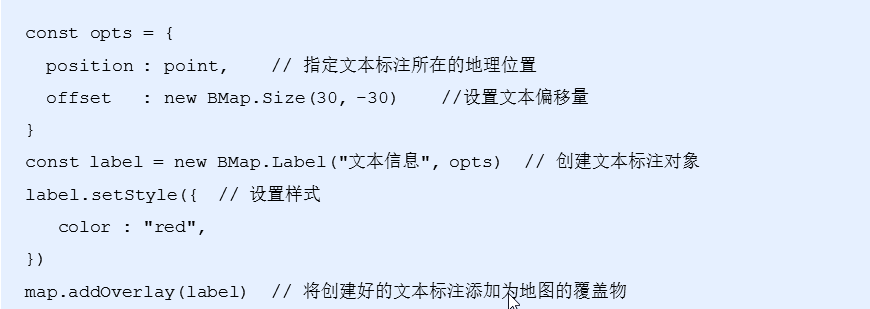
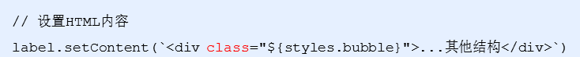
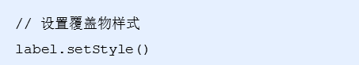
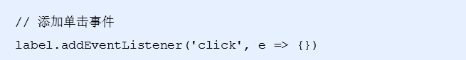
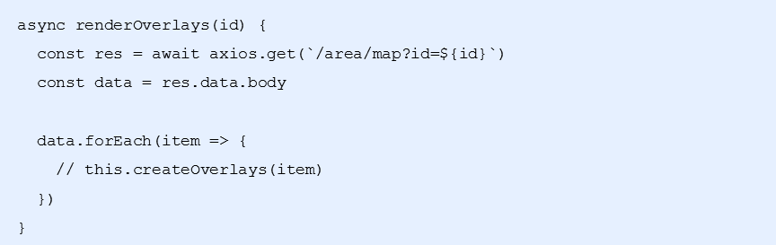

# 地图找房模块

## 1.1 根据定位展示当前城市（★★★）

- storage拿出来 根据定位展示当前城市地图 获取定位城市
- (逆地址解析就是省市名字转化成坐标经纬度) 
- 调用 centerAndZoom() 方法在地图中展示当前城市，并设置缩放级别为11
- 在地图中添加比例尺和平移缩放控件
- map.addControl(new BMap.NavigationControl());
- 文档 <http://lbsyun.baidu.com/index.php?title=jspopular3.0/guide/helloworld>


### 1.2 创建文本覆盖物 demo

打开百度地图添加文字标签DEMO

文档地址： <http://lbsyun.baidu.com/jsdemo.htm#c1_14>

- 创建Label 示例对象
- 掉用setStyle() 方法设置样式
- 在map对象上调用 addOverlay() 方法，讲文本覆盖物添加到地图中



### 1.3 绘制房源覆盖物 修改样式即可

- 由于默认提供的本文覆盖物与我们效果不符合，所以我们需要进行重新的绘制
- 调用Label的 setContent方法，传入html结构，修改HTML的内容样式;注意：调用了setContent 那么里面文本的内容就失效了
- setContent文档 ：<http://lbsyun.baidu.com/cms/jsapi/reference/jsapi_reference_3_0.html#a3b9>



- 调用setStyle方法修改覆盖物样式



- 给覆盖物添加点击事件



- 覆盖的内容结构

```html
<div class="${styles.bubble}">
    <p class="${styles.name}">朝阳区</p>
    <p>10套</p>
 </div>
```

- 覆盖物的样式

```react
const labelStyle = {
    cursor: 'pointer',
    border: '0px solid rgb(255,0,0)',
    padding: '0px',
    whiteSpace: 'nowrap',
    fontSize: '12px',
    color: 'rbg(255,255,255)',
    textAlign: 'center'
}
```


### 2.1 获取所有区的信息

- 发送请求获取房源数据
- 遍历数据，创建覆盖物，给每一个覆盖物添加唯一标识
- 给覆盖物添加点击事件
- 在单击事件中，获取到当前单击项的唯一标识 id->value
- 以当前覆盖物放大地图（级别为13），调用clearOverlays()方法清除当前覆盖物

```react
// 请求接口，获取房源数据
let res = await axios.get(`http://localhost:8080/area/map?id=${value}`)
// 遍历房源信息，创建对应的覆盖物
res.data.body.map(item => {
    // 给每一条数据添加覆盖物
    // 得到返回的经纬度信息
    let { coord: { longitude, latitude }, label: areaName, count, value } = item
    // 创建覆盖物
    let label = new BMap.Label('', {
        position: new BMap.Point(longitude, latitude),
        offset: new BMap.Size(-35, -35)
    })
    // 设置覆盖物内容
    label.setContent(`<div class="${styles.bubble}">
    <p class="${styles.name}">${areaName}</p>
    <p>${count}套</p>
  </div>`)
    // 设置样式
    label.setStyle(labelStyle)
    // 添加点击事件
    label.addEventListener('click', function () {
        // 当点击了覆盖物，要以当前点击的覆盖物为中心来放大地图
        map.centerAndZoom(this.K.position, 13);
        // 解决清除覆盖物的时候，百度地图js报错问题
        setTimeout(function () {
            map.clearOverlays()
        }, 0)
    })
    // 给label添加唯一标识
    label.id = value
    // 添加到地图上
    map.addOverlay(label)
})
```

### 3 封装流程

   11 显示区   13 显示县镇  15 显示小区名 (再点就不放大了 显示房源列表即可)

   // 假设当前地图缩放级别为 11，此时，type 为 circle（圆形覆盖物）

​    // 假设当前地图缩放级别为 13，此时，type 为 circle（圆形覆盖物）

​    // 假设当前地图缩放级别为 15，此时，type 为 rect（矩形覆盖物）

 this.map.getZoom() 获取当前缩放级别

#### 3.1 renderOverlays 方法的封装

- 这个方法是整个封装的入口
- 在这个方法需要 接收区域id ，获取对应的房源数据



#### 4.2 this.renderOverly(id,type) 

```react
async renderOverly(id,type){
        // 获取 当前城市对应的覆盖物数据
        let fgwRes=await axios.get('http://localhost:8080/area/map?id='+id) 

        console.log("覆盖物数据",fgwRes)
        
        //循环 创建地图覆盖物
        fgwRes.data.body.forEach(item=>{
            // longitude经度
            let { coord: { longitude, latitude }, label: areaName, count, value }=item
            let areaPoint=new BMap.Point(longitude, latitude)
            // 循环一次 创建一个覆盖物
            if(type=='cycle'){
                var opts = {
                    position : areaPoint,    // 指定坐标 注意要百度的坐标
                    offset   : new BMap.Size(-35, -35)    //设置文本位置
                }
                var label = new BMap.Label("", opts);  // 创建文本标注对象
                // 直接写html结构
                label.setContent(`<div class="${styles.bubble}">
                    <p class="${styles.name}">${areaName}</p>
                    <p>${count}套</p>
                </div>`)
            }else{
                var opts = {
                    position : areaPoint,    // 指定坐标 注意要百度的坐标
                    offset   : new BMap.Size(-35, -35)    //设置文本位置
                }
                var label = new BMap.Label("", opts);  // 创建文本标注对象
                // 直接写html结构
                label.setContent(`<div class="${styles.rect}">
                <span class="${styles.housename}">${areaName}</span>
                <span class="${styles.housenum}">${count}套</span>
                <i class="${styles.arrow}"></i>
              </div>`)
            }
            // 设置外层样式
            label.setStyle(labelStyle);
            label.id=value
            // 点击覆盖物
            label.addEventListener("click",e=>{
                console.log("点了label啦",label.id)
                // 如果点击的时候是11 我就跳到13 ..
                let zoom= this.map.getZoom()
                console.log("zoom",zoom)
                // 放大地图 把当前覆盖物到中心 
                if(zoom==11){
                    this.map.centerAndZoom(areaPoint, 13);
                    // 发送请求获取县镇数据
                    this.renderOverly(label.id,'cycle')
                }else if(zoom==13){
                    this.map.centerAndZoom(areaPoint, 15);
                    // 发送请求获取街道小区数据显示 矩形覆盖物
                    this.renderOverly(label.id,'rect')
                }else if(zoom==15){
                    //  发送请求显示房子列表
                    console.log("发送ajax获取房子数据")
                    return;
                }
                
                // 清除所有覆盖物
                setTimeout(()=>{
                    this.map.clearOverlays()  
                },10)
                // 发送请求获取 县镇的数据 循环生成覆盖物
            })
            // 添加覆盖物到地图上
            this.map.addOverlay(label); 
        })

    }
```

​       

### 5.1 单击获取数据展示房源列表

展示房源列表 show代表显示 点击了就true 默认false不显示

接口地址：http://localhost:8080/houses?cityId=AREA%7C88cff55c-aaa4-e2e0

​	1发送请求 getHouseList 2 复制结构样式

### 5.2  获取并展示小区房源数据（优化）

tag标签  类名  tag1  tag2 tag3

```
 const tagClass = 'tag' + (index + 1)
                        return (
                            <span
                                className={[styles.tag, styles[tagClass]].join(' ')}
                                ...
```

```react
// 逻辑代码
async getHouseList(id) {
    let res = await axios.get('http://localhost:8080/houses?cityId=' + id)
    this.setState({
        housesList: res.data.body.list,
        isShowList: true
    })
}
//结构
{/* 房源列表 */}
{/* 添加 styles.show 展示房屋列表 */}
    <div
        className={[
            styles.houseList,
            this.state.isShowList ? styles.show : ''
        ].join(' ')}
    >
        <div className={styles.titleWrap}>
            <h1 className={styles.listTitle}>房屋列表</h1>
            <Link className={styles.titleMore} to="/home/list">
                更多房源</Link>
        </div>
        <div className={styles.houseItems}>
            {/* 房屋结构 */}
            {this.renderHousesList()}
        </div>
    </div>
</div>
// 渲染房屋列表的item方法
/**
 * 渲染房源列表
 */
renderHousesList() {
    return this.state.housesList.map(item => (
        <div className={styles.house}>
            <div className={styles.imgWrap}>
                
            </div>
            <div className={styles.content}>
                <h3 className={styles.title}>{item.title}</h3>
                <div className={styles.desc}>{item.desc}</div>
                <div>
                    {/* ['近地铁', '随时看房'] */}
                    {item.tags.map((tag, index) => {
                        const tagClass = 'tag' + (index + 1)
                        return (
                            <span
                                className={[styles.tag, styles[tagClass]].join(' ')}
                                key={tag}
                            >
                                {tag}
                            </span>
                        )
                    })}
                </div>
                <div className={styles.price}>
                    <span className={styles.priceNum}>{item.price}</span> 元/月
    </div>
            </div>
        </div>
    )
    )
}
```


### 6.1  点击小区 移动地图到中间

 		<http://lbsyun.baidu.com/cms/jsapi/reference/jsapi_reference_3_0.html>

- 使用地图的 panBy() 方法，移动地图到中间位置

  - 垂直位移：(window.innerHeight（屏幕高度）-330（房源列表高度）/2） 

    -e.changedTouches[0].clientY（目标覆盖层的位置）

  - 水平位移：window.innerWidth（屏幕宽度）/2 - e.changedTouches[0].clientX

- 移动地图的时候（监听movestart事件），隐藏房源列表

### 6.2 添加Loading效果

- 利用Toast的loading方法来实现

- 在每次请求开始的时候开启loading    Toast.loading('加载中。。。', 0, null, false)

- 在请求结束后关闭loading   Toast.hide()

- 2 添加loading优化体验

  显示0秒代表不隐藏     Toast.loading('正在加载...', 0, null, false)

  ​    // 请求成功 隐藏loading

  ​        Toast.hide()
