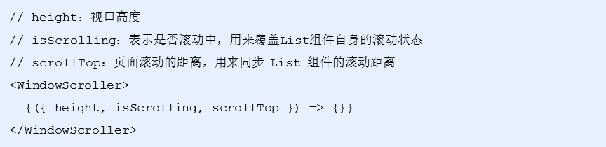
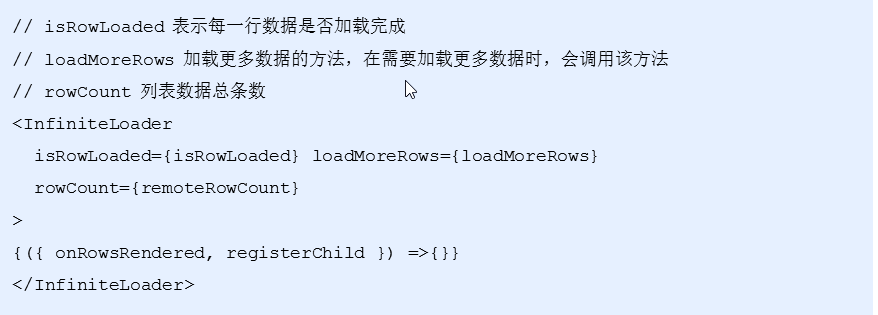
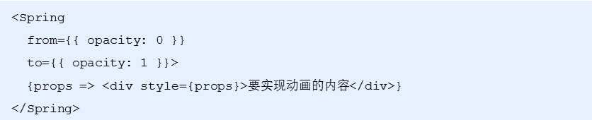
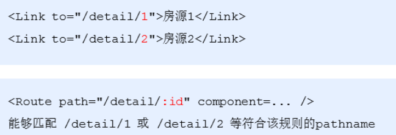
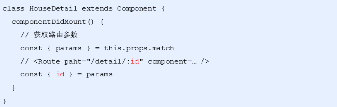

# 列表找房模块-房屋列表

## 1.1 使用`WindowScroller` 让Lsit跟随页面滚动-参数不要少了

文档 ：https://github.com/bvaughn/react-virtualized/tree/master/docs

- **默认：**List组件只让组件自身出现滚动条，无法让整个页面滚动，也就无法实现标题吸顶功能
- **解决方式：**使用`WindowScroller`高阶组件，让List组件跟随页面滚动（为List组件提供状态，同时还需要设置List组件的autoHeight属性）
- **注意：**`WindowScroller`高阶组件只能提供height，无法提供width
- **解决方式：**在WindowScroller组件中使用AutoSizer高阶组件来为List组件提供width



```react
<WindowScroller>
  {({ height, isScrolling, scrollTop }) => (
    <AutoSizer>
      {({ width }) => (
        <List
          autoHeight // 设置高度为 WindowScroller 最终渲染的列表高度
          // 组件的宽度
          width={width} // 视口宽度
          // 组件的高度
          height={height} // 视口高度
          rowCount={this.state.count} // List列表项总条目数
          // 每行的高度
          rowHeight={120} // 每一行高度
          rowRenderer={this.renderHouseList}
          isScrolling={isScrolling}
          scrollTop={scrollTop}
        />
      )}
    </AutoSizer>
  )}
</WindowScroller>
```

## `1.2 InfiniteLoader` 无限滚动加载组件（★★★）

文档  <https://github.com/bvaughn/react-virtualized/tree/master/docs>

先复制使用

- 滚动房屋列表时候，动态加载更多房屋数据
- 使用`InfiniteLoader` 组件，来实现无限滚动列表，从而加载更多房屋数据
- 根据 `InfiniteLoader` 文档示例，在项目中使用组件



```react
<InfiniteLoader
  isRowLoaded={this.isRowLoaded}
  loadMoreRows={this.loadMoreRows}
  rowCount={this.state.count}
>
  {({ onRowsRendered, registerChild }) => (
    <WindowScroller>
      {({ height, isScrolling, scrollTop }) => (
        <AutoSizer>
          {({ width }) => (
            <List
              onRowsRendered={onRowsRendered}
              ref={registerChild}
              autoHeight // 设置高度为 WindowScroller 最终渲染的列表高度
              // 组件的宽度
              width={width} // 视口宽度
              // 组件的高度
              height={height} // 视口高度
              rowCount={this.state.count} // List列表项总条目数
              // 每行的高度
              rowHeight={120} // 每一行高度
              rowRenderer={this.renderHouseList}
              isScrolling={isScrolling}
              scrollTop={scrollTop}
            />
          )}
        </AutoSizer>
      )}
    </WindowScroller>
  )}
</InfiniteLoader>
 // 判断每一行数据是否加载完毕
  isRowLoaded = ({ index }) => {
    return !!this.state.list[index];
  };
  // 用来获取更多房屋列表数据
  // 注意，该方法的返回值是一个 Promise 对象，并且，这个对象应该在数据加载完成时，来调用 resolve让 Promise对象的状态变为已完成
  loadMoreRows = ({ startIndex, stopIndex }) => {
    return new Promise(resolve => {
       ...
    });
  };
```


## 2.1 加载更多房屋列表数据

- 在loadMoreRows方法中，根据起始索引和结束索引，发送请求，获取更多房屋数据
- 获取到最新的数据后，与当前list中的数据合并，再更新state，并调用Promise的resolve

```react
 loadMoreRows = ({ startIndex, stopIndex }) => {
    return new Promise(resolve => {
      instance
        .get("/houses", {
          params: {
            cityId: value,
            ...this.filters,
            start: startIndex,
            end: stopIndex
          }
        })
        .then(res => {
          this.setState({
            list: [...this.state.list, ...res.data.body.list]
          });

          // 加载数据完成时，调用resolve即可
          resolve();
        });
    });
  };
```

- 报错情况---在renderHouseList方法中，判断house是否存在
- 不存在的时候，就渲染一个loading元素
- 存在的时候，再渲染HouseItem组件

```react
// 渲染每一行的内容
  renderHouseList = ({
    key, // Unique key within array of rows
    index, // 索引号
    style // 重点属性：一定要给每一个行数添加该样式
  }) => {
    // 当前这一行的
    const { list } = this.state;
    const house = list[index];
    // 如果不存在，需要渲染loading元素占位
    if (!house) {
      return (
        <div key={key} style={style}>
          <p className={styles.loading}></p>
        </div>
      );
    }
    return (
      ...
    );
  };
```

# 列表找房模块-吸顶功能（★★★）

吸顶功能- 当页面滚动上某个位置 filter就固定不动(fixed)--滚道对应位置又还原位置

## 2.2 实现思路

- 在页面滚动的时候，判断筛选栏上边是否还在可视区域内
- 滚动到某个规定的位置 就固定定位 吸顶  --没有滚动就正常
- 吸顶之后，元素脱标，房屋列表会突然往上调动筛选栏的高度，解决这个问题，我们用一个跟筛选栏相同的占位div元素默认是0高 固定定位留出位置设置为那个高度比如50 正好，在筛选栏脱标后，代替它撑起高度

## 2.3 实现步骤1 基本结构

- 封装Sticky组件（吸顶功能--滚动固定定位）
- 在HouseList页面中，导入Sticky组件
- 使用Sticky组件包裹要实现吸顶功能的Filter组件

```react
<Sticky>
  <Filter onFilter={this.onFilter} />
</Sticky>
```

- 在Sticky组件中，创建两个ref对象（placeholder，content），分别指向占位元素和内容元素

```react
class Sticky extends Component {
  // 创建ref对象
  placeholder = createRef()
  content = createRef()
  ...
  render() {
   return (
     <div>
       {/* 占位元素 */}
       <div ref={this.placeholder} />
       {/* 内容元素 */}
       <div ref={this.content}>{this.props.children}</div>
     </div>
   )
}
```

## 3.1实现步骤2 监听滚动判断是否fixed固定定位-注意层级

- 在组件中，监听浏览器的scroll事件

```react
// 监听 scroll 事件
componentDidMount() {
  window.addEventListener('scroll', this.handleScroll)
}
componentWillUnmount() {
  window.removeEventListener('scroll', this.handleScroll)
}
```

- 在scroll事件中，通过getBoundingClientRect()方法得到筛选栏占位元素当前位置
- 判断top是否小于0（是否在可视区内）
- 如果小于，就添加需要吸顶样式（fixed），同时设置占位元素高度
- 否则，就移除吸顶样式，同时让占位元素高度为0

```react
// scroll 事件的事件处理程序
handleScroll=()=>{
        console.log("我滚动了")
        // 获取占位div  和要fixed定位的 div
        let pDiv=this.placerholderRef.current
        let contentDiv=this.contentRef.current
        // 判断是否到顶部 判断占位div--pDiv是否top位置到0了
        // getBoundingClientRect 他可以获取到当前元素 距离上下左右的位置
        // console.log( pDiv.getBoundingClientRect() )// top 距离顶部
        let {top}=pDiv.getBoundingClientRect()
        if(top<=0){//到顶了 就要filter固定定位
            contentDiv.style.position='fixed'
            pDiv.style.height="40px";
        }else{//没有到顶
            contentDiv.style.position='static'
            pDiv.style.height="0";
        }
    }
```

## 3.2 通用性优化 高度传来

- 现在Sticky组件中占位元素的高度是写死的，这样就不通用了，我们可以把这个高度通过参数来进行传递，组件内部通过props就可以来进行获取了

```react
// HouseList组件
<Sticky height={40}>
  <Filter onFilter={this.onFilter} />
</Sticky>

// Sticky 组件
  handleScroll = () => {
    const { height } = this.props;
    ...
   // 获取占位div  和要fixed定位的 div
        let pDiv=this.placerholderRef.current
        let contentDiv=this.contentRef.current
        // 判断是否到顶部 判断占位div--pDiv是否top位置到0了
        // getBoundingClientRect 他可以获取到当前元素 距离上下左右的位置
        // console.log( pDiv.getBoundingClientRect() )// top 距离顶部
        let {top}=pDiv.getBoundingClientRect()
        if(top<=0){//到顶了 就要filter固定定位
            contentDiv.style.position='fixed'
            pDiv.style.height=height+"px";
        }else{//没有到顶
            contentDiv.style.position='static'
            pDiv.style.height="0";
        }
  };
```

# 列表找房模块

## 4.1 加载提示

- 发送ajax的 loading效果

- 实现加载房源数据时：加载中、加载完成的提示（需要解决：没有房源数据时，不弹提示框）

  - 判断一下count是否为0，如果为0，就不加载提示信息

  ```
      //getHouseList 提示找到的房源数量
      if (count !== 0) {
        Toast.info(`共找到 ${count} 套房源`, 2, null, false)
      }
  ```

  

- 找不到房源数据时候的提示（需要解决：进入页面就展示该提示的问题）
  - 判断一下是否是第一次进入，可以用一个变量来进行记录，然后只要进行了数据请求，就把这个标识更改

  ```
  const { count, isLoaded } = this.state

      // 注意：因为 count 默认值为 0 ，所以，进入页面时，就会展示 没有房源 的提示！
      // 需求：进入页面时，先不要展示 没有房源 的提示。而是等到，数据加载完成后，如果 count 为0，再展示 没有房源 的提示
      // 解决：添加 数据加载完成的状态，使用该状态 和 !count 一起来决定是否展示 没有房源的提示
      if (isLoaded && !count) {
        // 没有房源
        return <NoHouse>没有找到房源，请您换个搜索条件吧~</NoHouse>
      }
  ```

  

## 4.2 条件筛选栏优化

- 点击条件筛选栏，展示FilterPicker组件时，样式错乱问题（需要解决：样式问题）
  
  - 把FilterPicker组件修改成绝对定位，脱标了，就不会挤下面的结构了
- 使用条件筛选查询数据时，页面没有回到顶部（需要解决：每次重新回到页面顶部）
  - 在点击条件查询确定按钮的时候，利用window.scroll(0 ,0) 来回到页面顶部

  


# react-spring动画库（★★★）

## 5.2 概述

- 场景：展示筛选对话框的时候，实现动画效果，增强用户体验
- react-spring是基于spring-physics（弹簧物理）的react动画库，动画效果更加流畅、自然
- 优势：
  - 几乎可以实现任意UI动画效果
  - 组件式使用方式（render-props模式），简单易用，符合react的声明式特性，性能高
- [github地址](https://github.com/react-spring/react-spring)
- [官方文档](https://www.react-spring.io/docs/props/spring)

## 5.3 基本使用

- 安装： yarn add react-spring
- 打开Spring组件文档
- 导入Spring文档，使用Spring组件包裹要实现动画效果的遮罩层div
- 通过render-props模式，讲参数props设置为遮罩层div的style
- 给Spring组件添加from属性，指定：组件第一次渲染时的动画状态
- 给Spring组件添加to属性，指定：组件要更新的新动画状态
- props就是透明度有0~1中变化的值



## 6 实现了导航栏的显示隐藏

- 

```react
 {/* 搜索顶部导航 */}
            <Spring
                from={{ opacity: 0 }}
                to={{ opacity: 1 }}>
                {
                    props => <div style={props} className="search">
                        <i className="iconfont icon-back"></i>
                        <SearchHeader cityname={this.state.cityname}></SearchHeader>
                    </div>
                }
            </Spring>
```

## 6.2 房子详情页面

- 创建房屋详情页面HouseDetail
- 修改NavHeader组件（添加了className和rightContent两个props）
- 创建了HousePackage组件（房屋配套）
- 这些模板已经提供好，可以直接来使用

```react
// 添加 className 和 rightContent（导航栏右侧内容） 属性
function NavHeader({
  children,
  history,
  onLeftClick,
  className,
  rightContent
}) {
  // 默认点击行为
  const defaultHandler = () => history.go(-1)

  return (
    <NavBar
      className={[styles.navBar, className || ''].join(' ')}
      mode="light"
      icon={<i className="iconfont icon-back" />}
      onLeftClick={onLeftClick || defaultHandler}
      rightContent={rightContent}
    >
      {children}
    </NavBar>
  )
}

// 添加props校验
NavHeader.propTypes = {
  ...
  rightContent: PropTypes.array
}

// withRouter(NavHeader) 函数的返回值也是一个组件
export default withRouter(NavHeader)
```

## 1.2 路由参数--动态路由（★★★）

- 房源有多个，那么URL路径也就有多个，那么需要多少个路由规则来匹配呢？一个还是多个？
- 使用 一个 路由规则匹配不同的URL路径，同时I获取到URL中不同的内容，利用路由参数来解决
- 让一个路由规则，同时匹配多个符合该规则的URL路径
- 语法：/detail/:id ，其中:id 就是路由参数



- 获取路由参数： props.match.params



+ 点击跳转详情页面

在找房页面中，给每一个房源列表添加点击事件，在点击时跳转到房屋详情页面