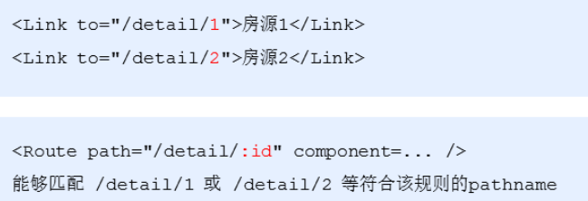
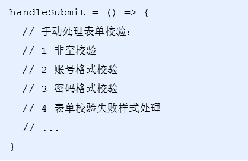

# houselist房子列表 小bug

必须写 style了  才能计算每行的高度等样式

```
 // 每行的div结构   style={style}

            <div className={styles.house} style={style} key={key}
```


# 房屋详情模块-准备工作

- 创建房屋详情页面HouseDetail
- 修改NavHeader组件（添加了className和rightContent两个props）
- 创建了HousePackage组件（房屋配套）
- 这些模板已经提供好，可以直接来使用

```react
// 添加 className 和 rightContent（导航栏右侧内容） 属性
function NavHeader({
  children,
  history,
  onLeftClick,
  className,
  rightContent
}) {
  // 默认点击行为
  const defaultHandler = () => history.go(-1)

  return (
    <NavBar
      className={[styles.navBar, className || ''].join(' ')}
      mode="light"
      icon={<i className="iconfont icon-back" />}
      onLeftClick={onLeftClick || defaultHandler}
      rightContent={rightContent}
    >
      {children}
    </NavBar>
  )
}

// 添加props校验
NavHeader.propTypes = {
  ...
  rightContent: PropTypes.array
}

// withRouter(NavHeader) 函数的返回值也是一个组件
export default withRouter(NavHeader)
```

## 1.2 路由参数（★★★）

- 房源有多个，那么URL路径也就有多个，那么需要多少个路由规则来匹配呢？一个还是多个？
- 使用 一个 路由规则匹配不同的URL路径，同时I获取到URL中不同的内容，利用路由参数来解决
- 让一个路由规则，同时匹配多个符合该规则的URL路径
- 语法：/detail/:id ，其中:id 就是路由参数



- 获取路由参数： props.match.params


## 2.1 展示房屋详情（★★★）

1  根据id发送ajax获取数据

-  在找房页面中，给每一个房源列表添加点击事件，在点击时跳转到房屋详情页面
-  在单击事件中，获取到当前房屋id
-  根据房屋详情的路由地址，调用history.push() 实现路由跳转

```react
<
  onClick={() => this.props.history.push(`/detail/${house.houseCode}`)}
  // 注意：该组件中应该接收 style，然后给组件元素设置样式！！！

/>
```

- 封装getHouseDetail方法，在componentDidMount中调用该方法

```react
componentDidMount() {
    // 获取房屋数据
    this.getHouseDetail()
}
```

- 在方法中，通过路由参数获取到当前房屋id
- 使用API发送请求，获取房屋数据，保存到state中

```react
 // 发送ajax获取房子详情
  async gethousedetail(){
    console.log('id',this.props.match.params.id)
    let id=this.props.match.params.id;
    let res=await API.get("/houses/"+id)
    console.log("房子详情",res)
    this.setState({
        houseInfo:res.data.body 
    },()=>{

      // 成功有数据之后 loading
      this.setState({
        isLoading:true
      })

      // 有数据 渲染 地图
      this.renderMap(this.state.houseInfo.community, {
        latitude: this.state.houseInfo.coord.latitude,
        longitude: this.state.houseInfo.coord.longitude
      })
    })

  }
```

## 2.2 使用房屋数据，渲染页面

- 解构出需要的数据

  ```react
  const {
    isLoading,
    houseInfo: {
      community,
      title,
      price,
      roomType,
      size,
      floor,
      oriented,
      supporting,
      description
    }
  } = this.state
  ```

- 渲染小区名称

  ```react
  {/* 导航栏 */}
  <NavHeader
    className={styles.navHeader}
    rightContent={[<i key="share" className="iconfont icon-share" />]}
  >
    {community}
  </NavHeader>
  ```

- 渲染轮播图

  ```react
  // 渲染轮播图结构
  renderSwipers() {
    const {
      houseInfo: { houseImg }
    } = this.state

    return houseImg.map(item => (
      <a key={item} href="http://itcast.cn">
        
      </a>
    ))
  }
  ```

- 渲染标签

  ```react
  // 渲染标签
  renderTags() {
    const {
      houseInfo: { tags }
    } = this.state

    return tags.map((item, index) => {
      // 如果标签数量超过3个，后面的标签就都展示位第三个标签的样式
      let tagClass = ''
      if (index > 2) {
        tagClass = 'tag3'
      } else {
        tagClass = 'tag' + (index + 1)
      }

      return (
        <span key={item} className={[styles.tag, styles[tagClass]].join(' ')}>
          {item}
        </span>
      )
    })
  }
  ```

- 渲染价格，房型，面积等

  ```react
  <Flex className={styles.infoPrice}>
    <Flex.Item className={styles.infoPriceItem}>
      <div>
        {price}
        <span className={styles.month}>/月</span>
      </div>
      <div>租金</div>
    </Flex.Item>
    <Flex.Item className={styles.infoPriceItem}>
      <div>{roomType}</div>
      <div>房型</div>
    </Flex.Item>
    <Flex.Item className={styles.infoPriceItem}>
      <div>{size}平米</div>
      <div>面积</div>
    </Flex.Item>
  </Flex>
  ```

- 渲染装修，楼层，朝向等

  ```react
  <Flex className={styles.infoBasic} align="start">
     <Flex.Item>
       <div>
         <span className={styles.title}>装修：</span>
         精装
       </div>
       <div>
         <span className={styles.title}>楼层：</span>
         {floor}
       </div>
     </Flex.Item>
     <Flex.Item>
       <div>
         <span className={styles.title}>朝向：</span>
         {oriented.join('、')}
       </div>
       <div>
         <span className={styles.title}>类型：</span>普通住宅
       </div>
     </Flex.Item>
   </Flex>
  ```

- 渲染地图

  ```react
  // 渲染地图
  renderMap(community, coord) {
    const { latitude, longitude } = coord

    const map = new BMap.Map('map')
    const point = new BMap.Point(longitude, latitude)
    map.centerAndZoom(point, 17)

    const label = new BMap.Label('', {
      position: point,
      offset: new BMap.Size(0, -36)
    })

    label.setStyle(labelStyle)
    label.setContent(`
      <span>${community}</span>
      <div class="${styles.mapArrow}"></div>
    `)
    map.addOverlay(label)
  }
  ```

- 渲染房屋配套

  ```react
   {/* 房屋配套 */}
   <div className={styles.about}>
     <div className={styles.houseTitle}>房屋配套</div>
     {/* 判断是否有数据 */}
     {supporting.length === 0 ? (
       <div className={styles.titleEmpty}>暂无数据</div>
     ) : (
       <HousePackage list={supporting} />
     )}
   </div>
  ```

- 渲染房屋概况

  ```react
  <div className={styles.set}>
    <div className={styles.houseTitle}>房源概况</div>
    <div>
      <div className={styles.contact}>
        <div className={styles.user}>
          
          <div className={styles.useInfo}>
            <div>王女士</div>
            <div className={styles.userAuth}>
              <i className="iconfont icon-auth" />
              已认证房主
            </div>
          </div>
        </div>
        <span className={styles.userMsg}>发消息</span>
      </div>

      <div className={styles.descText}>
        {description || '暂无房屋描述'}
      </div>
    </div>
  </div>
  ```

- 渲染推荐，可以复用 HouseItem组件

  ```react
  <div className={styles.recommend}>
    <div className={styles.houseTitle}>猜你喜欢</div>
    <div className={styles.items}>
      {recommendHouses.map(item => (
        <HouseItem {...item} key={item.id} />
      ))}
    </div>
  </div>
  ```

# 电话与客服

a href="tel:187..." 打电话


百度：环信客服

前端：注册账号  -》登录客服云-》点击右上角管理员模式->渠道管理-》选中网站之类

​       把那段js复制到页面body里面

测试：我注册账号直接引入他的js就可以  <http://leijuncao.applinzi.com/kuayu/1.html>


# 登录模块

- 用户登录
- 我的页面
- 封装路由访问控制组件

功能实现：

- 添加状态：username和password

```react
  state = {
    username: '',
    password: ''
  }
```

- 使用受控组件方式获取表单元素值

```react
getUserName = e => {
  this.setState({
    username: e.target.value
  })
}

getPassword = e => {
  this.setState({
    password: e.target.value
  })
}
render() {
    const { username, password } = this.state

    return (
      <div className={styles.root}>
        ...

        {/* 登录表单 */}
        <WingBlank>
          <form onSubmit={this.handleSubmit}>
            <div className={styles.formItem}>
              <input
                className={styles.input}
                value={username}
                onChange={this.getUserName}
                name="username"
                placeholder="请输入账号"
              />
            </div>
            {/* 长度为5到8位，只能出现数字、字母、下划线 */}
            {/* <div className={styles.error}>账号为必填项</div> */}
            <div className={styles.formItem}>
              <input
                className={styles.input}
                value={password}
                onChange={this.getPassword}
                name="password"
                type="password"
                placeholder="请输入密码"
              />
            </div>
            ...
      </div>
    )
  }
}
```

- 给form表单添加 onSubmit
- 创建方法 handleSubmit，实现表单提交

```react
// 表单提交事件的事件处理程序
handleSubmit = async e => {
  // 阻止表单提交时的默认行为
  e.preventDefault()
  ...
}
```

- 在方法中，通过username和password获取到账号和密码
- 使用API调用登录接口，将username和password作为参数
- 判断返回值status为200时候，表示登录成功
- 登录成功后，将token保存到本地存储中（my_token）
- 返回登录前的页面

```react
// 表单提交事件的事件处理程序
handleSubmit = async e => {
  // 阻止表单提交时的默认行为
  e.preventDefault()

  // 获取账号和密码
  const { username, password } = this.state

  // console.log('表单提交了', username, password)
  // 发送请求
  const res = await API.post('/user/login', {
    username,
    password
  })

  console.log('登录结果：', res)
  const { status, body, description } = res.data

  if (status === 200) {
    // 登录成功
    localStorage.setItem('my_token', body.token)
    this.props.history.go(-1)
  } else {
    // 登录失败
    Toast.info(description, 2, null, false)
  }
}
```

## 4.1 表单验证说明

- 表单提交前，需要先进性表单验证，验证通过后再提交表单
- 方式一：antd-mobile 组件库的方式（需要InputItem文本输入组件）

```
 <InputItem
            type="phone"
            placeholder="input your phone"
            error={this.state.hasError}
            onErrorClick={this.onErrorClick}
            onChange={this.onChange}
            value={this.state.value}
          >手机号码</InputItem>
```


- 推荐：使用更通用的 formik，React中专门用来进行表单处理和表单校验的库



# formik

## 4.2 介绍

- Github地址：[formik文档](http://jaredpalmer.com/formik/docs/overview)
- 场景：表单处理，表单验证
- 优势：轻松处理React中的复杂表单，包括：获取表单元素的值，表单验证和错误信息，处理表单提交，并且将这些内容放在一起统一处理，有利于代码阅读，重构，测试等
- 使用两种方式：1. 高阶组件（withFormik） 2. render-props（<Formik render={() => {}} />）

## formik来实现表单校验（★★★）

### 4.3 -5重构

- 安装： yarn add formik
- 导入 withFormik，使用withFormit 高阶组件包裹Login组件
- 为withFormit提供配置对象： mapPropsToValues / handleSubmit
- 在Login组件中，通过props获取到values（表单元素值对象），handleSubmit，handleChange
- 使用values提供的值，设置为表单元素的value，使用handleChange设置为表单元素的onChange
- 使用handleSubmit设置为表单的onSubmit
- 在handleSubmit中，通过values获取到表单元素值
- 在handleSubmit中，完成登录逻辑


```react
// Login组件中
render() {
  // const { username, password } = this.state

  // 通过 props 获取高阶组件传递进来的属性
  const { values, handleSubmit, handleChange } = this.props

  return (
    <div className={styles.root}>
      {/* 顶部导航 */}
      <NavHeader className={styles.navHeader}>账号登录</NavHeader>
      <WhiteSpace size="xl" />

      {/* 登录表单 */}
      <WingBlank>
        <form onSubmit={handleSubmit}>
          <div className={styles.formItem}>
            <input
              className={styles.input}
              value={values.username}
              onChange={handleChange}
              name="username"
              placeholder="请输入账号"
            />
          </div>
          {/* 长度为5到8位，只能出现数字、字母、下划线 */}
          {/* <div className={styles.error}>账号为必填项</div> */}
          <div className={styles.formItem}>
            <input
              className={styles.input}
              value={values.password}
              onChange={handleChange}
              name="password"
              type="password"
              placeholder="请输入密码"
            />
          </div>
          {/* 长度为5到12位，只能出现数字、字母、下划线 */}
          {/* <div className={styles.error}>账号为必填项</div> */}
          <div className={styles.formSubmit}>
            <button className={styles.submit} type="submit">
              登 录
            </button>
          </div>
        </form>
        <Flex className={styles.backHome}>
          <Flex.Item>
            <Link to="/registe">还没有账号，去注册~</Link>
          </Flex.Item>
        </Flex>
      </WingBlank>
    </div>
  )
}

// 使用 withFormik 高阶组件包装 Login 组件，为 Login 组件提供属性和方法
Login = withFormik({
  // 提供状态：
  mapPropsToValues: () => ({ username: '', password: '' }),
  // 表单的提交事件
  handleSubmit: async (values, { props }) => {
    // 获取账号和密码
    const { username, password } = values

    // 发送请求
    const res = await API.post('/user/login', {
      username,
      password
    })

    console.log('登录结果：', res)
    const { status, body, description } = res.data

    if (status === 200) {
      // 登录成功
      localStorage.setItem('hkzf_token', body.token)

      // 注意：无法在该方法中，通过 this 来获取到路由信息
      // 所以，需要通过 第二个对象参数中获取到 props 来使用 props
      props.history.go(-1)
    } else {
      // 登录失败
      Toast.info(description, 2, null, false)
    }
  }
})(Login)
```

### 5 两种表单验证方式

- 两种方式

  - 通过validate 配置手动校验

    

  - 通过 validationSchema 配置项配合Yup来校验

    

- 推荐： validationSchema配合Yup的方式进行表单校验

### 6 给登录功能添加表单验证

- 安装： yarn add yup （[Yup 文档](https://github.com/jquense/yup)），导入Yup

```react
// 导入Yup
import * as Yup from 'yup'
```

- 在 withFormik 中添加配置项 validationSchema，使用 Yup 添加表单校验规则


- 在 Login 组件中，通过 props 获取到 errors（错误信息）和  touched（是否访问过，注意：需要给表单元素添加 handleBlur 处理失焦点事件才生效！）
- 在表单元素中通过这两个对象展示表单校验错误信


示例代码：

```react
// 使用 withFormik 高阶组件包装 Login 组件，为 Login 组件提供属性和方法
Login = withFormik({
  ...
  // 添加表单校验规则
  validationSchema: Yup.object().shape({
    username: Yup.string()
      .required('账号为必填项')
      .matches(REG_UNAME, '长度为5到8位，只能出现数字、字母、下划线'),
    password: Yup.string()
      .required('密码为必填项')
      .matches(REG_PWD, '长度为5到12位，只能出现数字、字母、下划线')
  }),
  ...
})(Login)
```

在结构中需要渲染错误信息：

```react
{/* 登录表单 */}
<WingBlank>
  <form onSubmit={handleSubmit}>
    ...  用户名的错误提示
    {errors.username && touched.username && (
      <div className={styles.error}>{errors.username}</div>
    )}
    ... 密码框的错误提示
    {errors.password && touched.password && (
      <div className={styles.error}>{errors.password}</div>
    )}
    ...
</WingBlank>
```

### 6 简单处理 简化表单验证

- 导入 Form组件，替换form元素，去掉onSubmit


- 导入Field组件，替换input表单元素，去掉onChange，onBlur，value


- 导入 ErrorMessage 组件，替换原来的错误消息逻辑代码


- 去掉所有 props

示例代码：

```react
// 导入withFormik
import { withFormik, Form, Field, ErrorMessage } from 'formik'

<Form>
  {/* 账号 */}
  <div className={styles.formItem}>
    <Field
      className={styles.input}
      name="username"
      placeholder="请输入账号"
    />
  </div>
  <ErrorMessage
    className={styles.error}
    name="username"
    component="div"
  />
  {/* 密码 */}
  <div className={styles.formItem}>
    <Field
      className={styles.input}
      name="password"
      type="password"
      placeholder="请输入密码"
    />
  </div>
  <ErrorMessage
    className={styles.error}
    name="password"
    component="div"
  />
  <div className={styles.formSubmit}>
    <button className={styles.submit} type="submit">
      登 录
    </button>
  </div>
</Form>
```
