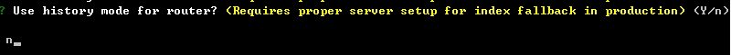
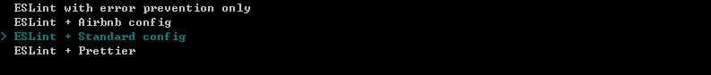
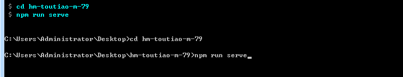

### 项目介绍

- 首先，黑马头条移动端是一个IT资讯移动**web应用**，有着和今日头条一样的资讯浏览体验。

- 主要功能：资讯列表、标签页切换，文章举报，频道管理、离线频道，文章详情、阅读记忆，关注功能、点赞功能、评论功能、回复评论、搜索功能、登录功能、个人中心、编辑资料、小智同学、~~问答功能~~、~~视频功能~~ ...   

- 最后，黑马头条可打包成一款移动APP，后期结合H5+可在Dcloud打包成一款体验较好的手机应用。


###使用技术

-  生产依赖
  - vuejs  核心vue
  - vuex  状态管理插件
  - vue-router  路由插件
  - axios  请求插件
  - json-bigint 最大安全数值处理
  - socket.io-client  即时通讯库
  - vant 移动组件库
  - amfe-flexible  rem适配
  - vue-lazyload 图片懒加载
- 开发依赖
  - babel  ES转换器
  - less  css预处理器
  - postcss  css后处理器
  - vue-cli  vue项目脚手架
- 打包App
  - H5+  native接口
  - DCLOUD 打包


###创建项目

创建项目：

```sh
vue create hm-toutiao-m-85
```

自定义创建：


依赖插件：


路由是否使用history模式：



- 两种路由实现模式
  - hash模式 
    - 使用 location.hash = '/user'  跳转
    - 根据地址栏切换，更新页面内容（组件）即可。
      - 使用 window.onhashchange 来监听hash改变
  - history模式
    - 使用 BOM对象 history 提供了一些API  back forward go pushState(H5)
    - 使用 history.pushState(null,null,'/user')  跳转
    - 根据地址栏切换，更新页面内容（组件）即可。
      - 使用 window.onpopstate 来监听历史改变

预处理器:


语法风格：



风格检查：


存储插件配置位置：


是否记录操作：


正在创建：


创建完毕启动项目：




### 调整结构

调整src目录：

```sh
├─api   #接口函数
├─assets  #静态资源
├─components  #公用组件
├─styles #less代码
├─utils #工具模块
└─views #路由页面
    ├─home #首页模块
    ├─video #视频模块
    ├─question #问答模块
    ├─search #搜索模块
    ├─user #用户模块
    └─Layout.vue #公用布局
├─App.vue #根组件
├─router #路由文件
└─store #状态文件
```


###版本控制

1. 创建远程仓库

```sh
# （空）仓库地址
# https://gitee.com/zhoushugang/hm-toutiao-m-79
```

2. 提交

```sh
git add .
git commit -m '初始化'
```

3. 推送远程仓库

```sh
# 加别名origin
git remote add origin git@gitee.com:zhoushugang/hm-toutiao-m-79.git
# 推送记录操作
git push -u origin master
```

注明：不再采用分支来管理，按功能提交即可。


###使用vant

- 官方地址：https://youzan.github.io/vant/#/zh-CN/intro
- 安装：

```sh
npm i vant -S
```

- 导入：

```js
import Vue from 'vue';
import Vant from 'vant';
import 'vant/lib/index.css';

Vue.use(Vant);
```

以上做法是完整导入，在项目开发阶段使用，配置方便节省时间，将来上线的时候可以使用按需导入。


### REM适配

> 注意：如果项目中没有生成postcss.conifg.js，请手动创建即可。

Vant 中的样式默认使用`px`作为单位，如果需要使用`rem`单位，推荐使用以下两个工具

- [postcss-pxtorem](https://github.com/cuth/postcss-pxtorem) 是一款 postcss 插件，用于将单位转化为 rem
- [lib-flexible](https://github.com/amfe/lib-flexible) 用于设置 rem 基准值

首先，需要安装：

```sh
# 后处理器 开发阶段使用
npm i postcss-pxtorem -D
# 修改rem基准值的js插件   需要在打包后需要使用
npm i amfe-flexible -S
```

然后，下面提供了一份基本的 postcss 配置（postcss.config.js），可以在此配置的基础上根据项目需求进行修改

```diff
module.exports = {
  plugins: {
    'autoprefixer': {},
+    'postcss-pxtorem': {
+      rootValue: 37.5,
+      propList: ['*']
+    }
  }
}
```

最后，入口文件main.js导入 amfe-flexible 

```js
import 'amfe-flexible'
```

注意

- rootValue 是转换px的基准值，参考设备iPhone6，设备宽度375px。
- flexible 在iPhone6设备设置的  html--->font-size 也为37.5px 。
- 但是 设计稿 尺寸750px 大小，所以在设计稿量取的尺寸使用时候需要  **除以2**  。


