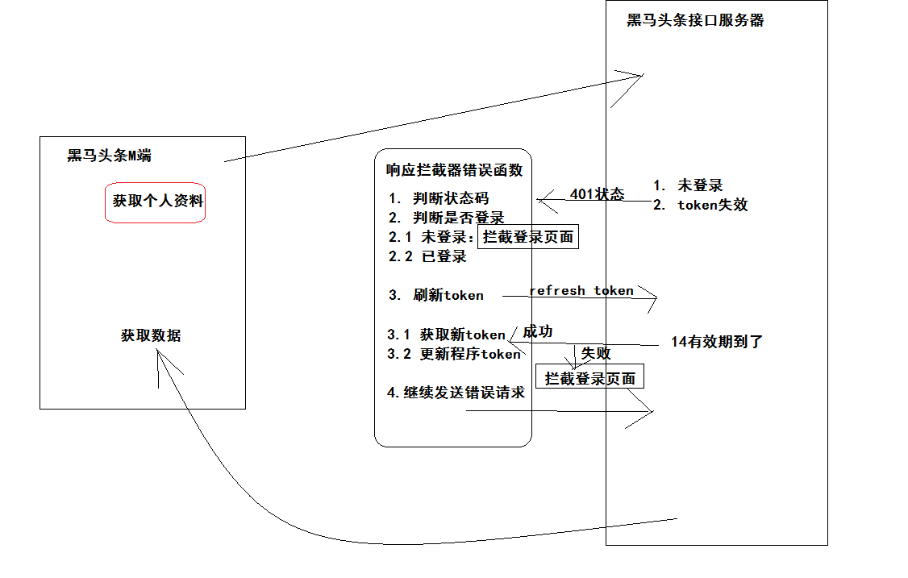
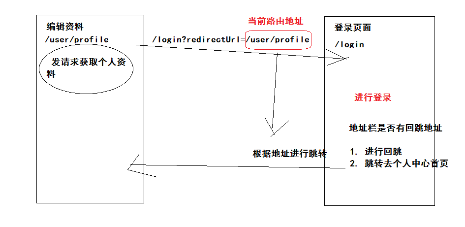
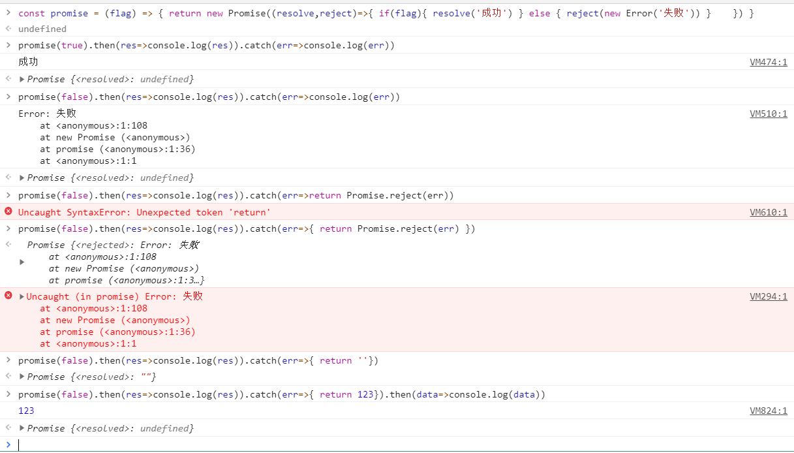

###约定路由规则

| path           | 功能         | 路由级别 |
| -------------- | ------------ | -------- |
| /              | 布局组件     | 一级路由 |
| ├─ /           | 首页组件     | 二级路由 |
| ├─ /question   | 问答组件     | 二级路由 |
| ├─ /video      | 视频组件     | 二级路由 |
| ├─ /user       | 个人中心组件 | 二级路由 |
| /user/profile  | 编辑资料组件 | 一级路由 |
| /user/chat     | 小智同学组件 | 一级路由 |
| /login         | 登录组件     | 一级路由 |
| /search        | 搜索中心组件 | 一级路由 |
| /search/result | 搜索结果组件 | 一级路由 |
| /article       | 文章详情     | 一级路由 |

- 根据参考图，设计路由规则。


###实现路由配置

```js
import Vue from 'vue'
import VueRouter from 'vue-router'

const Layout = () => import('@/views/Layout')
const Home = () => import('@/views/home/Index')
const Question = () => import('@/views/question/Index')
const Video = () => import('@/views/video/Index')
const User = () => import('@/views/user/Index')
const UserProfile = () => import('@/views/user/Profile')
const UserChat = () => import('@/views/user/Chat')
const Login = () => import('@/views/user/Login')
const Search = () => import('@/views/search/Index')
const SearchResult = () => import('@/views/search/Result')
const Article = () => import('@/views/home/Article')

Vue.use(VueRouter)

const routes = [
  {
    path: '/',
    component: Layout,
    children: [
      { path: '/', name: 'home', component: Home },
      { path: '/question', name: 'question', component: Question },
      { path: '/video', name: 'video', component: Video },
      { path: '/user', name: 'user', component: User }
    ]
  },
  { path: '/user/profile', name: 'user-profile', component: UserProfile },
  { path: '/user/chat', name: 'user-chat', component: UserChat },
  { path: '/login', name: 'login', component: Login },
  { path: '/search', name: 'search', component: Search },
  { path: '/search/result', name: 'search-result', component: SearchResult },
  { path: '/article', name: 'article', component: Article }
]

const router = new VueRouter({
  routes
})

export default router


```

- 根据约定的路由规则定义。
- 且先定义规则对应的组件。


###完成Layout组件

```vue
<template>
  <div class="container">
    <!-- 当路由地址（path === $route.path）不是`我的`才显示 -->
    <van-nav-bar fixed title="黑马头条"right-text="搜索"
      @click-right="$router.push('/search')"/>
    <div class="my-wrapper" >
      <router-view></router-view>
    </div>
    <van-tabbar route>
      <van-tabbar-item to="/" icon="home-o">首页</van-tabbar-item>
      <van-tabbar-item to="/question"  icon="chat-o">问答</van-tabbar-item>
      <van-tabbar-item to="/video"  icon="video-o">视频</van-tabbar-item>
      <van-tabbar-item to="/user"  icon="user-o">我的</van-tabbar-item>
    </van-tabbar>
  </div>
</template>

<script>
export default {
}
</script>

<style scoped lang='less'>
.container{
  width: 100%;
  height: 100%;
  position: relative;
  .my-wrapper{
    width: 100%;
    height: 100%;
    overflow: hidden;
    padding-top: 46px;
    padding-bottom: 50px;
    box-sizing: border-box;
    &.noTop{
      padding-top: 0;
    }
  }
}
</style>
```

- 提供  首页 问答 视频 我的  基础布局，也就是一级路由组件。
- 回退历史，需要根据地址栏去选中TabBar对应标签，开启路由模式组件内部实现。
- 如果选中的是 `我的` 标签，应该隐藏 NavBar , 内容容器 my-wrapper 去除上内边距。
- 点击搜索，跳转到搜索中心页面。


### 全局样式

`src/styles/index.less`

```less
// -----------------------全局样式-----------------------
*{
  margin: 0;
  padding: 0;
}
ul{
  list-style: none;
}
#app{
  position: absolute;
  left: 0;
  top: 0;
  overflow: hidden;
  width: 100%;
  height: 100%;
  font-size: 14px;
}

// -----------------------覆盖vant-----------------------
.van-nav-bar {
  background: #3296fa;
  .van-nav-bar__title {
    color: #fff;
  }
  .van-nav-bar__text {
    color: #fff;
    font-size: 12px;
  }
  .van-icon{
    color: #fff;
  }
}
.van-tabbar{
  background: #fdfdfd;
}
.van-nav-bar__text:active{
  background: transparent;
}
```

- 在引入vant样式后，导入自己样式，这样覆盖。


###其他功能组件

home-index 组件

```vue
<template>
  <div class='container'>Home</div>
</template>

<script>
export default {
  name: 'home-index'
}
</script>

<style scoped lang='less'></style>
```

question-index 组件

```vue
<template>
  <div class='container'>
    <van-skeleton title :row="3" />
    <van-skeleton title :row="3" />
    <van-skeleton title :row="3" />
  </div>
</template>

<script>
export default {
  name: 'question-index'
}
</script>

<style scoped lang='less'>
.van-skeleton{
  margin-top: 10px;
}
</style>
```

video-index 组件

```vue
<template>
  <div class='container'>
    <van-skeleton title avatar :row="3" />
    <van-skeleton title avatar :row="3" />
    <van-skeleton title avatar :row="3" />
  </div>
</template>

<script>
export default {
  name: 'video-index'
}
</script>

<style scoped lang='less'>
.van-skeleton{
  margin-top: 10px;
}
</style>
```

user-index 组件

```vue
<template>
  <div class='container'>User</div>
</template>

<script>
export default {
  name: 'user-index'
}
</script>

<style scoped lang='less'></style>
```

search-index 组件

```vue
<template>
  <div class="container">
    <van-nav-bar title="搜索中心" left-arrow @click-left="$router.back()" />
  </div>
</template>

<script>
export default {
  name: 'search-index'
}
</script>

<style scoped lang='less'></style>
```

search-result 组件

```html
<template>
  <div class='container'>
    <van-nav-bar title="搜索结果" left-arrow @click-left="$router.back()" />
  </div>
</template>

<script>
export default {
  name: 'search-result'
}
</script>

<style scoped lang='less'></style>
```

user-profile 组件

```vue
<template>
  <div class="page-user-profile">
    <van-nav-bar left-arrow @click-left="$router.back()" title="编辑资料" right-text="保存" @click-right="save()"></van-nav-bar>
  </div>
</template>

<script>
export default {
  name:'user-profile'
  methods: {
    save () {
      this.$toast.success('保存成功')
    }
  }
}
</script>

<style scoped lang='less'></style>
```

user-chat 组件

```vue
<template>
  <div class="page-user-chat">
    <van-nav-bar fixed left-arrow @click-left="$router.back()" title="小智同学"></van-nav-bar>
  </div>
</template>

<script>
export default {
  name: 'user-chat'
}
</script>

<style scoped lang='less'></style>

```

user-login 组件

```vue
<template>
  <div class="page-user-chat">
    <van-nav-bar left-arrow @click-left="$router.back()" title="登录"></van-nav-bar>
  </div>
</template>

<script>
export default {
  name: 'user-chat'
}
</script>

<style scoped lang='less'></style>

```

article.vue  详情组件

```html
<template>
  <div class='container'>
    <van-nav-bar fixed left-arrow @click-left="$router.back()" title="文章详情"></van-nav-bar>
  </div>
</template>

<script>
export default {
  name: 'article'
}
</script>

<style scoped lang='less'></style>

```


###本地存储token

`src/utils/auth.js `

```js
// auth 认证  操作的是用户信息(token 令牌 认证信息)
// 之前用户信息存储位置是：sessionStorage   关闭浏览器登录失效
// 永久保存用户信息，根据refresh_token来延长有效期. 使用  localStorage

// 导出三个操作
const USER_KEY = 'hm-toutiao-m-user-85'
// 获取用户信息
export const getUser = () => {
  return JSON.parse(window.localStorage.getItem(USER_KEY) || '{}')
}
// 设置用户信息 user是对象
export const setUser = (user) => {
  window.localStorage.setItem(USER_KEY, JSON.stringify(user))
}
// 删除用户信息
export const delUser = () => {
  window.localStorage.removeItem(USER_KEY)
}

```

操作localStorage的一些函数。

- 目的：将来实现刷新token，需要存储的信息。关闭浏览器后再次打开，需要保持登录状态。


###vuex状态管理token

`src/store.js`

```js
import Vue from 'vue'
import Vuex from 'vuex'
import * as auth from '@/utils/auth'

Vue.use(Vuex)

export default new Vuex.Store({
  state: {
    // 用户信息（包含token）
    user: auth.getUser()
  },
  mutations: {
    // 修改用户信息 user对象
    setUser (state, user) {
      // 修改state
      state.user = user
      // 更新本地 (当你刷新页面的时候，默认获取的是本地的用户信息)
      auth.setUser(user)
    },
    // 清除用户信息
    delUser (state) {
      state.user = {}
      auth.delUser()
    }
  },
  actions: {
  }
})
```

- 共享token数据
- 在vuex中更好操作，更好监听。


###初步request工具封装

封装的目的：复用，导出一个调用请求的函数。

- 处理JS最大安全数值
- 处理在请求头中携带token
- 处理响应数据（剥离无效数据）
- 导出一个使用配置好的axios发请求的函数

```js
// 配置axios  使用配置好的axios发请求
// 处理js最大安全数值   在每次请求携带token  响应后获取有效数据   响应失败token失效（TODO）
// 导出一个发请求的工具函数

import axios from 'axios'
import JSONBIGINT from 'json-bigint'
import store from '@/store'

// 创建一个新的axios实例
const instance = axios.create({
  // 基准地址
  baseURL: 'http://ttapi.research.itcast.cn/',
  // 转换原始数据格式
  transformResponse: [(data) => {
    // data 原始数据（json格式字符串）
    try {
      return JSONBIGINT.parse(data)
    } catch (e) {
      return data
    }
  }]
})

// 请求拦截 在每次请求头中携带token
instance.interceptors.request.use(config => {
  // 成功拦截
  // 修改请求配置  修改的是headers  获取token  配置token
  if (store.state.user.token) {
    config.headers.Authorization = `Bearer ${store.state.user.token}`
  }
  return config
}, err => Promise.reject(err))

// 响应拦截 响应后获取有效数据
instance.interceptors.response.use(res => {
  // 处理响应
  // 调用接口的时候  then() 的传参就是现在的return
  // res.data 响应内容  res.data.data 才是有效数据
  try {
    return res.data.data
  } catch (e) {
    return res
  }
}, err => Promise.reject(err))

// 导出一个使用配置好的axios来发请求的函数
// 请求地址 url 请求方式 methdo  传参 data
export default (url, method, data) => {
  return instance({
    // headers:{} 请求头传参                  
    url,
    method,
    // 当请求方式是get 是params来传参
    // 其他请求方式   是data来传参
    // 动态插入 属性 params|data
    // [] 写任意表达式  返回结果一定要是字符串类型
    // 不够严谨：用户传入请求方式 get Get GET
    [method.toLowerCase() === 'get' ? 'params' : 'data']: data
  })
}

```

- 以上没有处理token失效


###处理token失效

- `token` 用于访问需要身份认证的普通接口，有效期2小时
- `refresh_token` 用于在token过期后，获取新的用户token，有效期14天
  - 它可以获取新的有效token，无需重新登录。





```js
import router from '@/router'
```

```js
// 响应拦截器 （响应成功：剥离无效数据，响应失败：刷新token）
instance.interceptors.response.use(res => {
  // 将来获取数据：res.data.data 麻烦
  // 我们想要结果：data 即可
  try {
    return res.data.data
  } catch (e) {
    return res
  }
}, async err => {
  try {
    // 目的：刷新token
    if (err.response && err.response.status === 401) {
    // 未登录  跳转登录页面  阻止程序运行
      const { user } = store.state
      // 如果没有token没登录  如果没有refresh_token无法刷新token
      if (!user.token || !user.refresh_token) {
        router.push('/login')
        return Promise.reject(err)
      }
      // 刷新token 发请求  没有配置的axios  自己配置refresh_token
      const res = await axios({
        url: 'http://ttapi.research.itcast.cn/app/v1_0/authorizations',
        method: 'put',
        headers: {
          Authorization: `Bearer ${user.refresh_token}`
        }
      })
      // token获取  res.data.data.token
      // 更新 vuex 和 本地 token
      store.commit('setUser', {
        token: res.data.data.token,
        refresh_token: user.refresh_token
      })
      // 继续发送刚才错误的请求
      // instance({之前错误的请求配置})
      // err错误对象 包含（response 响应对象 |config 请求配置）
      return instance(err.config)
    }
  } catch (e) { // exception 异常
    // 刷新token失败
    router.push('/login')
    return Promise.reject(e)
  }
  return Promise.reject(err)
})

```

演示代码：promise错误处理



