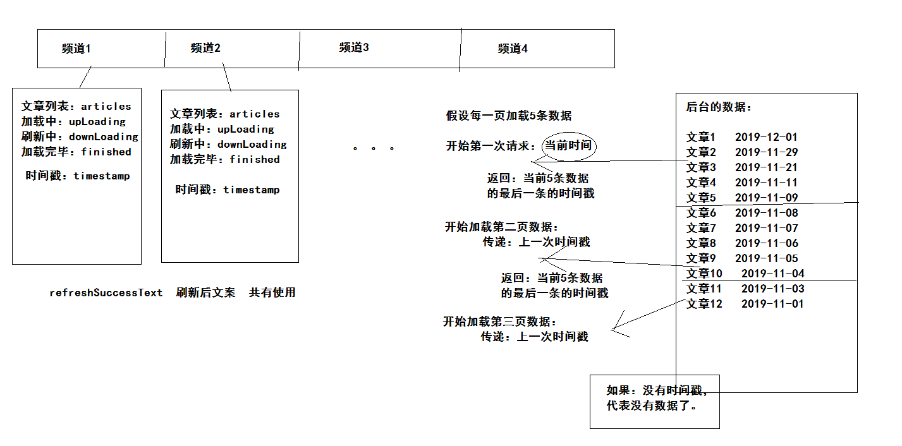
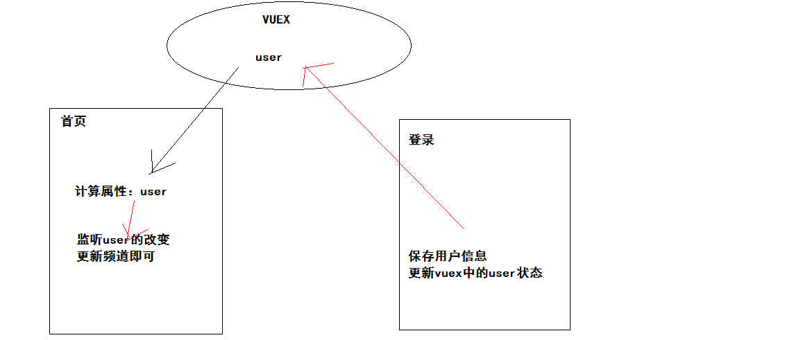

### 使用tabs组件

基础结构：

```html
<van-tabs swipeable>
  <van-tab :key="index" v-for="index in 8" :title="'标签 ' + index">
    <div class="scroll-wrapper">
     <van-cell-group>
         <van-cell v-for="item in 20" :key="item">{{index}}</van-cell>
      </van-cell-group>
     </div>
  </van-tab>
</van-tabs>
<span class="bar_btn" slot="nav-right">
  <van-icon name="wap-nav"></van-icon>
</span>
```

设置样式：

```less
.van-tabs {
  height: 100%;
  display: flex;
  flex-direction: column;
  /deep/ .van-tabs__wrap {
    height: 36px;
    padding-right: 36px;
    .van-tab {
      line-height: 36px;
    }
    .van-tabs__line {
      background-color: #3296fa;
      height: 2px;
    }
  }
  /deep/ .van-tabs__content{
    flex: 1;
    overflow: hidden;
  }
  /deep/ .van-tab__pane{
    height: 100%;
    .scroll-wrapper{
      height: 100%;
      overflow-y: auto;
    }
  }
}
.bar_btn {
  width: 36px;
  height: 35px;
  position: absolute;
  top: 0;
  right: 0;
  &::before {
    content: "";
    width: 100%;
    height: 100%;
    position: absolute;
    z-index: 999;
    box-shadow: 0 0 10px #999;
    transform: scale(1, 0.6);
  }
  .van-icon-wap-nav {
    width: 100%;
    height: 100%;
    background: #fff;
    text-align: center;
    line-height: 35px;
    position: relative;
    z-index: 1000;
    &::before {
      font-size: 20px;
    }
  }
}
```

- /deep/  作用：让样式在其他组件生效。
- 保证 scroll-wrapper 容器能够生成滚动条，将来需要使用滚动。
  - 下拉刷新
  - 上拉加载
  - 记录浏览位置


### 实现上拉加载

结构：

```html
          <!-- van-list 列表组件 实现上拉加载 -->
          <!-- v-model="upLoading" 如果值 true 代表正在加载中  false 代表加载完毕 -->
          <!-- :finished="finished" 如果值 true 代表所有数据加载完毕  false 代表还有数据 -->
          <!-- finished-text="没有更多文章了"  加载完毕的提示文章 -->
          <!-- @load="onLoad" 上拉加载触发的事件： -->
          <!-- 何时触发：拉到底部（滚动到底部）触发 -->
          <!-- 何时触发：当组件初始化的时候，默认触发一次 -->
          <!-- 何时触发：当加载数据渲染后不足一屏幕的高度，自动触发事件去加载更多数据直到 高于一屏幕的高度 为止 -->
<van-list v-model="upLoading" :finished="finished" finished-text="没有更多了" @load="onLoad">
            <van-cell v-for="item in articles" :key="item">{{item}}</van-cell>
          </van-list>
```
数据：

```js
// ----列表需要的数据----
// 上拉加载中
upLoading: false,
// 是否全部加载完成
finished: false,
// 文章列表
articles: []
```
逻辑：

```js
  methods: {
    onLoad () {
      // 模拟获取数据
      window.setTimeout(() => {
        // 获取数据成功
        const data = []
        for (let i = this.articles.length; i < this.articles.length + 10; i++) {
          data.push(i + 1)
        }
        // 追加数据
        this.articles.push(...data)
        // 结束加载中效果
        this.upLoading = false
        // 考虑：是否全部数据加载完毕   假设超过40就没有数据了
        if (this.articles.length >= 40) {
          this.finished = true
        }
      }, 1500)
    }
  }
```


### 实现下拉刷新

结构：

```html
          <!-- van-pull-refresh 下拉刷新组件 -->
          <!-- v-model="downLoading"  值为true 正在刷新中  值为false  结束刷新效果 -->
          <!-- :success-text="refreshSuccessText" 刷新成功后的文案  （更新成功|暂无更新） -->
          <!-- @refresh="onRefresh" 下拉刷新事件：下拉后松手后触发 -->
```

```diff
+<van-pull-refresh v-model="downLoading" @refresh="onRefresh" :success-text="refreshSuccessText">
  <van-list v-model="upLoading" :finished="finished" 
  finished-text="没有更多了" @load="onLoad">
    <van-cell-group>
      <van-cell v-for="item in articles" :key="item">{{item}}</van-cell>
    </van-cell-group>
  </van-list>
+</van-pull-refresh>
```

数据：

```js
      // 是否是刷新中状态
      downLoading: false,
      // 刷新完成的提示  文案（暂无更新|更新成功）
      refreshSuccessText: '',
```

逻辑：

```js
    // 下拉刷新
    onRefresh () {
      // 模拟获取数据
      window.setTimeout(() => {
        // 获取数据成功
        const data = [1, 2, 3, 4]
        // 结束刷新效果
        this.downLoading = false
        if (data.length) {
          // 替换数据
          this.articles = data
          // 提示文案
          this.refreshSuccessText = '更新成功'
          // 防止不足一屏数据
          this.onLoad()
          // 重置是否加载完毕
          this.finished = false
        } else {
          // 提示文案
          this.refreshSuccessText = '暂无更新'
        }
      }, 1500)
    },
```


### 列表文章布局

结构：

- 三张图

```html
<div class="article_item">
  <h3 class="van-ellipsis">PullRefresh下拉刷新PullRefresh下拉刷新下拉刷新下拉刷新</h3>
  <div class="img_box">
     <van-image class="w33" fit="cover" src="https://img.yzcdn.cn/vant/cat.jpeg"/>
     <van-image class="w33" fit="cover" src="https://img.yzcdn.cn/vant/cat.jpeg"/>
     <van-image class="w33" fit="cover" src="https://img.yzcdn.cn/vant/cat.jpeg"/>
  </div>
  <div class="info_box">
     <span>你像一阵风</span>
     <span>8评论</span>
     <span>10分钟前</span>
     <span class="close"><van-icon name="cross"></van-icon></span>
  </div>
</div>
```

- 一张图

```html
<div class="article_item">
  <h3 class="van-ellipsis">PullRefresh下拉刷新PullRefresh下拉刷新下拉刷新下拉刷新</h3>
  <div class="img_box">
      <van-image class="w100" fit="cover" src="https://img.yzcdn.cn/vant/cat.jpeg"/>
  </div>
  <div class="info_box">
     <span>你像一阵风</span>
     <span>8评论</span>
     <span>10分钟前</span>
     <span class="close"><van-icon name="cross"></van-icon></span>
  </div>
</div>
```

- van-ellipsis  vant内置的样式 当文本内容长度超过容器最大宽度时，自动省略多余的文本。
- w33   宽度33% 剩余1%当作间距。
- w100 宽度100% 


样式：

```less
.article_item{
  h3{
    font-weight: normal;
    line-height: 2;
  }
  .img_box{
    display: flex;
    justify-content: space-between;
    .w33{
      width: 33%;
      height: 90px;
    }
    .w100{
      width: 100%;
      height: 180px;
    }
  }
  .info_box{
    color: #999;
    line-height: 2;
    position: relative;
    font-size: 12px;                  
    span{
      padding-right: 10px;
      &.close{
        border: 1px solid #ddd;
        border-radius: 2px;
        line-height: 15px;
        height: 12px;
        width: 16px;
        text-align: center;
        padding-right: 0;
        font-size: 8px;
        position: absolute;
        right: 0;
        top: 7px;
      }
    }
  }
}
```


### 渲染频道

api函数 `src/api/channel.js`

```js
/**
 * 获取我的频道信息（如果没登录，获取的是后台设置的默认频道列表）
 */
export const getMyChannels = () => {
  return request('/app/v1_0/user/channels', 'get')
}
```

导入函数 `src/vies/home/index.vue`

```js
import { getMyChannels } from '@/api/channel'
```

使用函数 

```js
  created () {
    this.getMyChannels()
  },
  methods: {
    // 获取频道列表
    async getMyChannels () {
      const data = await getMyChannels()
      this.myChannels = data.channels
    },
```

申明数据

```js
      // 我的频道列表(推荐频道默认拥有第一个频道)
      myChannels: []
```

渲染组件

```html
<van-tab :key="channel.id" v-for="channel in myChannels" :title="channel.name">
```


### 组织数据



- 分析：文章列表与频道关系
- 结论：频道数据应该包含文章列表数据

```js
    // 获取频道列表
    async getMyChannels () {
      const data = await getMyChannels()
      // 目前 myChannels： 频道id  频道名称
      // 扩展 myChannels： 频道id  频道名称  +文章列表 +加载中 +刷新中 +是否全部加载 +时间戳
      this.myChannels = data.channels.map(item => {
        return {
          id: item.id,
          name: item.name,
          articles: [],
          upLoading: false,
          downLoading: false,
          finished: false,
          timestamp: Date.now()
        }
      })
    },
```

- timestamp  相当于分页的页码
- upLoading  加载中
- finished  没有数据
- downLoading 刷新中
- articles 文章列表

全局数据：

-  refreshSuccessText  刷新后提示信息


### 渲染列表

- 封装api  `src/api/article.js`

```js
// 提供  调用文章相关的接口函数

import request from '@/utils/request'

/**
 * 获取文章列表
 * @param {Integer} channelId - 频道ID
 * @param {Integer} timestamp - 时间戳 相对于分页页码
 */
export const getArticles = (channelId, timestamp) => {
  return request('app/v1_1/articles', 'get', {
    channel_id: channelId,
    timestamp,
    with_top: 1
  })
}

```

- tabs组件数据绑定

```html
<van-tab v-model="activeIndex" 
```

```js
      // 当前激活的频道索引
      activeIndex: 0
```

- 当前频道

```js
  computed: {
    // 当前激活的频道
    activeChannel () {
      return this.myChannels[this.activeIndex]
    }
  },
```

- 上拉加载  onLoad

```js
// await this.$sleep()

      // 当前激活频道的ID和时间戳
      // this.myChannels[this.activeIndex] === this.activeChannel  当前激活的频道
      const data = await getArticles(this.activeChannel.id, this.activeChannel.timestamp)
      // 往当前激活频道下的文章列表中去追加
      this.activeChannel.articles.push(...data.results)
      // 结束当前激活频道的加载效果
      this.activeChannel.upLoading = false
      // 判断是否有数据
      if (data.pre_timestamp) {
        // 存入时间戳，当前激活的频道
        this.activeChannel.timestamp = data.pre_timestamp
      } else {
        this.activeChannel.finished = true
      }
```

- 下拉刷新  onRefresh

```js
// await this.$sleep()

    // 把当前激活频道的时间戳改成当前时间
      this.activeChannel.timestamp = Date.now()
      // 获取数据
      const data = await getArticles(this.activeChannel.id, this.activeChannel.timestamp)
      // 关闭刷新
      this.activeChannel.downLoading = false
      // 判断是否获取数据
      if (data.results.length) {
        // 替换
        this.activeChannel.articles = data.results
        // 文案
        this.refreshSuccessText = '更新成功'
        // 加载下一页数据前  时间戳使用后台给的
        this.activeChannel.timestamp = data.pre_timestamp
        // 主动加载下一页数据
        this.onLoad()
        // 重置是否加载完毕
        this.activeChannel.finished = false
      } else {
        this.refreshSuccessText = '暂无更新'
      }
```

- 渲染页面

```html
 <van-tabs swipeable v-model="activeIndex">
      <van-tab :key="channel.id" v-for="channel in myChannels" :title="channel.name">
        <div class="scroll-wrapper">
          <van-pull-refresh
            v-model="channel.downLoading"
            @refresh="onRefresh"
            :success-text="refreshSuccessText"
          >
            <van-list
              v-model="channel.upLoading"
              :finished="channel.finished"
              finished-text="没有更多文章了"
              @load="onLoad"
            >
              <van-cell v-for="item in channel.articles" :key="item.art_id.toString()">
                <div class="article_item">
                  <h3 class="van-ellipsis">{{item.title}}</h3>
                  <div class="img_box" v-if="item.cover.type===3">
                    <van-image class="w33" fit="cover" :src="item.cover.images[0]" />
                    <van-image class="w33" fit="cover" :src="item.cover.images[1]" />
                    <van-image class="w33" fit="cover" :src="item.cover.images[2]" />
                  </div>
                  <div class="img_box" v-if="item.cover.type===1">
                      <van-image class="w100" fit="cover" :src="item.cover.images[0]"/>
                  </div>
                  <div class="info_box">
                    <span>{{item.aut_name}}</span>
                    <span>{{item.comm_count}}评论</span>
                    <span>{{item.pubdate}}</span>
                    <span class="close">
                      <van-icon name="cross"></van-icon>
                    </span>
                  </div>
                </div>
              </van-cell>
            </van-list>
          </van-pull-refresh>
        </div>
      </van-tab>
    </van-tabs>
```

- 延时函数 `src/utils/plugin.js`

```js
// 提供vue一些插件方法
const $sleep = () => {
  return new Promise((resolve, reject) => {
    window.setTimeout(() => {
      resolve()
    }, 1000)
  })
}

export default {
  install (Vue) {
    Vue.prototype.$sleep = $sleep
  }
}

```

```js
import myPlugin from '@/utils/plugin'
Vue.use(myPlugin)
```

- 仅在开发中使用，测试。


### 时间格式处理

- 封装一个相对时间函数

```js
import dayjs from 'dayjs'
import relativeTime from 'dayjs/plugin/relativeTime'
import 'dayjs/locale/zh-cn'
dayjs.extend(relativeTime)
```

```js
/**
 * 过滤器函数
 * @param {String} value - 就是过滤器 | 前的表达式的值
 */
const relTime = (value) => {
  // 转换的逻辑
  // moment 插件  dayjs 插件  都是处理时间格式
  // dayjs 轻量一些
  return dayjs().locale('zh-cn').from(value)
}
```

- 注册成过滤器

```diff
export default {
  install (Vue) {
    Vue.prototype.$sleep = $sleep
+   Vue.filter('relTime', relTime)
  }
}
```

使用：

```html
<span>{{article.pubdate|relTime}}</span>
```


### 图片懒加载

- 需要依赖 v-lazy 指令，由谁提供：vue-lazyload 插件

```html

```

- 安装插件 https://github.com/hilongjw/vue-lazyload

```sh
npm i vue-lazyload
```

- 导入，注册

```js
import VueLazyload from 'vue-lazyload'
Vue.use(VueLazyload)
```


项目中使用：**是vant内置的插件**，实现图片懒加载。

```js
import Vant, { Lazyload } from 'vant'
```

```js
// 注册好了 支持v-lazy指令
Vue.use(Lazyload)
```

```html
<van-image lazy-load></van-image>
```

```html

```


### 优化-缓存组件

- keep-alive 缓存组件 （使用keep-alive组件包裹动态组件即可）
  - `activated`  激活组件的钩子
  - `deactivated`  离开组件的钩子
- 并非所有组件要做缓存，所以按需缓存
  - 根据路由规则信息，决定keep-alive是否包裹router-view即可
  - 路由规则中存储额外信息的选项是：meta 元信息

`src/router.js`

```diff
const router = new Router({
  routes: [
    { path: '/search', name: 'serach', component: Search },
    { path: '/search/result', name: 'serach-result', component: SearchResult },
    { path: '/user/profile', name: 'user-profile', component: UserProfile },
    { path: '/user/chat', name: 'user-chat', component: UserChat },
    { path: '/login', name: 'login', component: UserLogin },
-   { path: '/article/:id', name: 'article', component: Article}  
+   { path: '/article/:id', name: 'article', component: Article, meta: { isKeepAlive: true } },
    {
      path: '/',
      component: Layout,
      children: [
-        { path: '/', name: 'home', component: Home }
+        { path: '/', name: 'home', component: Home, meta: { isKeepAlive: true } },
        { path: '/question', name: 'question', component: Question },
        { path: '/media', name: 'media', component: Media },
        { path: '/user', name: 'user', component: User }
      ]
    }
  ]
})
```

`src/App.vue`

```html
<div id="app">
      <!-- 1. 当动态路由组件外面包裹了keep-alive就被缓存 -->
    <!-- 2. 当动态路由组件外面没了keep-alive就没有被缓存 -->
    <!-- 3. 判断当前访问的组件 如果是 首页和文章详情  放在keep-alive中 -->
    <!-- 4. $route获取路由信息 meta 元信息  isKeepAlive 判断依据 -->
  <keep-alive>
    <router-view v-if="$route.meta.isKeepAlive"></router-view>
  </keep-alive>
  <router-view v-if="!$route.meta.isKeepAlive"></router-view>
</div>
```


### 优化-阅读记忆

- tab组件，默认是懒加载，会导致操作dom问题，需要关闭，自己主动来加载。

- 绑定滚动事件，记录阅读位置，使用scrollTop
- 激活组件的时候，操作当前列表，滚动到阅读位置
- 切换tab组件的时候
  - 如果之前没有加载过数据，开启上拉加载效果，调用加载函数。
  - 如果有数据，操作当前列表，滚动到阅读位置（切换频道的时候）

关闭懒加载：

```html
<van-tabs :lazy-render="false"></van-tabs>
```

自己来加载：

```html
<van-tabs @change="changeChannel"
```

```js
    // 切换频道
    changeChannel () {
      // （当前频道下无文章数据）主动加载一次数据
      if (!this.activeChannel.articles.length) {
        // 开启加载中效果
        this.activeChannel.upLoading = true
        // 关闭 没有数据的提示
        this.activeChannel.finished = false
        this.onLoad()
      } else {

      }
    },
```


监听滚动：

```html
<div  @scroll="remember($event)"></div>
```

记录阅读位置：

```js
remember (e) {
  this.activeChannel.scrollTop = e.target.scrollTop
},
```

需要提前设置记录阅读位置数据：

```diff
// 获取数据
    async getChannels () {
      const data = await getChannels()
      // 组织数据
      this.channels = data.channels.map(item => ({
        id: item.id,
        name: item.name,
        timestamp: Date.now(),
        upLoading: false,
        downLoading: false,
        finished: false,
        articles: [],
+       scrollTop: 0
      }))
    }
  },
```

在激活组件时候，跳转记录的位置：

```js
activated () {
  if (this.$refs['scrollWrapper']) {
      const dom = this.$refs['scrollWrapper'][this.activeIndex]
      dom.scrollTop = this.activeChannel.scrollTop
  }
},
```

切换tab组件的时候

```js
    // 选择频道
    changeChannel () {
      // （当前激活频道下无文章数据）自己加载渲染当前激活频道的文章列表
      if (!this.activeChannel.articles.length) {
        // 开启加载效果
        this.activeChannel.upLoading = true
        // 关闭 没有数据的提示
        this.activeChannel.finished = false
        // 加载文章
        this.onLoad()
      } else {
        // 有数据（根据当前频道记录的阅读位置进行滚动）
        // 在切换到频道后：tab组件默认做了滚动顶部操作
        // 保证 自己的操作逻辑在 tab组件逻辑之后执行。
        // 原始写法：
        // window.setTimeout(() => {
        //   const dom = this.$refs['scroll-wrapper'][this.activeIndex]
        //   dom.scrollTop = this.activeChannel.scrollTop
        // }, 0)
        // 下一帧 $nextTick() 延时一会执行
        this.$nextTick(() => {
          const dom = this.$refs['scroll-wrapper'][this.activeIndex]
          dom.scrollTop = this.activeChannel.scrollTop
        })
      }
    },
```


### 登录后更新频道与文章



- 监听登录与退出
- 不管登录与退出，都需要操作 vuex 中用户数据
- 监听用户数据改变即可

导入vuex的用户数据

```js
import { mapState } from 'vuex'
```

```diff
  computed: {
    activeChannel () {
      return this.channels[this.activeIndex]
    },
+    ...mapState(['user'])
  },
```

监听vuex的用户数据：重置到推荐频道，重新获取频道数据，手动加载文章数据。

```js
  watch: {
    // 监听 user.refresh_token 变化 然后去更新频道数据
    'user.refresh_token': function () {
      // 默认激活推荐频道
      this.activeIndex = 0
      // 加载频道数据
      this.getMyChannels()
      // 加载文章列表
      this.onLoad()
    }
  },
```

问题：更新频道后，排序错乱，先清空tabs，再根据新的数组进行渲染。

```diff
+      this.myChannels = [] // 清除tabs组件的排序（缓存）
+      this.$nextTick(() => {
        this.myChannels = data.channels.map(item => {
          return {
            id: item.id,
            name: item.name,
            articles: [],
            upLoading: false,
            downLoading: false,
            finished: false,
            timestamp: Date.now(),
            // 阅读位置
            scrollTop: 0
          }
        })
+      })
```

严谨操作：

```js
    // 上拉加载
    async onLoad () {
      // 严谨考虑：判断是否有激活频道
      if (!this.activeChannel) return false
```


### 更多操作-组件准备

- 使用 popup 组件  https://youzan.github.io/vant/#/zh-CN/popup
- 封装在 `./components/more-action.vue` 组件下

```html
<template>
  <van-popup v-model="show" @open="isReport=false">
    <van-cell-group v-if="!isReport">
      <van-cell>不感兴趣</van-cell>
      <van-cell is-link @click="isReport=true">反馈垃圾内容</van-cell>
      <van-cell>拉黑作者</van-cell>
    </van-cell-group>
    <van-cell-group v-else>
      <van-cell icon="arrow-left" @click="isReport=false">返回</van-cell>
      <van-cell>侵权</van-cell>
      <van-cell>色情</van-cell>
      <van-cell>暴力</van-cell>
      <van-cell>低俗</van-cell>
      <van-cell>不适</van-cell>
      <van-cell>错误</van-cell>
      <van-cell>其他</van-cell>
    </van-cell-group>
  </van-popup>
</template>

<script>
export default {
  name: 'more-action',
  data () {
    return {
      show:false,                                    
      isReport: false
    }
  }
}
</script>

<style scoped lang='less'>
.van-popup {
  width: 80%;
  border-radius: 4px;
}
</style>

```

- 登录后才可使用

```js
import MoreAction from './components/more-action'
```

```js
components: { MoreAction },
```

```html
<more-action v-if="user.token" ></more-action>
```

```html
<span v-if="user.token" class="close" ><van-icon name="cross"></van-icon></span>
```


**more-action中的van-popup组件应该由父组件home-index来控制。**

```js
      // 显示more-action中的van-popup组件
      showMoreAction: false
```

```js
:value="showMoreAction"
```

```js
  props: {
    // 接收父组件 showMoreAction 数据
    value: {
      type: Boolean,
      default: false
    }
  },
```

```html
<van-popup :value="value"
```

```html
<van-popup  @input="$emit('input',$event)"
```

```html
@input="showMoreAction=$event"
```

由于v-model是一个语法糖：

```html
v-model="showMoreAction"
```

绑定更多按钮的操作事件：

```html
<span @click="openMoreAction"
```

```js
  methods: {
    // 打开更多操作
    openMoreAction () {
      this.showMoreAction = true
    },
```


### 更多操作-不感兴趣

- 打开时候传入当前点击文章ID

```js
articleId: null
```

```html
<span
      v-if="auth.token"
      class="close"
      @click.stop="openMoreAction(article.art_id.toString())">
  <van-icon name="cross"></van-icon>
</span>
```

```js
openMoreAction (articleId) {
  this.showMoreAction = true
  this.articleId = articleId
},
```

```html
<more-action v-if="user.token" v-model="showMoreAction" :articleId="articleId" ></more-action>
```

- 封装API `src/api/article.js`

```js
/**
 * 对文章不感兴趣
 * @param {String} articleId
 */
export const disLike = (articleId) => {
  return request('app/v1_0/article/dislikes', 'post', {
    target: articleId
  })
}
```

- 点击 不感兴趣 发请求

```js
    // 当前文章ID
    articleId: {
      type: String,
      default: null
    }
```

```html
<van-cell icon="closed-eye" @click="disLikes()">不感兴趣</van-cell>
```

```js
    async disLikes () {
      try {
        await disLike(this.articleId)
        // 提示
        this.$toast({ type: 'success', message: '操作成功' })
        // 关闭
        this.$emit('input', false)
        // 删除文章
        this.$emit('on-dislike')
      } catch (e) {
        this.$toast({ type: 'fail', message: '操作失败' })
      }
    }
```

- 成功后 通知父组件 删除文章

```html
<more-action
      v-if="auth.token"
      v-model="showMoreAction"
      @on-dislike="removeArticle"
      :articleId="articleId" >
    </more-action>
```

```js
    removeArticle () {
      const articles = this.activeChannel.articles
      const index = articles.findIndex(item => item.art_id === this.articleId)
      articles.splice(index, 1)
    },
```


### 更多操作-举报文章

- 根据接口提供的传参，定义常量数据 `src/api/constants.js`

```js
/**
 * 举报类型
 */
export const reports = [
  { value: 0, label: '其他问题' },
  { value: 1, label: '标题夸张' },
  { value: 2, label: '低俗色情' },
  { value: 3, label: '错别字多' },
  { value: 4, label: '旧闻重复' },
  { value: 5, label: '广告软文' },
  { value: 6, label: '内容不实' },
  { value: 7, label: '涉嫌违法犯罪' },
  { value: 8, label: '侵权' }
]
```

- 使用数据

```js
import { reports } from '@/api/constants'
```

```diff
  data () {
    return {
      isReport: false,
+     reports
    }
  },
```

```html
<van-cell icon="info-o" v-for="item in reports" :key="item.value">
  {{item.label}}
</van-cell>
```

- 举报api  `src/api/article.js`

```js
/**
 * 举报文章
 * @param {String} articleId -文章ID
 * @param {Integer} type - 举报类型
 */
export const report = (articleId, type) => {
  return request('app/v1_0/article/reports', 'post', {
    target: articleId,
    type
  })
}
```

- 绑定点击事件，发请求

```js
import { report } from '@/api/article'
```

```html
<van-cell icon="info-o" @click="report(item.value)"
```

```js
    async report (type) {
      try {
        await report(this.articleId, type)
        // 提示
        this.$toast({ type: 'success', message: '举报成功' })
        // 关闭
        this.$emit('input', false)
        // 删除文章
        this.$emit('on-report')
      } catch (e) {
        if (e.response.status === 409) {
       
          return this.$toast({ message: '已举报过' })
        }
        this.$toast({ type: 'fail', message: '举报失败' })
      }
    }
```

- 成功后 通知父组件 删除文章

```diff
<more-action
      v-if="auth.token"
      v-model="showMoreAction"
      @on-dislike="removeArticle"
+     @on-report="removeArticle"
      :articleId="articleId" >
    </more-action>
```

